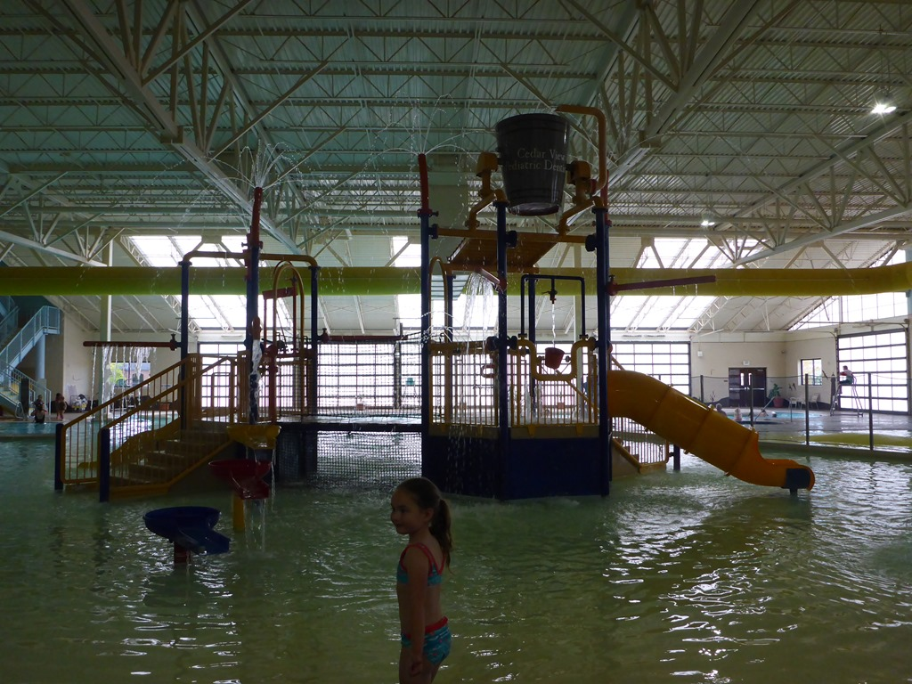
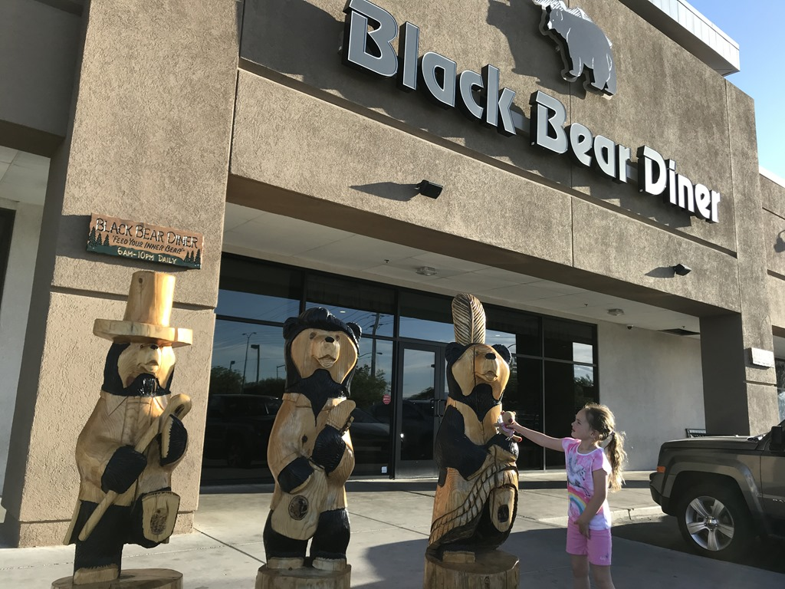
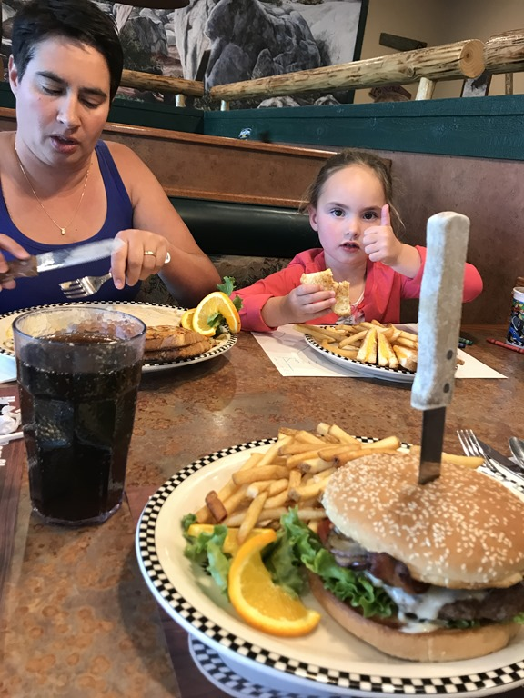

Euh... Niet Mesquite, maar Las Vegas!

Gisteravond hebben we op de zeer slechte wifi een alternatief gezocht (en gevonden!) om vandaag te doen in plaats van de gesloten Kolob Canyon. Het blijkt dat het kleine stadje Cedar City volgens de reviews een erg mooi overdekt zwembad heeft. Het is zo mooi, dat de lokale politiek het niet over een zwembad heeft, maar over een Aquatic Center. Dat klinkt natuurlijk een stuk chiquer, en je verwacht dan een hoge toegangsprijs, maar dat valt heel erg mee. Voor 13 dollar waren we met z'n drietjes binnen. Oh, klein detail: ze hebben hier lock-loze lockers, dus moesten we een slot kopen van 7 dollar. En zo blijft het toch altijd bijzonder, dit soort gelegenheden bezoeken in de VS (vorig jaar moesten we als onderpand voor een locker een creditcard, paspoort of de autosleutel afgeven).

Er waren glijbanen en een lazy river aanwezig, en nagenoeg geen ander publiek. We hebben er een uur of drie plezier gemaakt, en zijn toen weer de Interstate 15 opgegaan naar het zuiden, richting Mesquite. Dit stadje ligt halverwege ons doel voor morgen: Las Vegas. Toen we echter in de buurt van Mesquite kwamen, was Sofie nog bezig met haar schoonheidsslaapje, en dus besloten we de twee extra rij-uren maar voor lief te nemen, en door te gaan naar Las Vegas. Vanuit de auto hebben we onze favoriete camping Las Vegas Oasis RV resort even gebeld dat we een dagje eerder aankomen, en dat was gelukkig geen probleem: happy days!

Na aankomst hebben we ook maar meteen de huurauto een dagje eerder opgehaald, en hebben we bij de Walmart wat boodschappen gedaan. 's Avonds zijn we gaan eten bij Black Bear Diner, en hebben we nog even gespeeld in de speeltuin bij Town Square. Na dit alles ging bij ons allen redelijk vroeg het lichtje uit.

