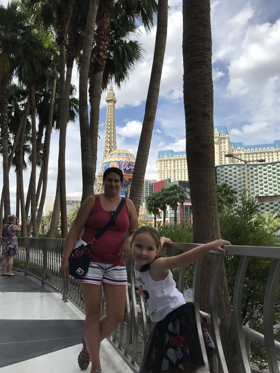
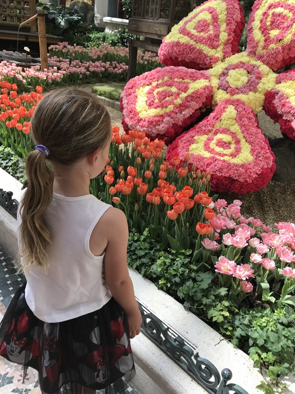
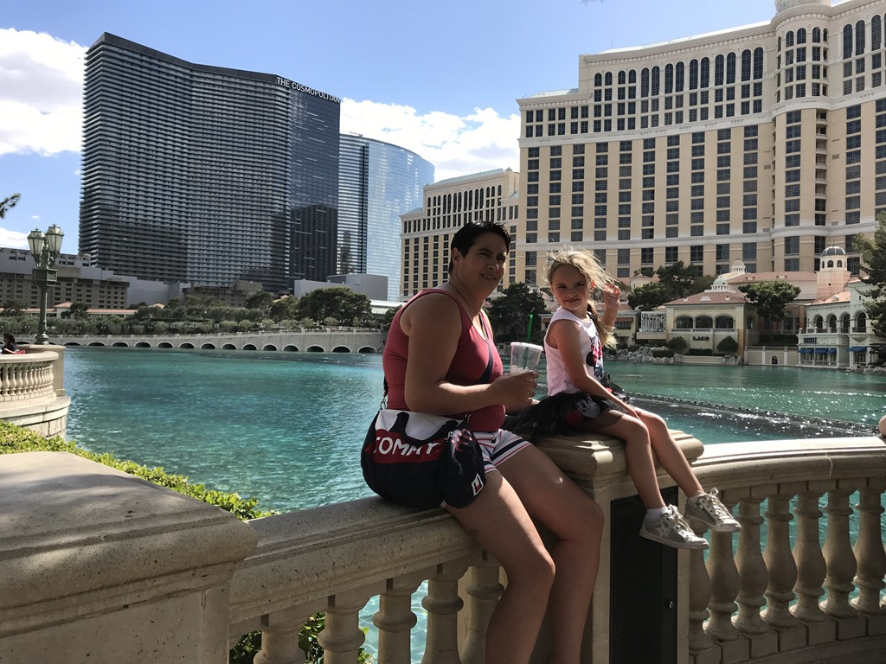
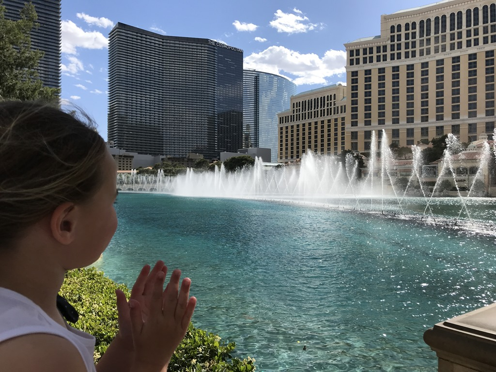
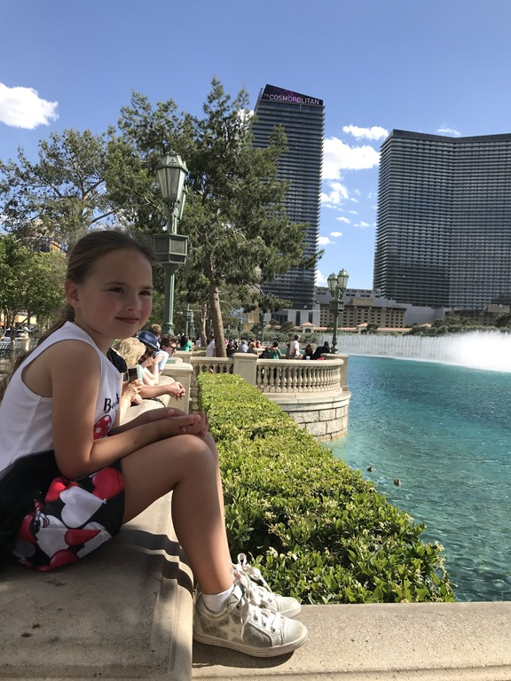
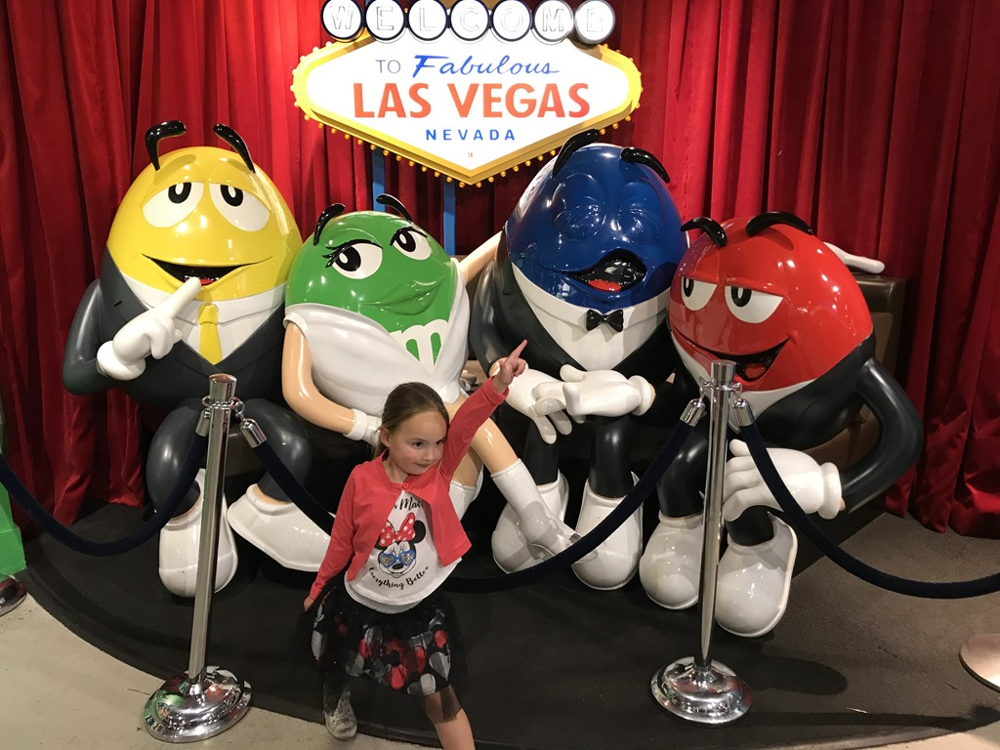
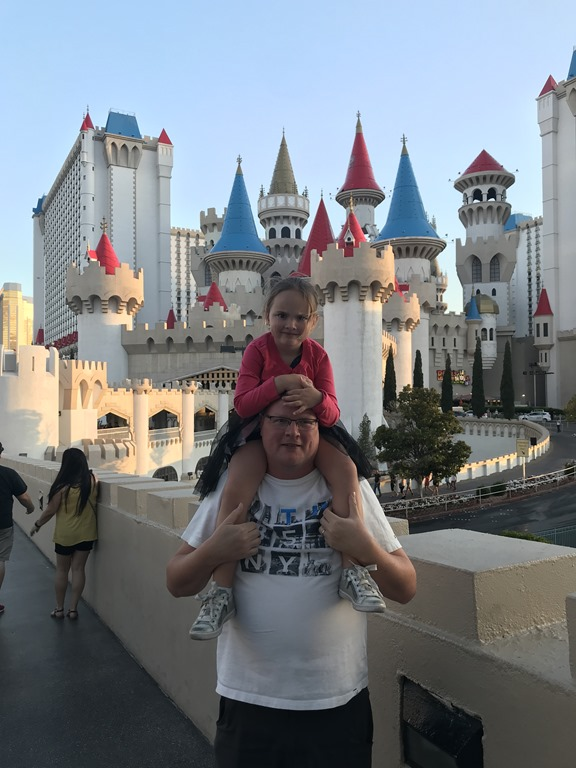

Tot de lunch hebben we in het heerlijke zwembad geplonst. Daarna hebben we de huurvoiture geparkeerd bij The Cosmopolitan. Dit casino ligt redelijk centraal om van daaruit een mooi stukje over The Strip te wandelen. Van Venetie en Parijs naar New York, in Las Vegas is dat hooguit een half uurtje stevig doorstappen. Eerste stop was echter de botanische tuin in de Bellagio. Het thema was Japanse Lente, en het was ondanks de drukte, best leuk om even te gaan kijken.

Na dit bloemenfestijn hebben we buiten nog naar de fonteinen show gekeken. Sofie was erg onder de indruk.

We hebben gedineerd bij Rainforest Cafe, favoriet van Sofie, waarbij je je in een regenwoud waant. Apen slingeren door de bomen, en olifant staan luid toeterend naast je tafel. Het eten is daarnaast ook nog eens prima voor papa's en mama's. Daarna zijn we nog doorgelopen naar de M&M winkel, en naar Excalibur.

Oh ja, Sofie kijkt tegenwoordig naar Barbie op Netflix en kan dus alleen nog maar in modellen-pose op de foto. Gek word je d'r van ! ;-)

## 1 opmerking

### Gerard 18 mei 2018 om 08:21

Pose of geen pose, Sofie heeft het zo te zien naar de zin. En dan zijn mama en papa ook blij
