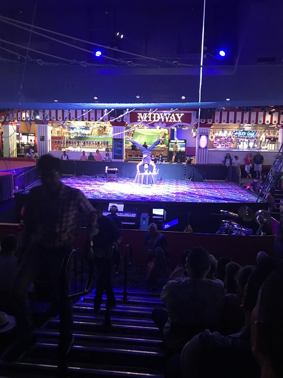
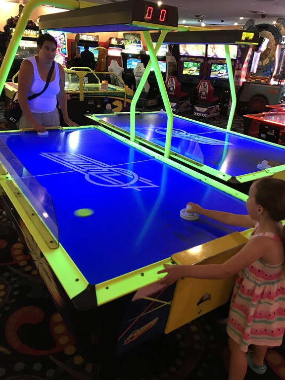
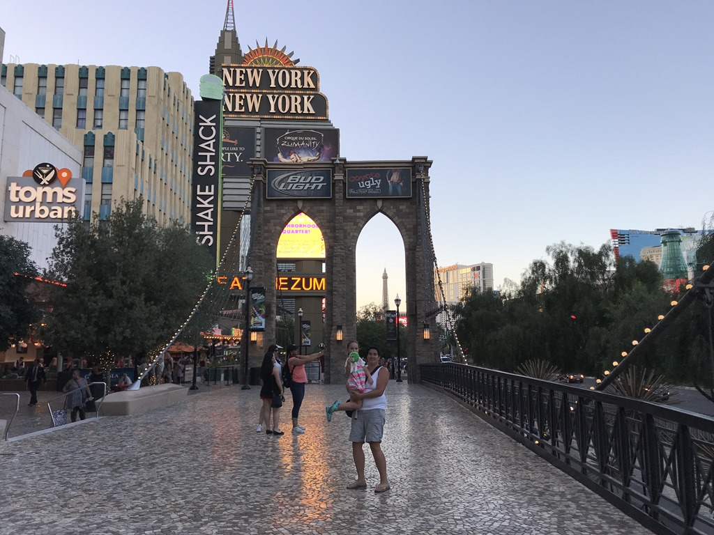
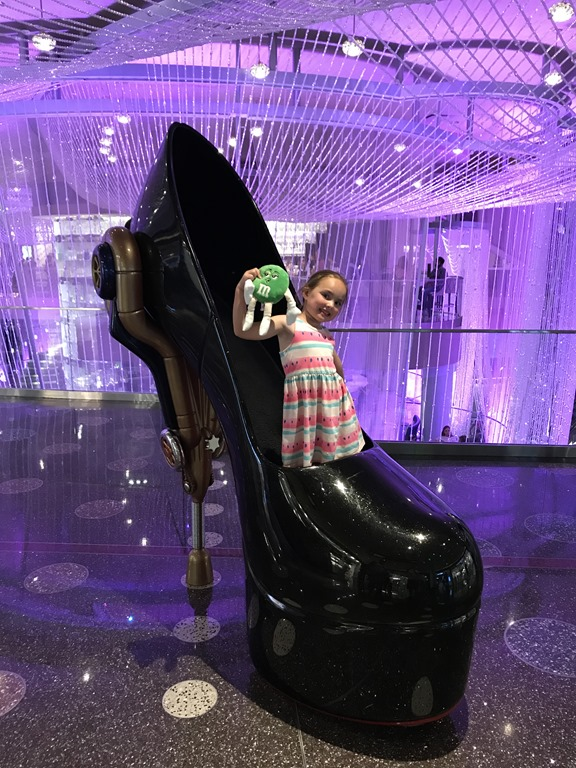

Wederom begonnen we de dag met een uitgebreid bad in het zwembad. Na de lunch hebben we de voiture helemaal naar het andere eind van de Strip geloodst. Hier staat Circus Circus, ooit een paradepaardje (?), maar inmiddels redelijk verouderd. Voor Sofie is er echter wel veel te zien en te doen. Zo hebben we kennis gemaakt met een meneer die heel aardig op z'n handen kan staan, en hebben we Sofie geintroduceerd in de wondere wereld van Air Hockey.

Na een kort wandelingetje door Adventure Dome met waanzinnige achtbanen en ander vertier voor de grote kinderen, zijn we weer richting Cosmopolitan gereden om van daaruit weer een wandelingetje te maken over de Strip.

