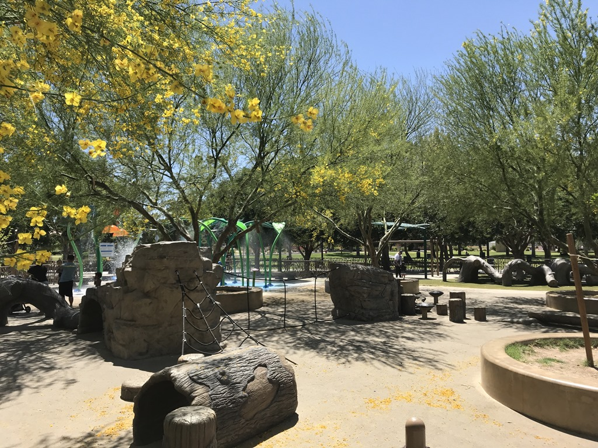
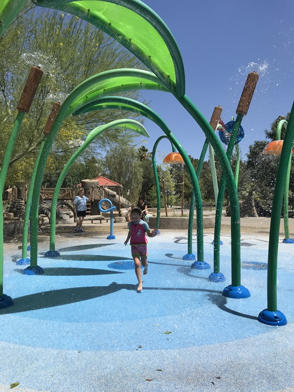
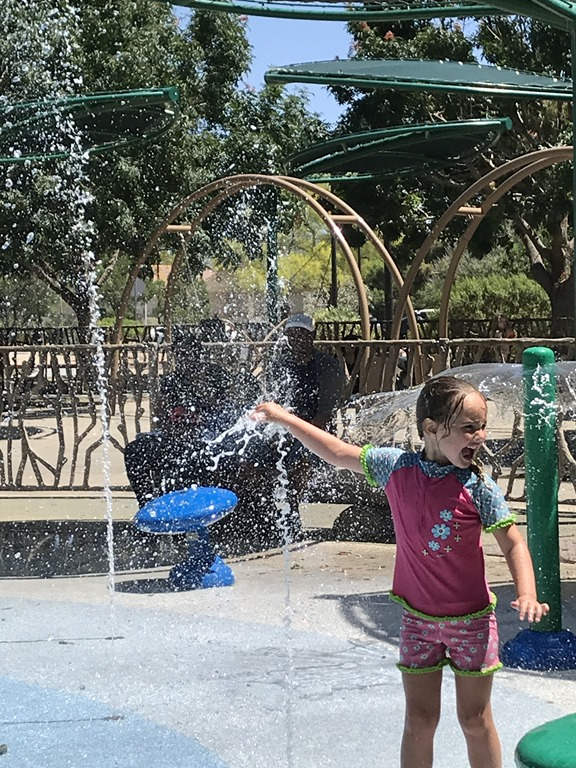
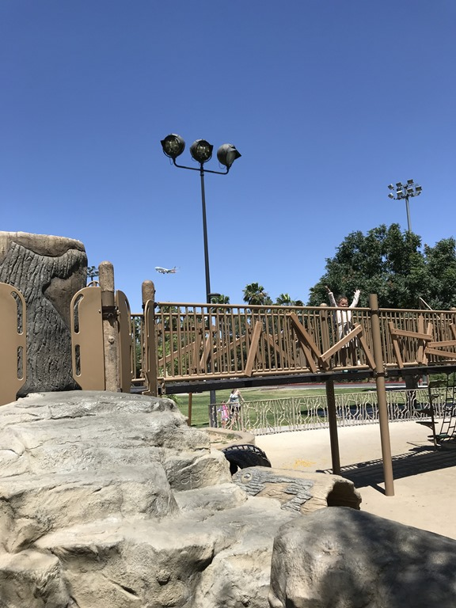

Het is inmiddels traditie: direct na het ontbijt gaan pa en dochterlief zwemmen. Mama gaat eerst naar de outlet om nog wat kleren te scoren. Om 12 uur verlaten we echter de camping, met pijn in het hart weliswaar. De auto moeten we terug brengen naar Alamo, en nadat dat is gebeurd gaan we met de camper naar Sunset Park, vlakbij het vliegveld, waar een aantal leuke speeltuinen is. En een splash pad! Met dit warme weer was dit voor Sofie een welkome verrassing.

Na de lunch was het tijd om naar de volgende overnachtingscamping te gaan, de KOA in Barstow. Ondanks dat de camping midden in de woestijn ligt, hadden we een mooi plekje tussen wat bomen en struiken. Van het zwembad hebben we maar kort gebruik gemaakt, het water is steenkoud! 's Avonds hebben we alvast wat tassen ingepakt en overtollig spul weggemikt, dan hoeven we dat morgen allemaal niet meer te doen.

