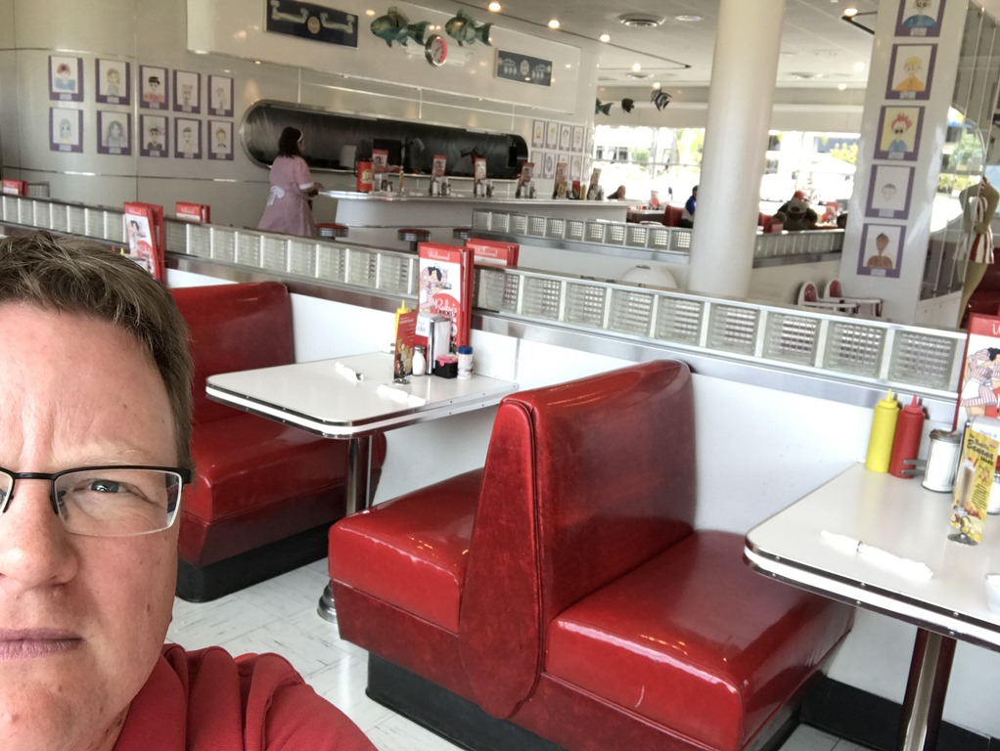
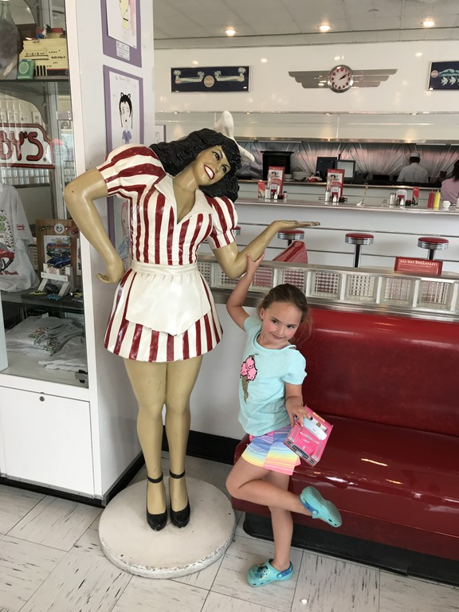
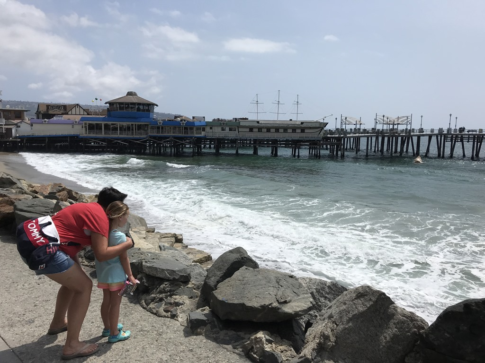
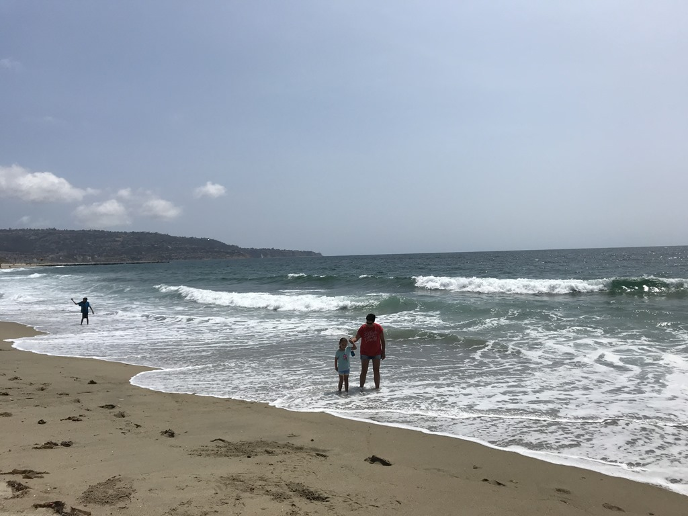
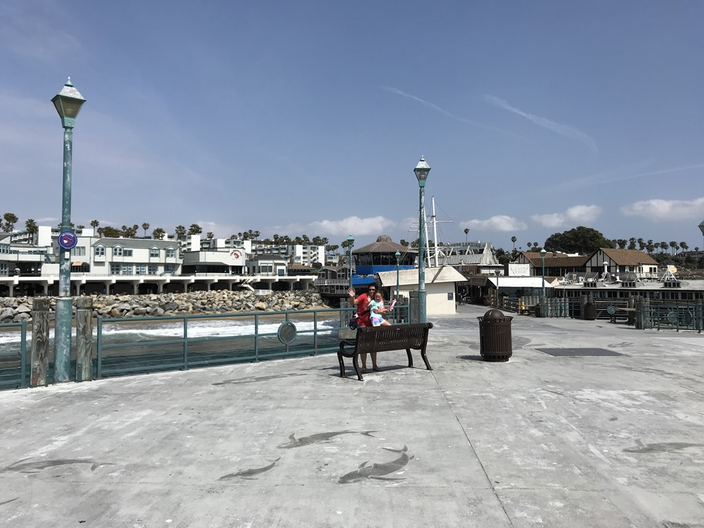

Zo, alle koffers en tassen staan in de auto (Toyota Sequoia), en zowel de black als de grey tank zijn gedumpt. Kortom, we zijn er klaar voor om de camper terug te brengen naar Roadbear. Vanuit de camping in Valencia is het zo’n 45 minuten rijden naar Roadbear in Agoura Hills, en dat ritje verloopt wonder boven wonder nagenoeg zonder file. De terugname ging soepel en vlot, en dus konden we na een minuut of 20 met z'n allen op pad naar ons hotel voor de laatste nacht: Crowne Plaza in Redondo Beach. Een snel telefoontje naar het hotel leert ons dat onze kamer al klaar is, dus we kunnen direct onze spullen in de kamer zetten. We moeten nog lunchen, en dat doen we bij Ruby's Diner, een restaurant tegenover ons hotel in fifties stijl.

Met een verdomd lekkere milkshake en sandwich achter de kiezen, wandelen we naar de nabijgelegen pier. Er hangt een aangename sfeer, en er zijn allerlei viswinkels en –restaurantjes. We kijken onze ogen uit, de ene krab is nog groter en onooglijker dan de andere.

Aan het einde van de middag gaan we toch nog even het zwembad in, alvorens we ons laatste Amerikaanse avondmaal nuttigen in een afgeladen Cheesecake Factory, die gelukkig ook op slechts 5 minuutjes wandelen ligt.
