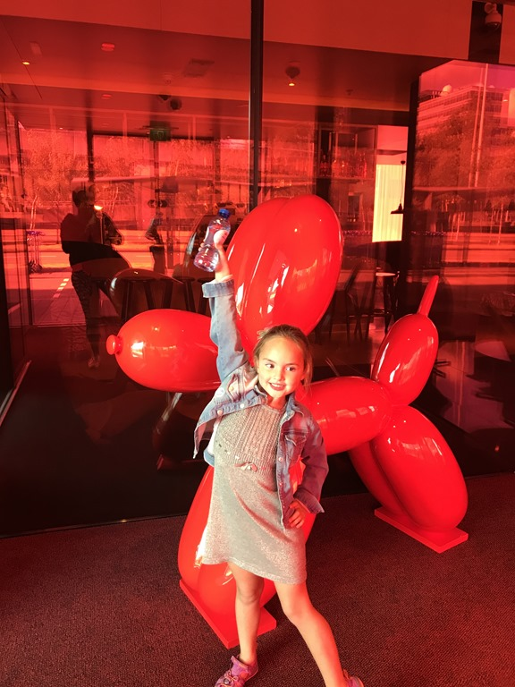
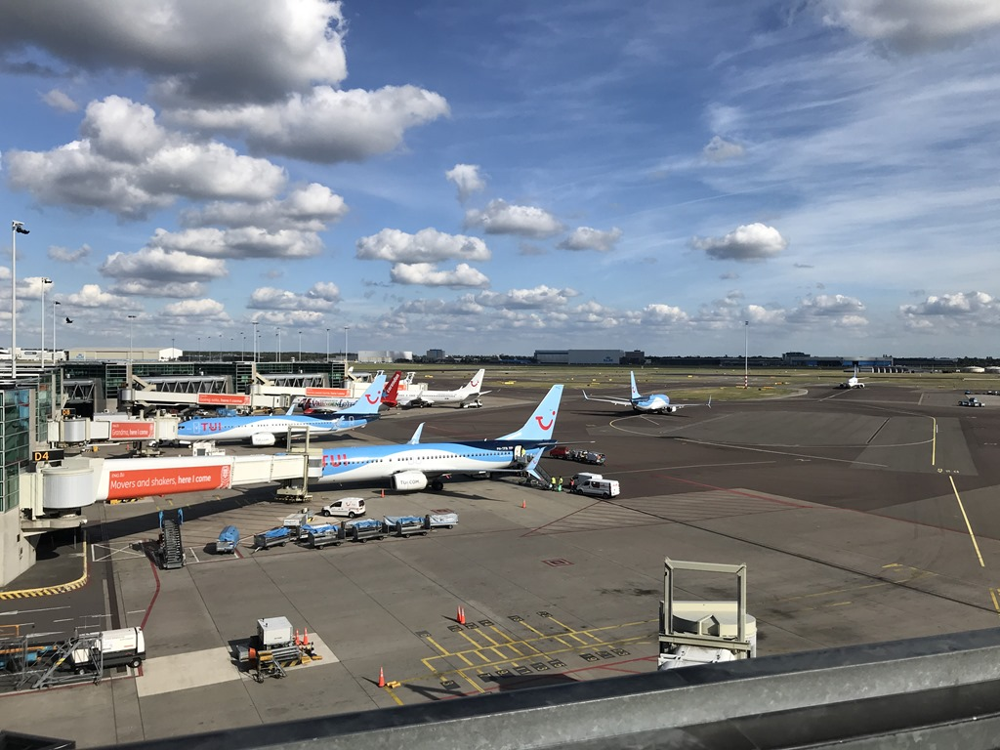
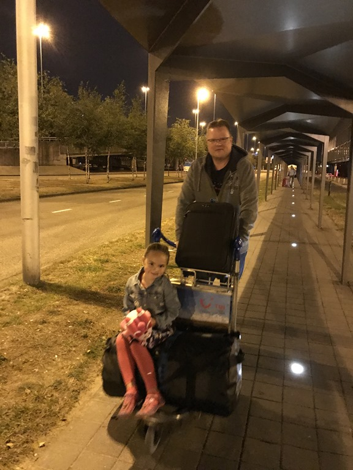
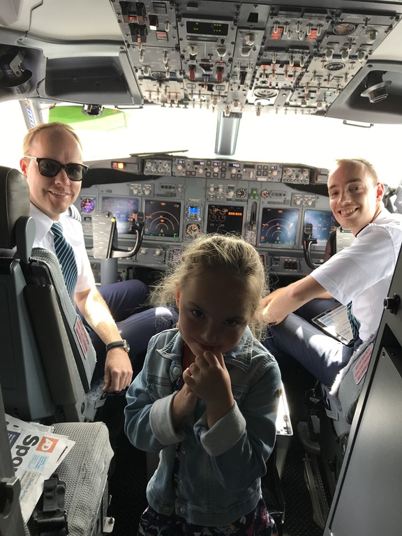
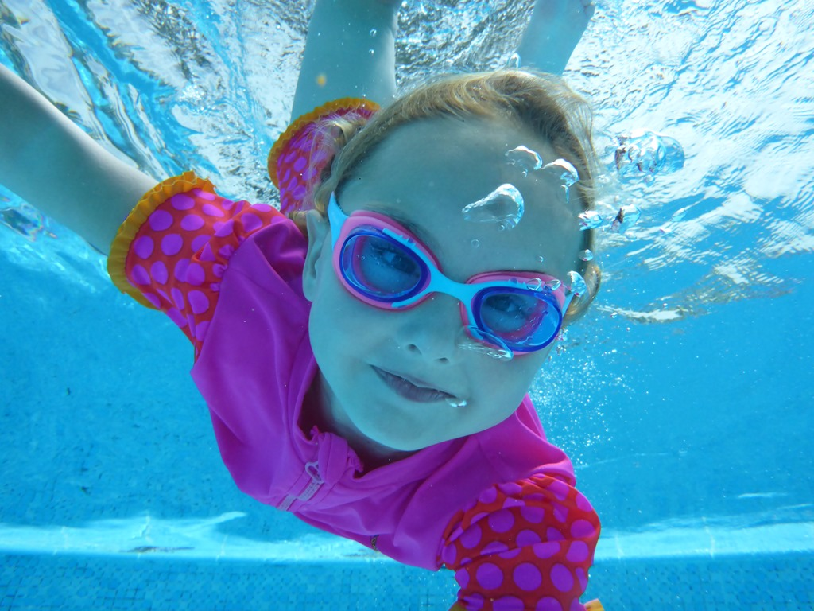
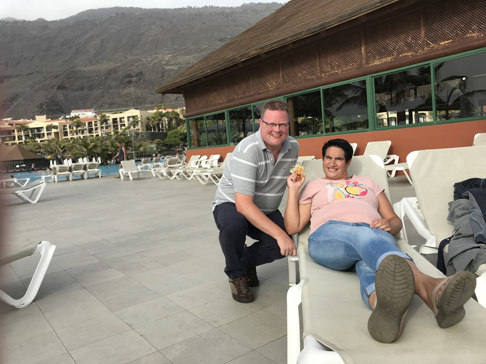

Ons vliegtuig vertrekt al om half acht in de ochtend, dus we zijn al een dagje eerder naar Schiphol gegaan. We overnachten in CitizenM, pal naast de vertrekhal. Dat is allemaal wel zo relaxed, en voor je gevoel begint de vakantie een dagje eerder.

Nadat we de koffers in de kamer gezet hebben, ben ik de auto gaan parkeren op P3. Na terugkomst in de kamer zijn we vertrokken richting het panorama terras. Het is altijd leuk om naar de aankomende en vertrekkende vliegtuigen te kijken.

Na een snelle hap zijn we maar op tijd terug gegaan naar de kamer, want morgen moeten we om 4 uur op staan.

Toen de wekker ging, was het nog donker buiten. Snel gewassen en aangekleed en op naar de balie om de koffer af te geven.

Het inchecken en de securitycheck ging allemaal erg vlot, dus we hadden nog alle tijd om op ons gemak wat te ontbijten bij La Place. Toen was het tijd om aan boord te gaan. De vlucht duurde iets meer dan 4 uur. Sofie (en papa) hebben onderweg nog wat achterstallige slaap ingehaald, dus voor we het wisten werd iets voor 12 uur lokale tijd de landing ingezet richting het vliegveld van La Palma in Santa Cruz. Sofie had onderweg wat in elkaar geknutseld voor de piloten en mocht als beloning even in hun kantoor een kijkje nemen. Dat was erg leuk!

De huurauto van Hertz stond al braaf op ons te wachten, dus we konden al snel op weg naar ons hotel La Palma & Teneguia Princess. Vanaf het vliegveld is het ongeveer een uurtje rijden. Dat komt niet door de afstand, maar door de enorme slingerweg. Al snel blijkt dat het hier moeite kost om 100 meter recht asfalt te vinden. De wegen slingeren van links naar rechts en van boven naar beneden. Bij het hotel aangekomen zijn we maar meteen gaan lunchen bij het zwembad, en daarna konden we de kamer in. Direct werd de zwembroek aangetrokken en was de eerste duik in een van de tien zwembaden een feit.

Het was al met al een enerverende dag, dus 's avonds hebben we gebruik gemaakt van het buffet in het restaurant van het hotel.

