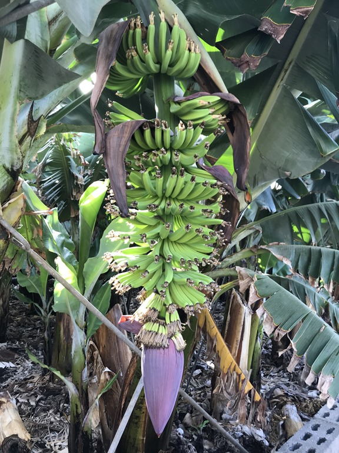
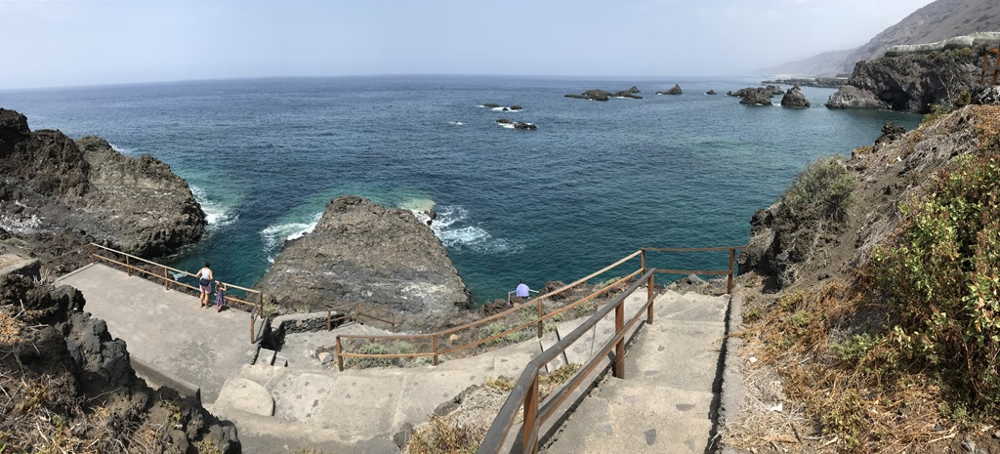
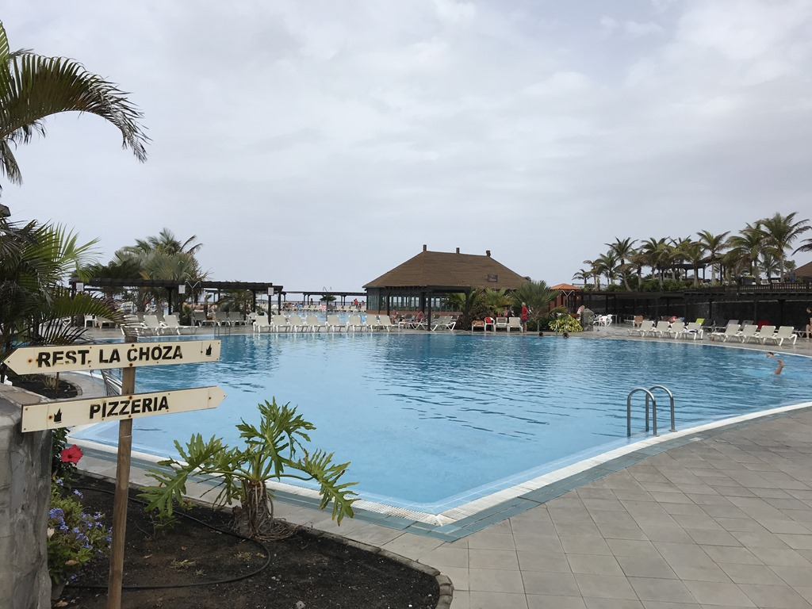
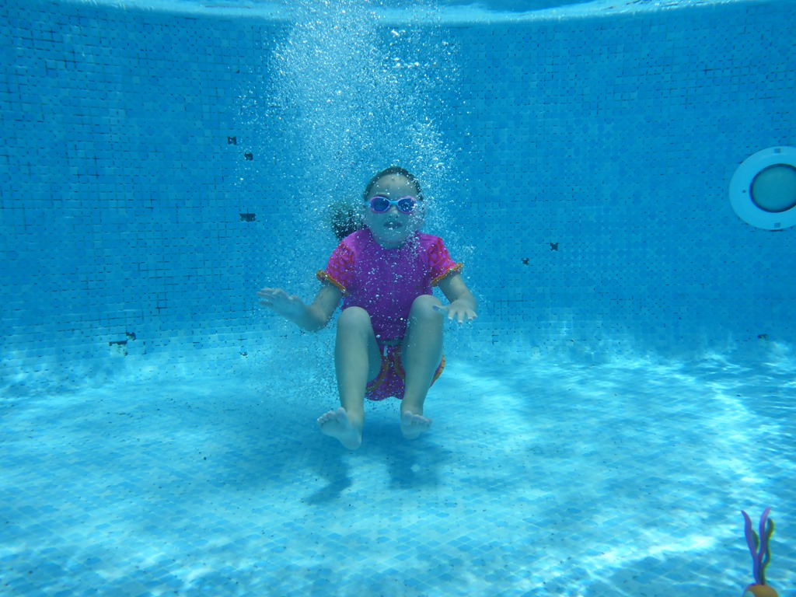
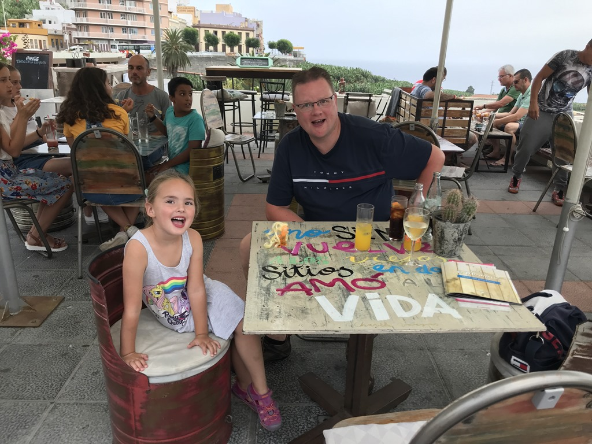
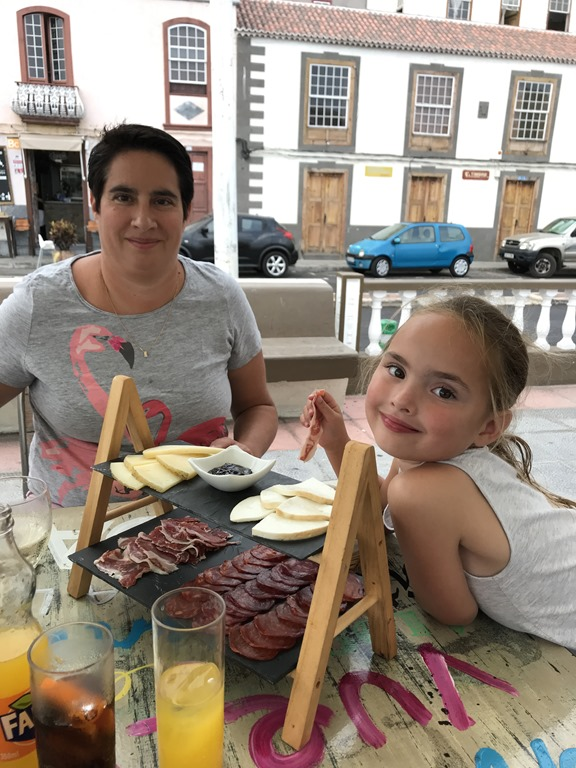

Vanmorgen hebben we lekker rustig aan gedaan. Na het ontbijt hebben we de auto gepakt en zijn we de omgeving wat gaan verkennen. Aan de zuidkant van het eiland liggen allemaal bananen plantages. Zover als je kunt kijken zie je bananen.

We hebben wat boodschappen gedaan bij de lokale Spar en nog wat strandjes in de buurt van het hotel bekeken.

's Middags hebben we nog lekker gezwommen bij het hotel.

's Avonds zijn we met de auto naar Tazacorte gereden. Dit is een leuk stadje met heel veel restaurantjes. We hebben heerlijke tapa's gegeten.

