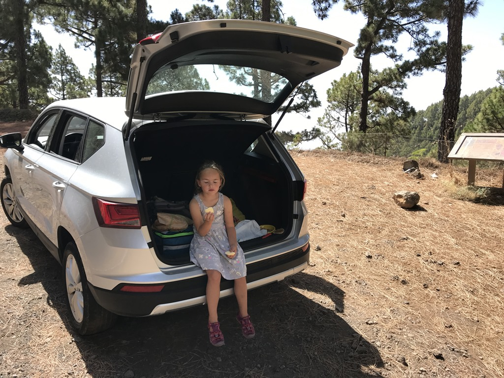
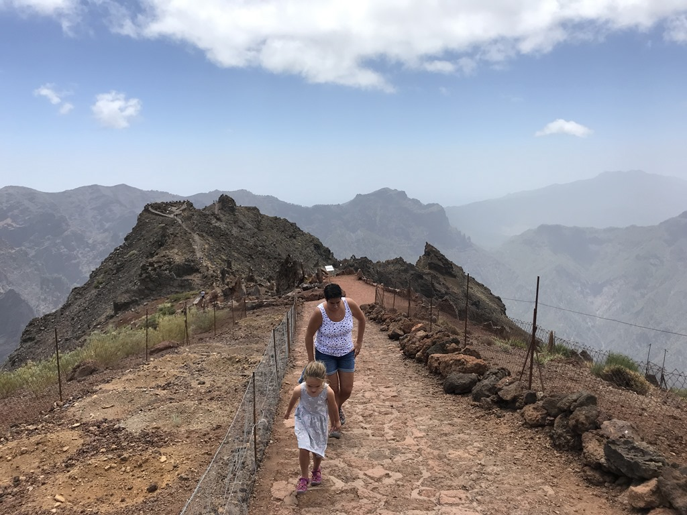
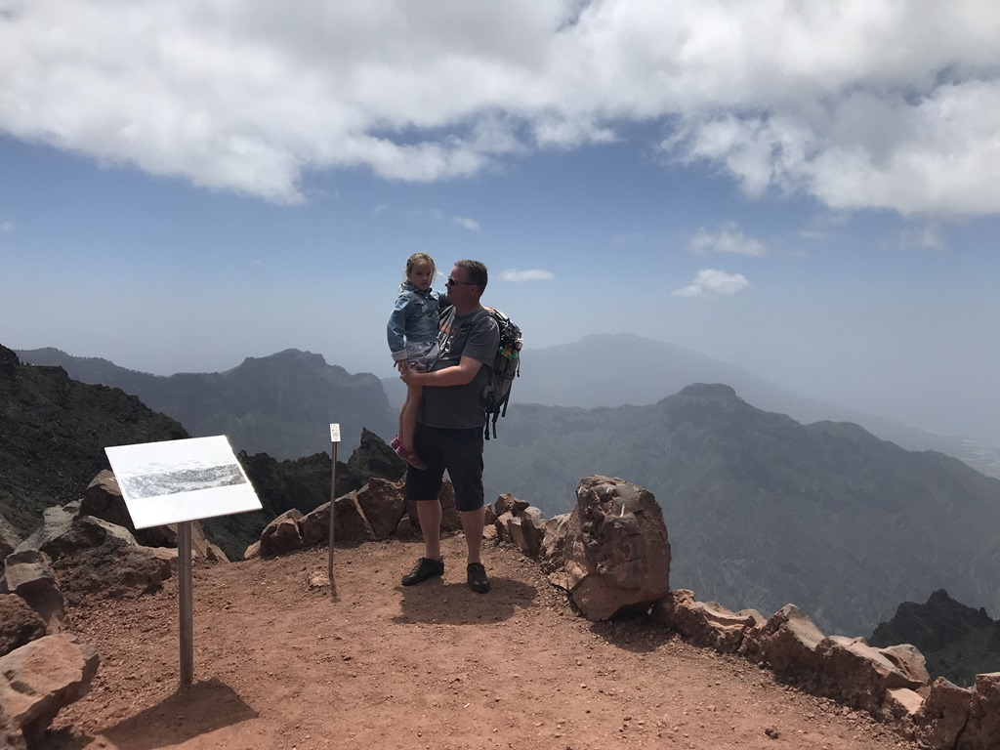
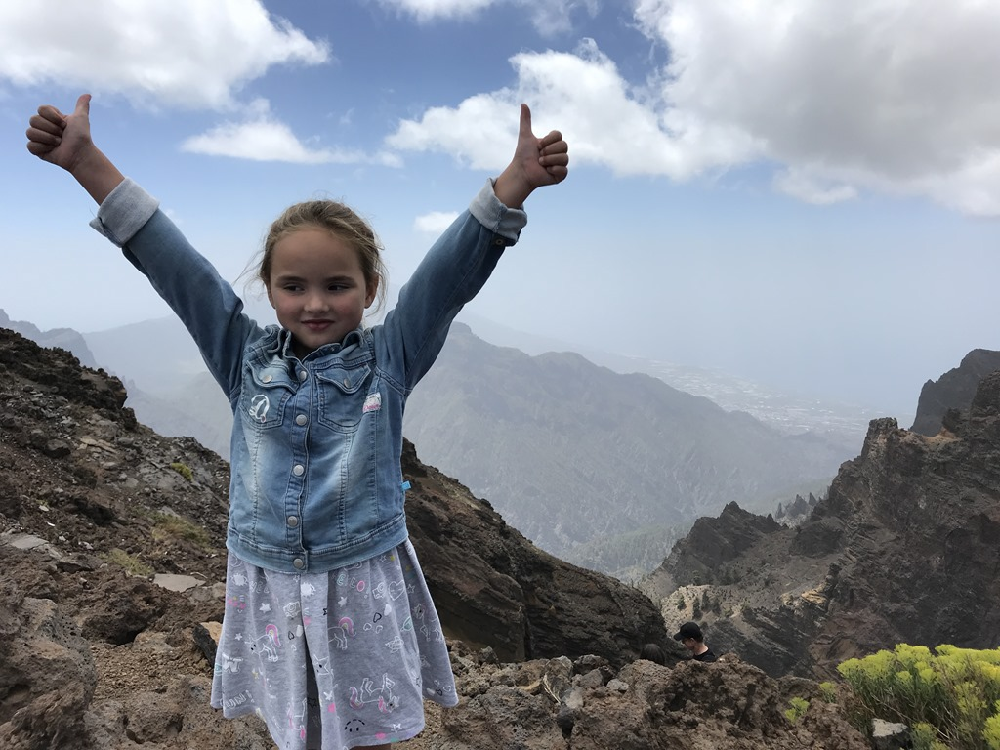
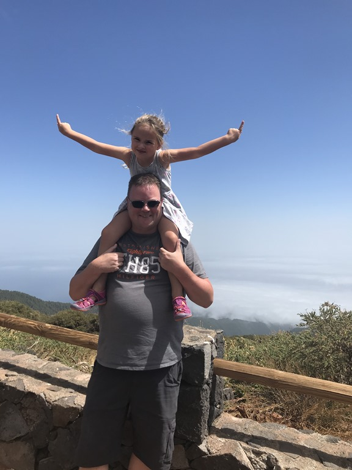

Met een hoogte van 2426 meter is de Roque de los Muchachos de hoogste top van de kraterrand van de Caldera de Taburiente, en tevens het hoogste punt van La Palma. Dit rit er naar toe is ronduit spectaculair. Voor sommige haarspeldbochten moeten we terug naar de eerste versnelling en maximaal insturen. Halverwege eten we even een appeltje.

Op La Palma is bepaalde wetgeving van kracht om 's nachts zo min mogelijk lichtvervuiling te genereren. De sterrenhemel is zodoende werkelijk prachtig, en dus is het een ideale plek om bovenop de top een aantal joekels van telescopen te plaatsen.

We maken een kort wandelingetje naar de rand van de krater. De uitzichten zijn fenomenaal.

