Een barranco is een kloof, en in deze kloof stroomt dus water. Zowel op natuurlijke wijze in de vorm van een beekje, als op semi-natuurlijke wijze: er is een irrigatiekanaaltje gemaakt die water vanaf de bergen naar de bananen plantages vervoert, en, heel handig, een waterval die aan- en uitgezet kan worden. De rit er naar toe is wederom prachtig. Het wandelingetje in de kloof naar de waterval is erg populair, en dus is het een Spaanse chaos met parkeren. Maar we hebben geluk, we kunnen redelijk bij de ingang parkeren.

Om in de kloof te komen, moeten we eerst over een smal paadje door een donkere tunnel.

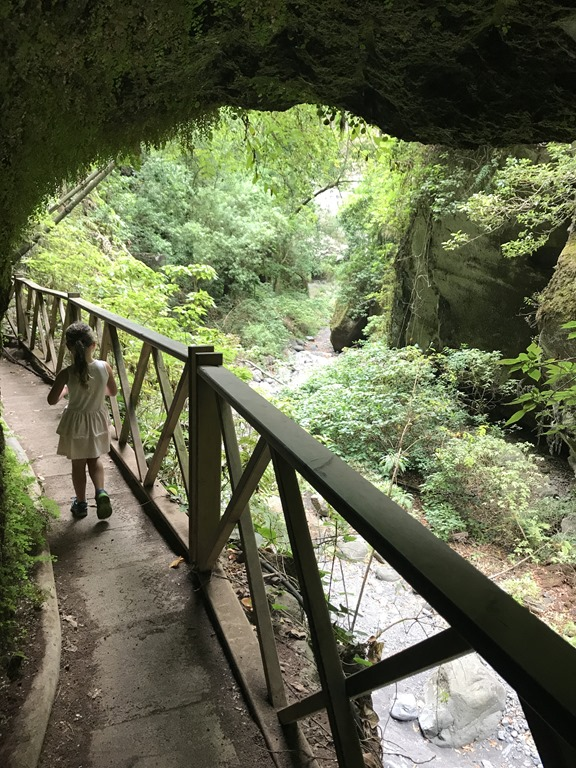

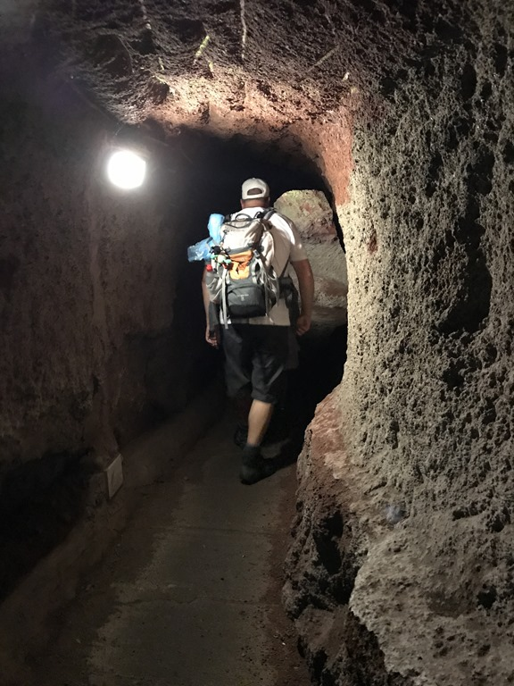

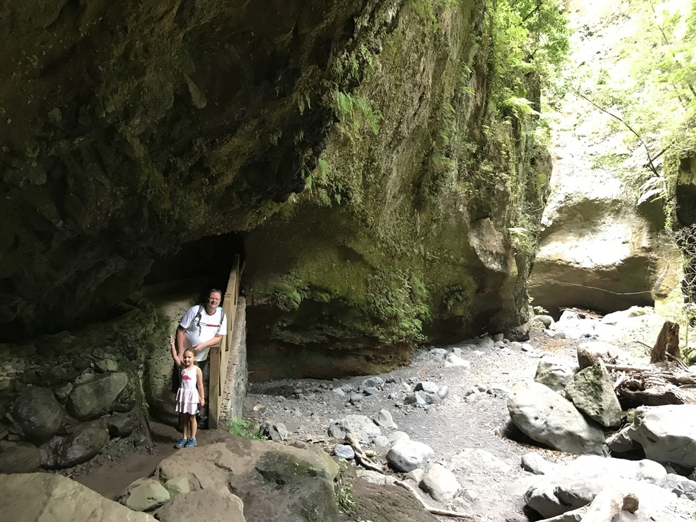

De waterval is op zich niet megaspectaculair, maar ligt wel erg mooi.

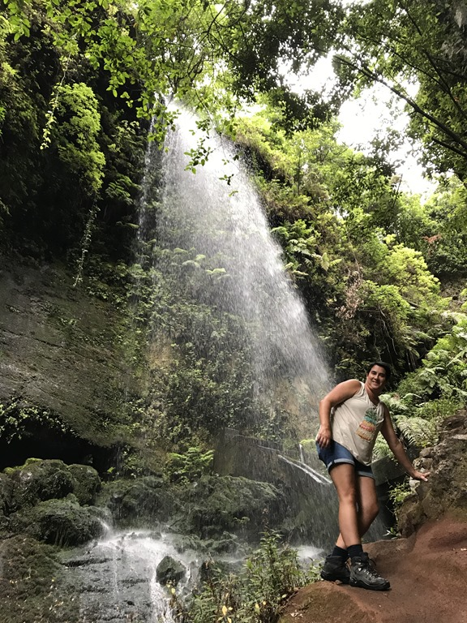

Om verder in de kloof te komen, moeten we onder de waterval door lopen. Sofie vindt het maar wat leuk om samen met mama in dezelfde poncho door het water te rennen.

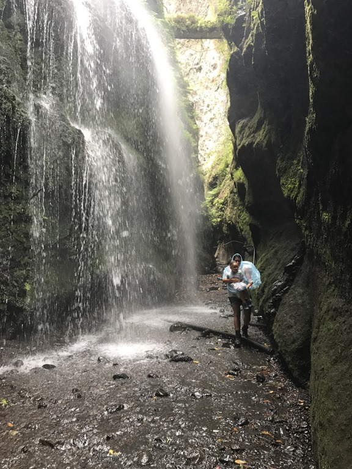

Voorbij de waterval wordt de kloof smaller en smaller. Hier is het erg rustig, en we kunnen genieten van de mooie omgeving.

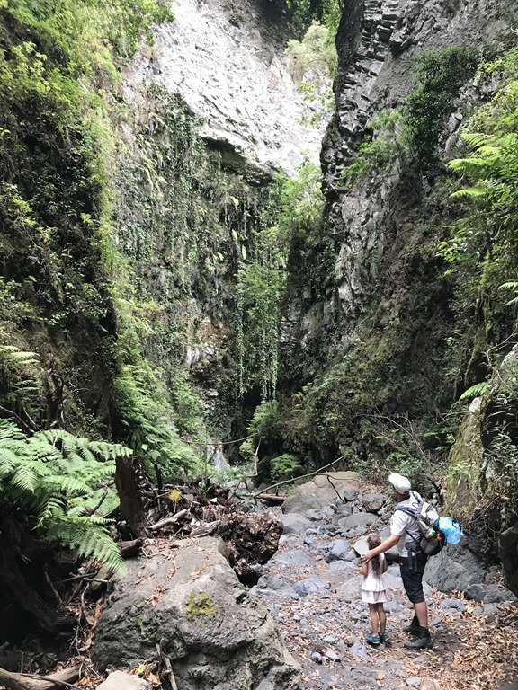

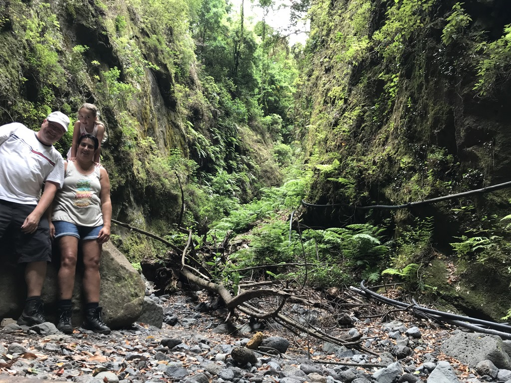

Na een tijdje wordt het geklauter wat te uitdagend en keren we weer terug naar het beginpunt. Daar staat een aantal banken waar we een lekker broodje eten.

Nu we toch in de buurt zijn, sluiten we de dag in stijl af door te gaan zwemmen bij Charco Azul. Dit is een gratis toegankelijk zwembad met zeewater, direct gelegen aan zee. Het is er best druk, maar het is wel heel erg leuk (en koud!) om hier even een duik te nemen.

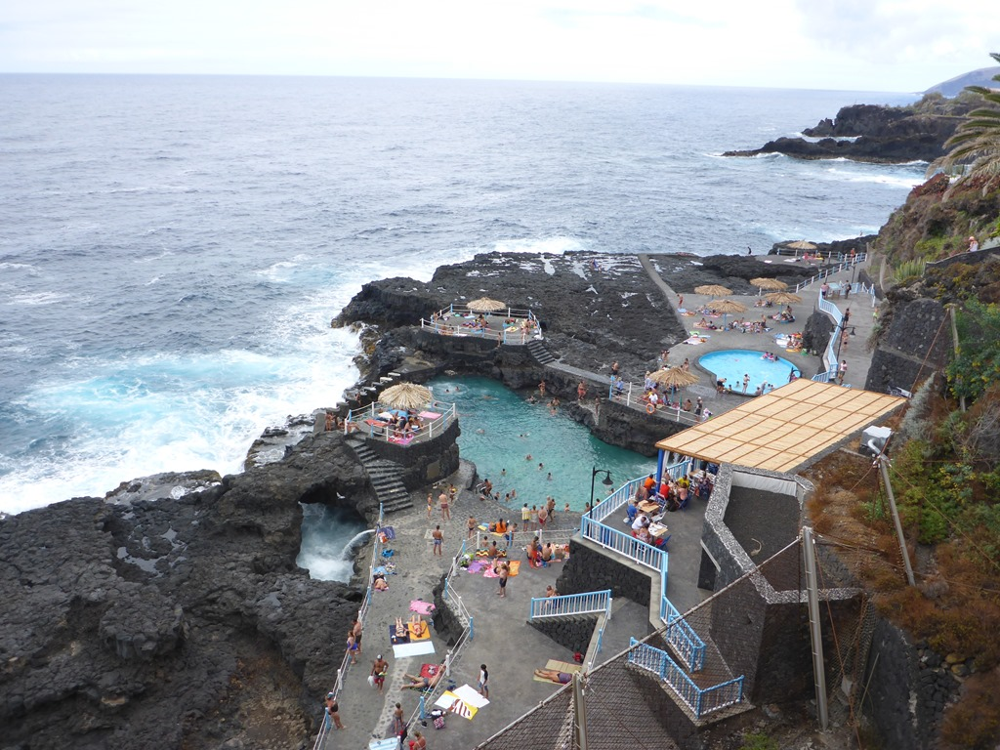

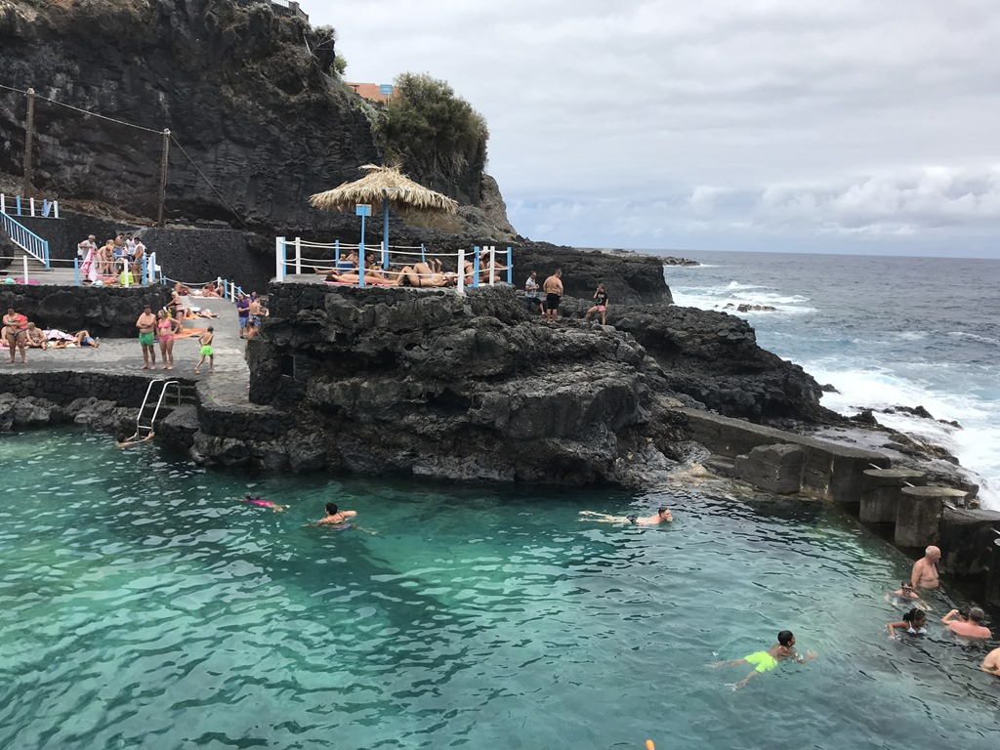

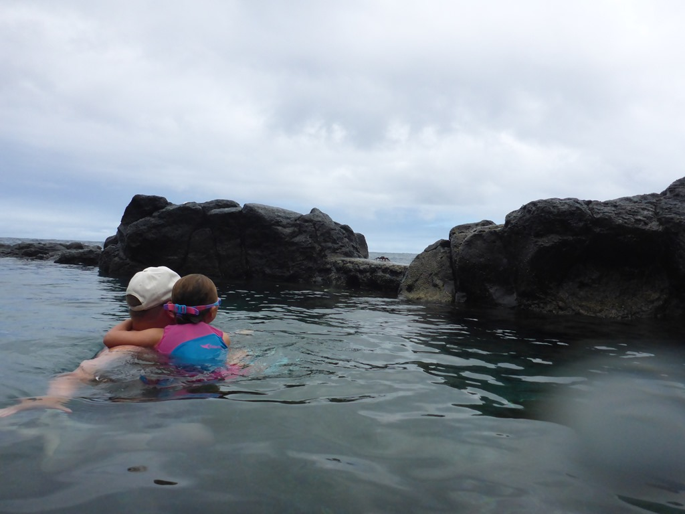

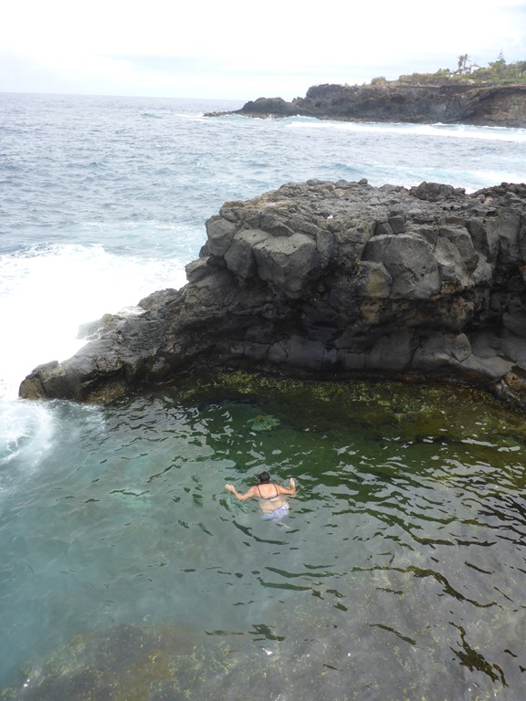

Het stikt er wel van de krabben...

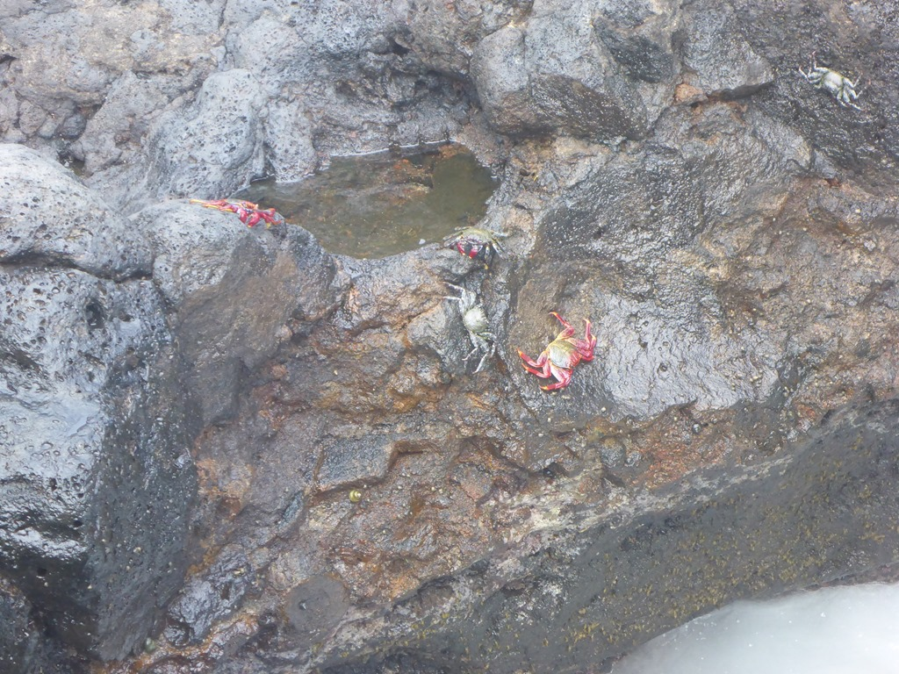

Het was een drukke dag, dus 's avonds hebben we bij het zwembad een broodje gegeten.
