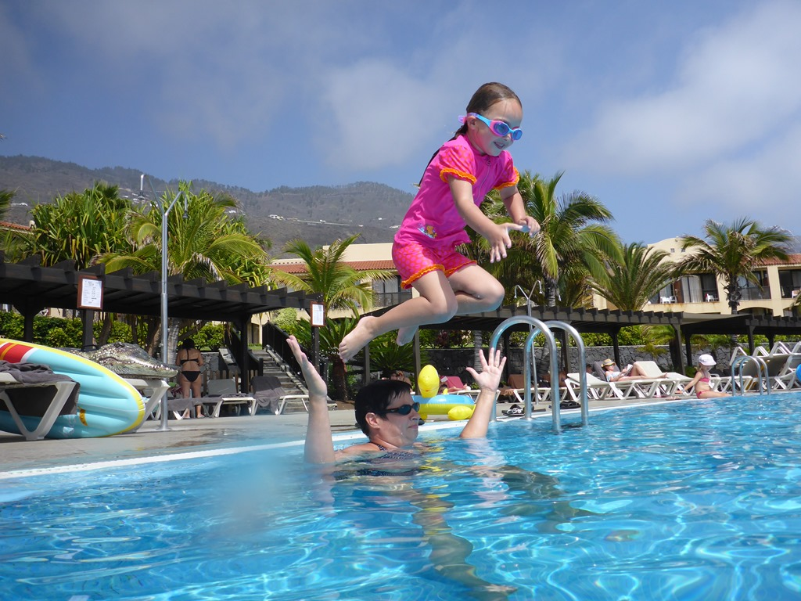
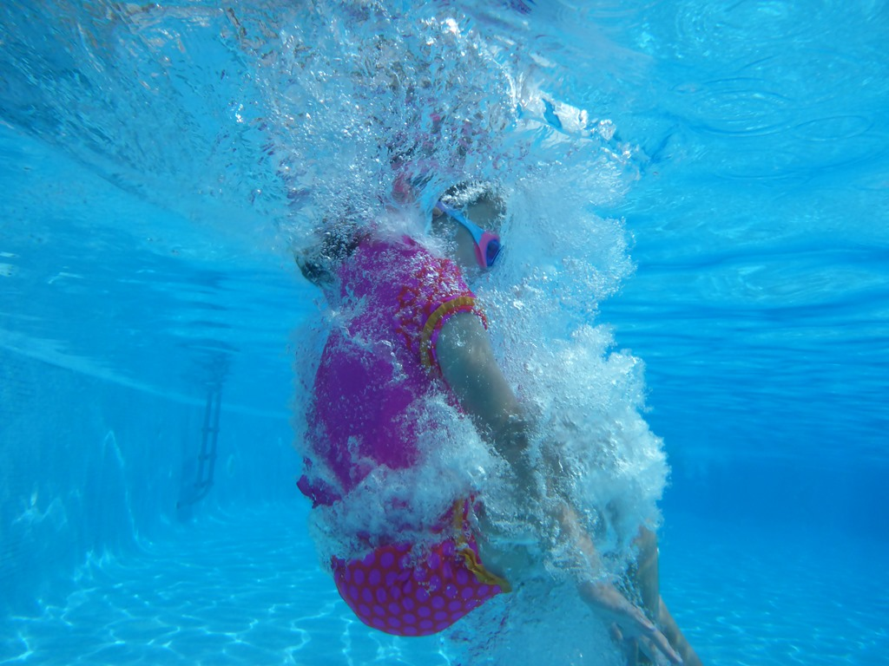
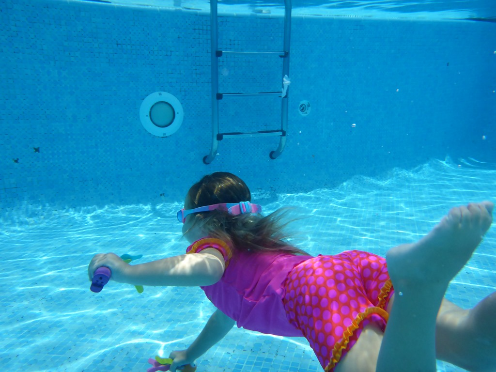
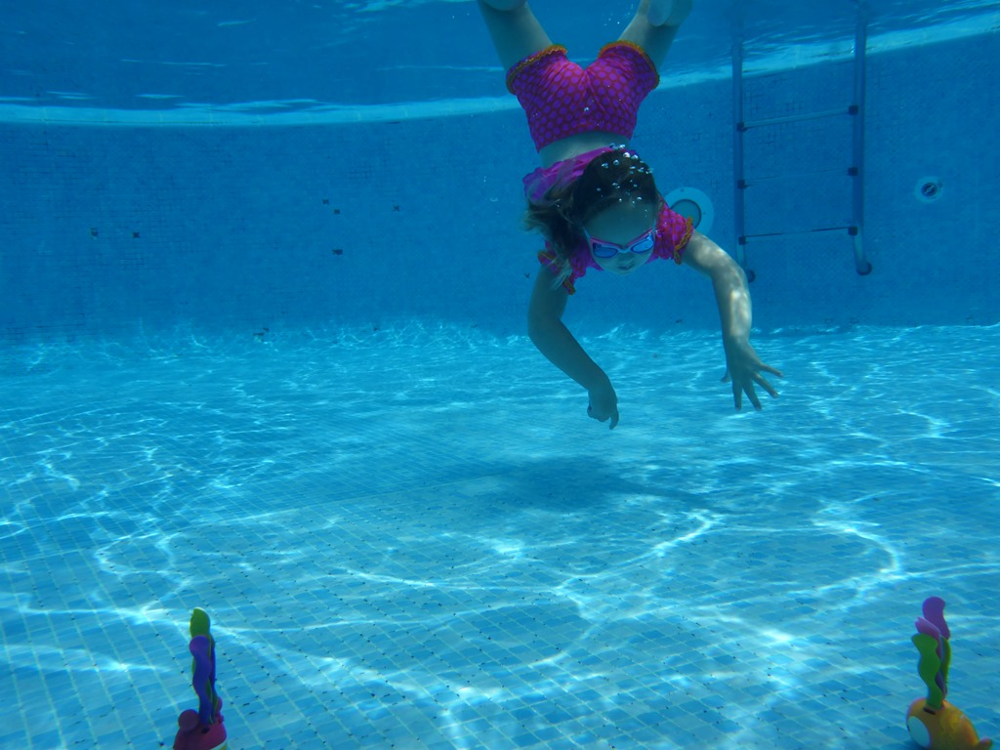
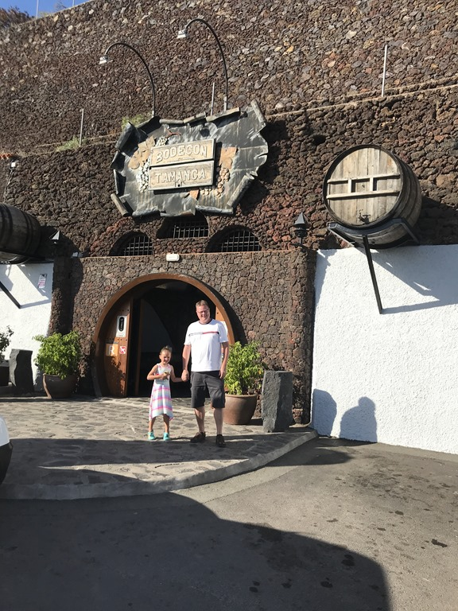
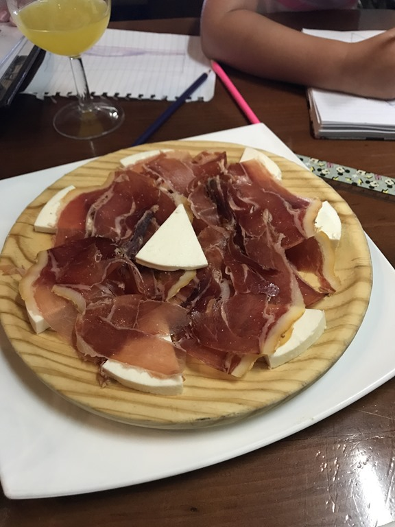
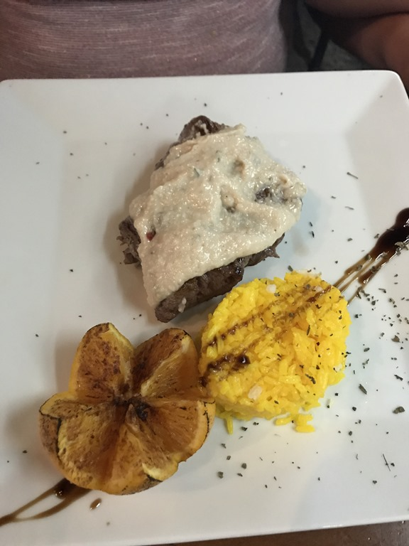
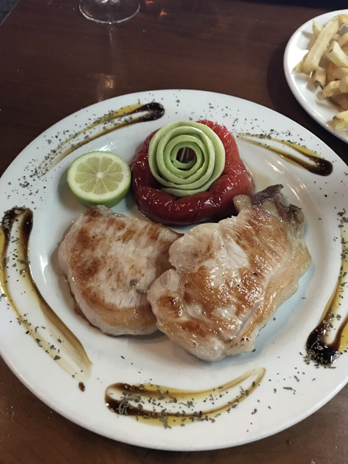

Na alle drukte van gisteren, besluiten we om vandaag een dagje bij het hotel te blijven. Lekker uitgeslapen en laat ontbeten. We scoorden bij het zwembad op de valreep nog drie ligbedjes in de schaduw. De hele dag werd er druk gesprongen, gedoken, gerust, gelezen en gespeeld.

Aan het einde van de middag hebben we de auto gepakt en zijn naar restaurant Bodegon Tamanca gereden. Dit restaurant bevindt zich in een oude wijnopslag, en ligt in een grot. We hebben er voortreffelijk gegeten!

Steak met knoflook (enorm veel knoflook!)

