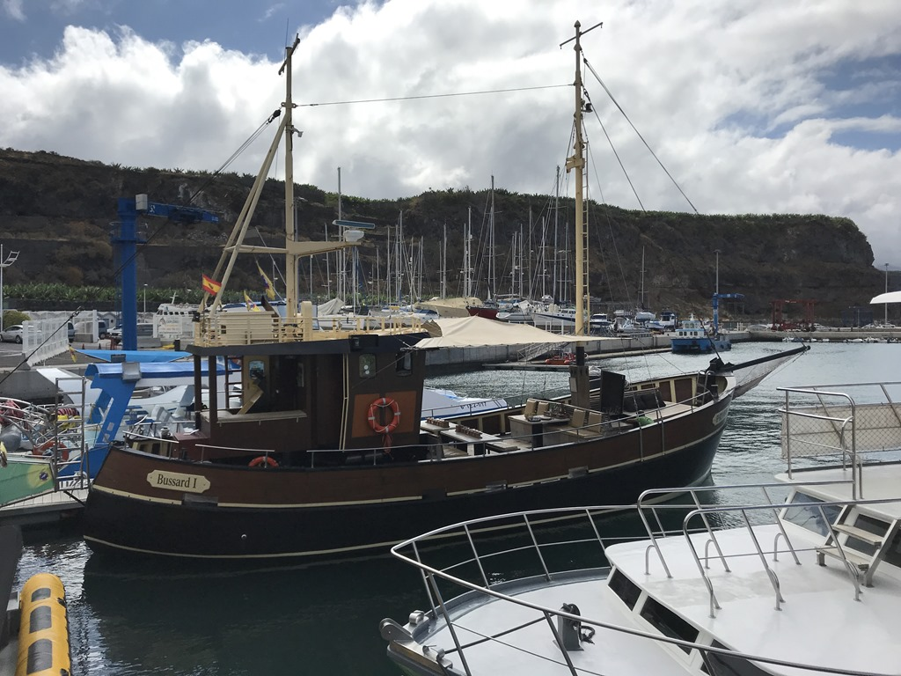
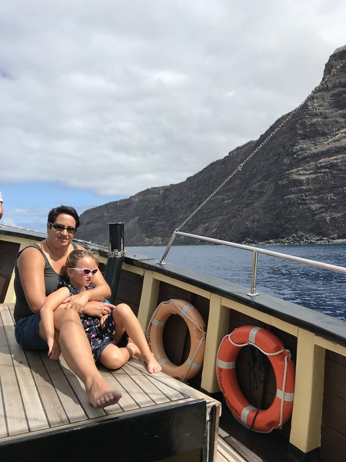
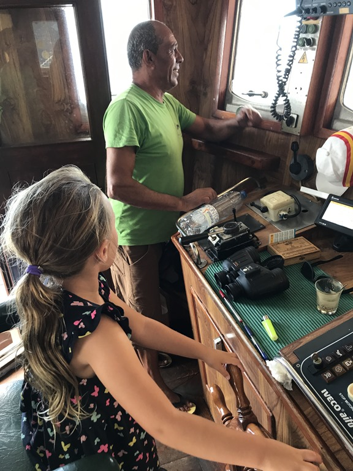
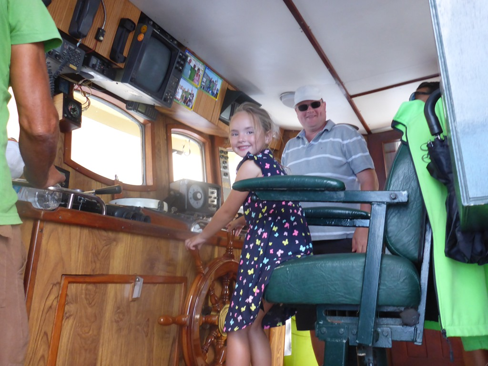
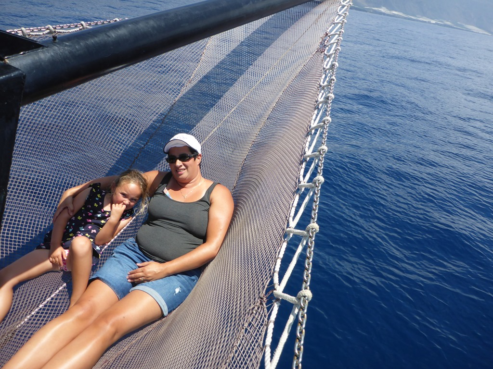
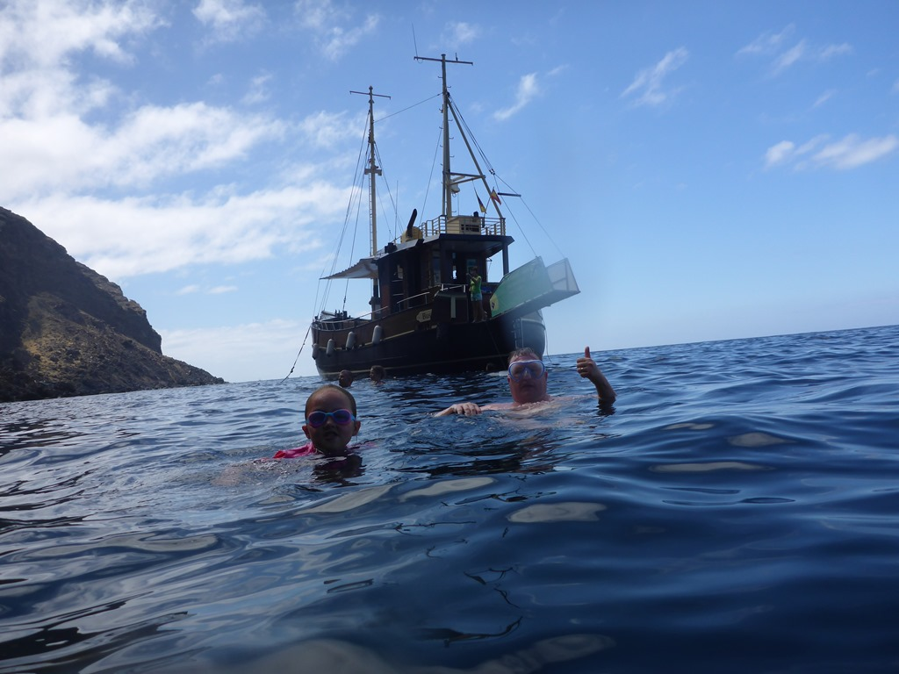
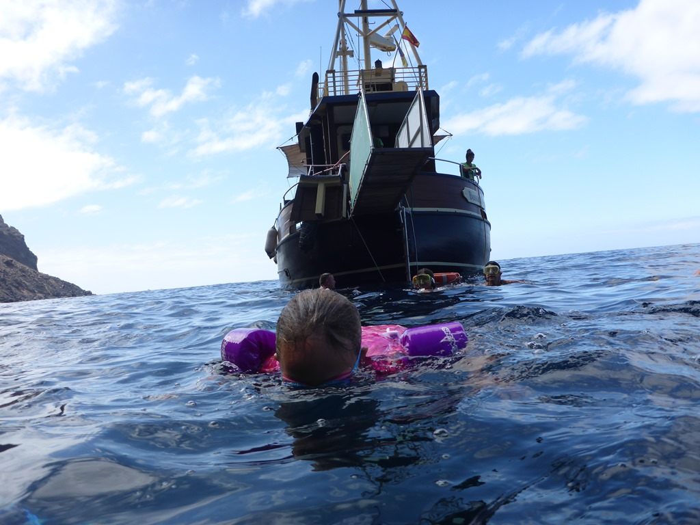
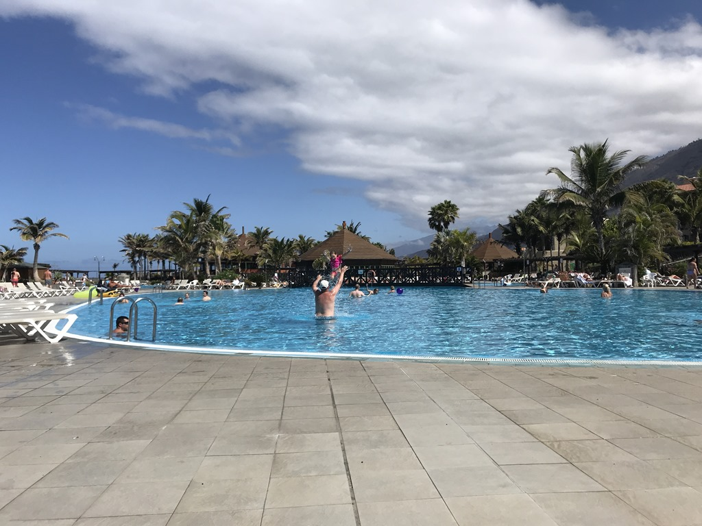
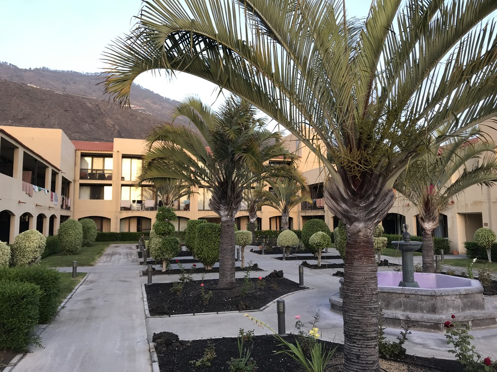
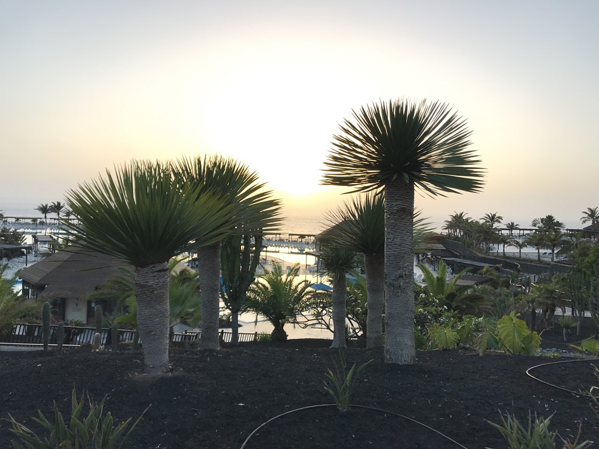

Dolfijnen zijn erg leuk om naar te kijken, behalve als ze er niet zijn. Daar kwamen we vandaag achter. We hadden een tour geboekt met de Bussard. De Bussard is een oude krabbenvissersboot, een sfeervolle houten schuit met een mooi dek om lekker op uit te waaien en om te zonnen. Op de Bussard gaan maximaal 12 mensen waardoor deze nooit propvol zit en je overal genoeg ruimte hebt. Deze boot richt zich meer op een boottocht met lekker eten. Alles is piekfijn verzorgd, kopje koffie, fris, wijntje en lekker eten (kip, salades, aardappelen, sausjes). Kortom, genieten op het water. De boot vaart langs de kust, op zoek naar dolfijnen. Deze moeten met het blote oog gespot worden en daardoor moet je net iets meer geluk hebben. De sfeer aan boord is leuk, relaxt en gemoedelijk. Naast ons, is er nog een Spaans en een ander Nederlands gezin. De bemanning praat redelijk Engels en is zeer sympathiek. We beginnen de tocht met Cava, altijd lekker natuurlijk. De boot is niet al te groot, en redelijk onstabiel in het deinende water, dus heel even dacht ik spijt te krijgen van de Cava, maar toen we wat verder op zee waren, werd de zee (en mijn maag) gelukkig wat rustiger.

Het eerste stuk varen we langs de kust, en kunnen we mooi naar het eiland en wat vakantie- en miniscule vissershuizen kijken.

Sofie mocht ook nog even voor kapitein spelen.

Na ongeveer een uurtje varen mochten we in een baaitje wat zwemmen terwijl de crew de lunch ging klaarmaken. Er waren niet al te veel vissen te zien, maar een duik in het frisse water was toch wel welkom.

De lunch was voortreffelijk, en we hebben gezellig zitten babbelen met z'n allen. Uiteindelijk hebben we geen enkele dolfijn gezien, maar niemand vond dat eigenlijk erg, de sfeer en verzorging aan boord was namelijk prima.

Om het af te leren hebben we de rest van de middag heerlijk in het zwembad gezwommen.

's Avonds hebben we de koffer en handbagage weer moeten inpakken. De week zit er al weer op. We kijken met veel plezier terug op ons verblijf in La Palma, we komen zeker een keertje terug!
