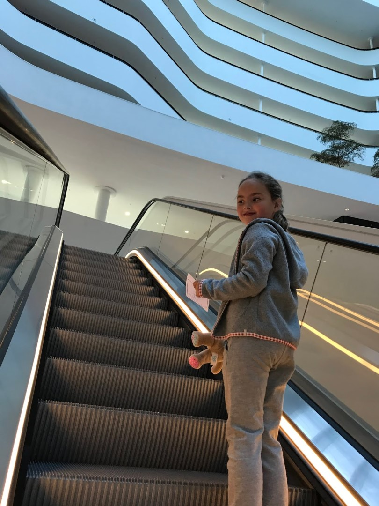
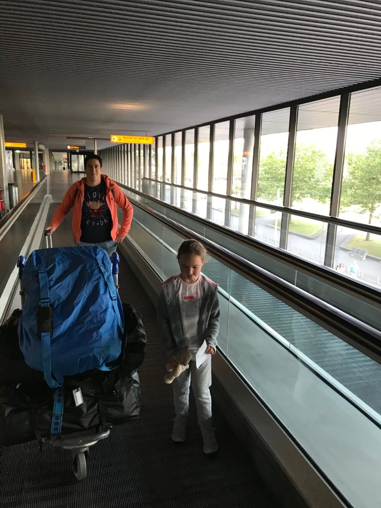
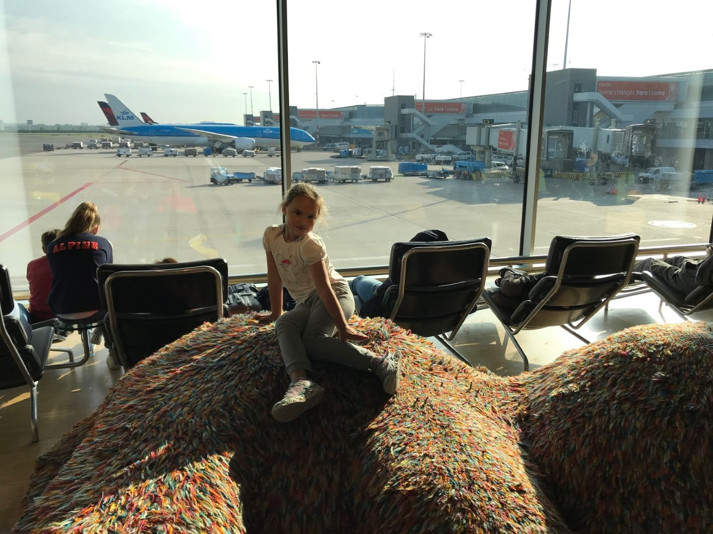
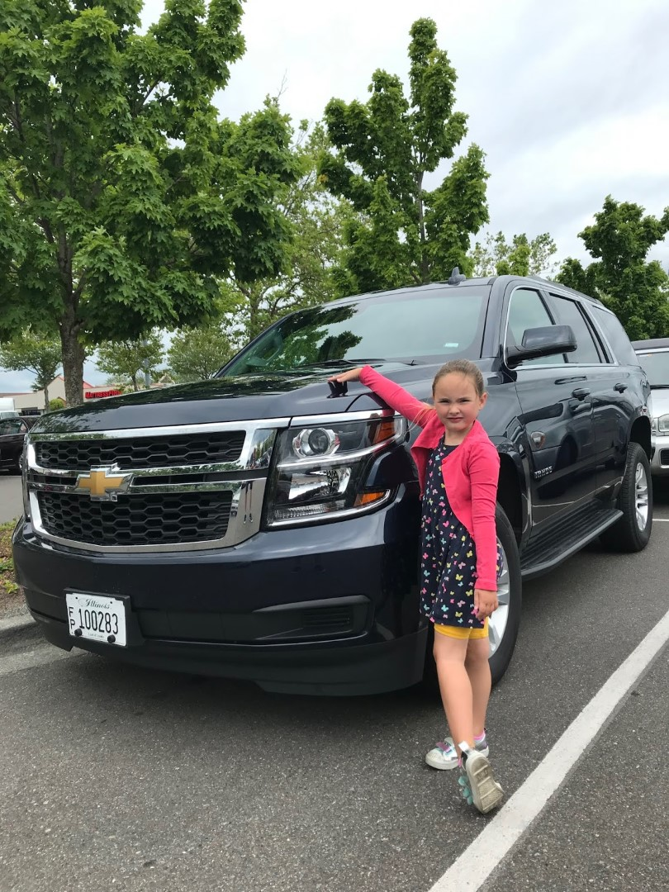
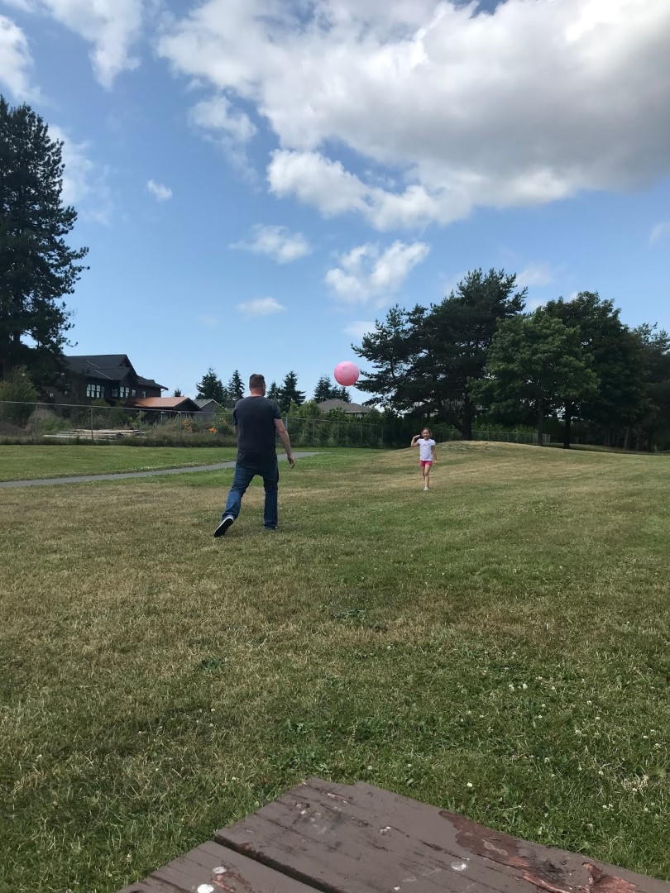
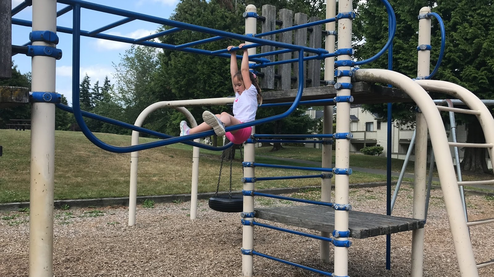

De laatste schooldag van Sofie werd meteen de eerste dag van de vakantie. Om half een hebben we Sofie opgehaald van school. Na de lunch zijn we langzaamaan richting Schiphol vertrokken. We overnachten in de Hilton op Schiphol zelf, een minuut of 10 wandelen en je staat in de vertrekhal. Het is druk in de Plaza, dus uiteindelijk zoeken we maar de rust van de hotel lobby op en eten daar (erg lekker!).

We hebben de volgende ochtend nog tijd genoeg om van het voortreffelijke ontbijt te genieten, alvorens de hele huisraad op een karretje richting vertrekhal 2 gaat. Inchecken, security en douane gaan allemaal redelijk vlot, dus we hadden genoeg tijd om wat door de vertrekhal te wandelen en te spelen.

De vlucht zelf ging prima, hoewel 9 uur en 20 minute natuurlijk een hele zit is. We werden prima verzorgd door de dames en heren van Delta. Na aankomst in Seattle stond onze voiture voor de komende weken al op ons te wachten, een donker blauwe Chevy Tahoe.

We waren iets te vroeg voor het hotel, dus hebben we nog even wat boodschappen gedaan, en hebben we heel even wat gespeeld in de speeltuin, vlak bij het hotel.

We waren allemaal erg moe van de lange dag, dus na een snelle hap van de Mac zijn we ons bed in gedoken.

## 1 opmerking

### Gerard 12 juli 2019 om 00:26

Welkom in Seattle. Sofie vindt de auto maar wat groot!
