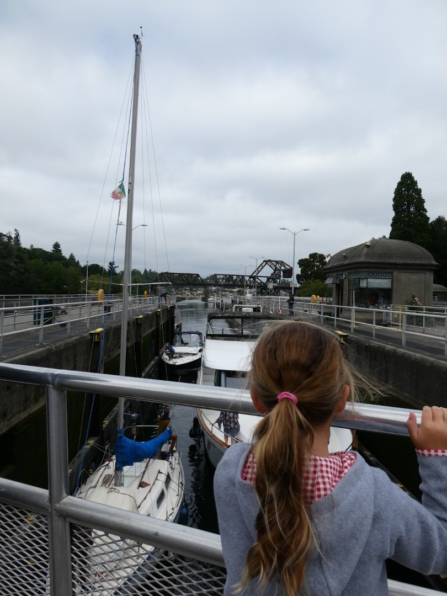
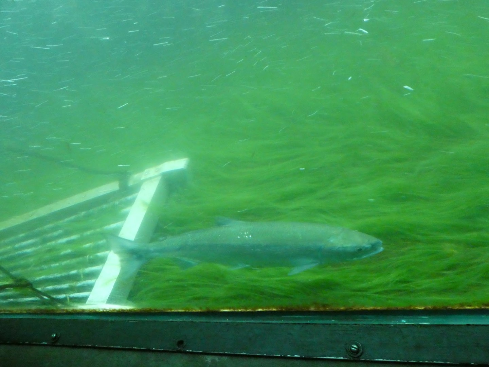
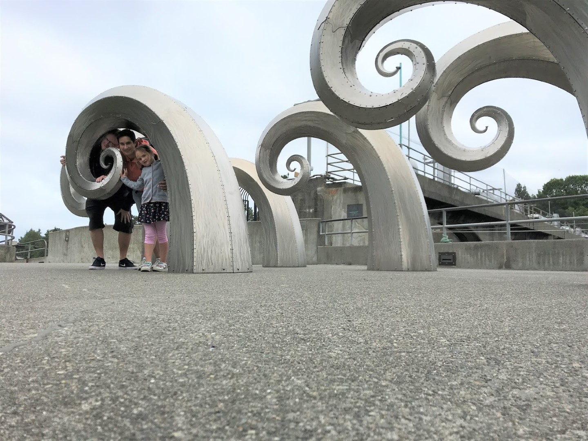
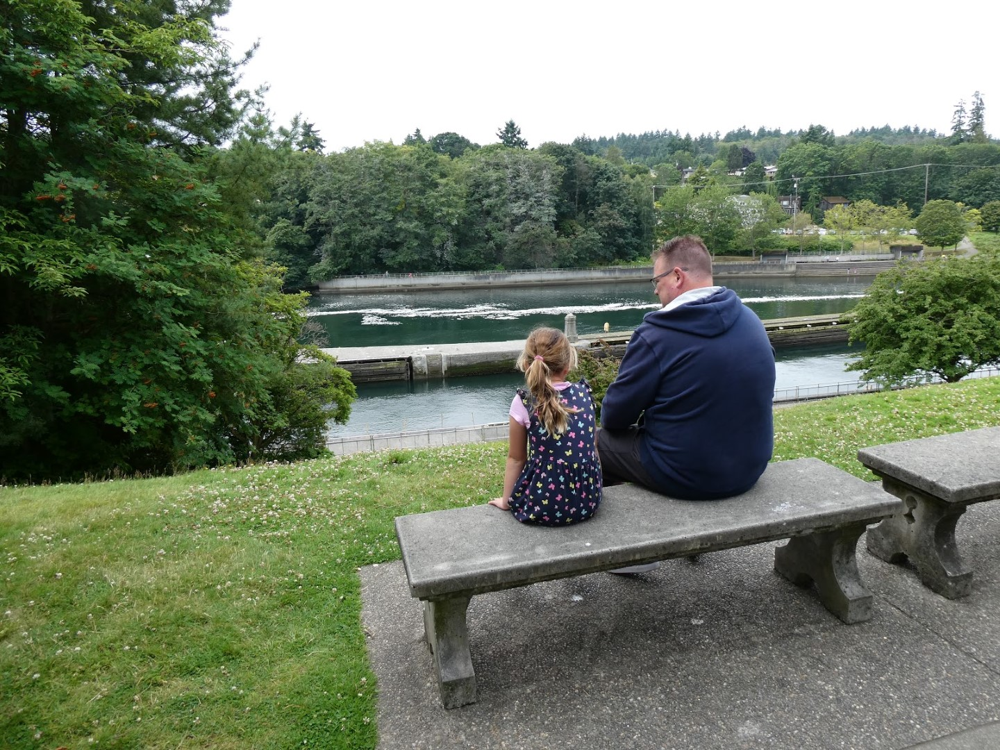
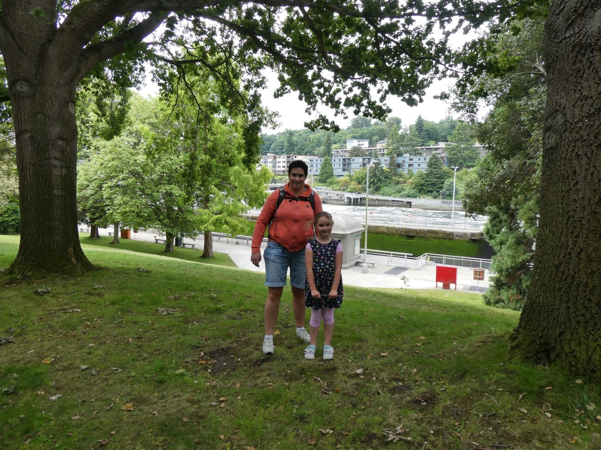
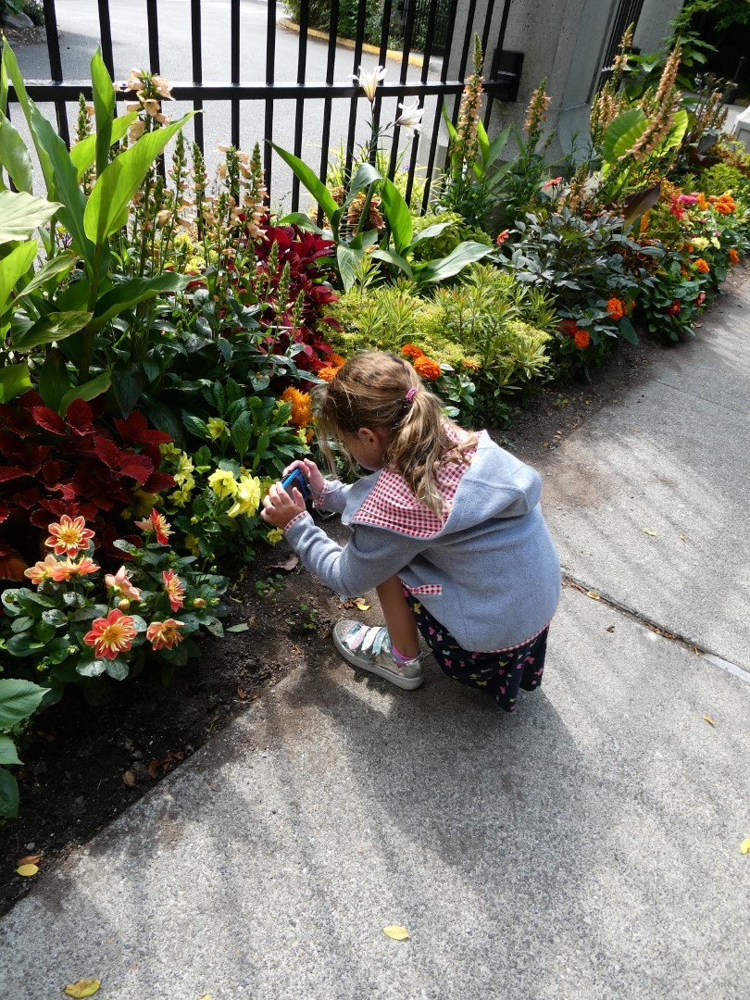
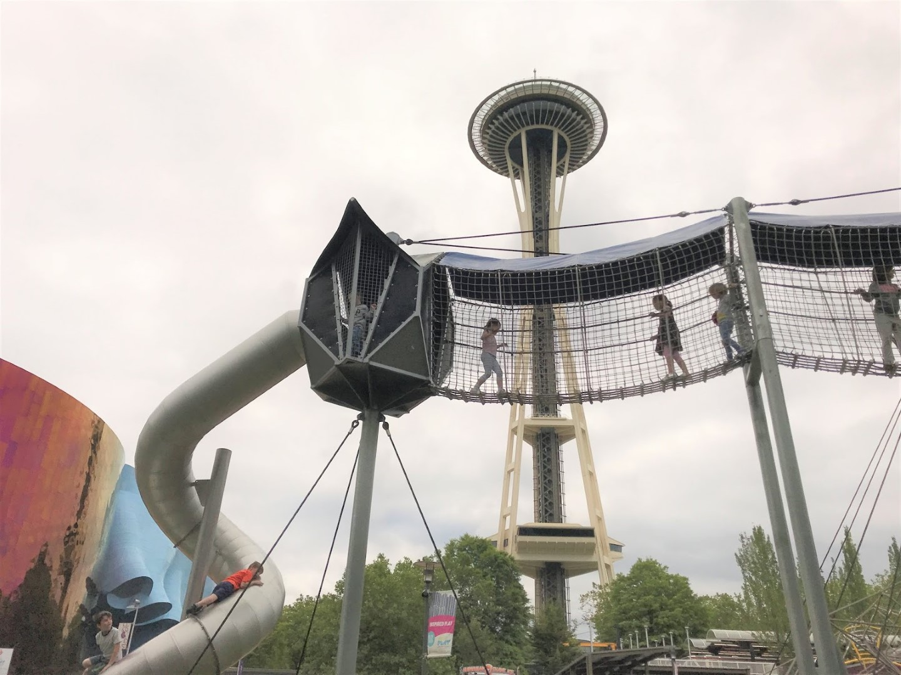
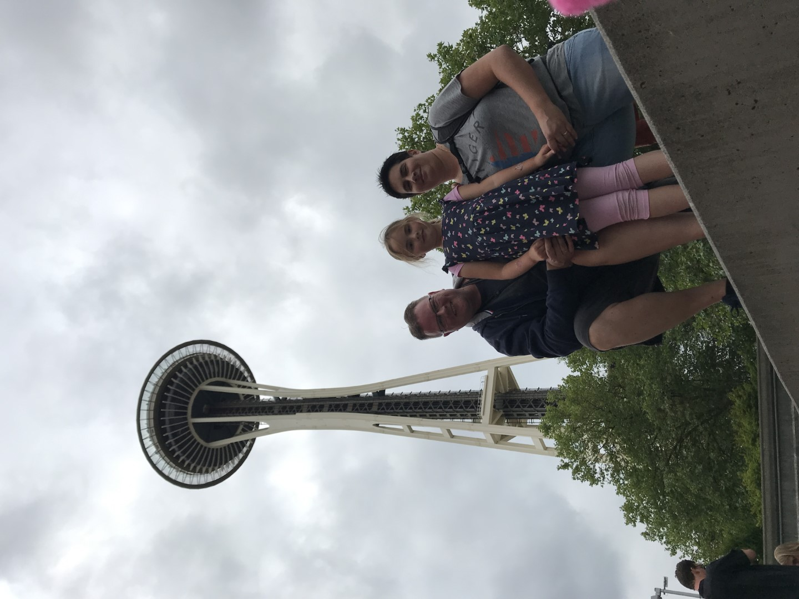
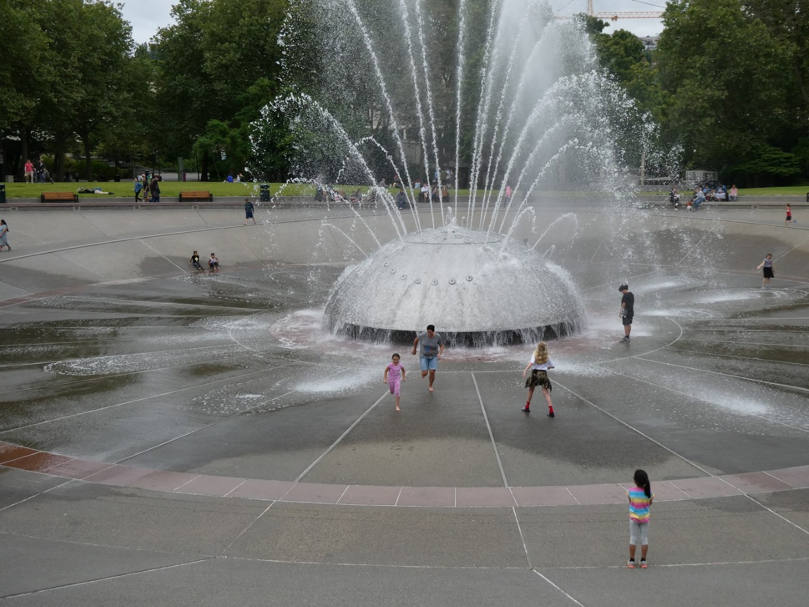

Met dank aan de jetlag zaten we al om zeven uur aan het ontbijt, waarna we richting de Hiram M Chittenden Locks gingen. Dat is een hele mond vol voor een stelletje sluizen, maar wat deze locatie uniek maakt is de zogenaamde zalm ladder die ze naast de sluizen gemaakt hebben.

Om de zalmtrek niet dwars te zitten, hebben ze hier een "trap" gemaakt van 21 treden, waardoor de zalmen braaf stroom opwaarts kunnen zwemmen om hun ding te kunnen blijven doen in hogerop gelegen gebieden. Er is een aantal kijkglazen gemaakt, en zodoende konden we de nog ongerookte varianten van dichtbij aanschouwen. Het was een mooi gezicht.

Naast de sluizen is nog een botanische tuin die ook de moeite van het bezoeken waard is.

Nu we toch in de buurt zijn, gaan we maar meteen naar het iconische bouwwerk van Seattle, de Space Needle. De toren zelf hebben we niet bezocht, maar het omliggende terrrein biedt volop vertier. Aan de voet van de toren is een leuke speeltuin. Terwijl Sofie ging klimmen en klauteren en glijden werden de broodjes voor de lunch bereid.

Na de boterham hebben we wat rondgelopen en kunnen genieten van het aangeboden entertainment. Uiteindelijk kwamen we bij een of ander water fontein spuit ding uit, die op de maat van de muziek veel of heel veel water de lucht in, en vervolgens op het meestal jonge grut spuugt. Het was een leuk schouwspel, en Sofie was gelukkig niet al te nat geworden.

Na dit alles konden we onze auto terugkopen bij de parkeergarage (18 dollar voor twee uurtjes!) en zijn we weer richting het hotel vertrokken. 's Avonds hebben we in het winkelcentrum tegenover het hotel gegeten bij de Cheesecake Factory. Vanwege de jetlag kon de kleinste van het gezin de ogen amper open houden, dus de overheerlijke Chicken Madeira moest in rap tempo gegeten worden.

## 1 opmerking

### Gerard 12 juli 2019 om 00:36

Leuke plaatjes van de eerste dag. De zalmtrek is wel een mooi gezicht. Zie wel dat er wat bewolking is maar die waait wel weg.
Geniet maar lekker.
