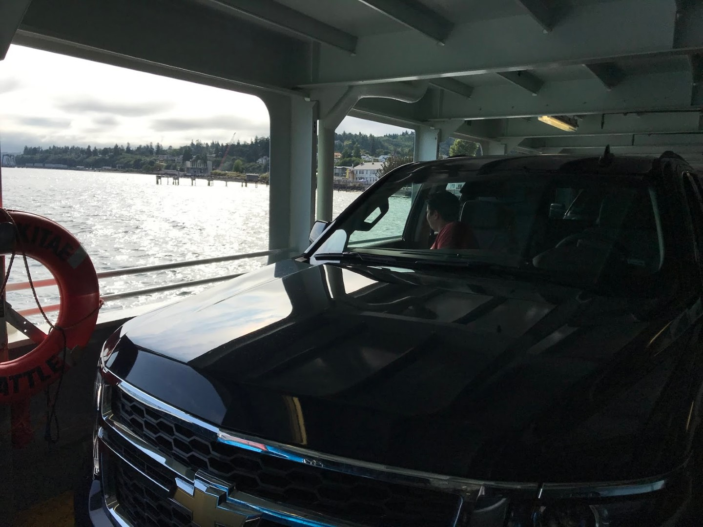
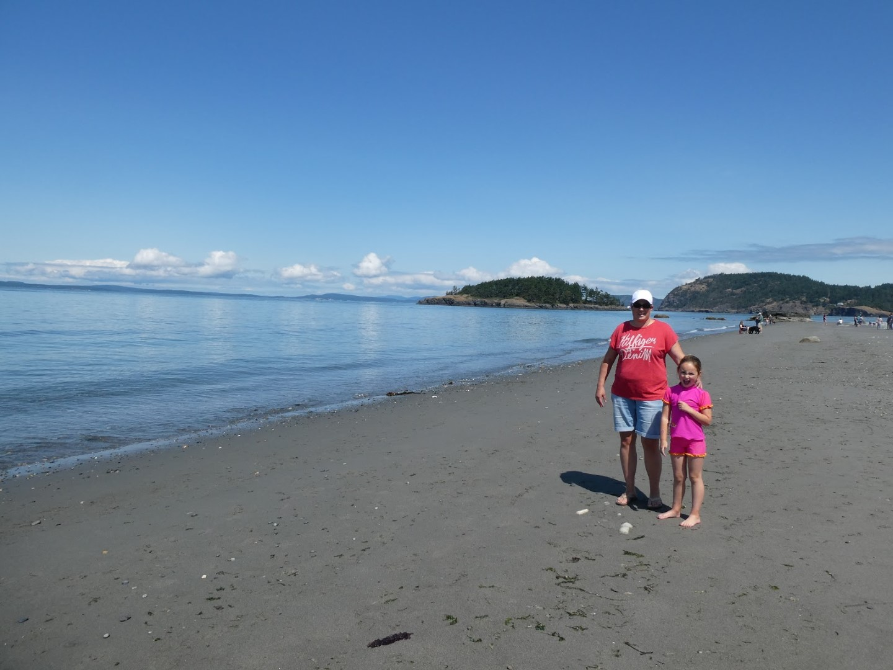
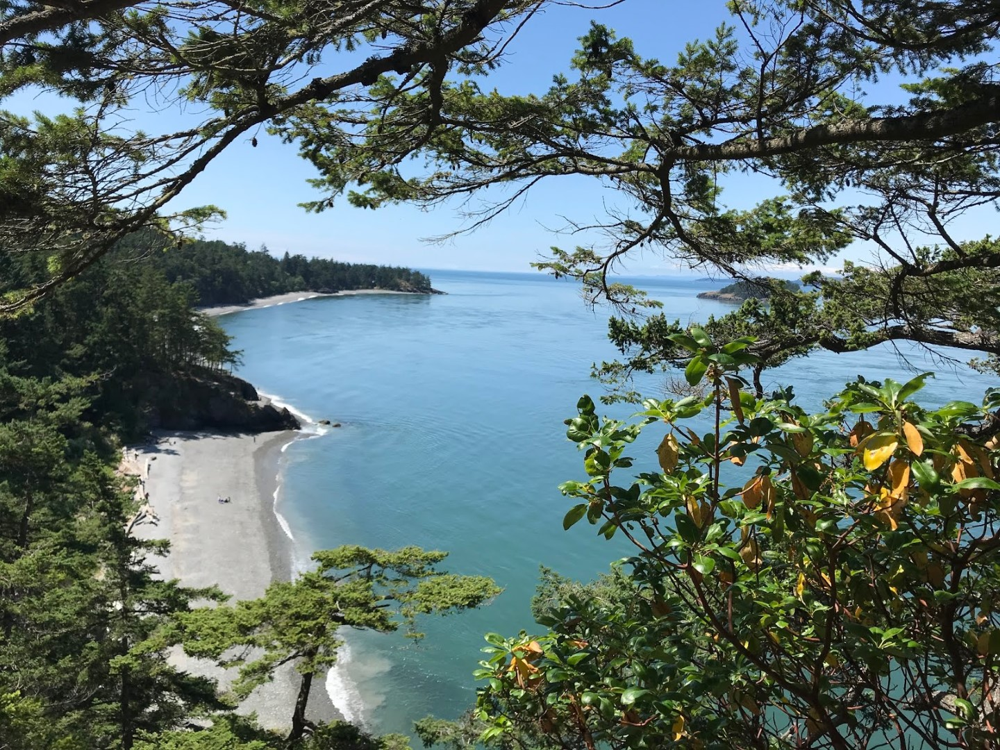
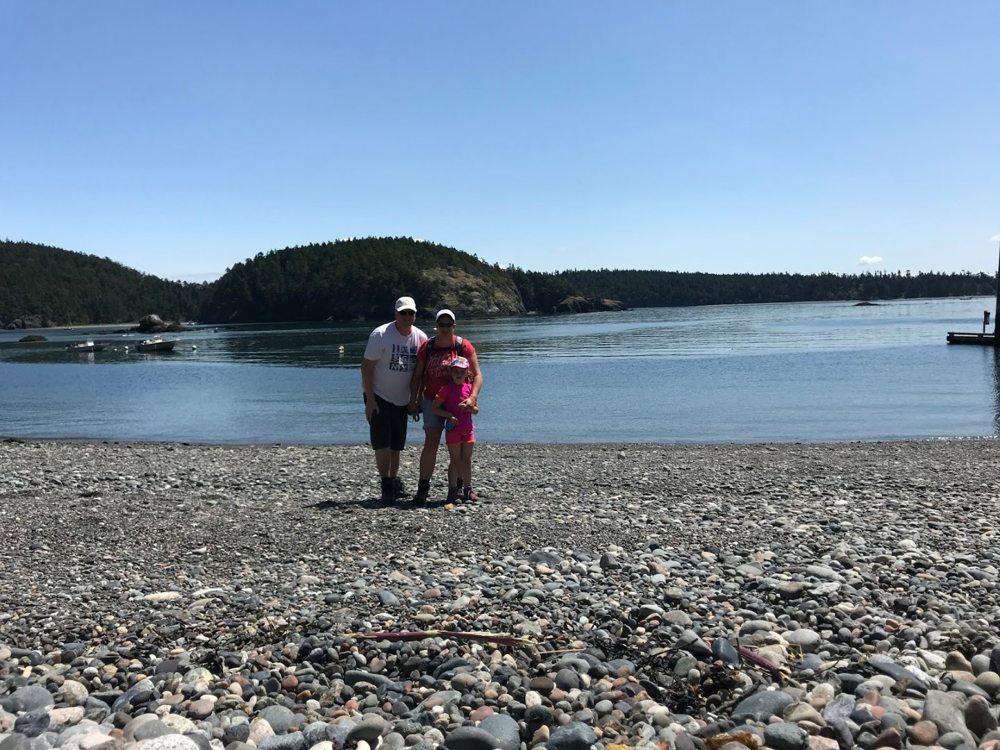
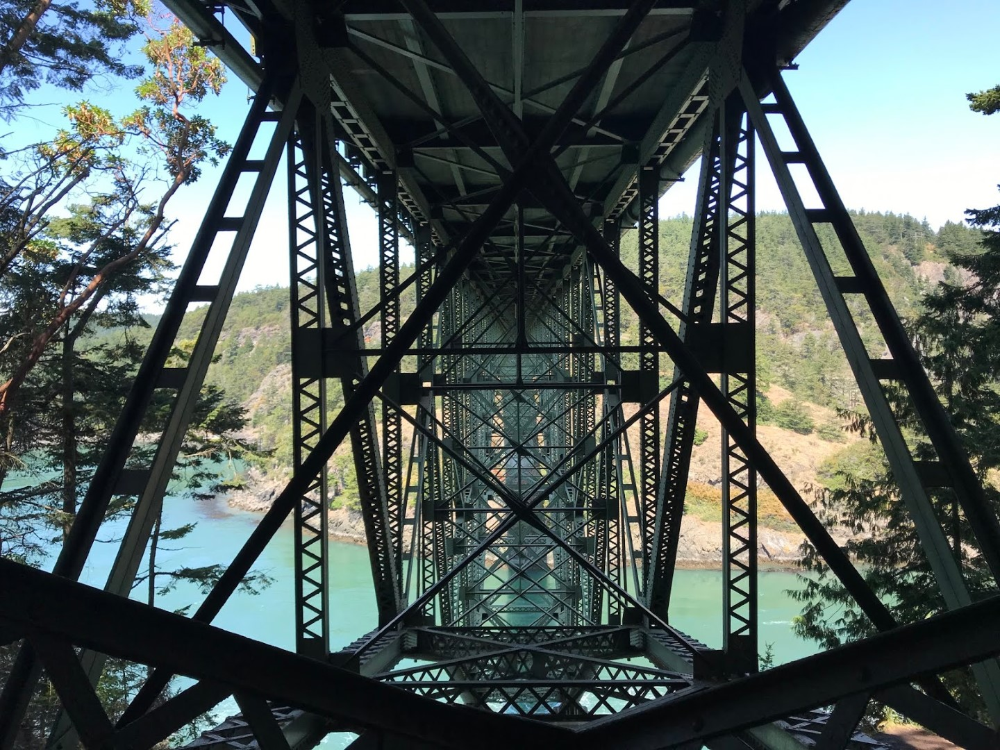

Vanuit het hotel is het een klein stukje rijden naar Mukilteo waar we de veerboot pakken naar Whidbey Island. De overtocht duurt een minuut of 20, en we meren aan in Clinton. Vanuit hier rijden we via mooie slingerwegen naar Deception Pass, helemaal in het noorden van het eiland. Vancouver in Canada ligt nog maar 100 kilometer van ons verwijderd (as the crow flies).

Deception Pass heeft een mooi strand waar we al snel bivak maken. Na de verplichte zandkastelen, watergeultjes en plonsen in het water, hebben we het eiland verlaten. Via de Outlet, waar we 's avonds nog gegeten hebben, zijn we terug gegaan naar het hotel.

## 2 opmerkingen

### Gerard 12 juli 2019 om 22:36

Voor Sofie is zo'n overtocht natuurlijk een belevenis en aan het water zijn er voor haar veel steentjes. Het vergezicht door de bomen mag je van mij inlijsten, erg mooi.

### Gerard 12 juli 2019 om 22:37

hoe bevalt het hotelleven.....
