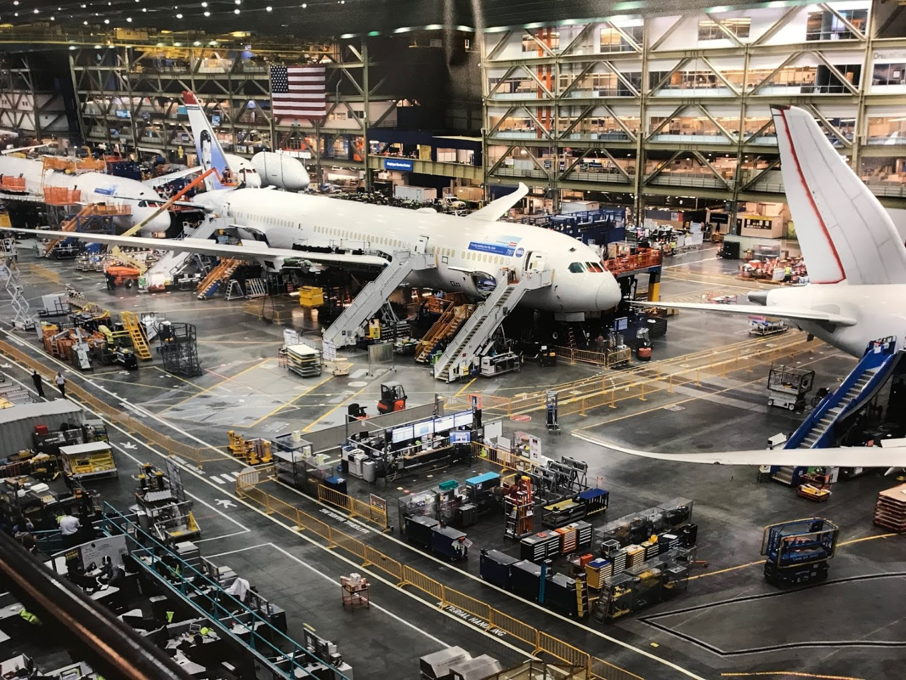
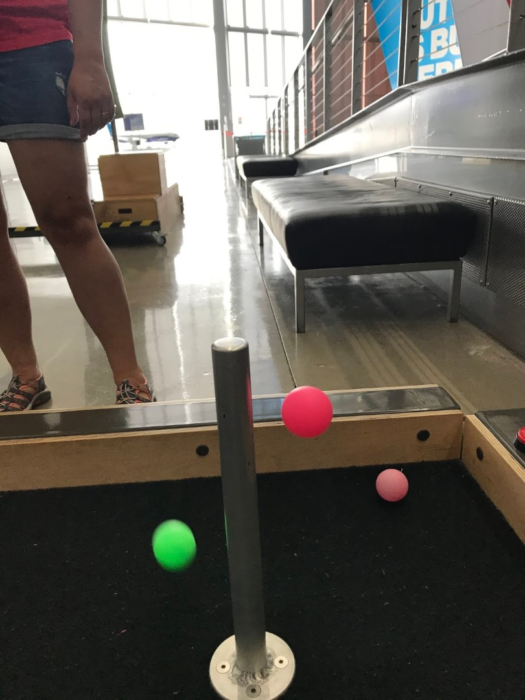
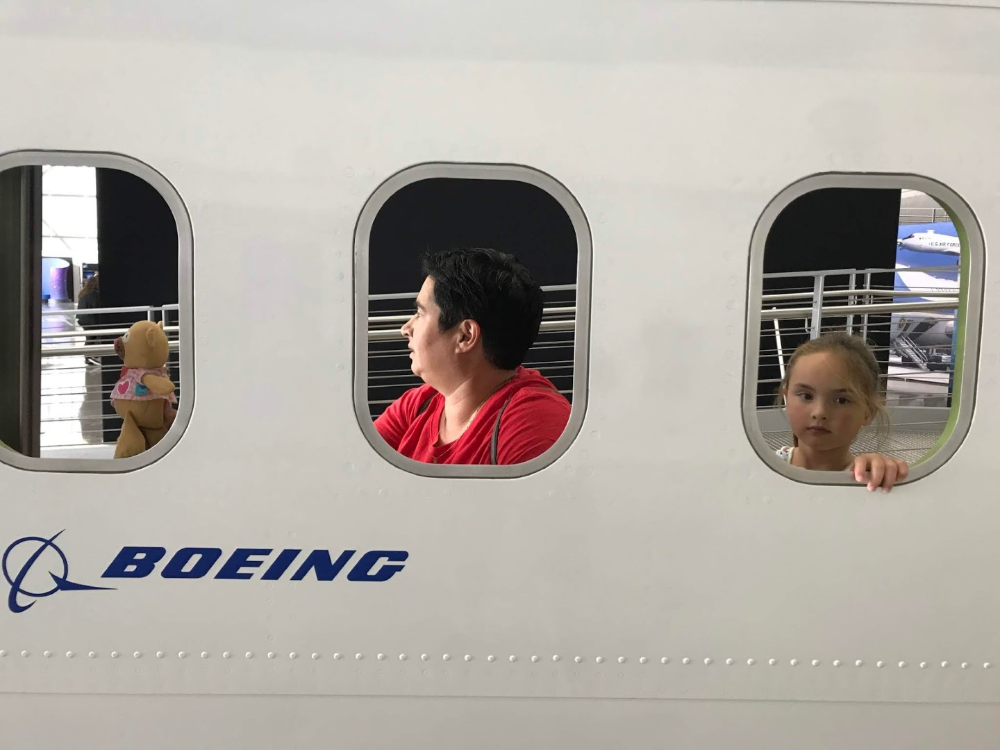

Het heeft toch voordelen, zo'n jetlag... Om 8 uur meldden we ons al bij de receptie van The Future of Flight, oftewel een rondleiding door de fabriek van Boeing. Je mag helemaal niets meenemen tijdens de tour, ook niet een telefoon, dus van de tour zelf hebben we helaas geen foto's kunnen nemen. Ze doen dit officieel vanwege de veiligheid, maar er zal ook een stukje bedrijfsspionage meespelen. Vanaf een hoogte van zo'n 20 meter kijk je vanaf balkons bovenop de werkplaatsen waar alle onderdelen van de 747 en dreamliner in elkaar worden geschroeft. Het is bijzonder interessant om te zien. De hal waar dit alles plaatsvindt is trouwens het grootste gebouw ter wereld (qua volume). Heel Disneyland en de bijbehorende parkeerplaatsen passen in de hal!

Aan het einde van de tour kun je nog een interactieve tentoonstelling bezoeken. Hier kun je onder andere een proefje doen met het Bernoulli effect: een van de natuurkundige verklaringen waardoor een vliegtuig kan vliegen. Door een klein gaatje in een buis kun je balletjes laten zweven. Sofie vindt het fascinerend en krijgt er geen genoeg van.

's Middags hebben we gezwommen in het zwembad bij het hotel, en hebben we een eigen gemaakte maaltijd genoten in de kamer.

## 1 opmerking

### Gerard 13 juli 2019 om 11:47

leuke rondleiding bij Boeing en zelfs Sofie krijgt er geen genoeg van.
