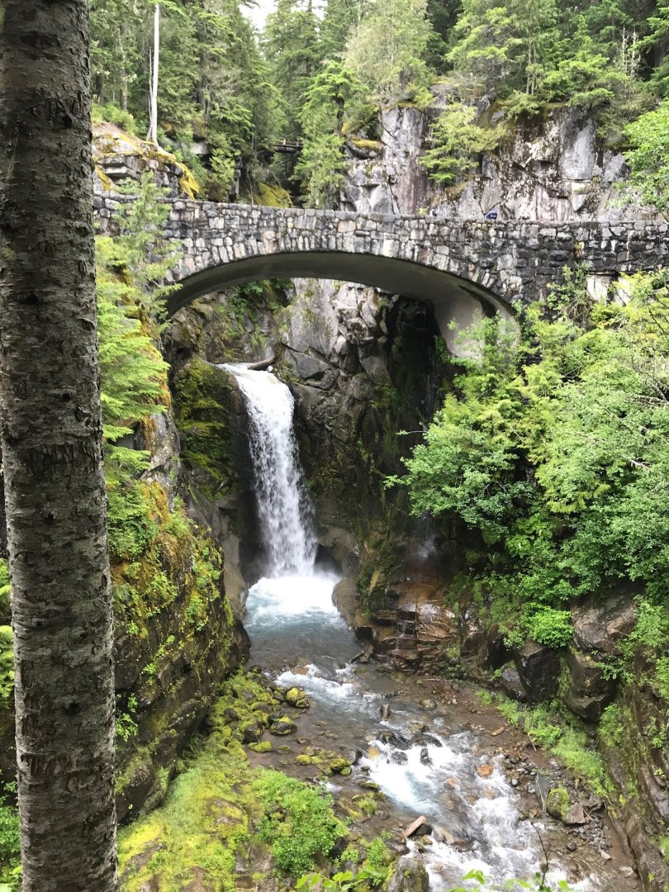
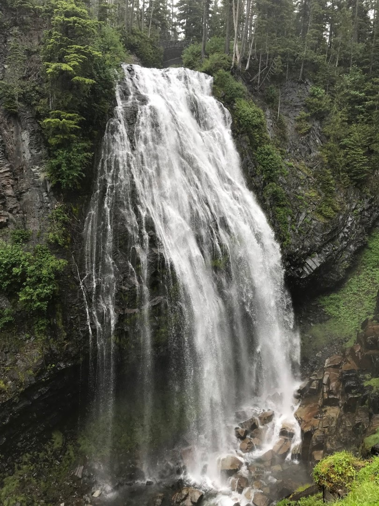
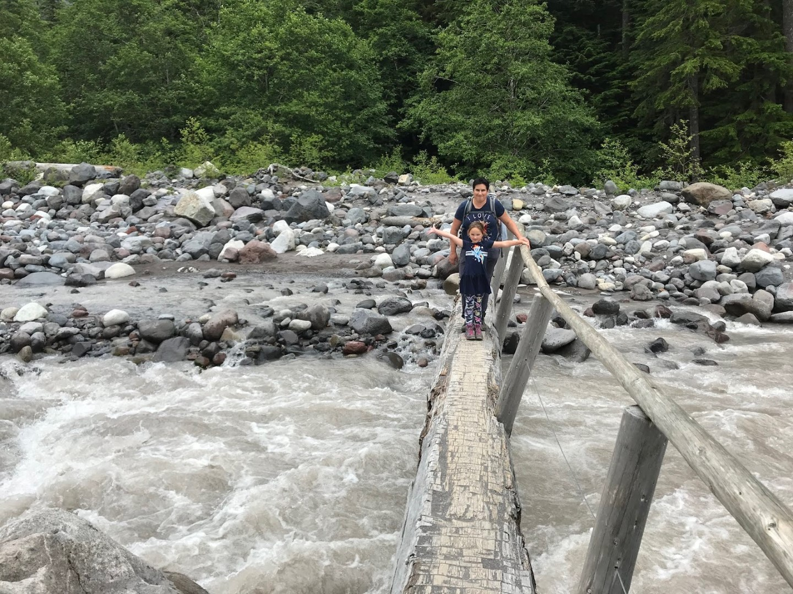
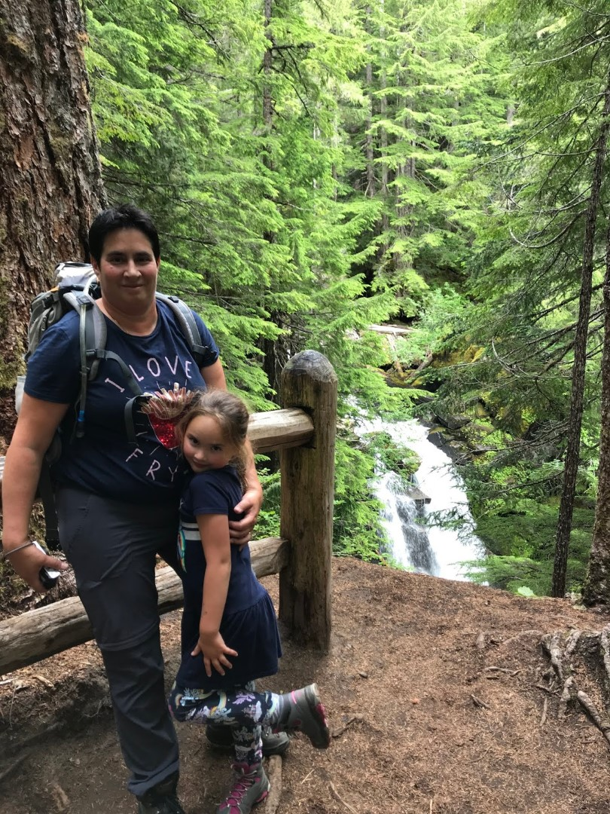
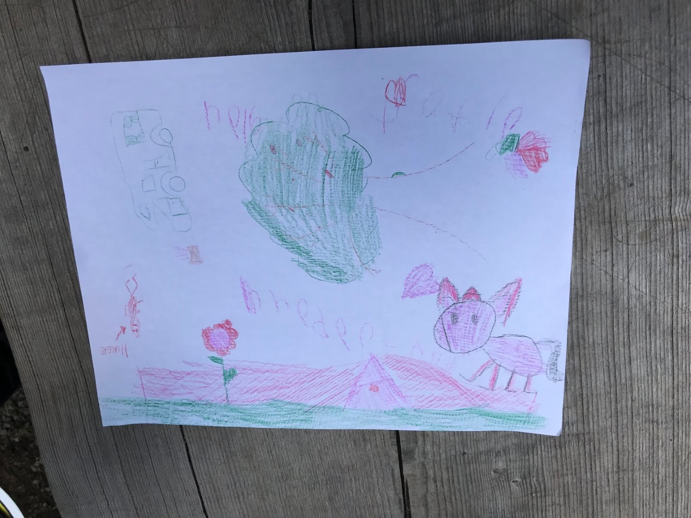

De dag begint wederom wat druilerig, dus in de regenjas bekijken we de Christine Falls en Narada Falls. Hoe dichter we bij het visitor center in Paradise komen, hoe droger het wordt. Het zonnetje komt zelfs af en toe voorbij, zodat het toch nog een mooie dag wordt.

In het visitor center halen we het junior ranger boekje op voor Sofie. Dan gaan we snel op stap richting de Myrtle Falls, een makkelijk, en daardoor erg druk bezocht pad. Ondanks de drukte is het prachtig, de planten zijn allemaal in bloei, en dat hebben wij nog niet zo vaak gezien, aangezien we meestal erg vroeg in het seizoen zijn. Sterker nog, de vorige keer dat we hier waren, was een groot deel van het pad nog besneeuwd. We bevinden ons hier wel op zo'n 1650 meter hoogte.

Met uitzicht op de waterval hebben we een overheerlijke boterham gegeten, en toen zijn we met een klein omweggetje weer terug naar beneden gewandeld naar de auto. Op weg naar beneden zijn we nog naar Carter Falls gewandeld. Voordat je naar de Falls kan, moeten we eerst de wilde rivier oversteken. Gelukkig ligt er een boomstam!

Na bijna een uur straf omhoog lopen, kom je bij de waterval.

De weg terug is gelukkig een stuk makkelijker, en dus sneller. Want we moeten om vijf uur op de nabij gelegen camping Cougar Rock zijn om het junior ranger programma bij te wonen. De ranger vertelt over hoe je op verschillende manieren naar de waarde van land kunt kijken (economisch, ecologisch, vrije tijd besteding, of cultureel). Het was een beetje lastig voor Sofie om drie kwartier stil te blijven zitten, maar gelukkig konden we ook de dikte van bomen meten om zodoende de waarde in geld uit te kunnen drukken. En de aanwezigen mochten een tekening maken van hun ideale nationale park. In het park van Sofie wonen uiteraard eenhoorns.

