Helaas moeten we Mountain Meadows Inn alweer verlaten. Wat een heerlijk plekje, en de uitbaters zijn ook erg hartelijk. We gaan het missen!

Met de Mount Rainier Railroad gaan we vanuit het vlakbij gelegen Elbe met een door een stoomlocomotief voortgetrokken trein naar een bosbouw museum. Het ritje is slechts een kilometer of tien lang, maar desondanks wel erg leuk. Tenminste, als je van stoomtreinen houdt natuurlijk.

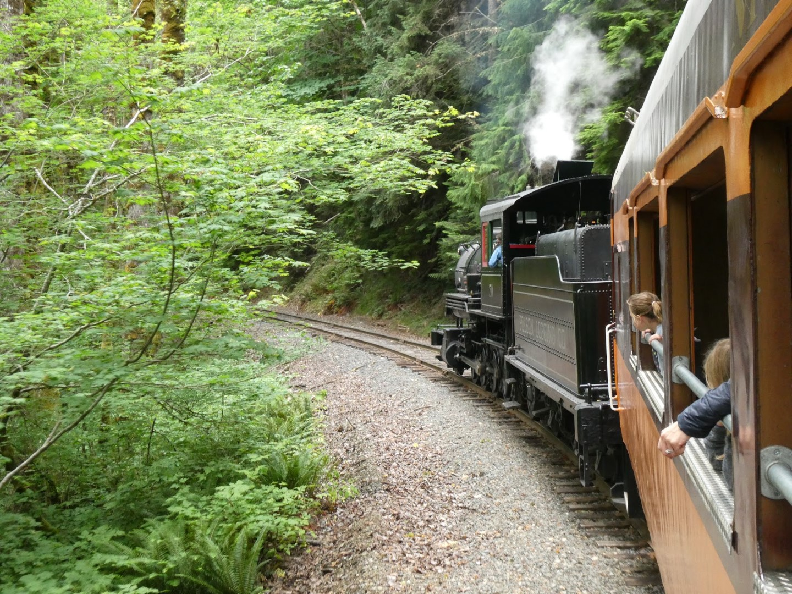

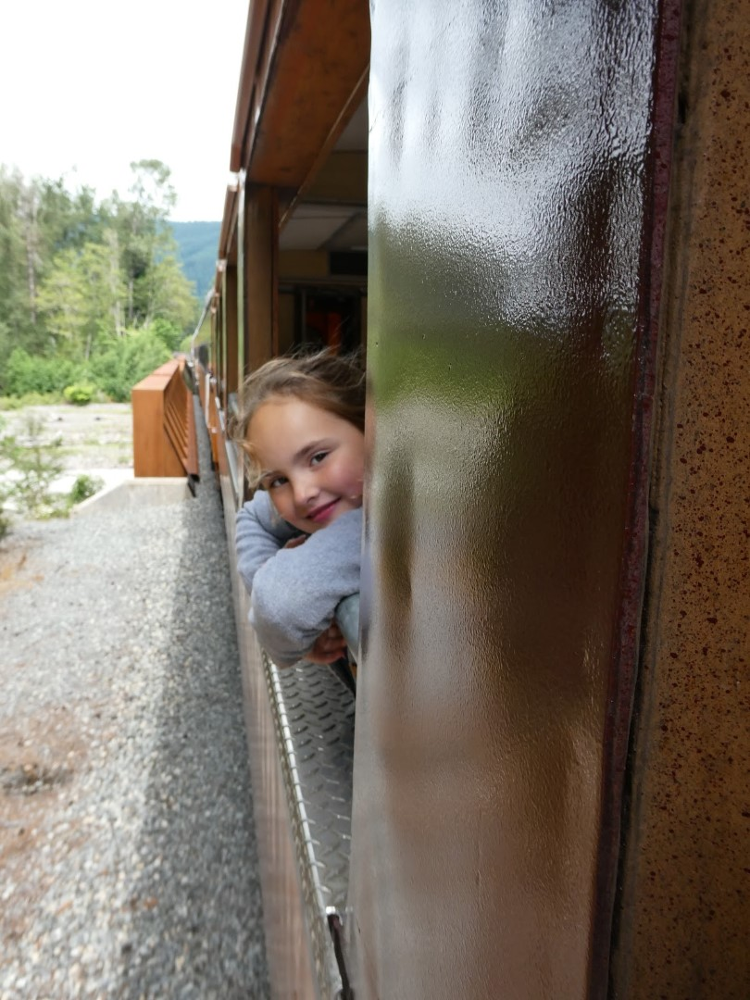

In het bosbouw (logging) museum bekijken we de verschillende machines die gebruikt werden, maar ook hoe de lumber jacks vroeger leefden in barre omstandigheden. Het was al met al een erg leuk uitje.

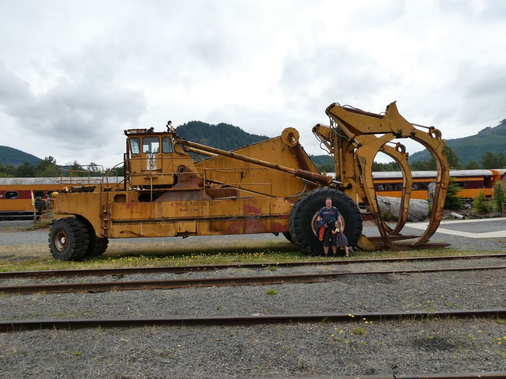

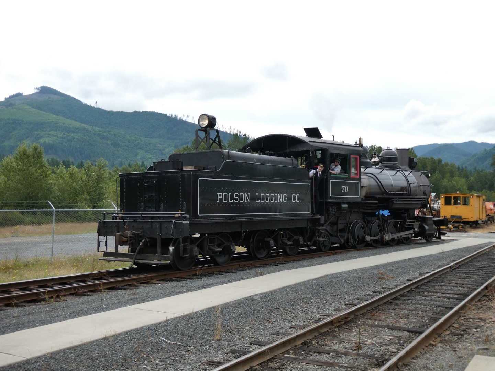

We hebben geluncht in de Copper Creek Inn. Hier hebben we in het najaar van 2012 al een keer een cabin gehuurd. De lunch was erg lekker, maar wel wat zwaar.

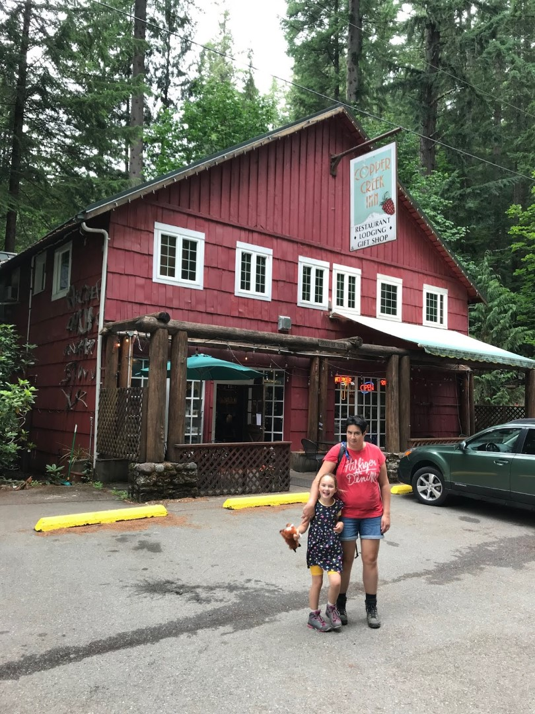

We moesten snel eten, want er stond, naast een lange rit naar het volgende hotel, een erg belangrijk ding op het programma: Sofie had alle opdrachten uit haar Junior Ranger boekje af, dus ze mocht haar welverdiende badge ophalen bij de Ranger. In het visitor center van Paradise kreeg ze met veel ceremonieel vertoon haar badge overhandigd. Ze was zo trots als een pauw!

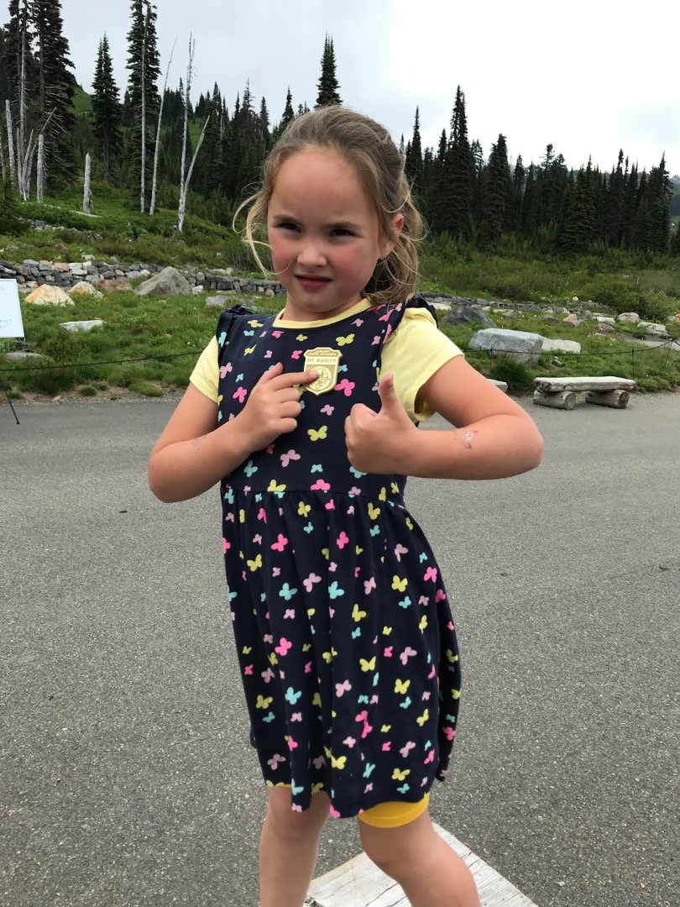

Na dit officiele moment hebben we het park aan de oostkant verlaten, maar niet voordat we de Grove of the Patriarchs trail gewandeld hebben. Dit is een erg leuk paadje, met een hangbrug en je bezoekt een aantal zeer oude reuzenbomen.

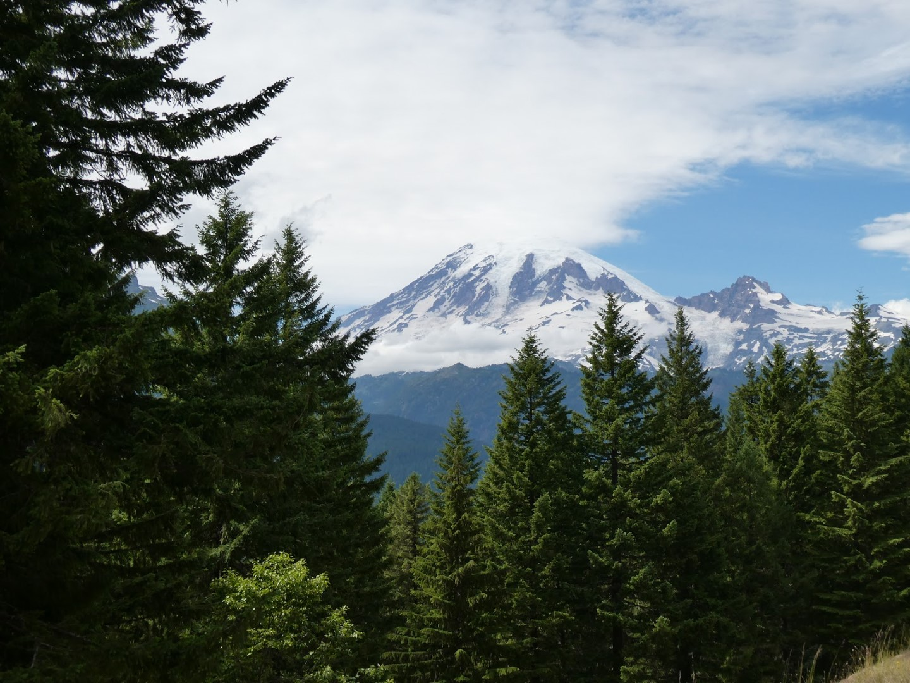

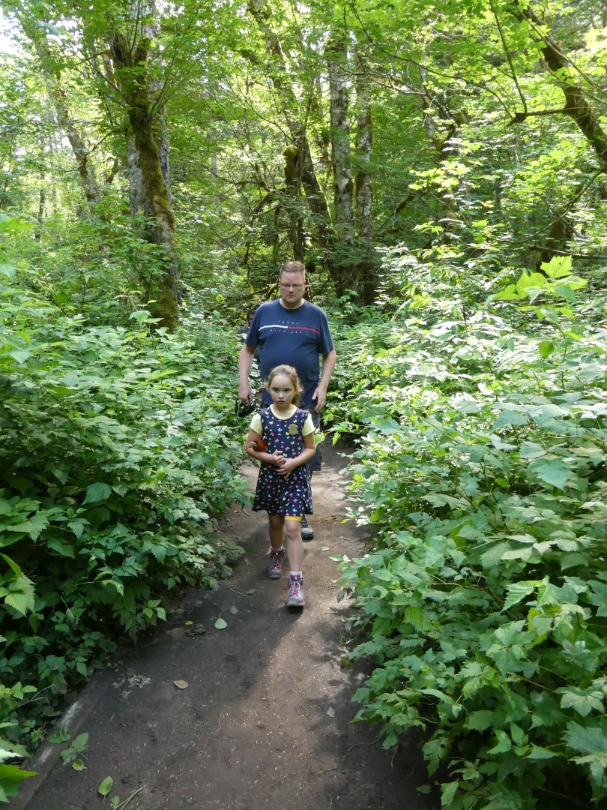

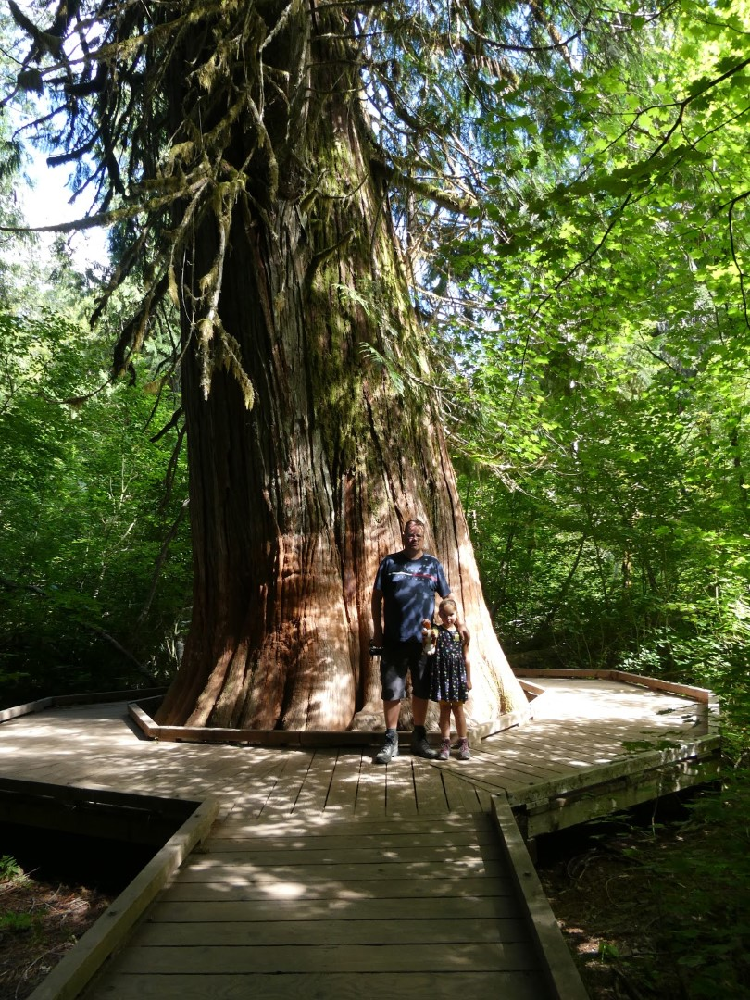

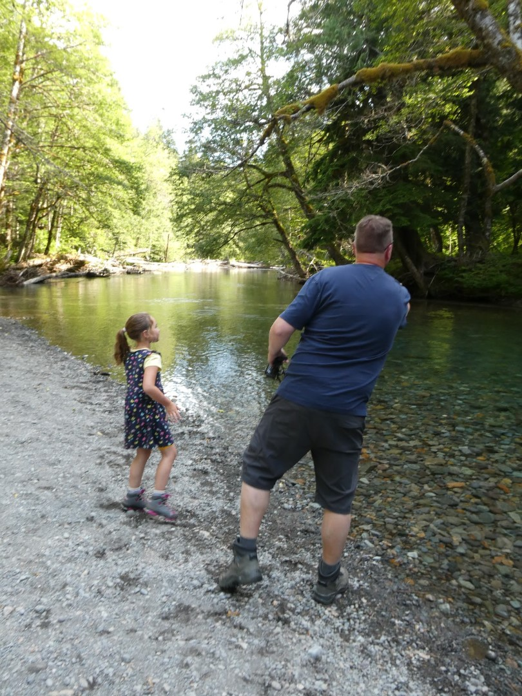

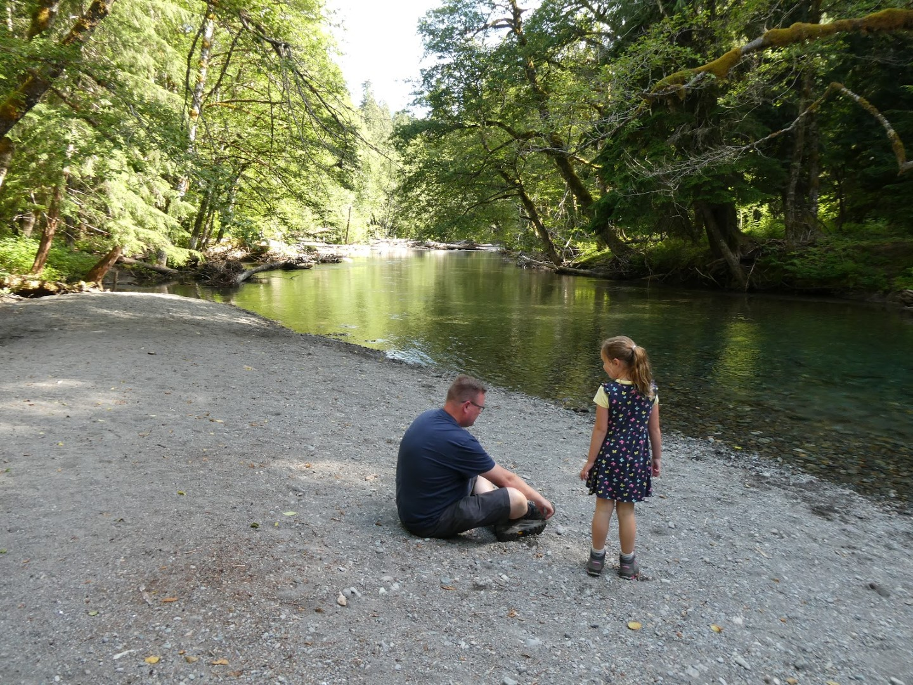

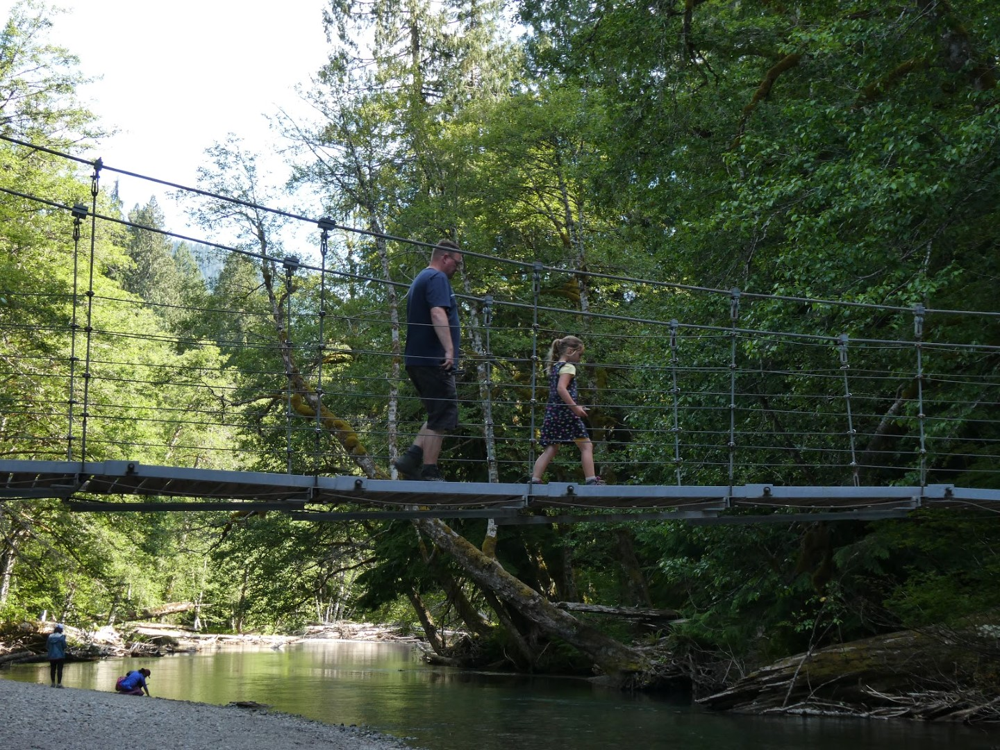

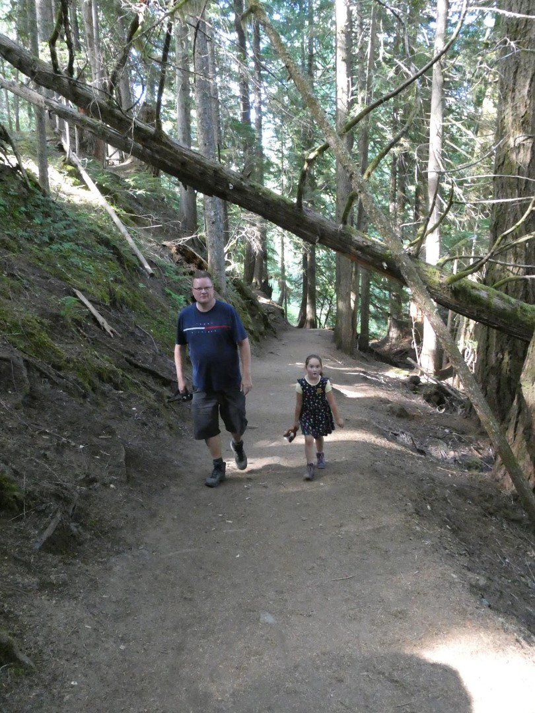

Via de fantastisch mooie WA-12 rijden we naar Moses Lake, nog steeds in de staat Washington. Hier overnachten we in de Wingate, een keurig hotel. We blijven hier maar een nacht, morgen gaan we al weer verder naar de volgende bestemming.

## 1 opmerking

### Gerard 13 juli 2019 om 23:44

We blijven genieten van de mooie foto's en Sofie heeft al weer een junior ranger badge.
