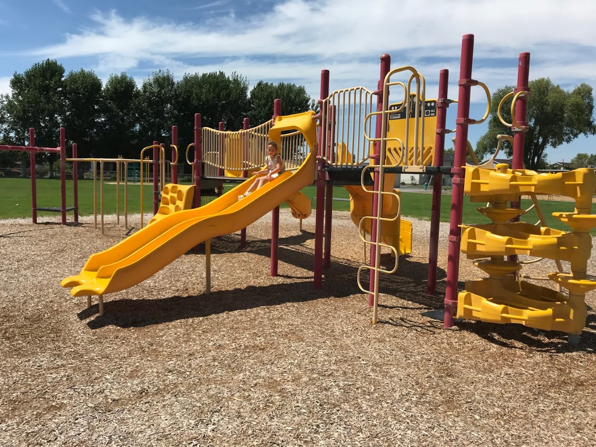
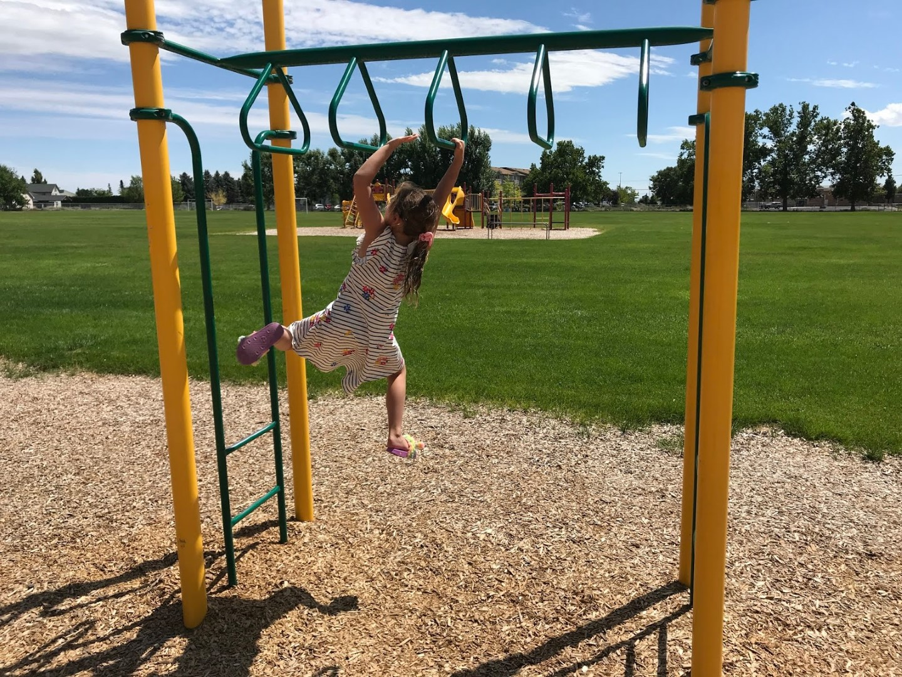

Vandaag stond niet al te veel op het programma. Na wat boodschappen gedaan te hebben, zijn we bij de lokale lagere school neergestreken om daar te lunchen (de kinderen hier hebben ook al vakantie). Hier stond een aantal speeltoestellen waar door Sofie dankbaar gebruik werd gemaakt, terwijl mama de boterhammetjes klaar maakte onder een afdak. Het is vandaag erg warm, dus wat schaduw was meer dan welkom.

Na de lunch zijn we op ons gemak via Interstate 90 naar het oosten gereden naar onze volgende stop: Hotel La Quinta in Coeur d'Alene, waar we rond drie uur aankwamen. Een keurig hotel, met een mooi binnen zwembad. De rest van de middag hebben heerlijk gezwommen en daarna in de kamer gegeten.
