De Route of the Hiawatha is een mountainbike route van 24 kilometer gemaakt van een oude spoorlijn tussen Montana en Idaho. Onderweg passeer je 10 tunnels en 7 voormalige spoorbruggen (de hoogste is 70 meter hoog en 260 meter lang). De huurfietsen moesten we ophalen bij Lookout Pass Ski Area. Daarna konden we met de eigen auto naar het beginpunt van de trail rijden via een keurig onderhouden onverharde weg.

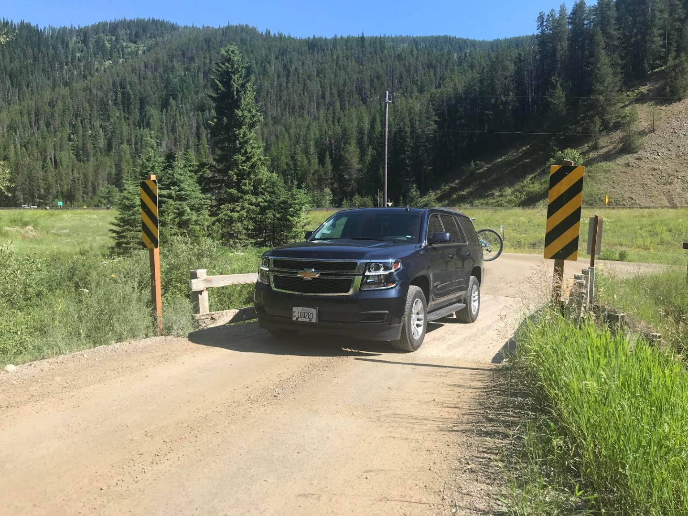

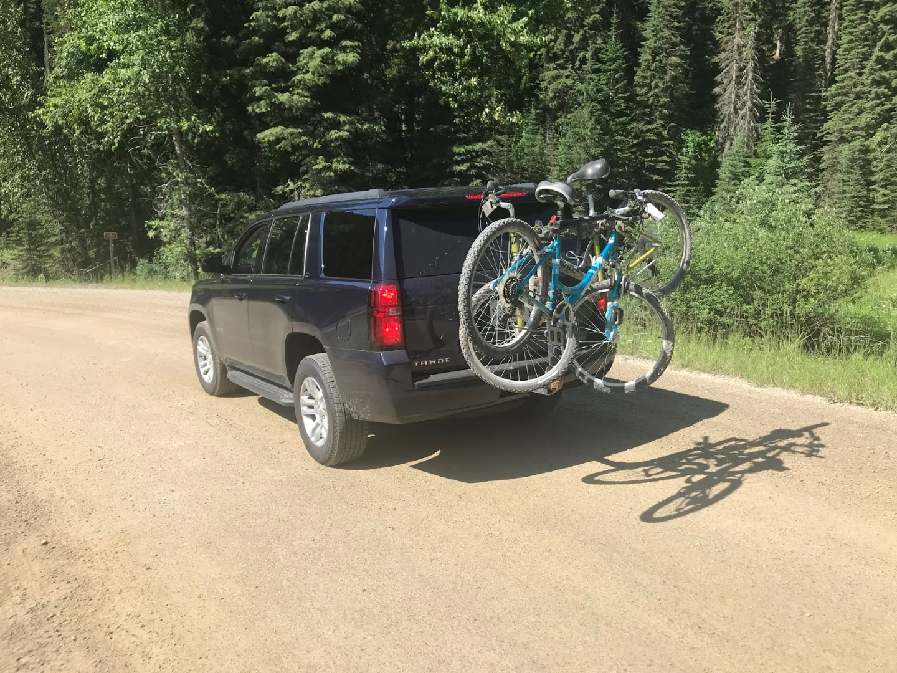

De rit begint meteen goed, de eerste tunnel die we door moeten is maar liefst 2,7 kilometer lang. De tunnel is niet verlicht, dus we zijn erg blij met de goede lampen die op de fiets gemonteerd zitten. Groter probleem in deze tunnel is echter, dat het er erg nat en modderig is, en dus komen we 20 minuten later aan de andere kant van de tunnel er weer uit alsof we in de modder hebben liggen rollen. Sofie kon direct schone kleren aan, die hadden we gelukkig meegenomen.

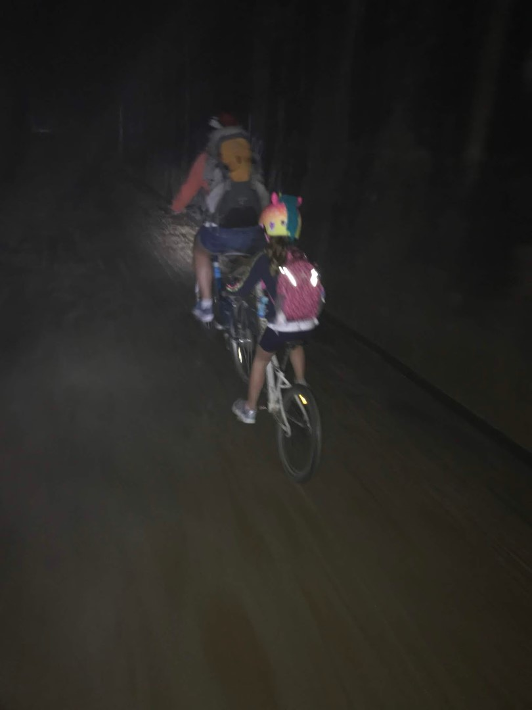



Het allermooiste van de route is dat de hele route bergaf is. Het kost dus geen enkele moeite om van al het moois te genieten, en we stoppen dan ook veelvuldig om een appeltje te eten, of wat te drinken, of gewoon om van het uitzicht te genieten. Vooral Sofie heeft het makkelijk: voor haar hebben we een "tag-along" gehuurd, ze kan meetrappen, maar ze kan ook gewoon de beentjes stil houden. In het begin was het was onwennig voor haar, maar al snel voelde ze zich als een vis in het water en had ze veel lol.

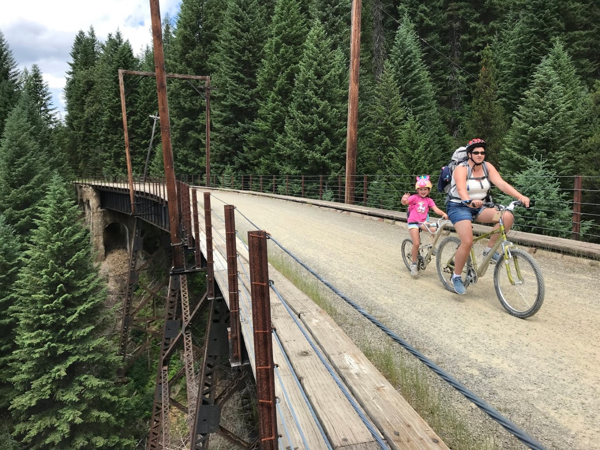

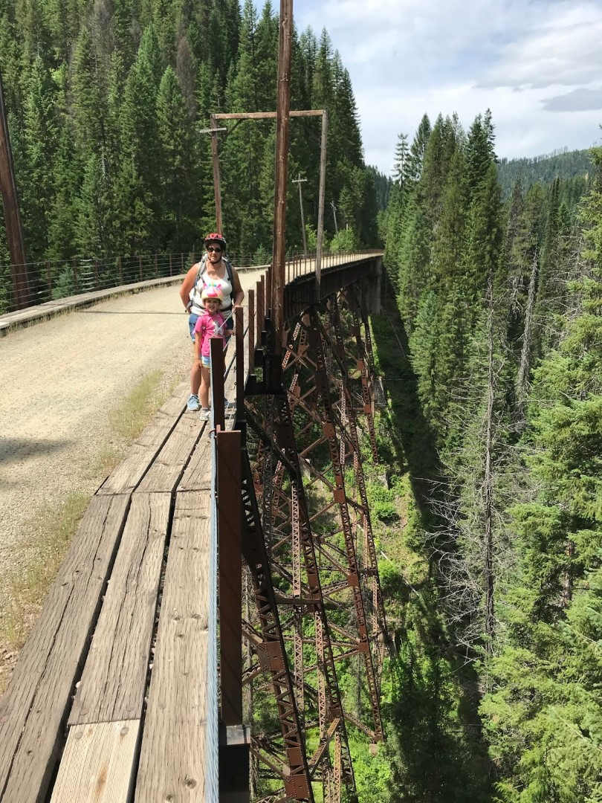

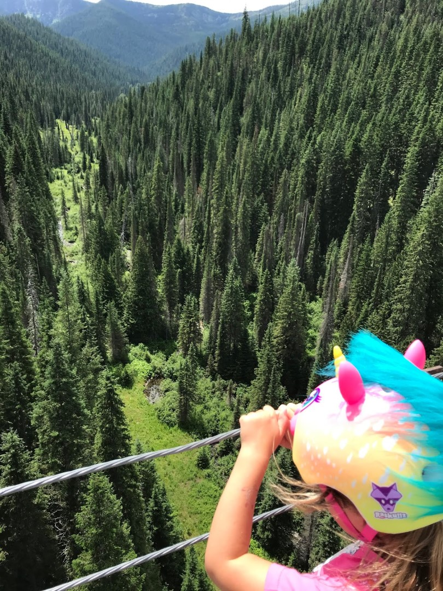

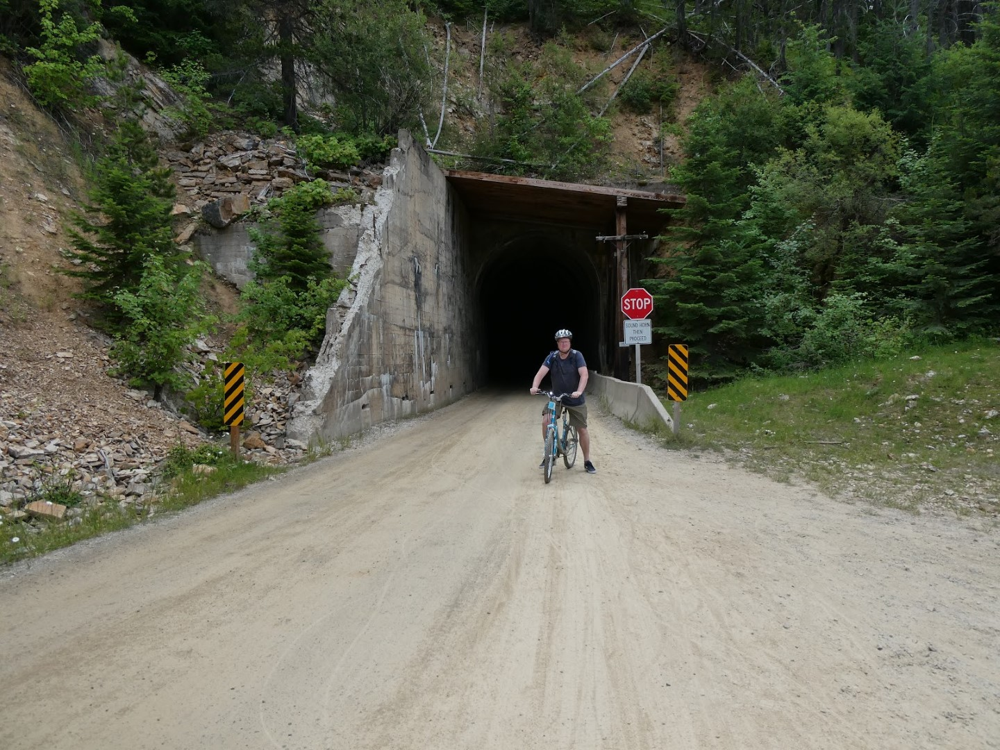

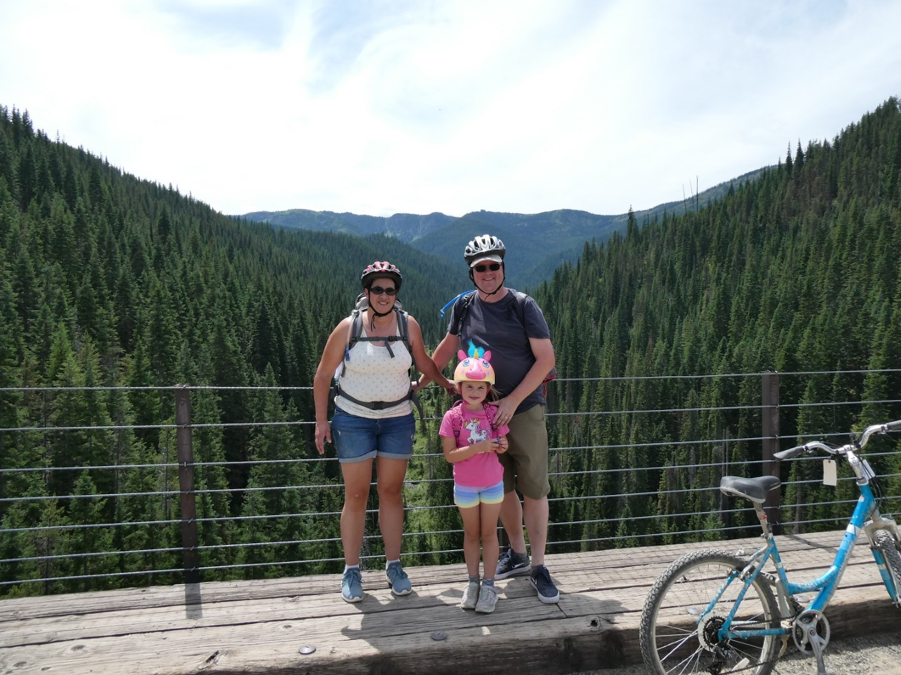

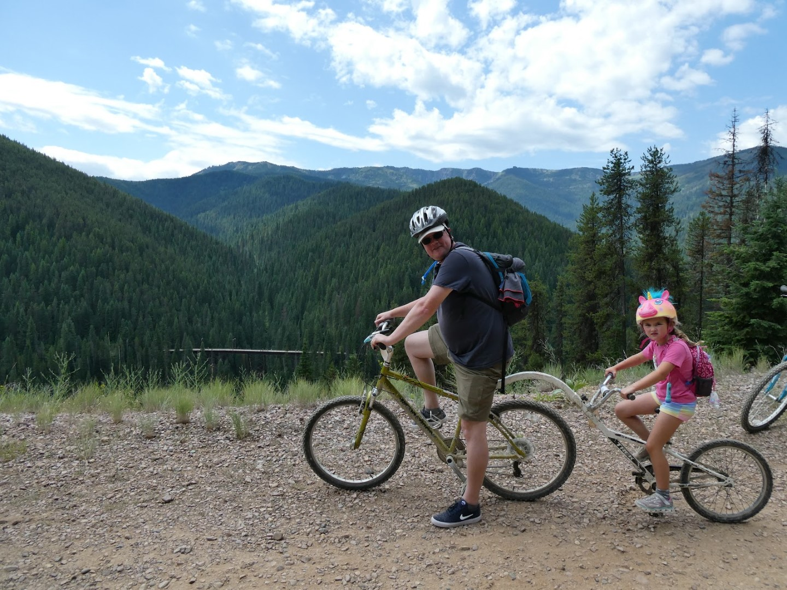

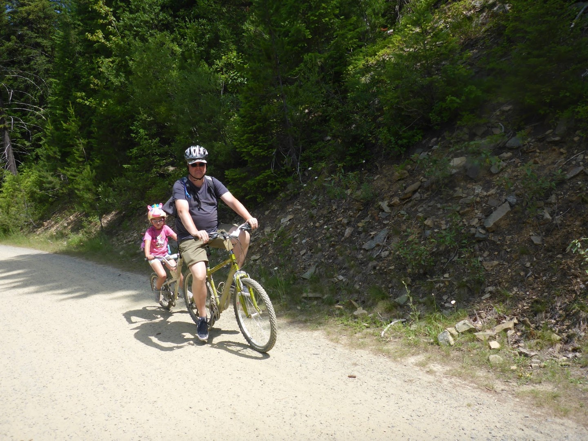

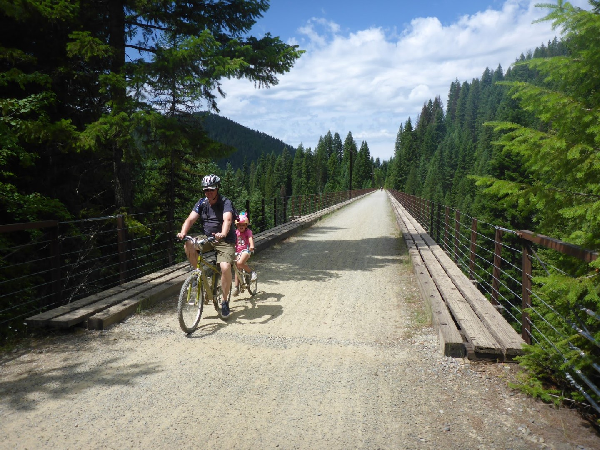

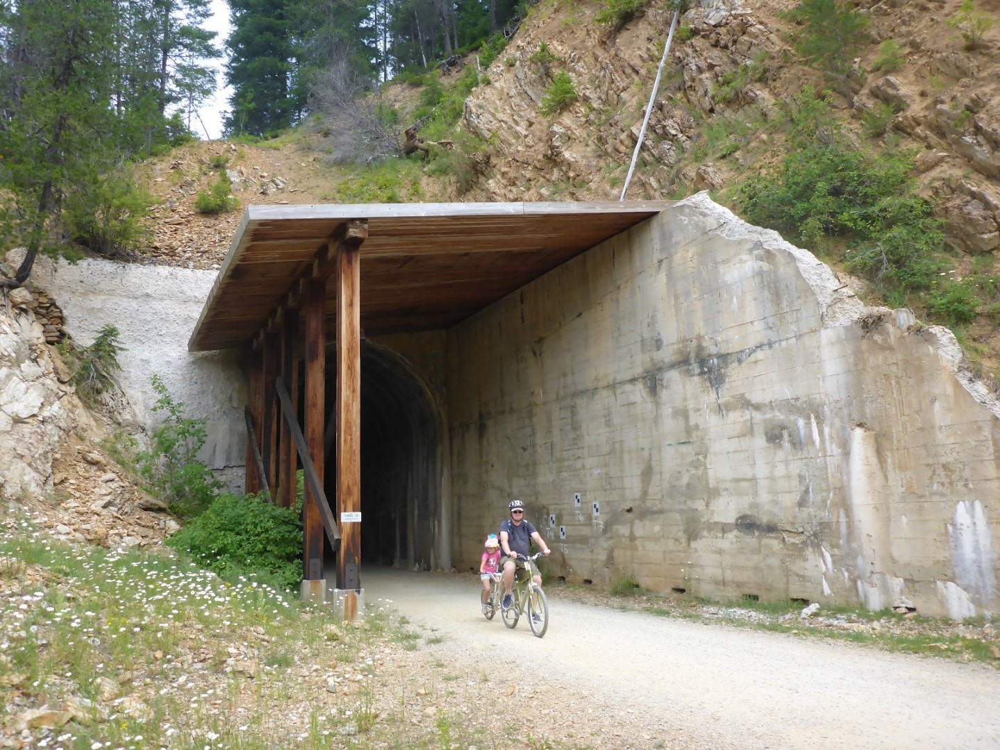



Het was een erg plezierig ritje, op de eerste modderige tunnel na dan. Helemaal aan het einde van de trail worden we opgepikt door een shuttlebus die ons en onze fietsen weer terugbrengt naar de eerste tunnel, in Roland. Helaas is dat wel aan het verkeerde uiteinde van de tunnel, dus eigenlijk moeten we de modder weer in. Chantal en Sofie hebben echter gewacht bij de bussen, en ik ben maar weer de modder in gegaan om de auto op te halen, en via een kleine omweg (in de tunnel mogen alleen fietsers) heb ik de dames weer opgehaald en zijn we met z'n allen de fietsen weer terug gaan brengen.

Terug in het hotel hebben we eerst gedoucht, en daarna zijn we gaan eten bij Applebee's.

## 1 opmerking

### Gerard 16 juli 2019 om 11:13

De Route of the Hiawatha is een mooie fietsroute met mooie uitzichten. Zo te zien waren er ook wat modderige plaatsen. Jullie zitten vol met dat fijne spatwater
