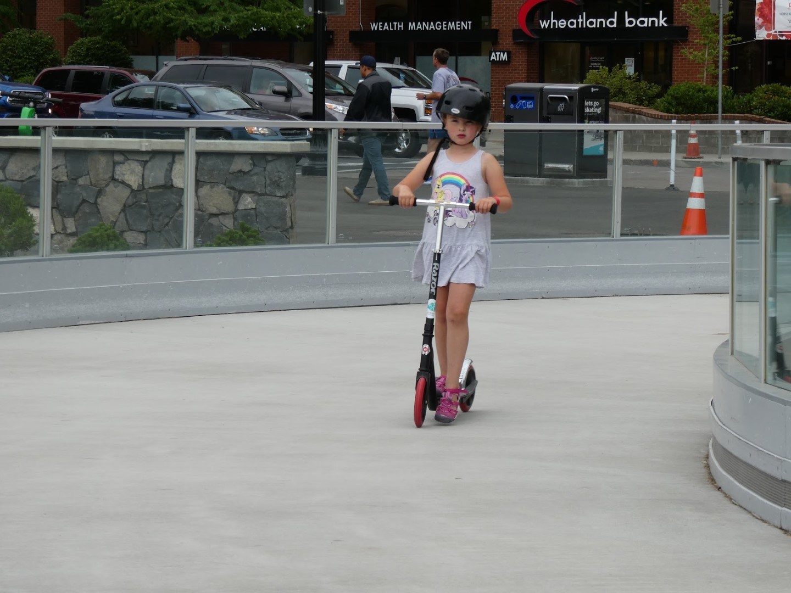
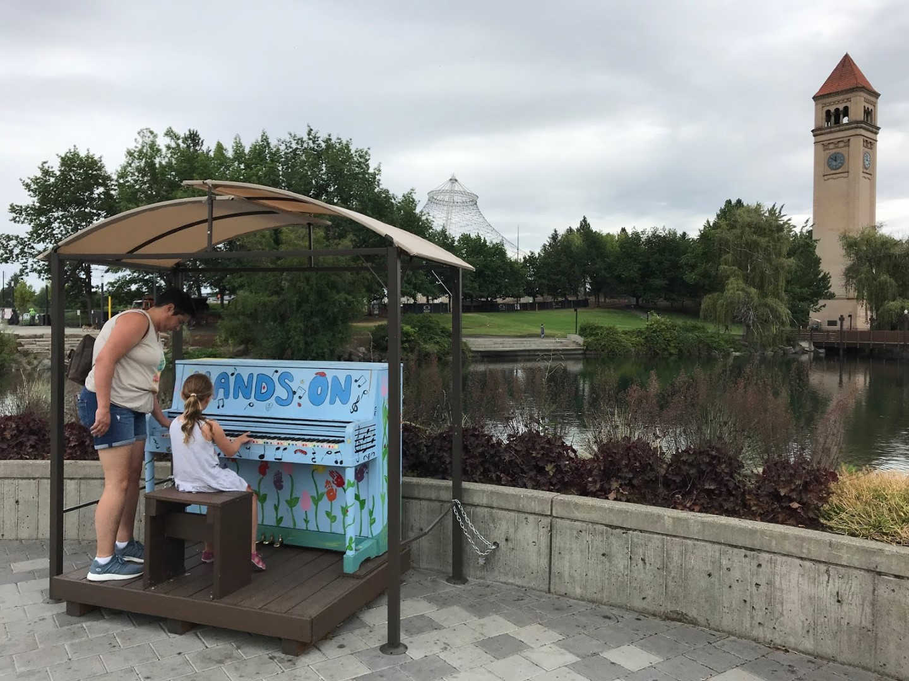
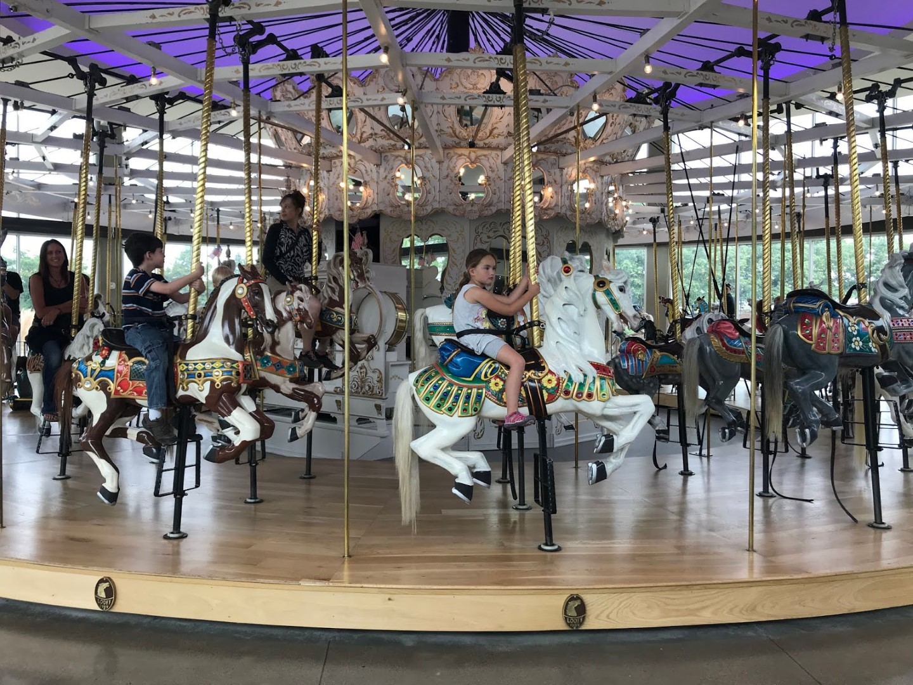
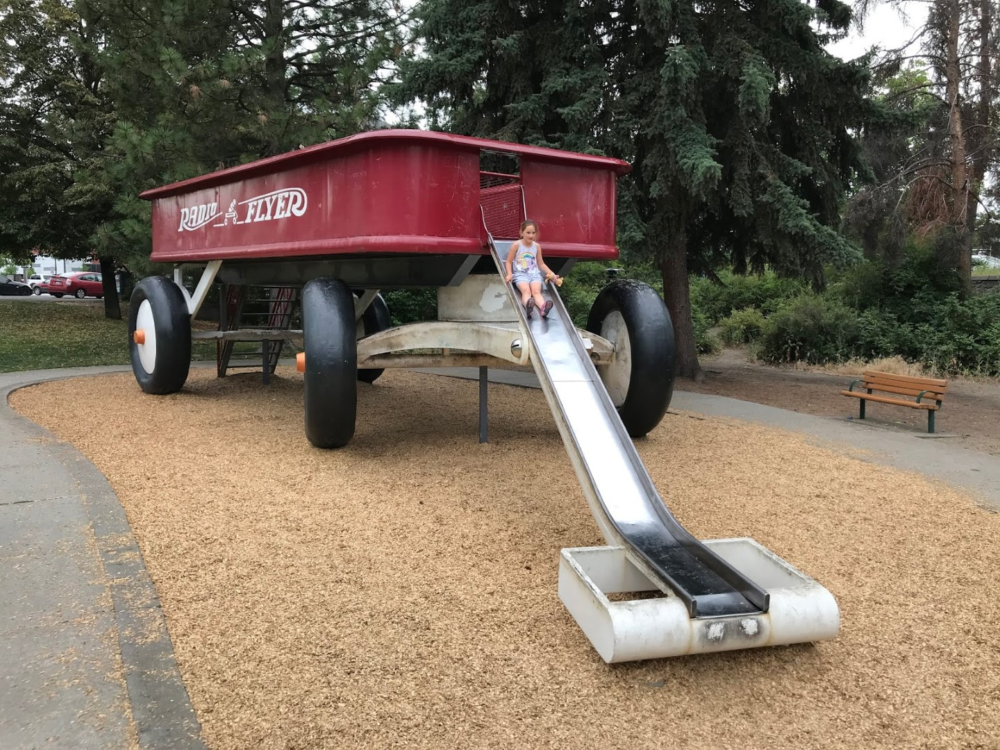
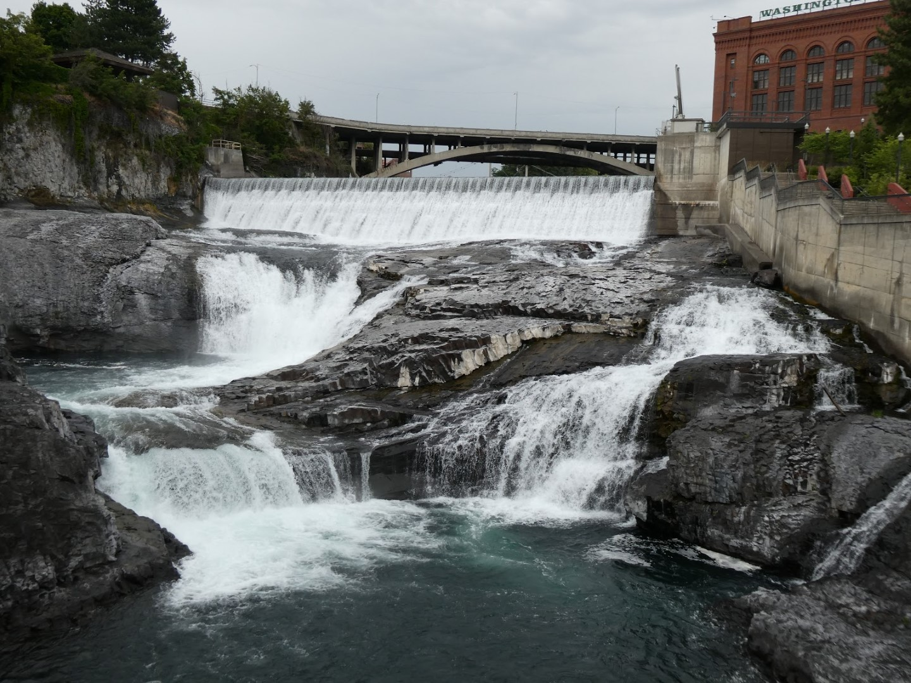
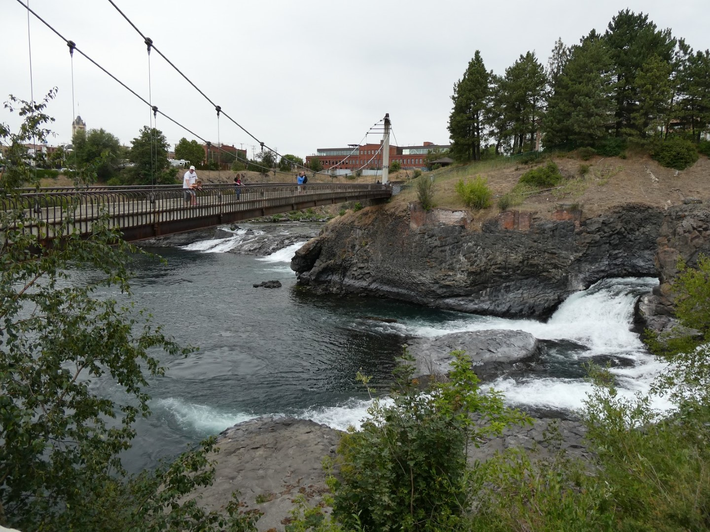
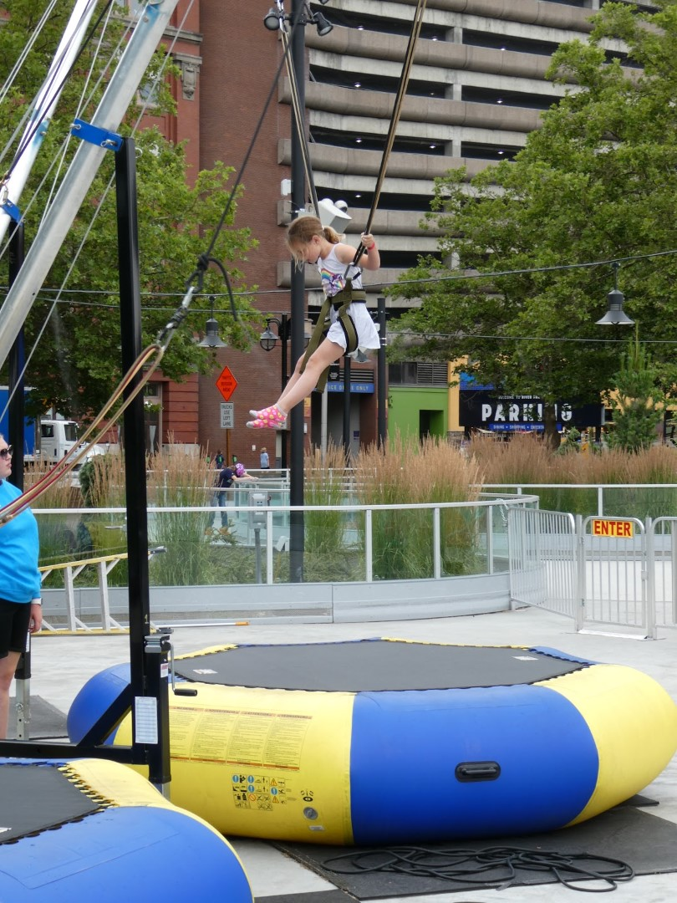
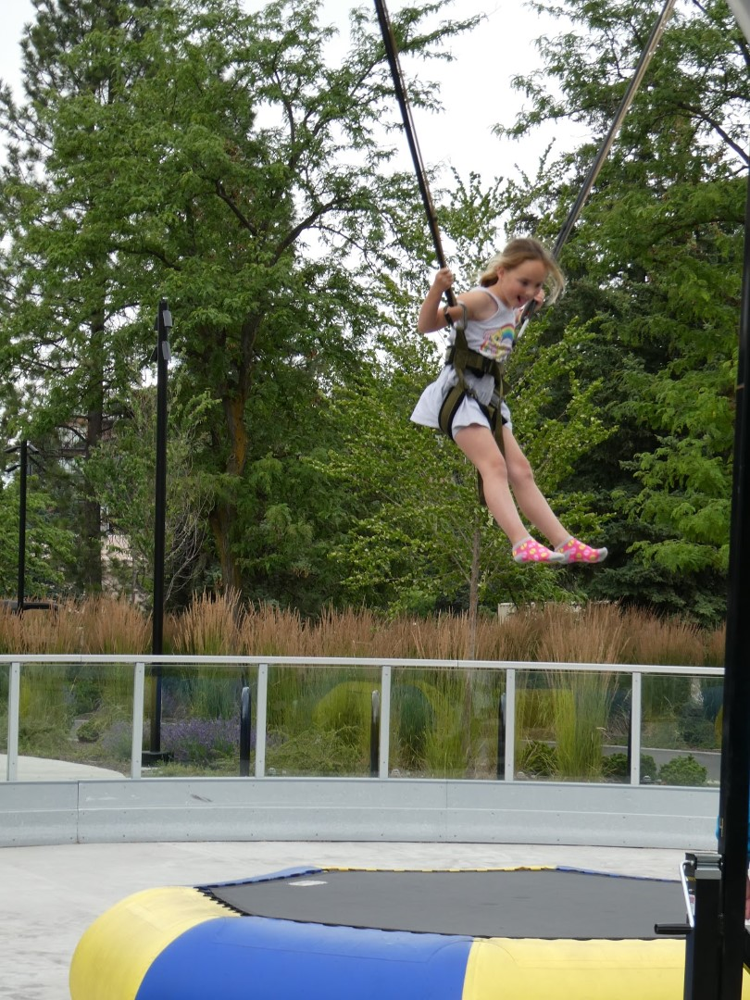

Na alle inspanning van gisteren, hebben we vandaag een rustige dag bedacht: we bezoeken het Riverfront Park in Spokane. Het is een mooi aangelegd park, met wandelpaden, en vertier voor de kleineren onder ons.

Vanuit de skilift hadden we een mooi uitzicht over de Spokane Falls.

's Avonds hebben we in het hotel gegeten, en hebben de dames nog even gezwommen. Morgen gaan we weer naar de volgende bestemming, Kalispell in Montana.
