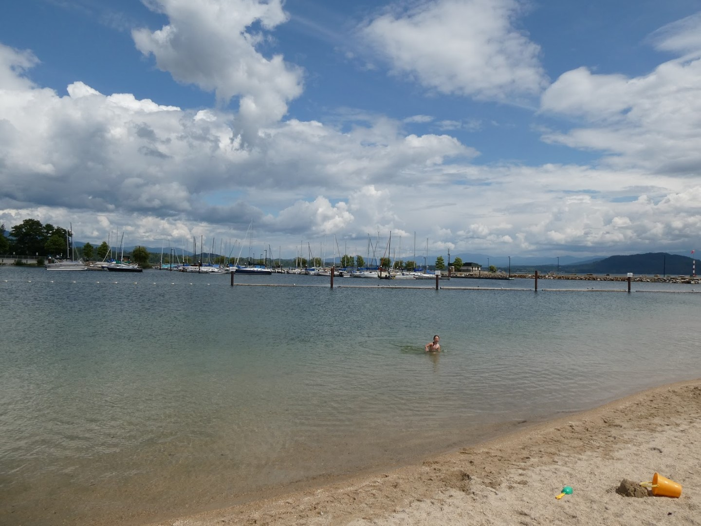
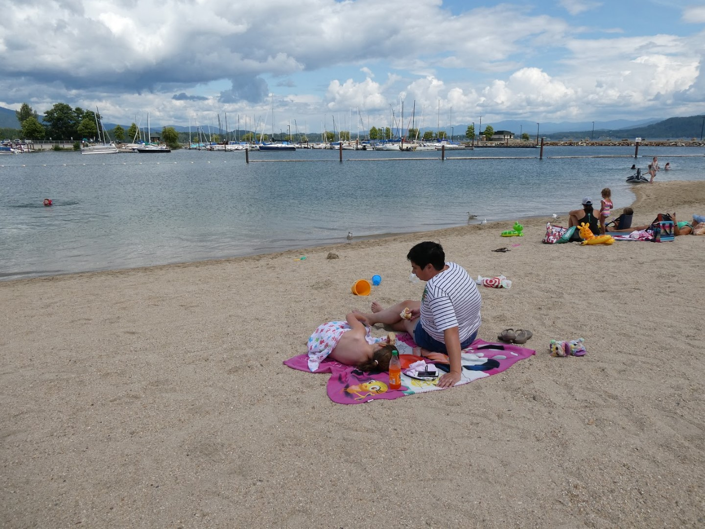
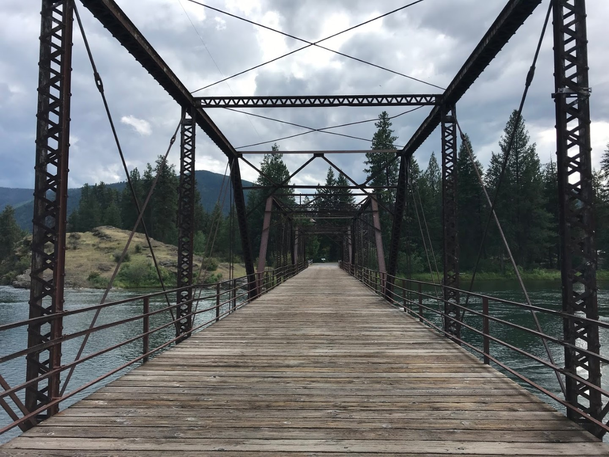
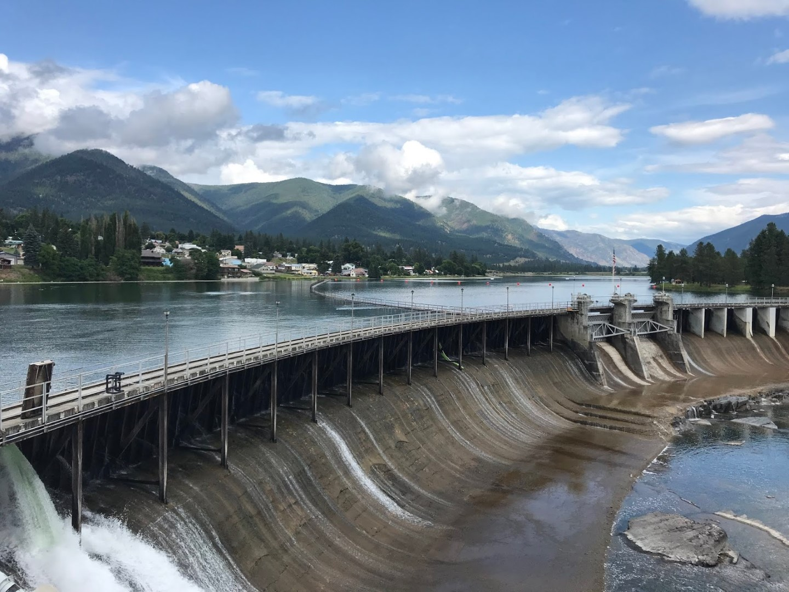
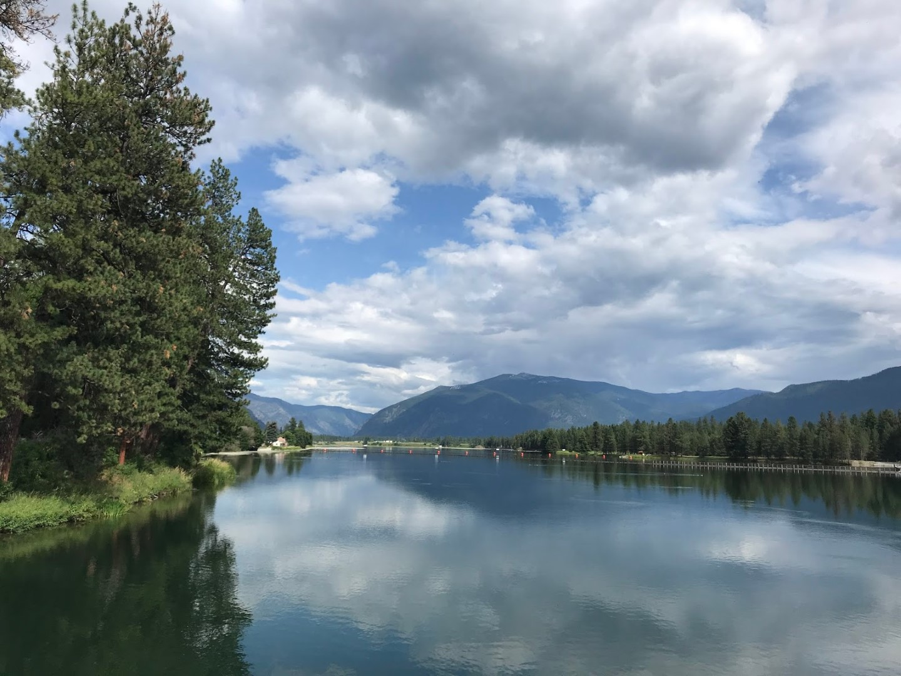
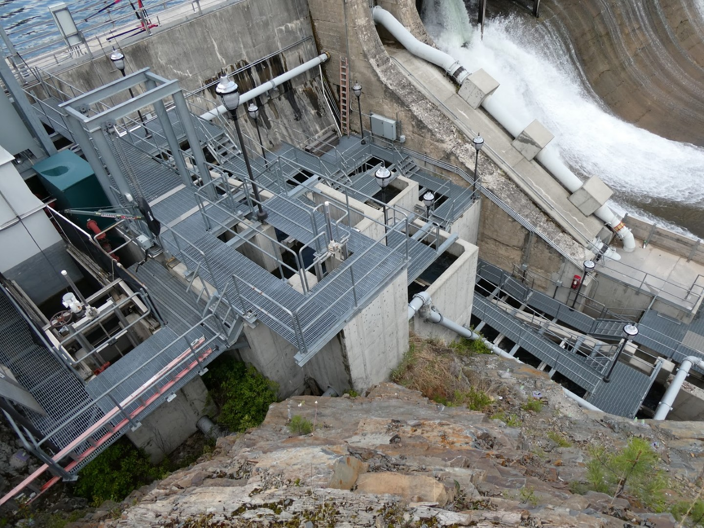
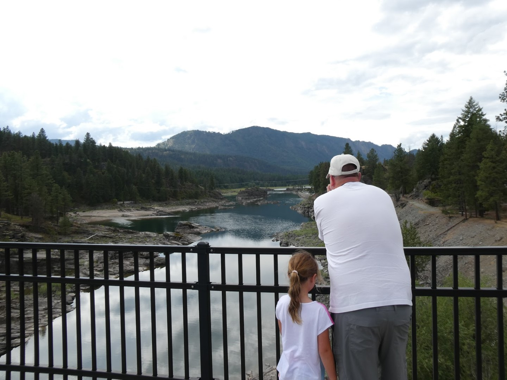

Vandaag verlaten we Coeur d'Alene (ze spreken het uit met het meest vette Amerikaanse accent wat je je kunt voorstellen, het lijkt totaal niet op de Franse schrijfwijze) en gaan we op weg richting Glacier National Park. Vanwege de nabijheid van diverse activiteiten en faciliteiten hebben we ervoor gekozen om zeven nachten te verblijven in de Homewood Suites in Kalispell, Montana om van daaruit de omgeving te verkennen.

Om de rit wat interessanter te maken rijden we over de US-95 naar het noordelijker gelegen Sandpoint, Idaho. Aan Lake Pend Oreille is een mooi strandje waar wat gespeeld en gezwommen kan worden. We nuttigen er ook de lunch.

Na de boterham stappen we weer in de voiture en rijden we via de fantastisch mooie ID-200 naar het oosten. Na ongeveer twee uurtjes komen we aan bij Thompson Falls. De Falls zelf zijn sinds de aanleg van een dam niet meer te bewonderen, maar levert toch enkele mooie plaatjes op. We stoppen bij de dam om een klein wandelingetje te maken op Island Park.

Bij de dam is ook een fish ladder gemaakt om de zalmtrek niet dwars te zitten. Kosten: 10 miljoen dollar!

Anders dan bij de fish ladder in Seattle kun je de vissen niet echt goed zien helaas.

Hierna gaan we de staatsgrens met Montana over, en krijgen gratis een uur minder tijdsverschil met Nederland cadeau. Montana is groter dan Duitsland, maar heeft slechts 1 miljoen inwoners. Via de MT-28 en MT-93 rijden we op ons gemak naar eindpunt van vandaag, Kalispell. Het hotel Homewood Suites by Hilton is erg mooi, we hebben een mooie suite met keukentje. Er is een zwembad aanwezig, en die hebben we meteen aan een uitgebreide test onderworpen. Conclusie: goedgekeurd!

## 1 opmerking

### Gerard 21 juli 2019 om 19:52

Ook de rit van vandaag geeft weer een mooi aantal viewpoints. Geniet er maar lekker van.
