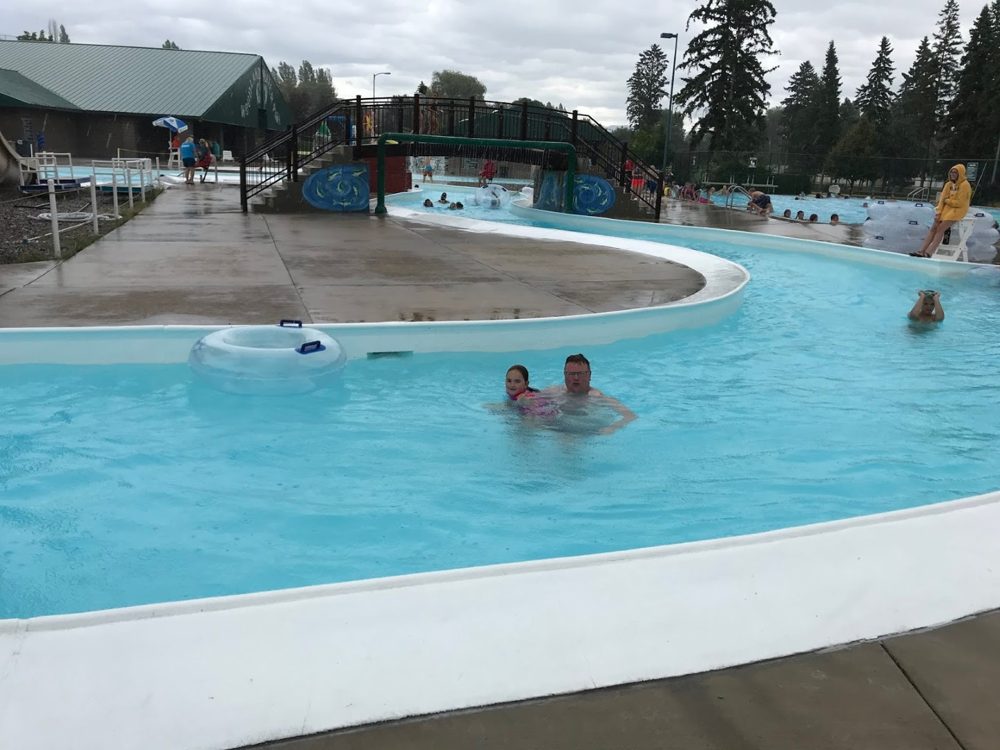
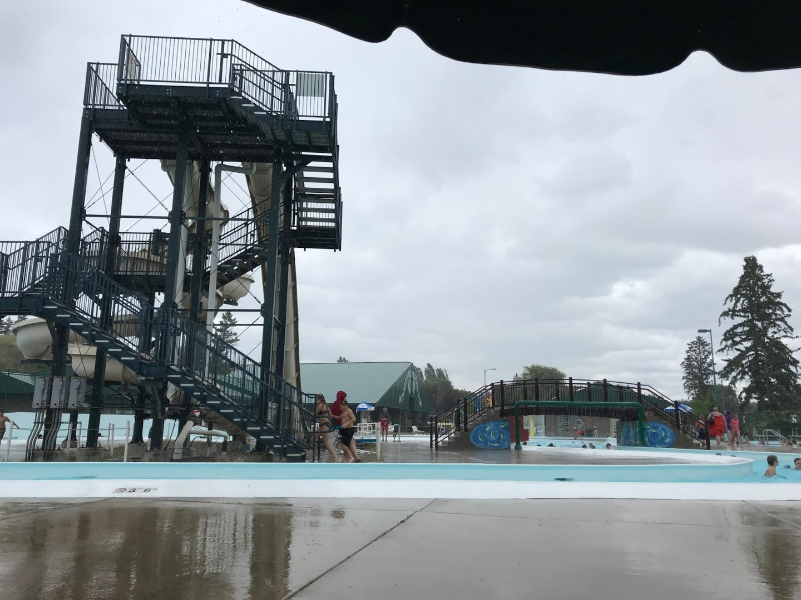

Na de lange dag van gisteren hebben we het vandaag rustig aangedaan. Na het ontbijt in het hotel hebben we bij REI een busje berenspray gekocht (het wordt aangeraden om met dat spul binnen handbereik te wandelen in Glacier NP). Zeer waarschijnlijk gaan we het niet nodig hebben, maar je kunt het maar beter bij je hebben, al is het maar voor je eigen gemoedsrust.

Nadat we de Chevy door de wasstraat hebben gereden (twee man met borstels vooraf het grove vuil verwijderen, dan door de wasstraat, twee man met handdoeken de auto afdrogen... jawel, de personeelskosten in de VS liggen een stuk lager dan in Nederland), zijn we gaan zwemmen in Woodland Park. Het is een buitenbad met een glijbaan en een lazy river.

Na anderhalf uur hadden we het wel gezien, het werd ook wat koud, en zijn we weer terug gegaan naar het hotel. 's Avonds fine dining bij de Applebee's!
