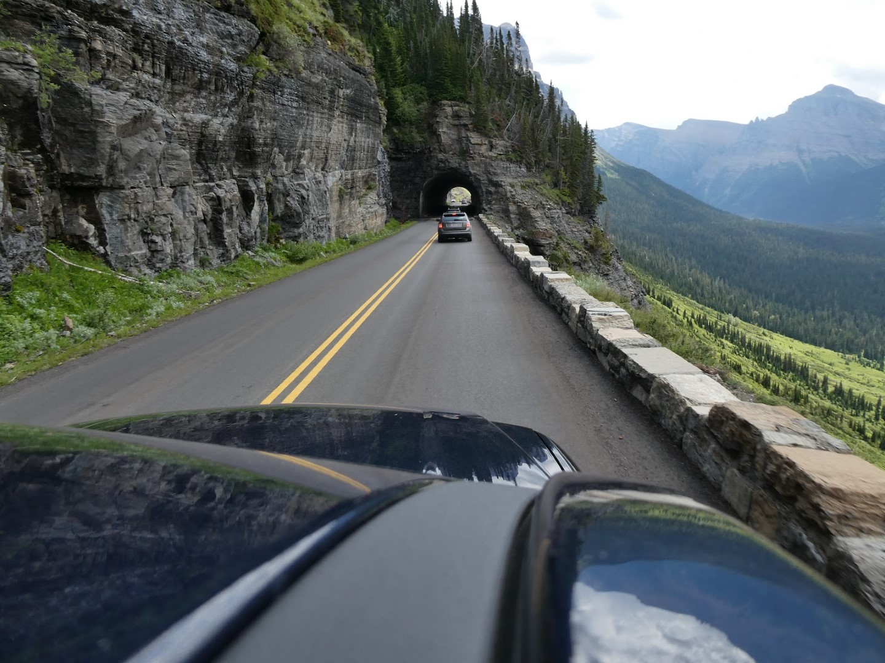
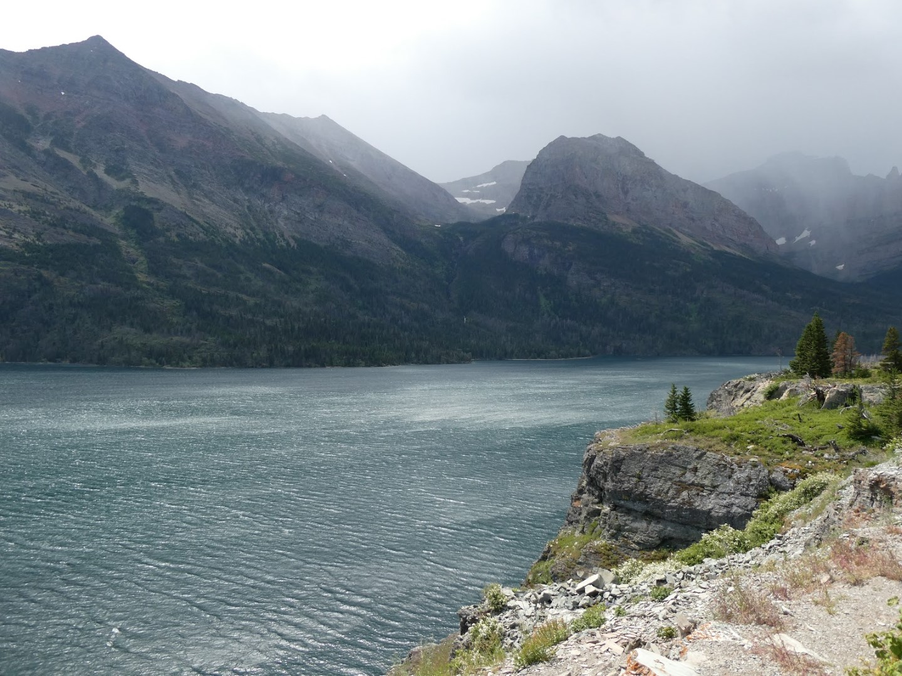
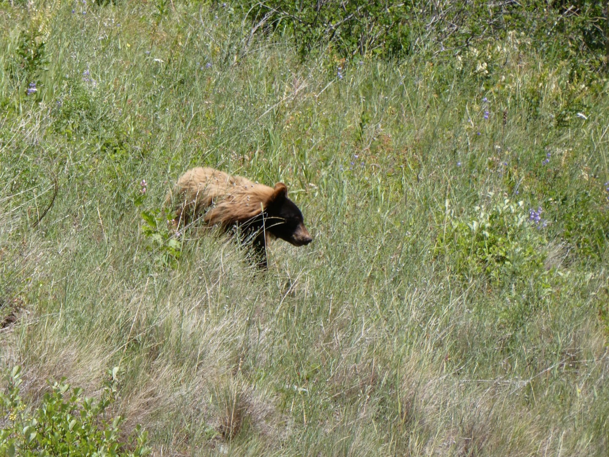
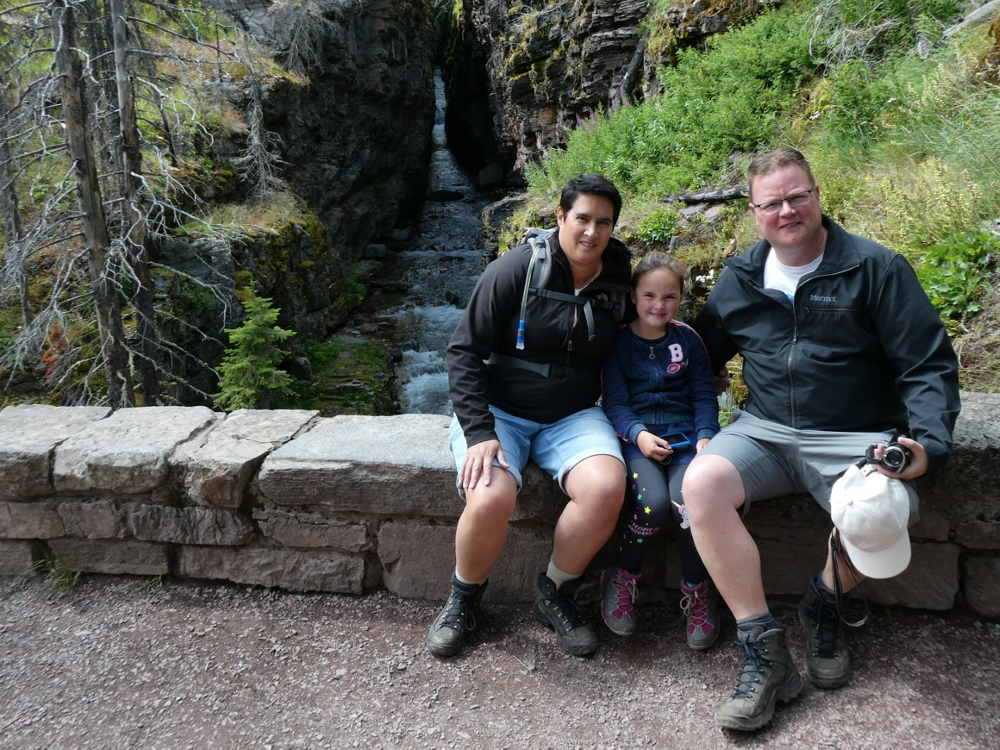
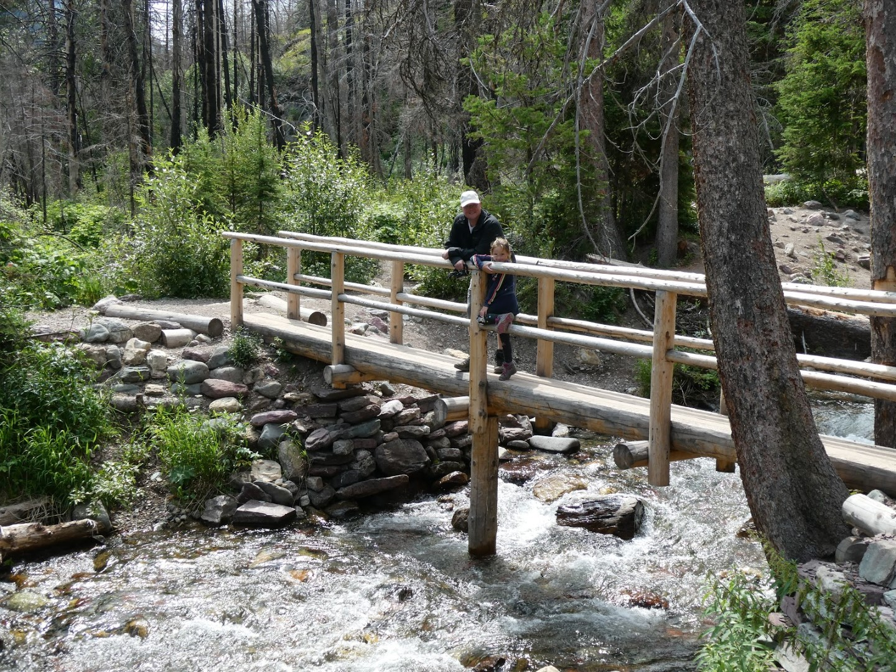
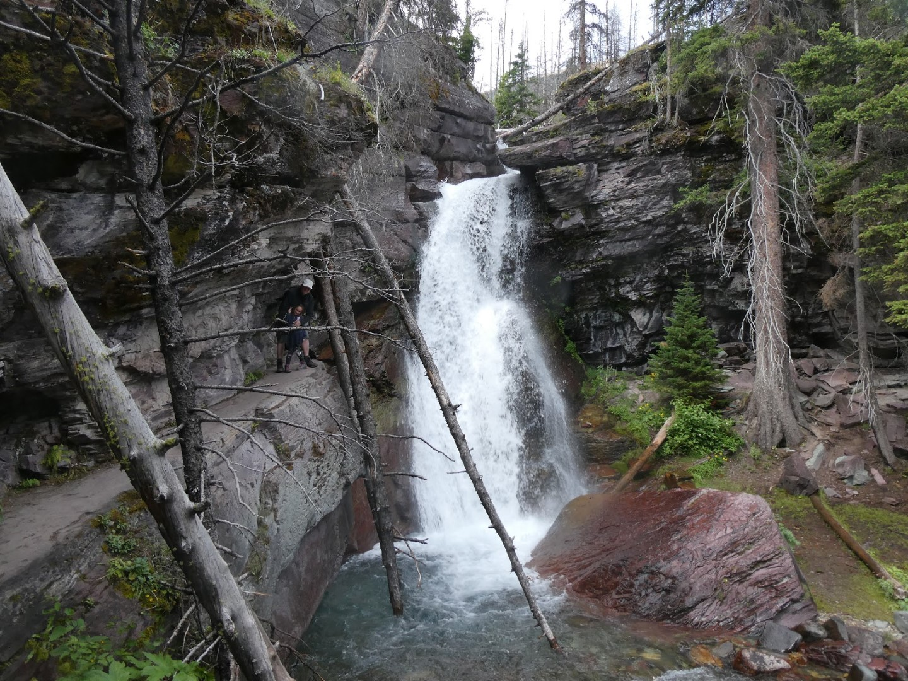
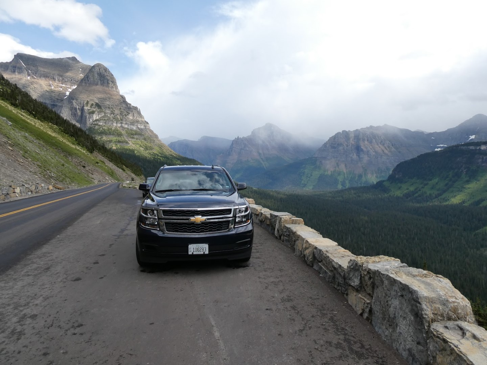
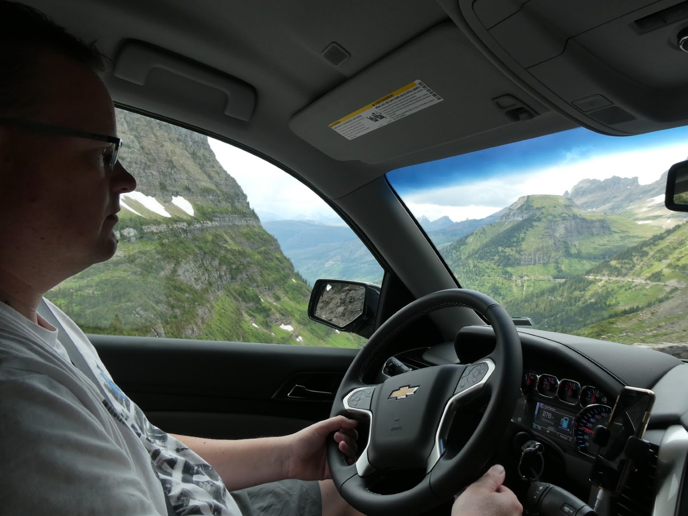

Gisteren hadden we een lange en inspannende dag, dus vandaag wilden we wat rustigers gaan doen. We waren van plan een motorbootje te huren op Lake McDonald in het park, maar er waren helaas te veel golven en dus mochten we niet het water op. We zijn dan maar weer helemaal naar de andere kant van het park gereden om daar te proberen met een begeleide boot- en wandeltocht mee te kunnen op Swiftcurrent Lake bij Many Glacier. Een rit van ongeveer 3 uur (met name veroorzaakt vanwege de slakkengang van de mede-automobilisten op de bergpas).

Het weer op de Going To The Sun road was prima, dus we hadden goede moed. Helaas bleek bij aankomst bij Many Glacier dat het weer hier nogal onvoorspelbaar is: een ENORME bui trok over het meer en de aanpalende bergen, dus we hadden niet veel trek in een (al dan niet begeleide) wandeling. Gelukkig konden we wel alvast drie kaarten kopen voor komende zondag. Vanaf vandaag wordt het iedere dag beter weer, volgens de voorspellingen, dus het moet goed komen!

Op weg terug naar ons hotel hebben we onze eerste beer gezien. In het wild dan wel te verstaan...

En hebben we nog wat watervallen bekeken.

## 1 opmerking

### Gerard 24 juli 2019 om 11:30

De eerste bruine beer lijkt geen aandacht voor jullie te hebben, dus de spuitbus was niet nodig!
