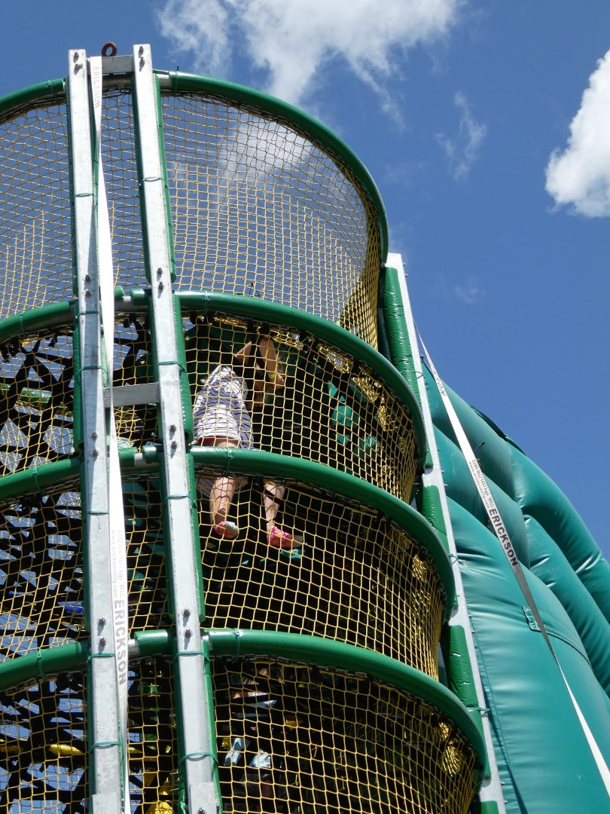
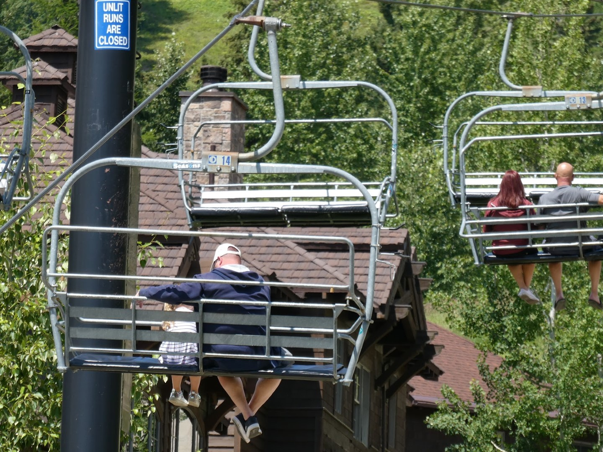
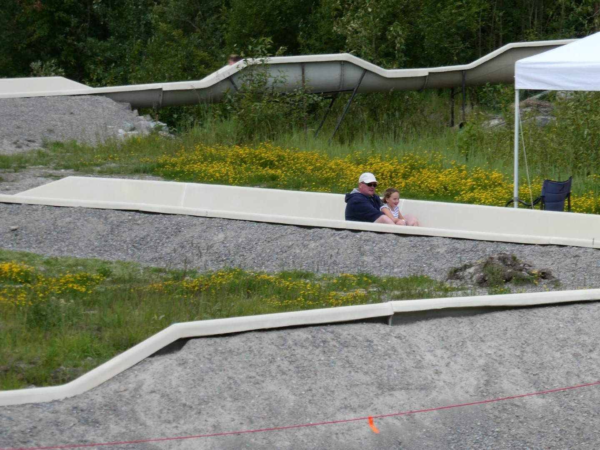
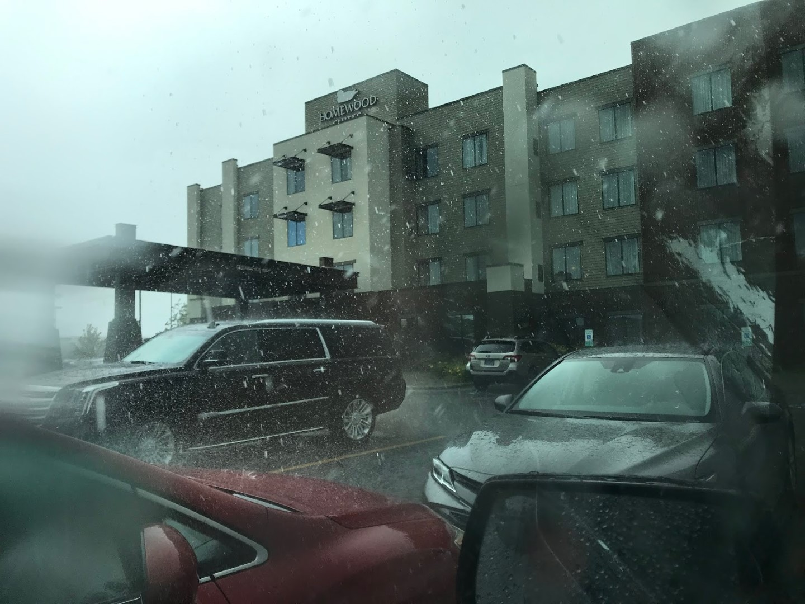

We hebben weer eens een rustige dag gepland voor vandaag. Op een kleine drie kwartier rijden van Kalispell ligt het gezellige stadje Whitefish. Dit stadje ligt tegen een berg aan, met daarop een skigebied. In de zomer kun je ook gebruik maken van de skiliften, en is er een aantal activiteiten beschikbaar voor jong en oud.

De rodelbaan stond vervolgens op het programma. Met de skilift gaan we de berg op, en mogen vervolgens bijna een uur in de rij staan om vervolgens in 60 seconden naar beneden te vliegen. Nou ja, vliegen... de Amish jongeman voor ons had meer vertrouwen in God dan in zijn rodelbaankunsten, dus wij moesten geregeld remmen om niet te botsen.

We waren amper beneden en toen werd de lucht ineens zwart. Dus wij vlug naar de auto om de regenjassen te halen, maar toen regende het zo hard dat we het tweede kaartje voor de rodelbaan en voor de extra skilift naar het hoogste punt maar hebben teruggebracht om ons geld terug te vragen. We besloten om de rest van de middag in het zwembad van het hotel te gaan zwemmen. Bij het hotel onweerde het trouwens ook heftig...

Het zijn iedere keer heftige, maar gelukkig erg korte buien. Na de bui is het meteen weer aangenaam qua temperatuur.
