Helemaal aan de noordoost kant van het park ligt Many Glacier met een bijbehorend hotel aan Swiftcurrent Lake. Hier stappen we op een boot om samen met een gids een stukje te varen naar de overkant van het meer. Om bij het hotel te komen moeten we wederom de hele Going To The Sun road rijden (wat op zich geen straf is). Het is vandaag prachtig mooi zonnig en warm weer, dus de watervallen en vergezichten zien er allemaal een stuk vriendelijker uit.

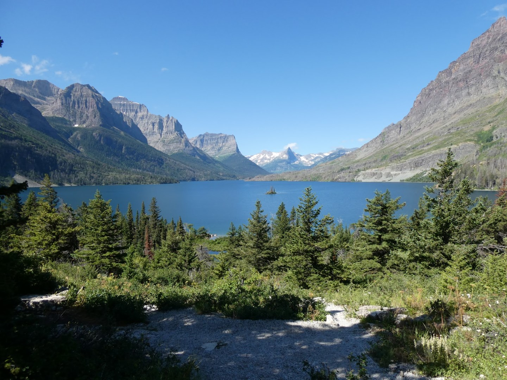

We stoppen bij het St Mary Visitor Center om de Junior Ranger badge op te halen.

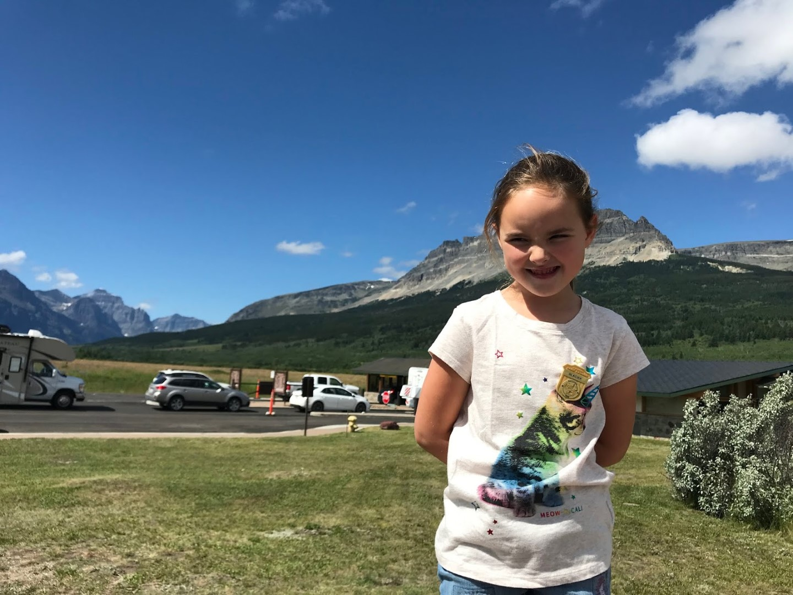

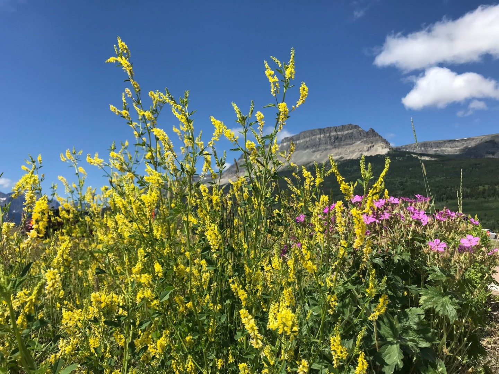

Daarna gaan we vlug naar Many Glacier. We willen op tijd zijn want parkeren in dit deel van het park is een drama, en we willen lunchen voordat we op de boot stappen. De boot wacht al geduldig op ons, wanneer we aankomen.

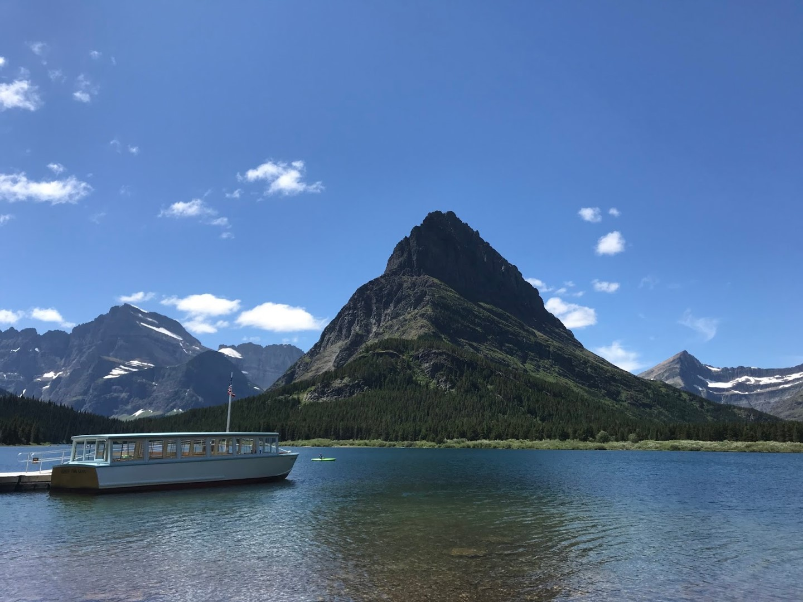

We varen eerst naar de overkant van Swiftcurrent Lake. Na het uitstappen moeten we een paar honderd meter lopen naar de volgende aanlegsteiger om vervolgens met een andere boot Lake Josephine over te steken. Beide boottochtjes duren niet al te lang. Wanneer we Josephine achter ons hebben gelaten lopen we met de gids in iets meer dan een mijl naar Grinnell Lake.

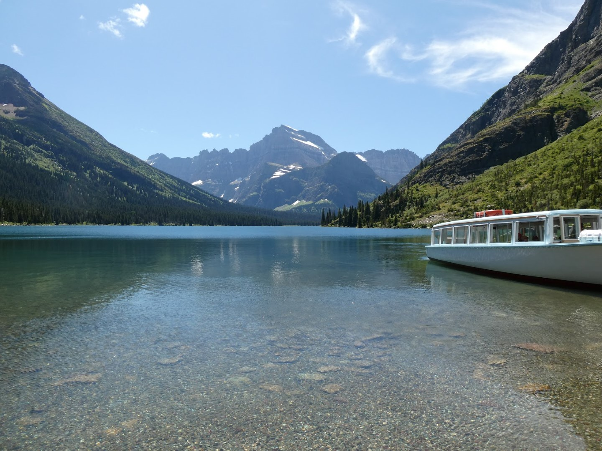

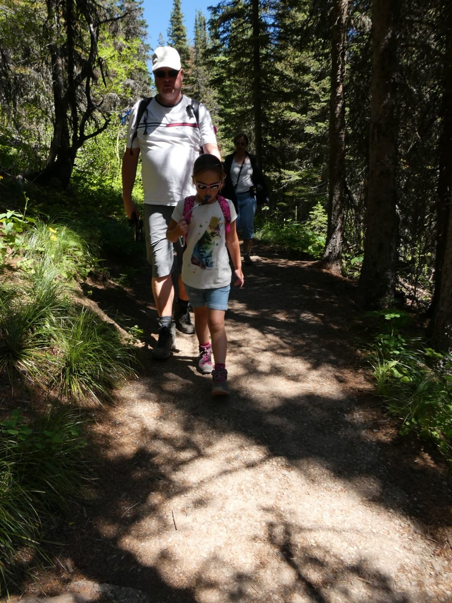

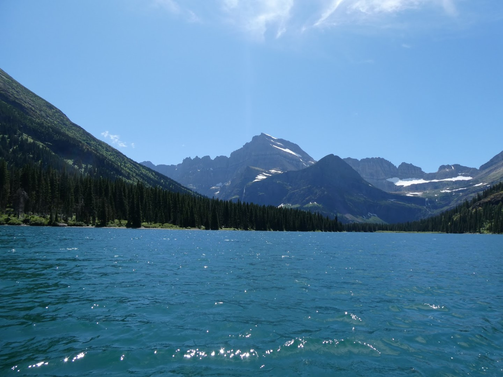

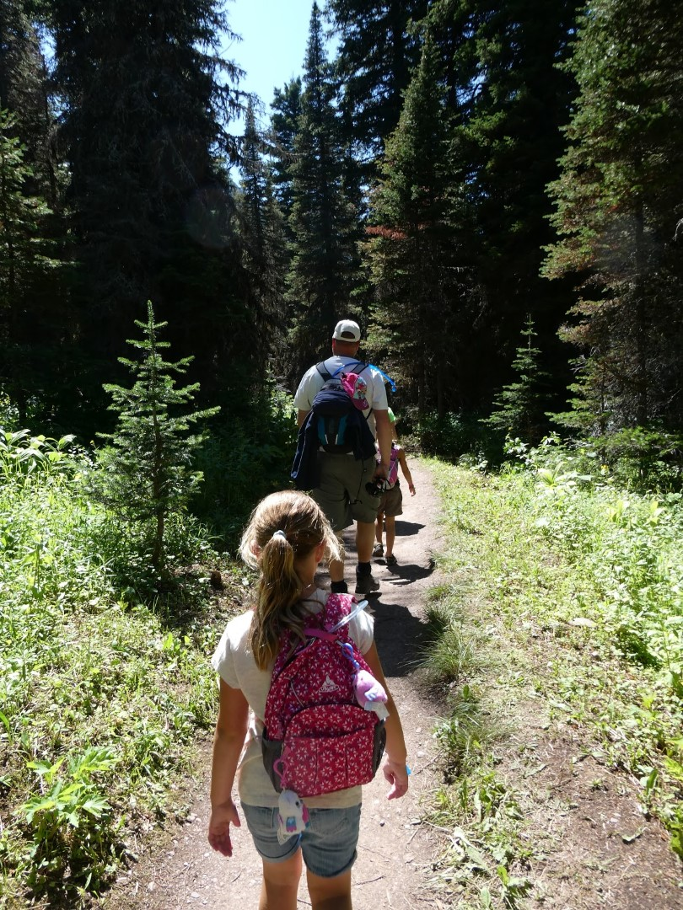

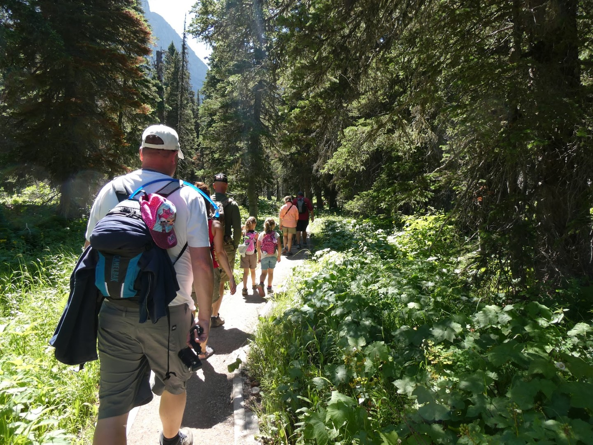

Na een mijl wandelen komen we bij een hangbrug aan. Hierna is het nog een klein stukje naar ons einddoel: Grinnell Lake.

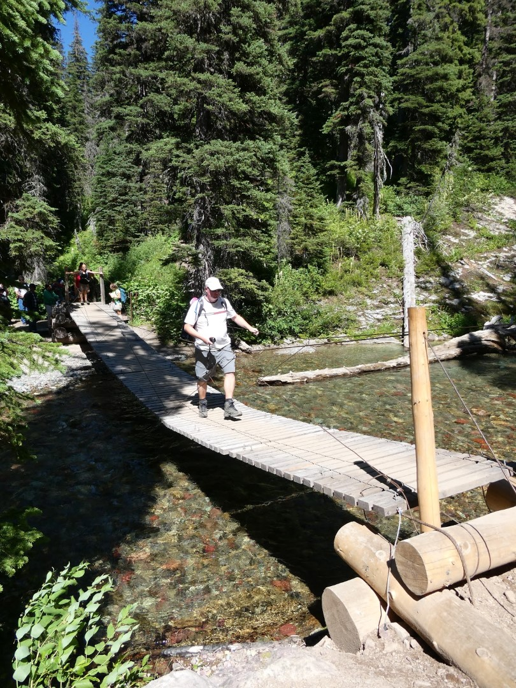

Het is er prachtig. Sofie had onderweg een vriendinnetje opgedoken uit Indiana. Samen met haar ouders zijn we terug gelopen en onderweg nog even gestopt bij Hidden Falls (ieder nationaal park heeft blijkbaar recht op een eigen Hidden Falls of Hidden Valley).

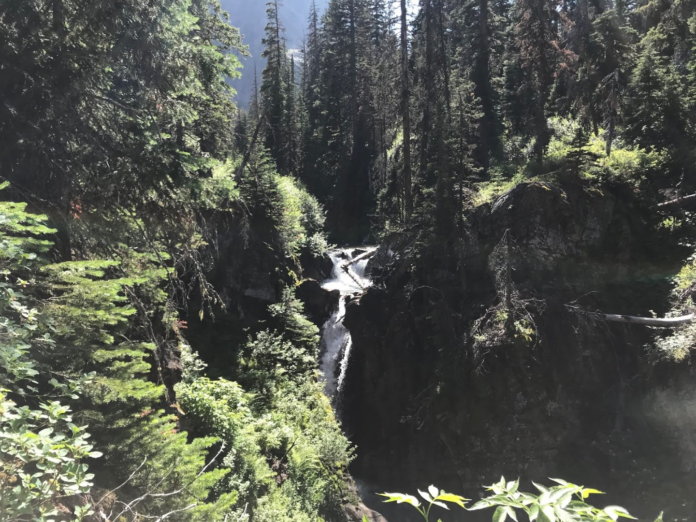

Al met al waren we pas rond zes uur terug bij het beginpunt. Het was een fantastisch leuke dag. We hebben gegeten bij de lodge bij St Mary, en daarna weer terug gereden naar Kalispell.

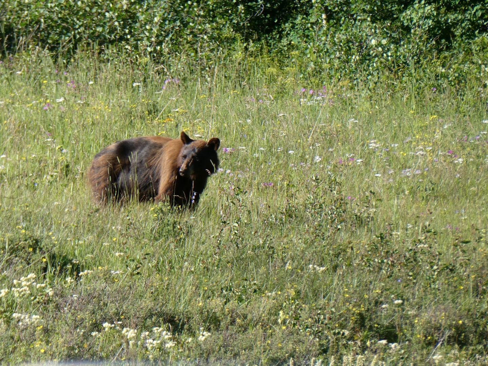

Uiteindelijk waren we na elf uur pas weer in ons hotel.
