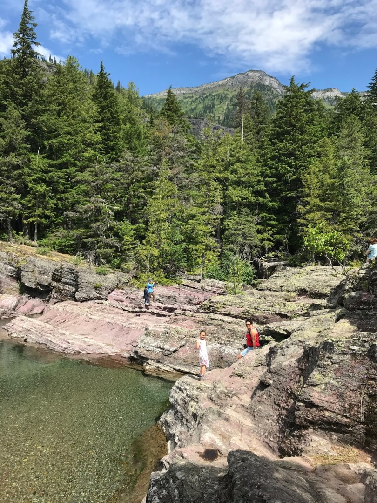
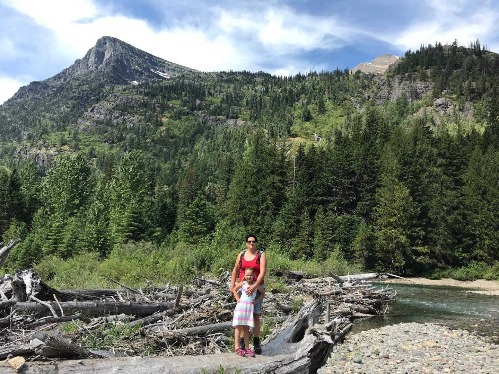
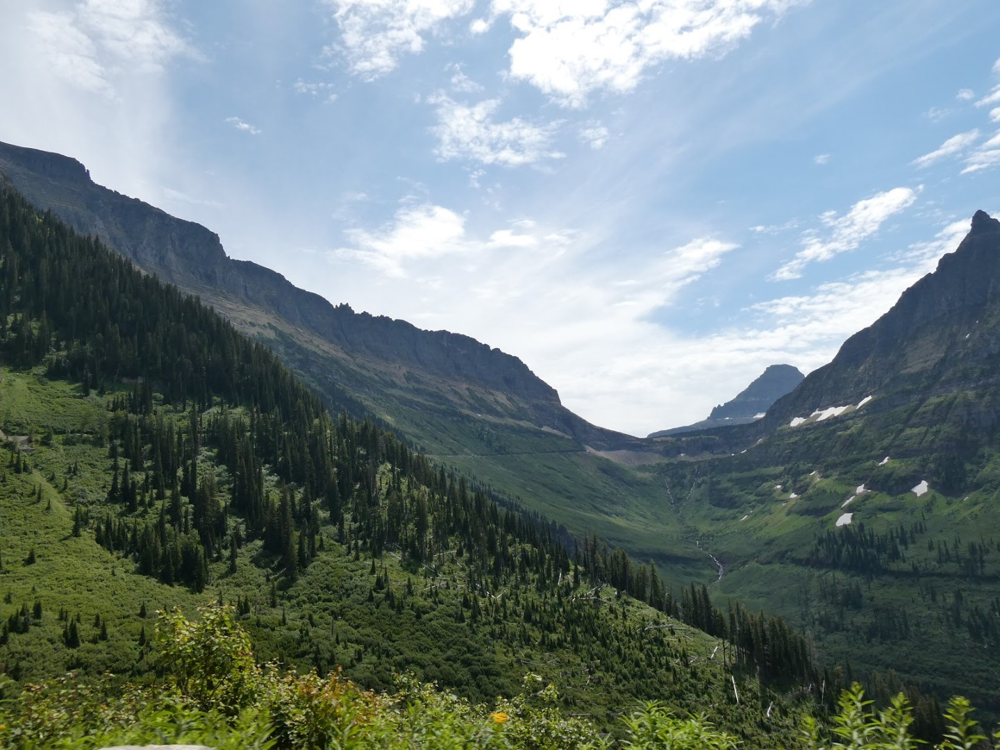
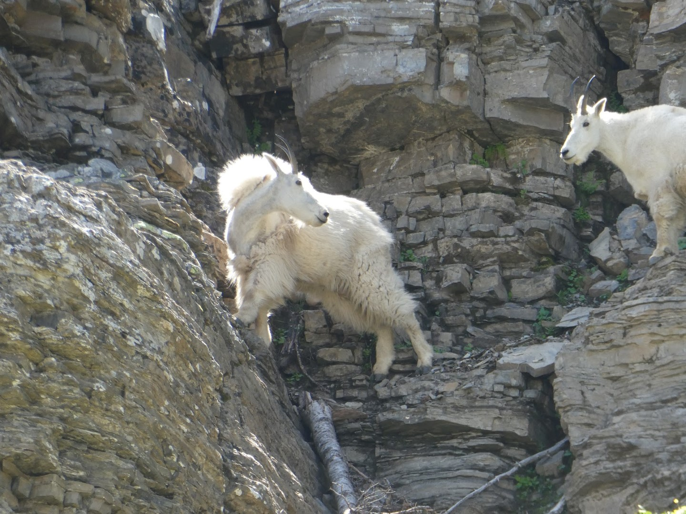
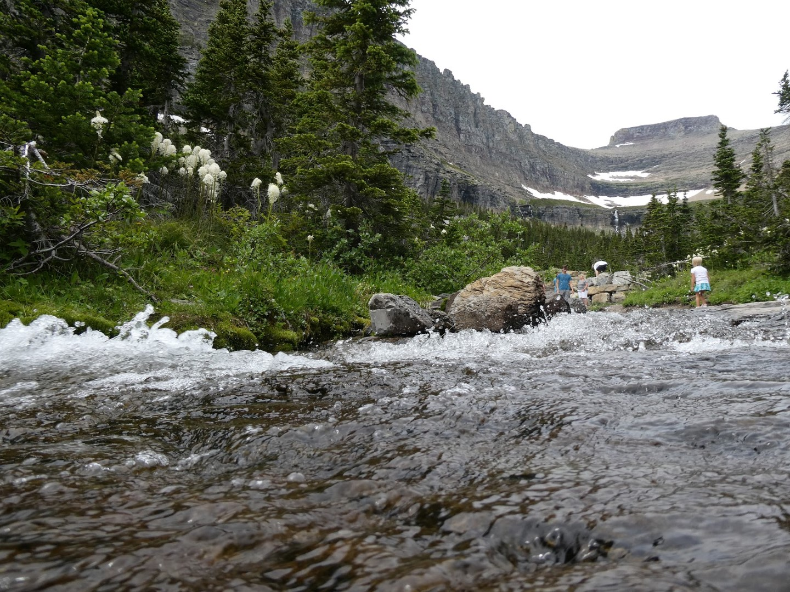
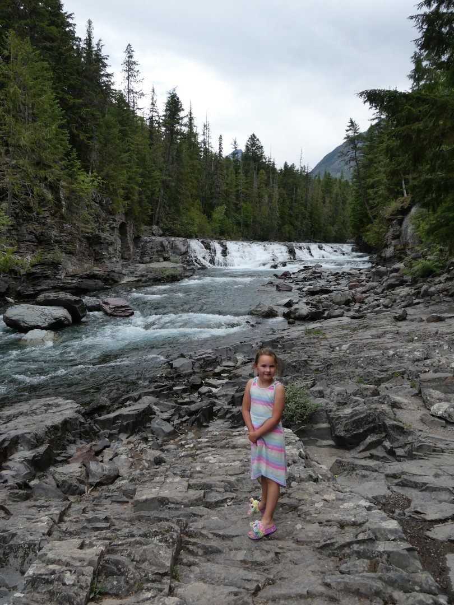
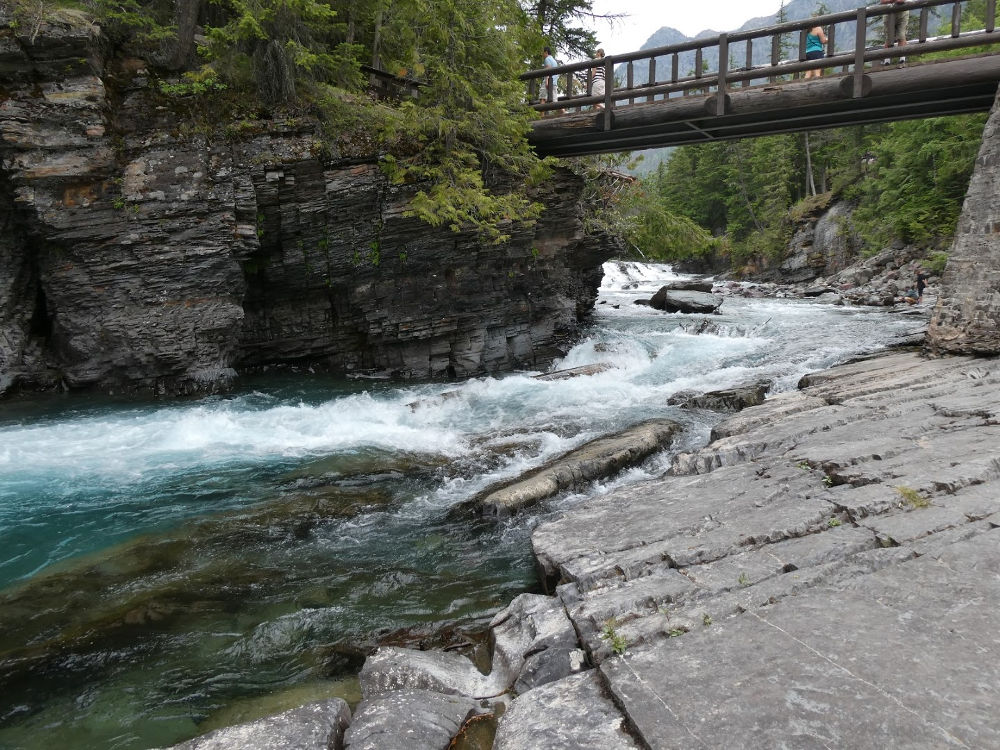
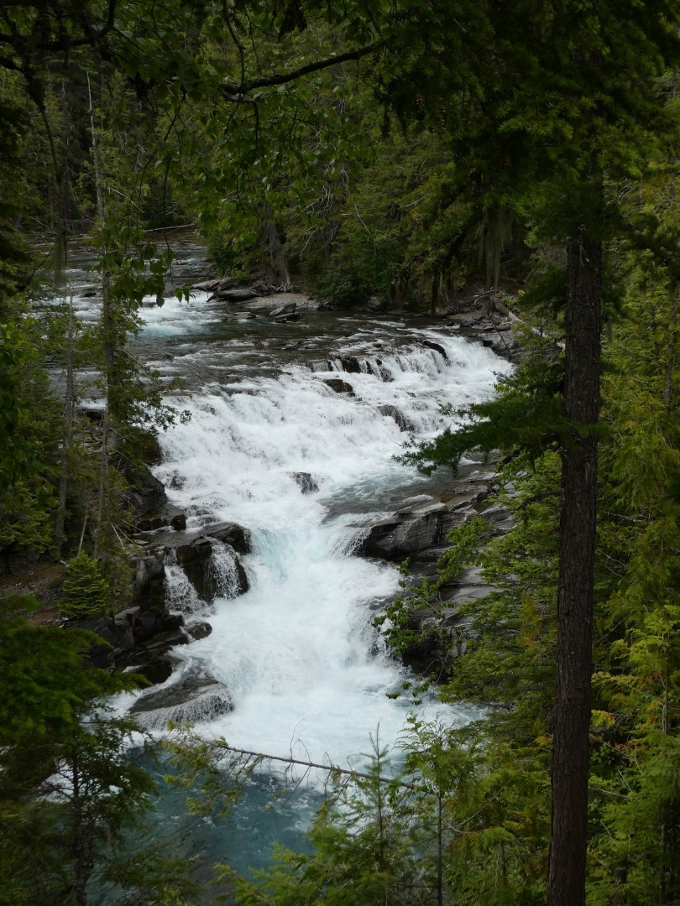

Omdat we wel erg laat thuis waren gisteren hebben we besloten om vandaag maar weer kalm aan te doen. We willen nog wat watervalletjes bekijken langs de Going To The Sun road. Verder hebben we niks spectaculairs gedaan.

Het is helaas onze laatste avond in de Homewood Suites in Kalispell. Het is een erg fijn hotel gebleken. We zijn gaan eten bij ihop, hebben de was gedaan en de koffers weer ingepakt voor morgen, dan gaan we naar Helena, de hoofdstad van Montana. Het is slechts een tussenstop voor de volgende "grote" bestemming: Yellowstone National Park.
