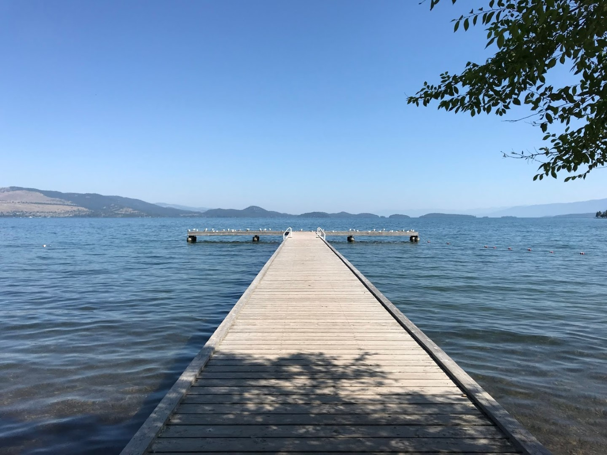
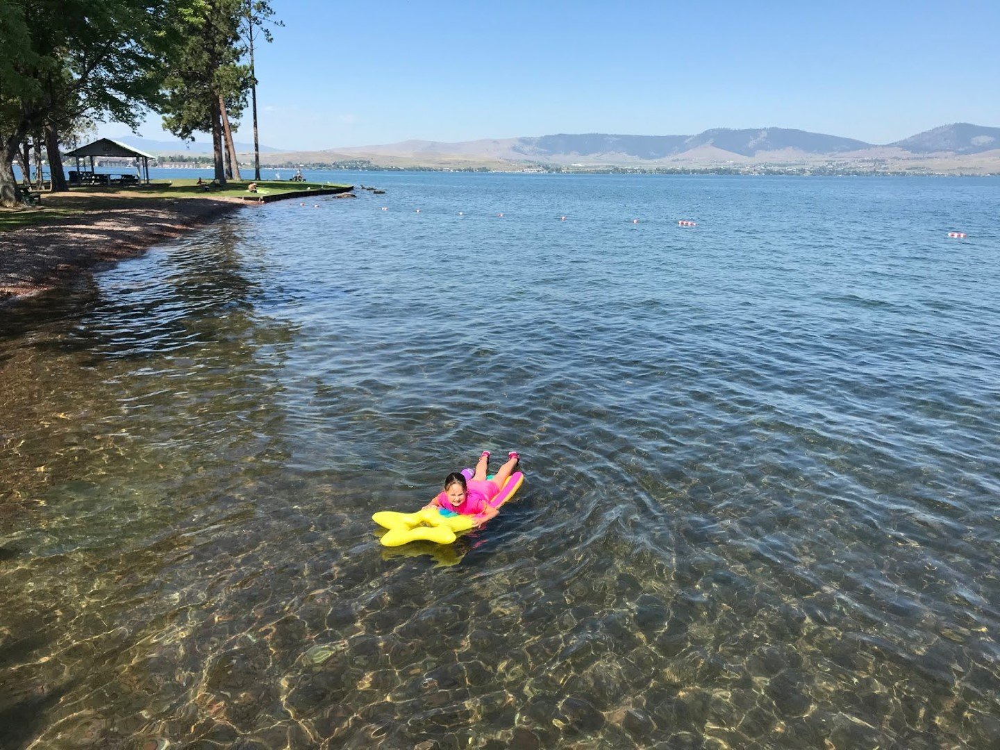
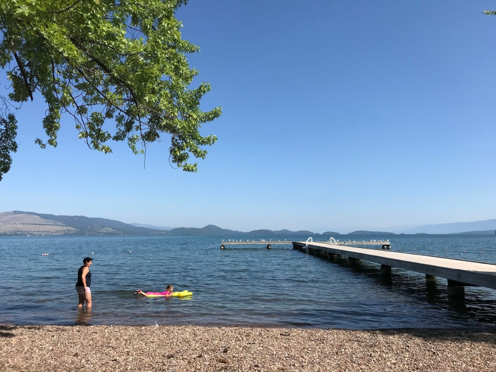
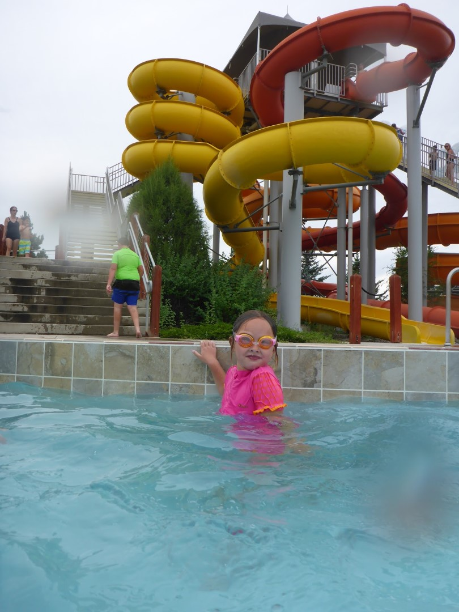
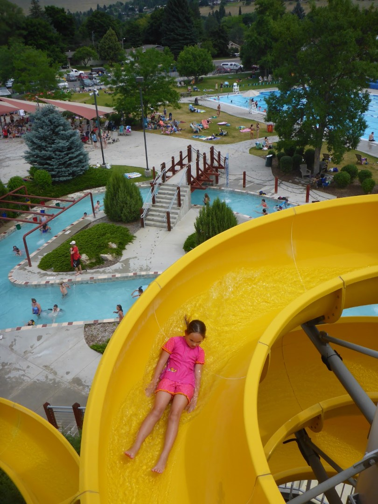
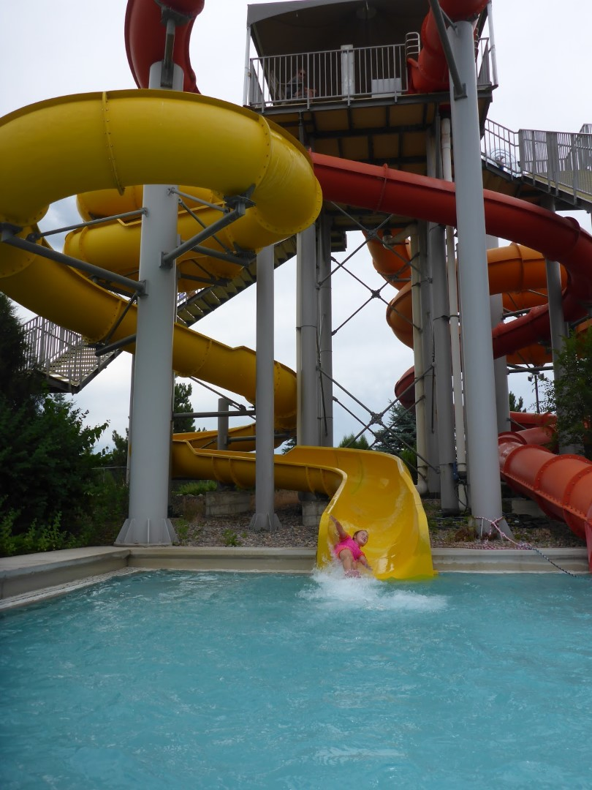
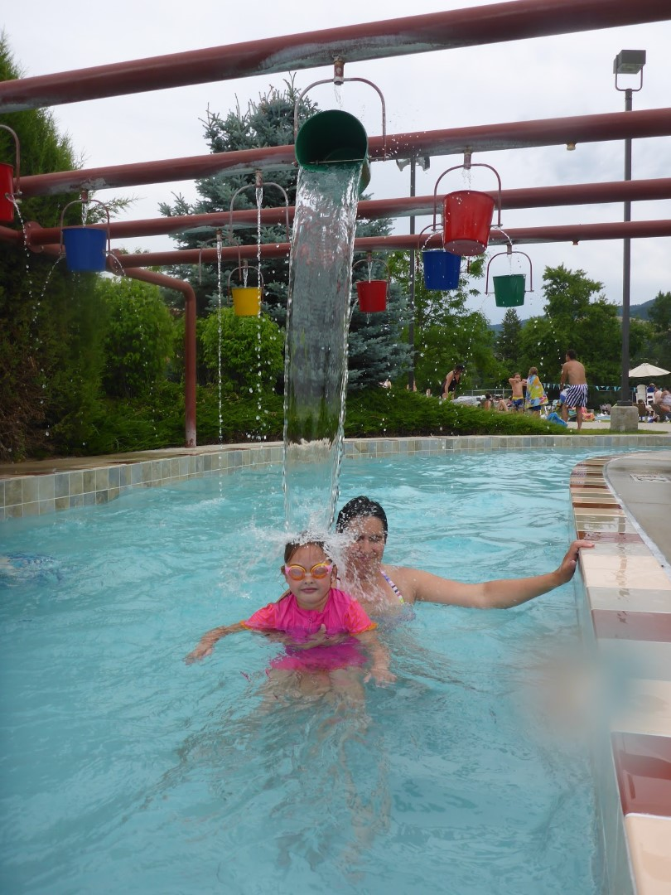
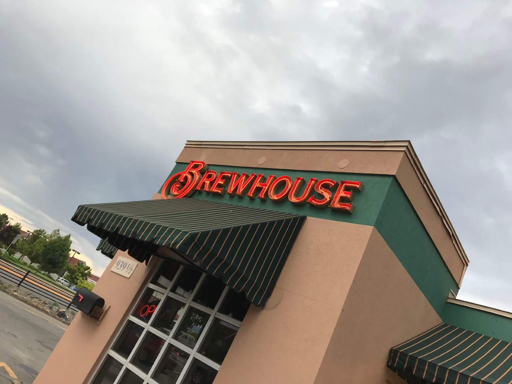
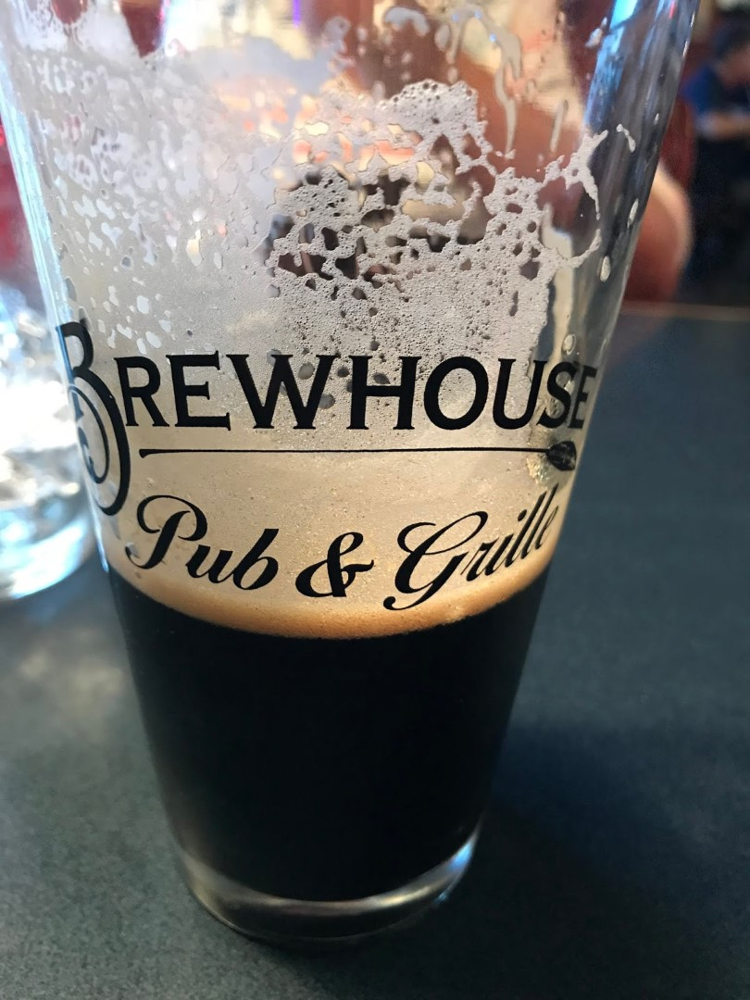

Om de rit naar Helena in behapbare brokken te knippen, stoppen we eerst in Polson. Aan het Flathead Lake is een leuke speeltuin direct aan het kristalheldere water.

Sofie durft het, ondanks het koude water, aan om in het meer te zwemmen.

We kunnen helaas niet al te lang blijven, want we moeten nog een behoorlijk stuk rijden. Bovendien hebben we nog een leuke verrassing voor Sofie in petto: Splash Montana, het waterpark in Missoula. En het goede nieuws is dat Sofie eindelijk van de glijbaan af mag!

Er was ook een fijne lazy river.

Toen we uitgezwommen waren, zijn we doorgereden naar Helena, de hoofdstad van Montana. We overnachten in de Best Western, midden in het centrum van het stadje. 's Avonds eten we bij Brewhouse, om de hoek van ons hotel.

Het eten (en bier) smaakt prima.

## 2 opmerkingen

### Gerard 26 juli 2019 om 09:46

Eindelijk, Sofie mag van de glijbaan en is dus apetrots. En papa geniet van een lekker biertje. Wij genieten hier van temperaturen boven de 35 graden.

### Anoniem 27 juli 2019 om 15:50

Hallo, We volgen jullie al heel de reis, maar een reactie plaatsen lukte ff niet. Het ziet er weer fantastisch uit en Glacier blijft ook voor ons een favoriet, samen met Yellowstone. Waarschijnlijk heeft Sofie dadelijk de meeste junior-ranger badges van alle kids haha. Nog heel veel plezier! Groetjes van 5-bijna-op-reis
