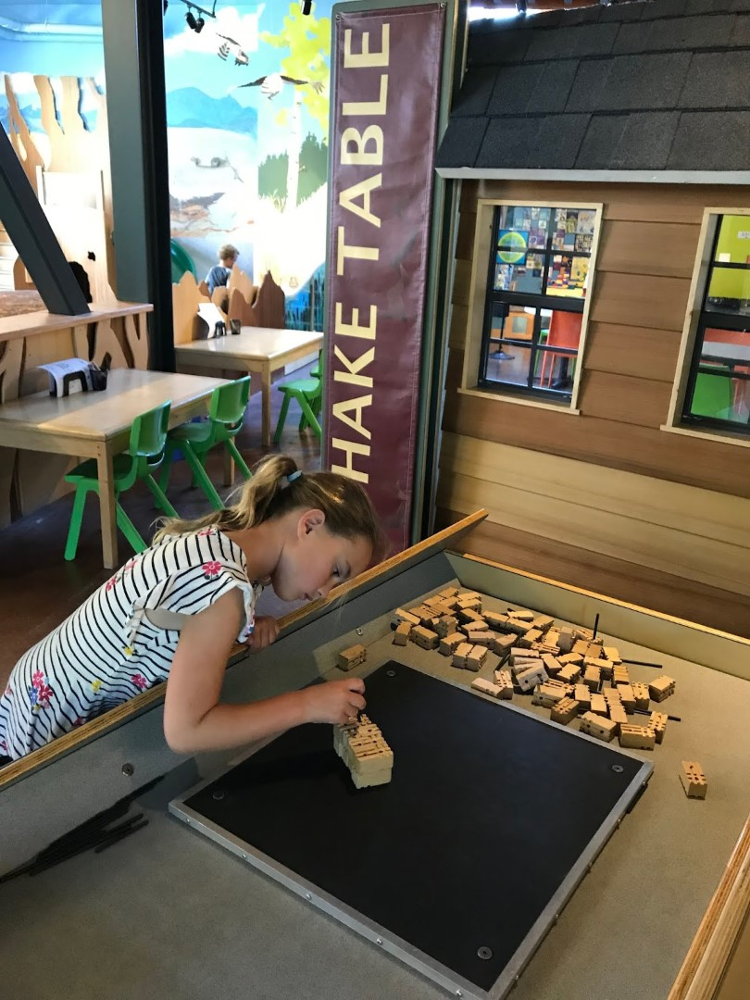
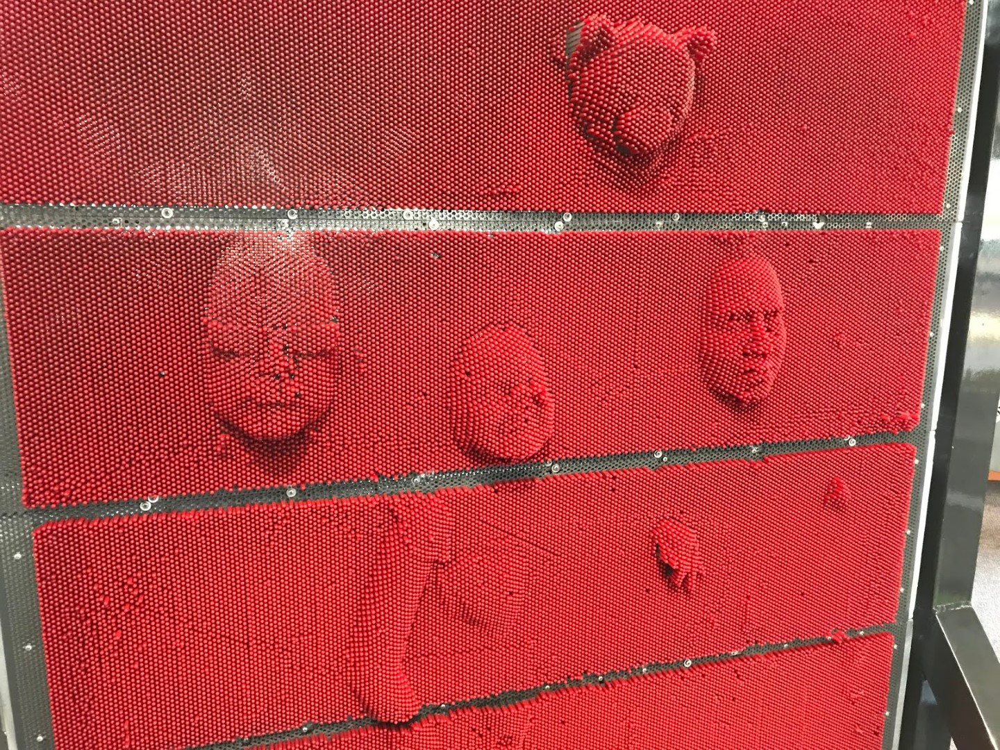
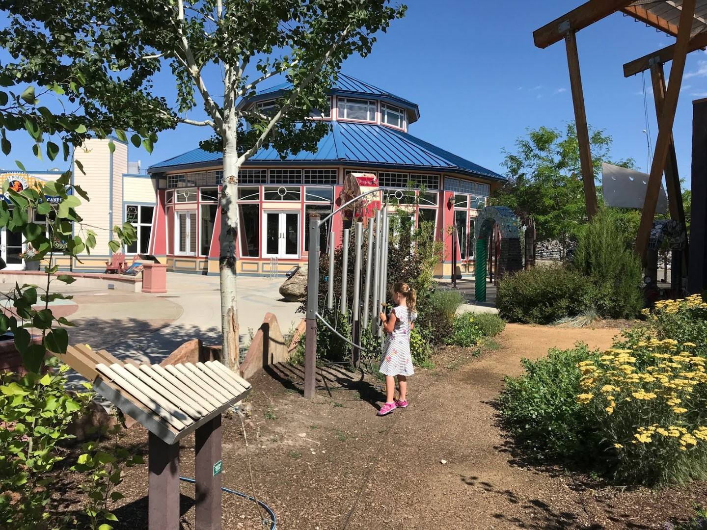

Vanmorgen hebben we rustig aan gedaan. Na het prima ontbijt in het hotel hebben we alle koffers in de auto geladen, en zijn we naar het naast ons hotel gelegen Exploration Works science museum gegaan. We hebben van alles kunnen leren over aardbevingen, tsunami's, magnetisme en water. We hebben er twee uurtjes rondgewandeld.

Sofie vond met name de luchtbuizen erg leuk. Aan de ene kant stop je een sjaaltje in een buis, en door enkele schakelaars te veranderen komt het sjaaltje ergens anders er weer uit.



Na al dit educatief verantwoord vermaak was het tijd voor een ouderwetse draaimolen en een ijs.

Daarna hebben we Helena achter ons gelaten en zijn we verder gereden naar hotel Kelly Inn in West Yellowstone. Daar kwamen we redelijk laat aan, dus hebben we maar voor een snelle hap bij de Mac gekozen om vervolgens met een volle buik in het zwembad te duiken. In de hottub spraken we wat mensen die uren in de rij hebben gestaan om uberhaupt in het park te komen, dus we gaan maar vroeg naar bed. Morgen rammelt de wekker al om 6 uur om de drukte voor te zijn.
