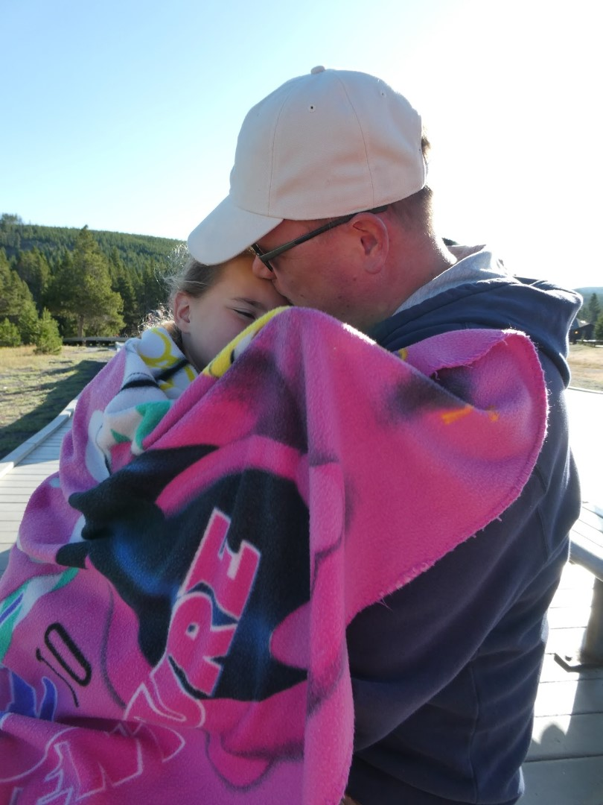
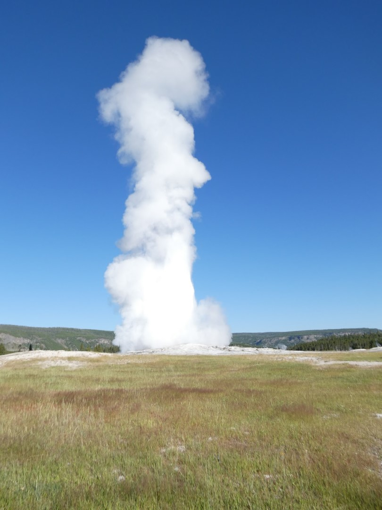
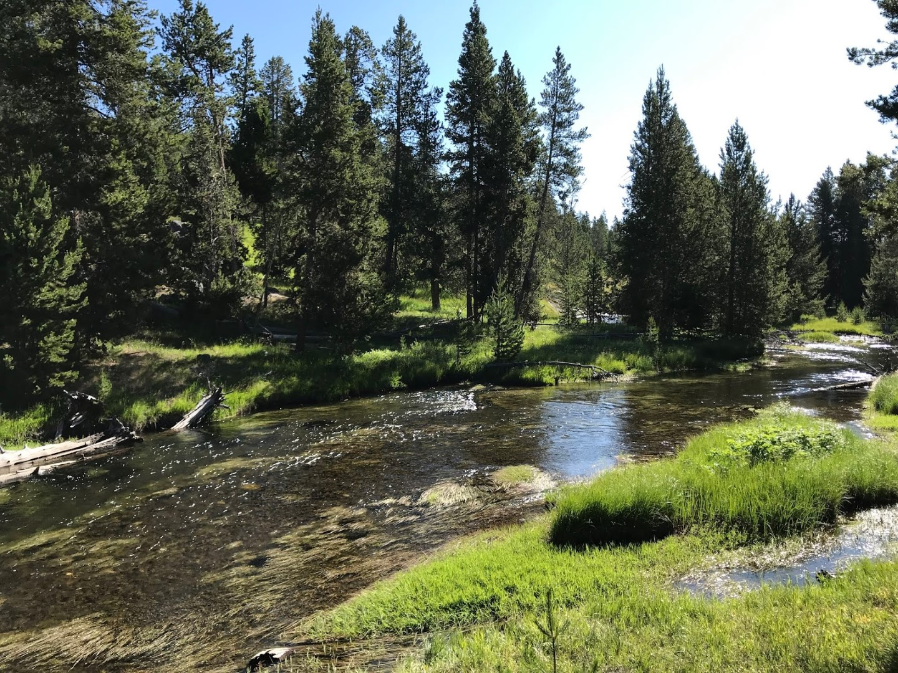
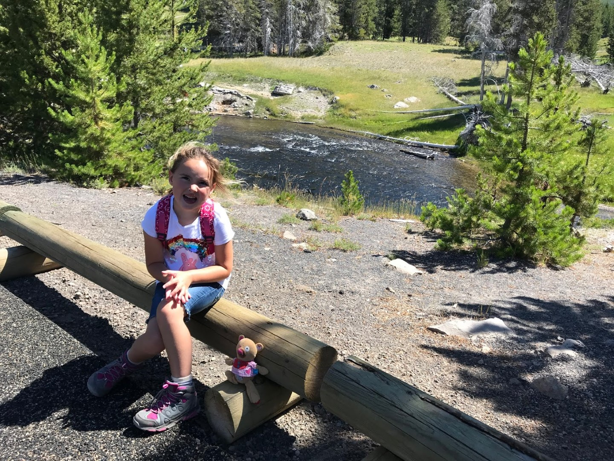
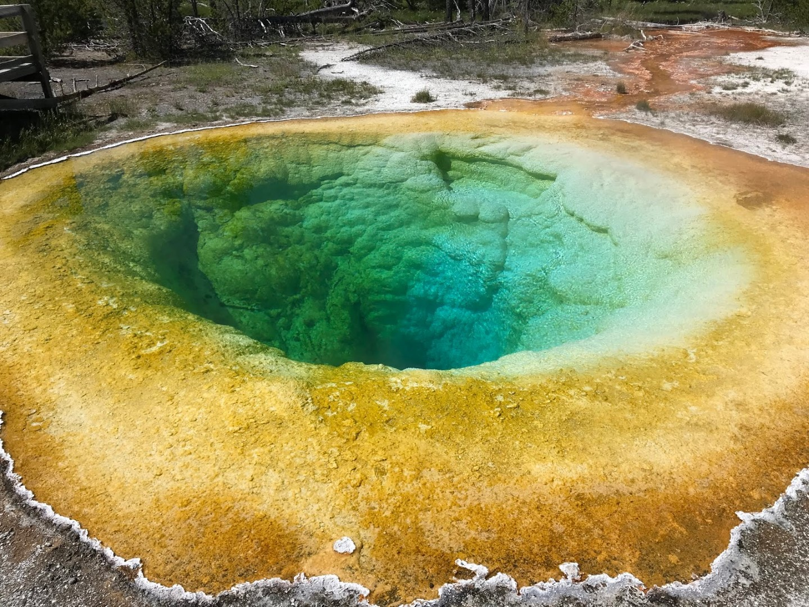
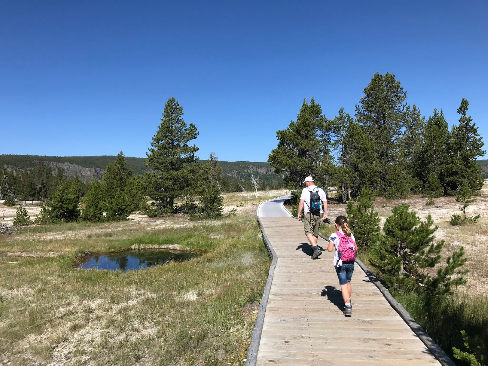
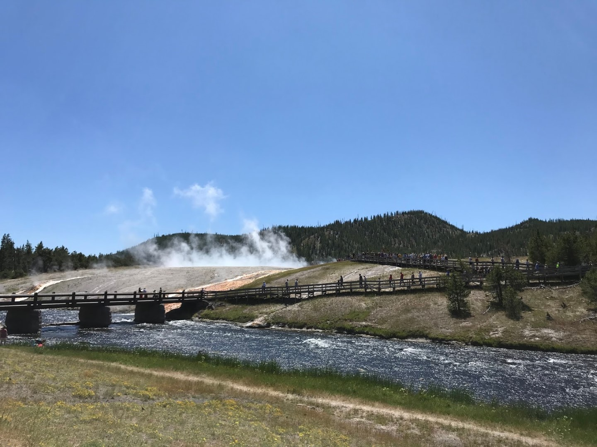
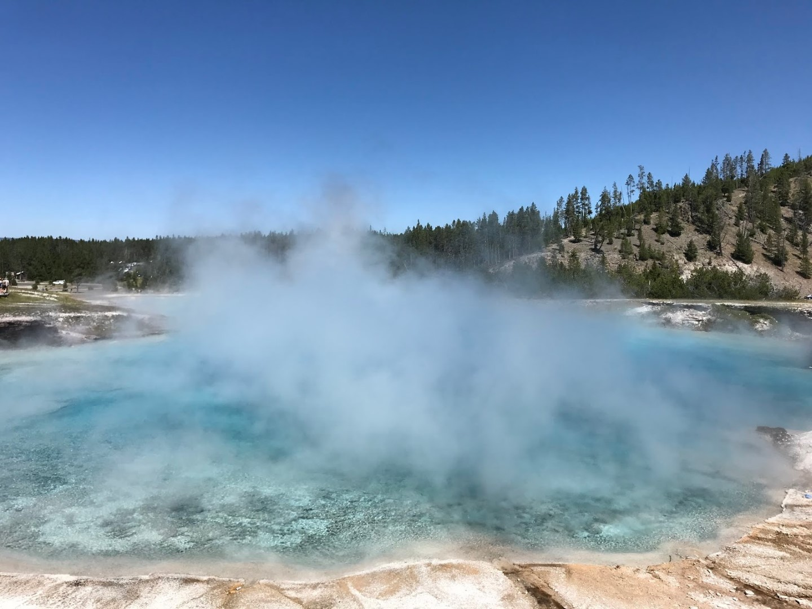
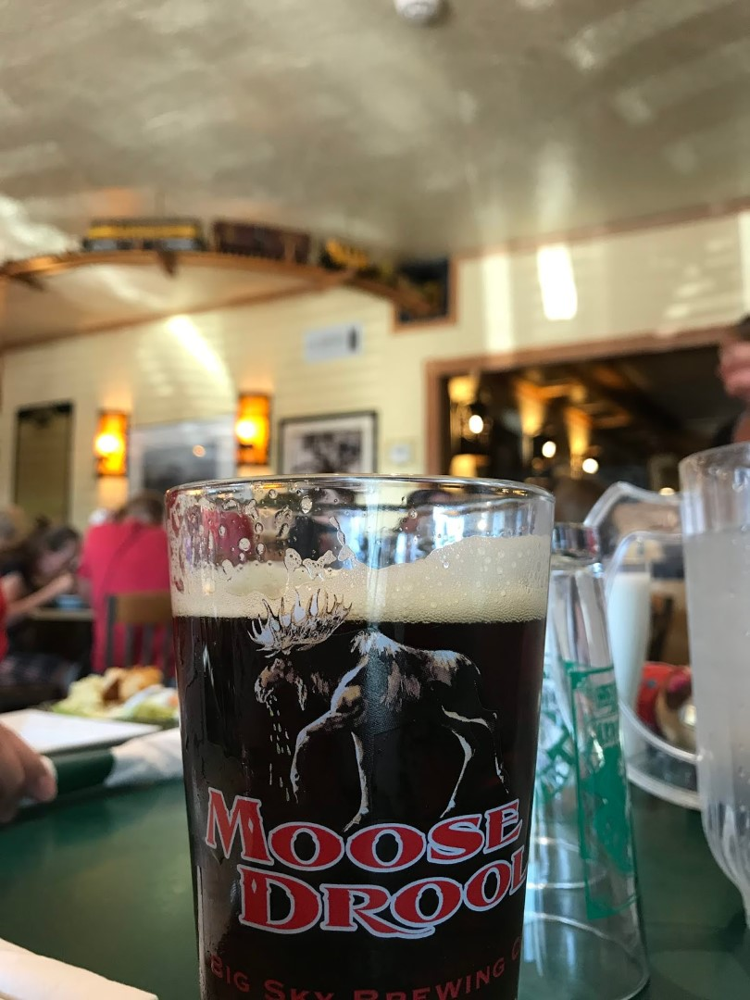

De wekker stond op 6 uur ingesteld, maar dankzij de buren waren we al iets eerder wakker. Om half zeven reden we door de toegangspoort van het beroemde National Park (ons hotel ligt op nog geen kilometer van de westelijke ingang). Ons doel van vandaag is de omgeving van de Old Faithful geiser te bezoeken. Van de vele geisers in dit park is dit, met ongeveer iedere 60 tot 80 minuten een eruptie, de meest actieve. Om half acht in de ochtend namen we plaats op de bankjes die rondom de geiser staan opgesteld (uiteraard naast een ander Nederlands koppel). Hoewel de zon schijnt, is het best nog frisjes. Dus duiken we onder de fleecedeken om de benen een beetje warm te houden.

Na een tijdje wachten begint dan de eruptie. Het blijft een mooi gezicht.

Een uitbarsting kan tot 32.000 liter kokend water zo'n 56 meter hoog spuiten. Nadat de geiser weer tot rust was gekomen, hebben we het junior ranger boekje opgehaald en hebben we een rondje gemaakt door de Upper Basin. Het blijft een heel apart gezicht (en de geur van rotte eieren) en het maakt behoorlijk indruk op Sofie: "Is dit lava???" hebben we meermaals gehoord.

Om de geisers en de bezoekers te beschermen is er een boardwalk gemaakt die je langs verschillende geisers en andere verschijnselen voert. Overal hangt de nare geur van zwavel, en soms moet je door een dikke wolk een weg banen. Het is een erg leuk wandelingetje.

Toen we weer terugkwamen bij het begintpunt (bij Old Faithful en onze auto), waren we erg blij dat we vanmorgen vroeg zijn vertrokken. De (enorme!) parkeerplaats puilde uit van de auto's. De bankjes bij Old Faithful zelf zaten ook bomvol.

We wilden gaan lunchen bij Grand Prismatic Spring. Daar aangekomen bleek er een behoorlijke file te staan om op de parkeerplaats te komen. Wij hadden geluk: iemand vlakbij de ingang van de parkeerplaats reed net weg toen wij aankwamen... Vlug op die plek geparkeerd, we stonden bijna pole position! Toch een voordeel dat we deze keer geen 29 voet camper moeten parkeren.

Hierboven kun je mooi de nadelen van reizen in het hoogseizoen zien. Bij ons vorige bezoek aan Yellowstone in 2007 liepen we hier nagenoeg alleen...

's Avonds hebben we op aanraden van de meneer van de hotelreceptie gegeten bij Bullwinkle's. De bizon hamburger met bluecheese was meer dan voortreffelijk. Het getapte Moose Droole (elanden kwijl) was ook prima.

