Mammoth Hotsprings staat vandaag op het programma. Wederom zijn we erg vroeg opgestaan om de drukte voor te zijn. De hotsprings liggen in het noord-westen van het park, en het is ongeveer een uur en twintig minuten rijden vanaf de westelijke ingang. Onderweg stoppen we eerst bij Gibbon Falls. Het is nog erg koud buiten, maar de zon schijnt wel al.

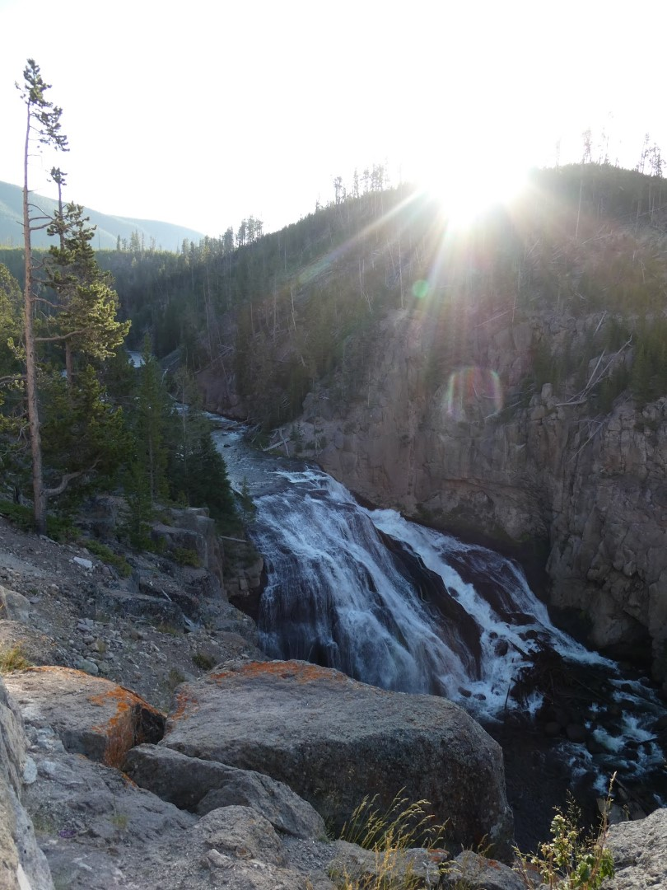

Bij Mammoth Hotsprings is ook weer een boardwalk en trappen aangelegd om de thermale fenomenen en zijn bezoekers te beschermen.

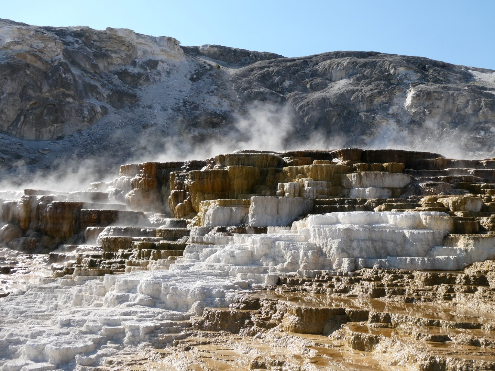

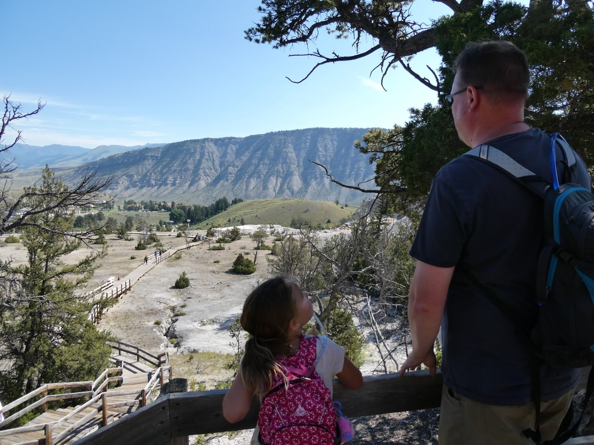

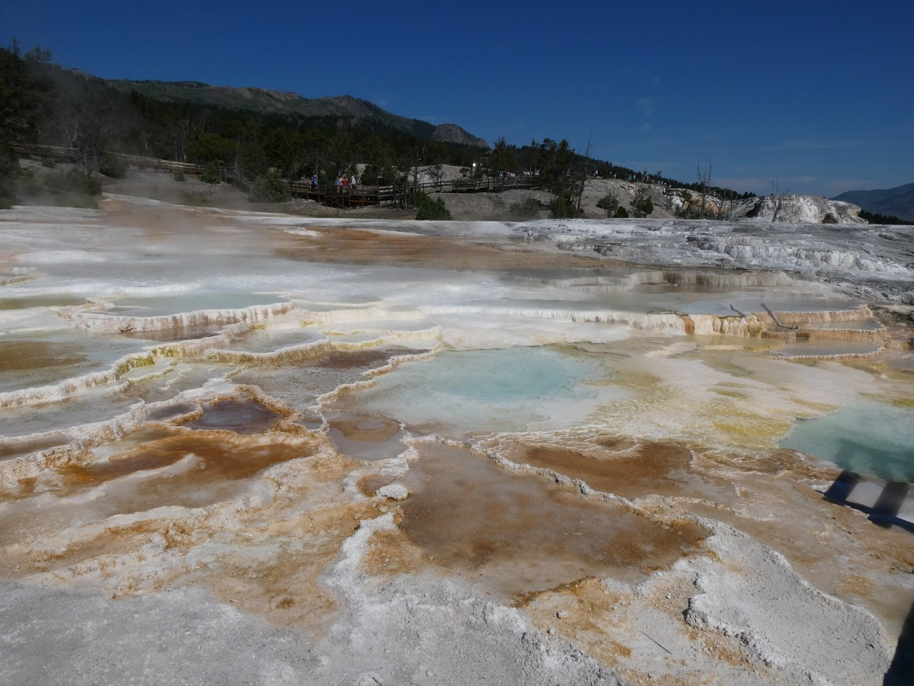

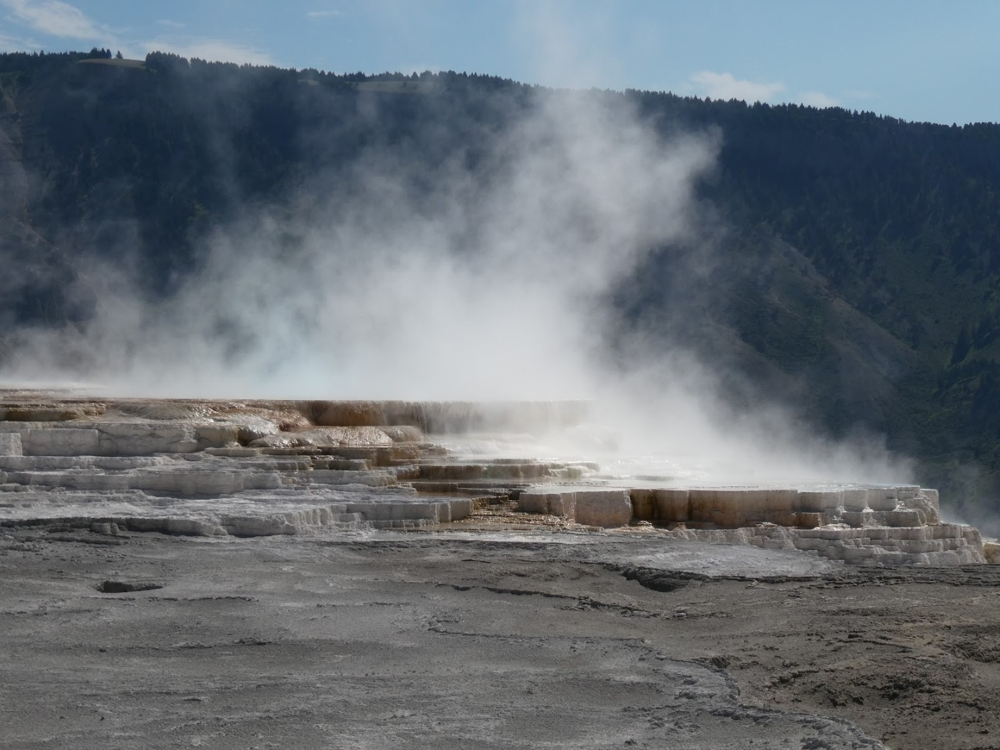

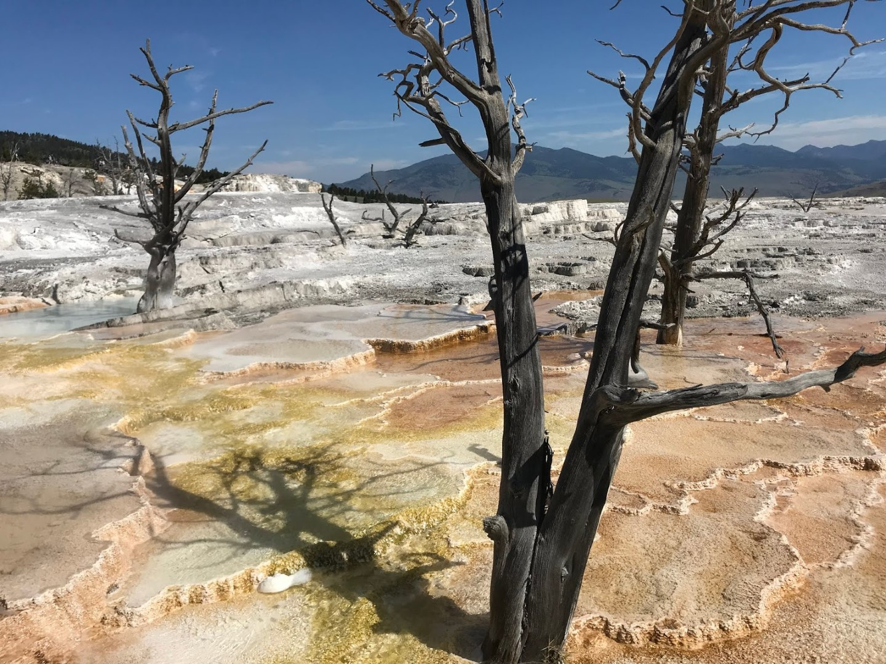

Na de wandeling zijn we naar het visitor center in Mammoth gegaan. Sofie kan daar meedoen aan twee junior ranger programma's. Het eerste programma is een Be Bear Aware praatje. De ranger van dienst legt uit wat de verschillen zijn tussen een zwarte beer en een grizzly, hoe je een beerontmoeting moet voorkomen, en wat je moet doen wanneer een beer vervelend gaat doen tegen je. Klap op de vuurpijl is een demo met berenspray met een nepbeer. Alle deelnemers mogen proberen om zo snel mogelijk de beerspray te pakken, de veiligheidssluiting te verwijderen en de beer een koekje van eigen deeg geven. Erg leuk om een keer te doen!

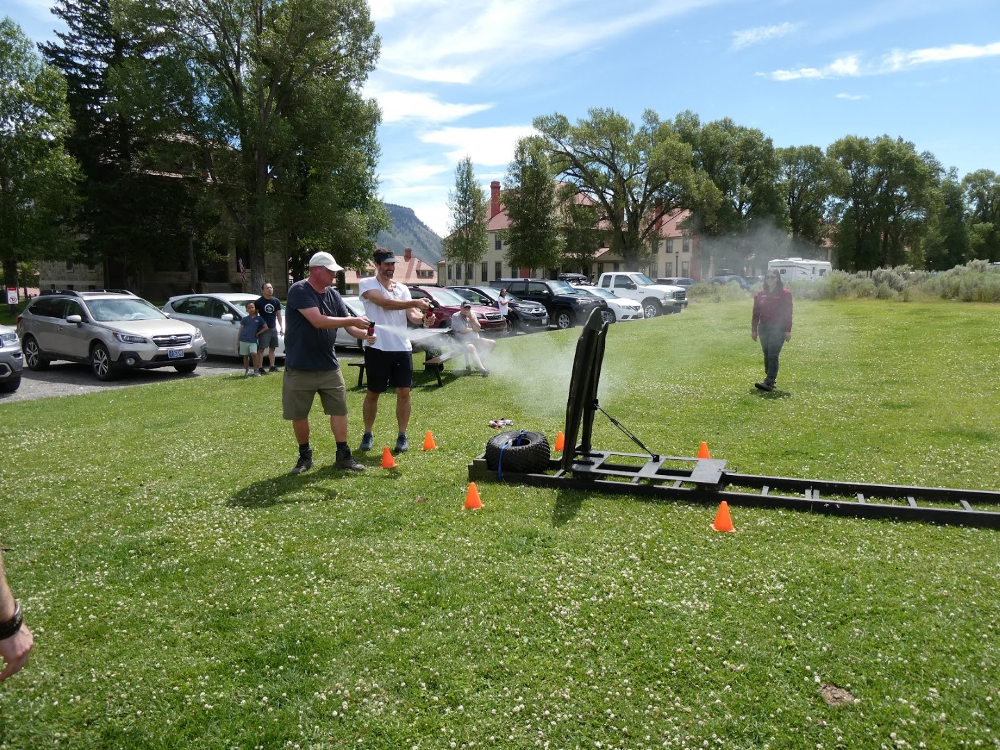

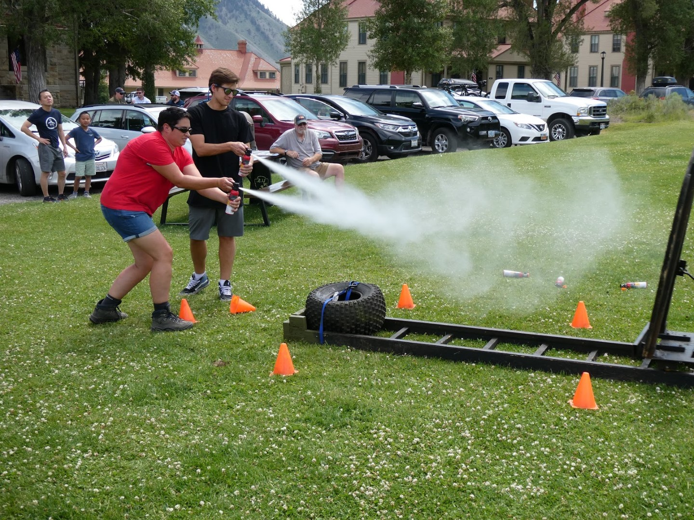

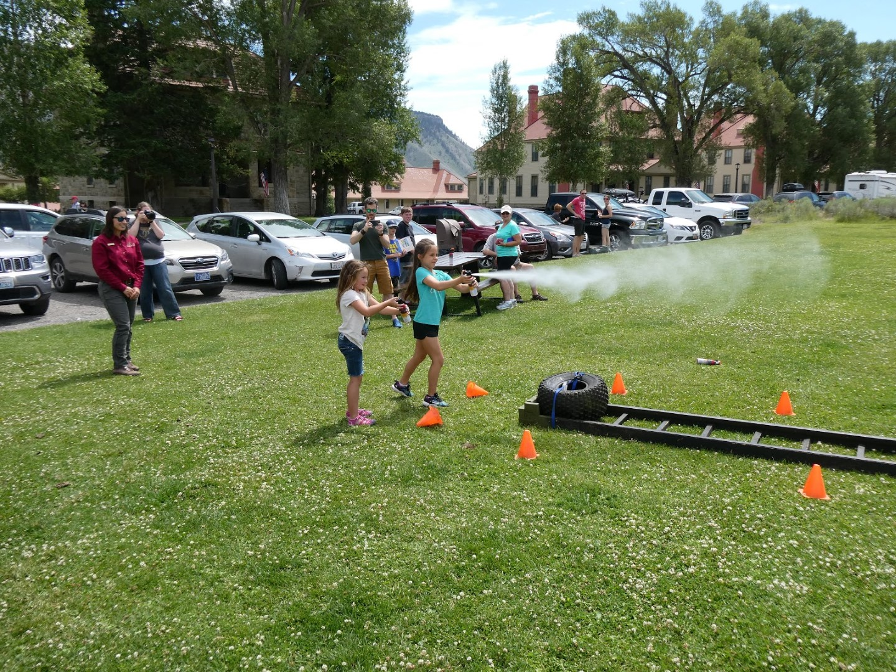

Hierna deed Sofie mee aan de Yellowstone Wildlife Olympics. In een zestal oefeningen kun je je eigen prestaties vergelijken met de dieren. Ze moest bijvoorbeeld zo snel mogelijk 25 meter rennen (6 seconden), een pronghorn kan dat in minder dan 1 seconde. Zo hoog mogelijk springen, en dan kom je er achter dat een bizon tot 1.80 meter hoog kan springen. Het was erg leuk opgezet, en Sofie deed fanatiek mee.

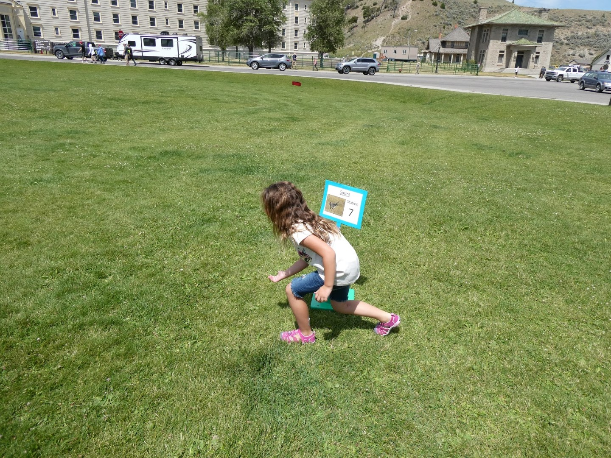

Na al deze sportiviteit hebben we geluncht en zijn we via de noordoostelijke hoek (Tower) naar Canyon Village gereden. Een fantastisch mooie weg, die niet heel erg druk is.

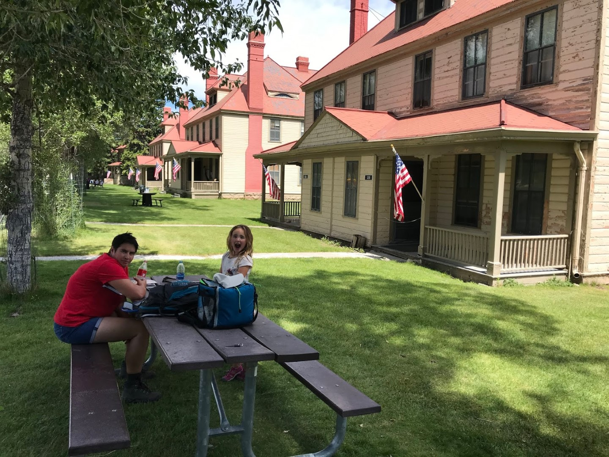

Omdat we vanmorgen al zo vroeg onderweg waren, hebben we heel veel kunnen doen, en waren we mooi op tijd terug in het hotel om nog te kunnen zwemmen voordat we gingen eten.

## 1 opmerking

Gerard 1 augustus 2019 om 12:08

Wat een prachtige minerale terrassen heeft de natuur aangebracht. Erg mooie plaatjes.
De berenspuitoefening is wel erg hilarisch en kost Sofie wel erg veel kracht
