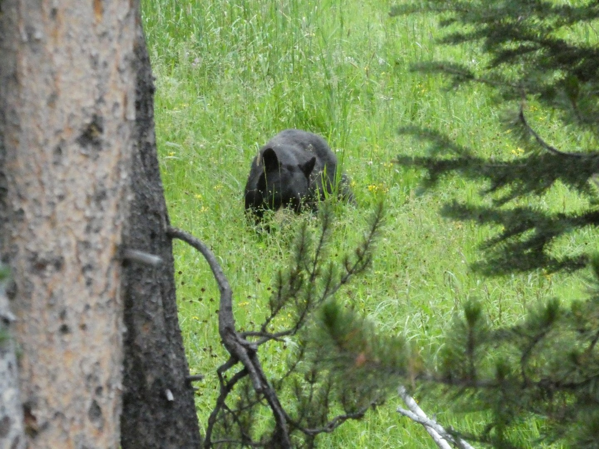
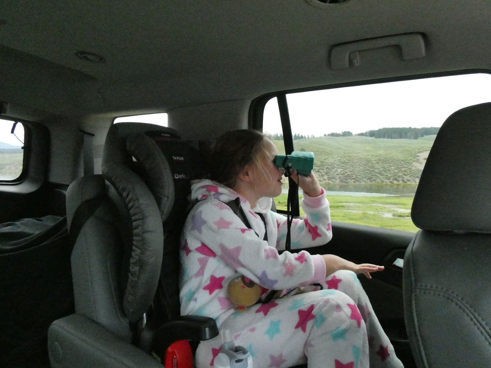
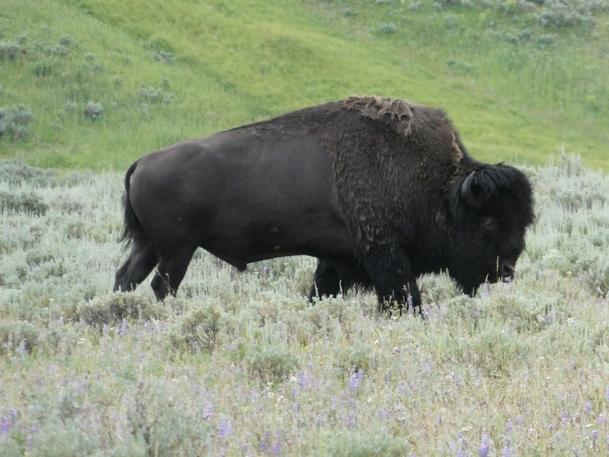
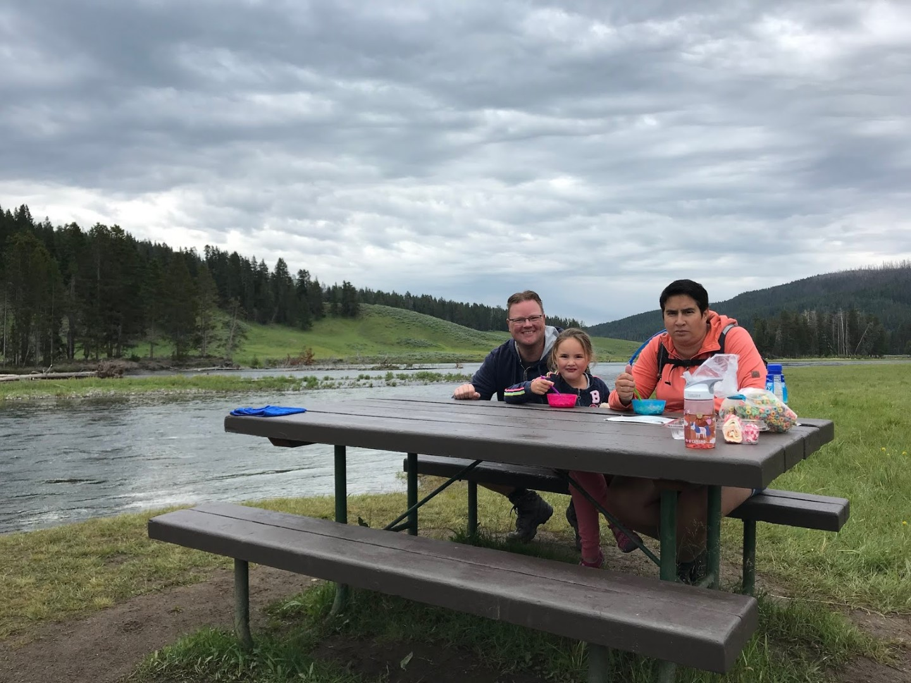
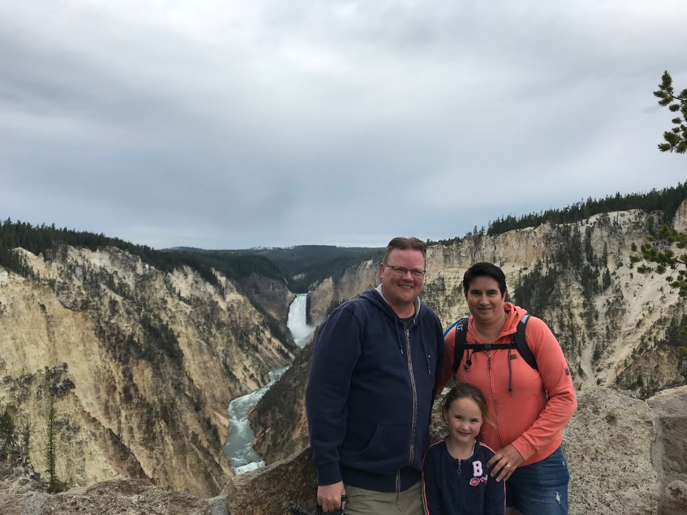
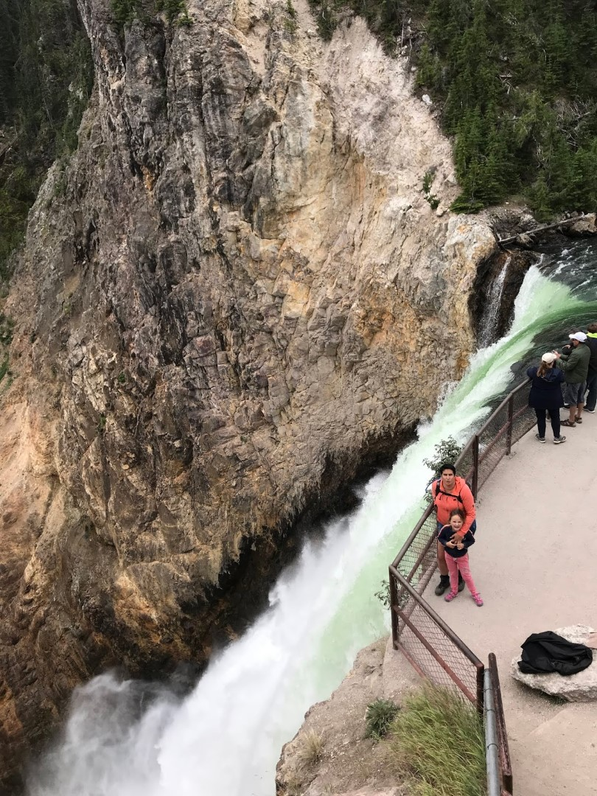
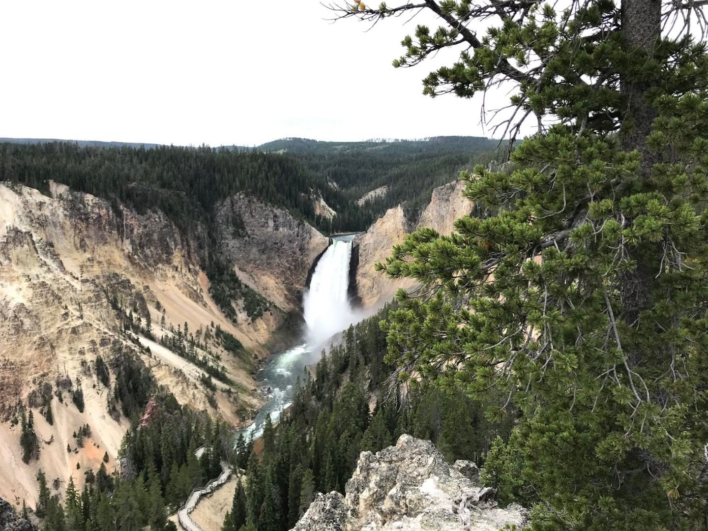
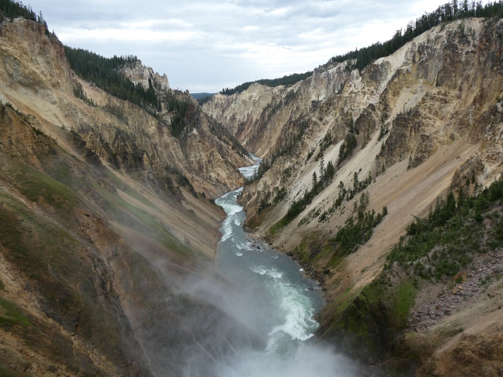
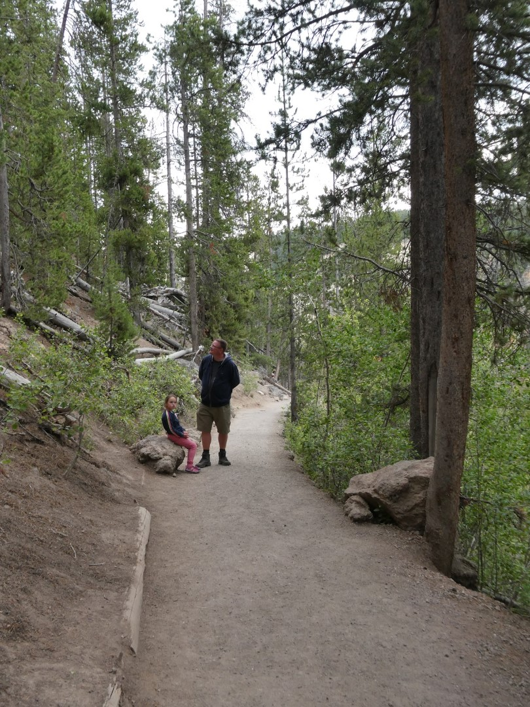

Een wekker die afgaat om kwart voor vijf is niet fijn, zeker niet als die van de buren is (die gisteren al waren vertrokken, maar het alarm niet van de klok af hadden gehaald). Gelukkig stond onze eigen wekker niet veel later, dus het probleem was niet al te groot.

We willen deze ochtend dieren gaan spotten in Hayden Valley aan de oostkant van het park, vandaar dat de wekker zo vroeg staat. Sofie hebben we slapend in de auto weten te krijgen, maar ze werd wakker toen we haar gordel vast deden. We hebben bizons gezien, een beer en de gebruikelijke herten. Het vroege opstaan was dus niet voor niks.

Sofie vond het allemaal maar spannend, en zocht fanatiek mee naar de wilde dieren.

We hebben ontbeten aan de Yellowstone river, op een heel mooi en verlaten plekje.

Nu we toch in het oostelijk deel zijn, zijn we maar meteen bij de Grand Canyon of the Yellowstone gaan kijken. Het uitzicht op de waterval is erg mooi vanaf Artist Point...

...maar nadat we de Brink of Lower Falls trail naar beneden gelopen waren, werd het ronduit spectaculair! Met donderend geweld stort het water zich hier over de rand.

## 1 opmerking

### Gerard 1 augustus 2019 om 12:09

Ik blijf het toch zeggen..... erg mooie omgeving
