Helaas is het al weer de laatste volledige dag in Yellowstone. We hebben weer de wekker vroeg gezet, om op tijd bij Norris Geyser Basin te gaan kijken. De rit begon erg mistig, maar dat leverde wel erg mooie plaatjes op.

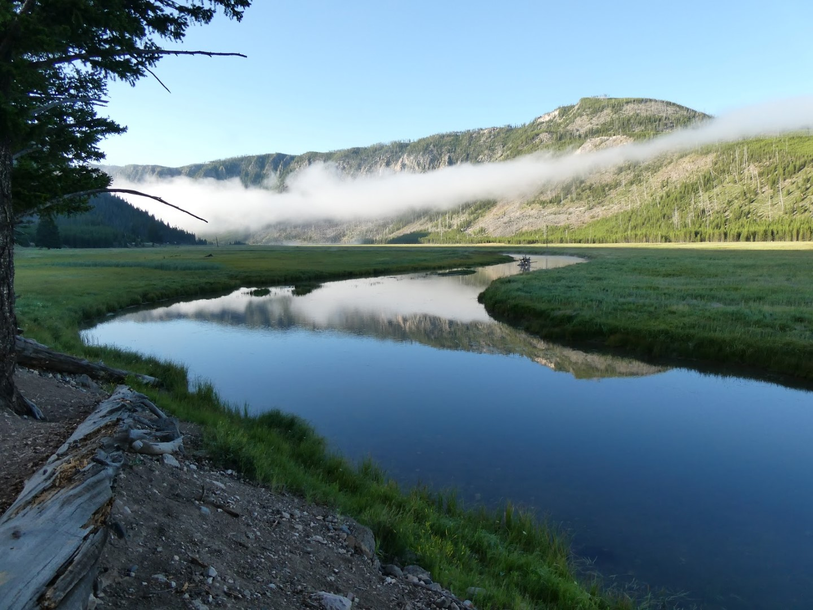

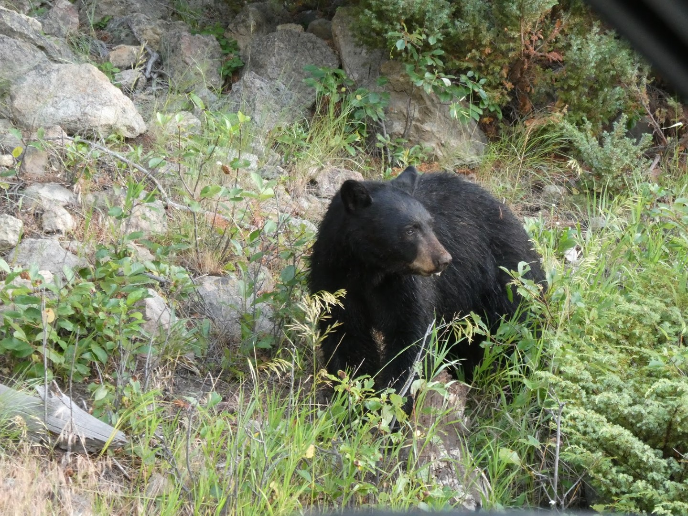

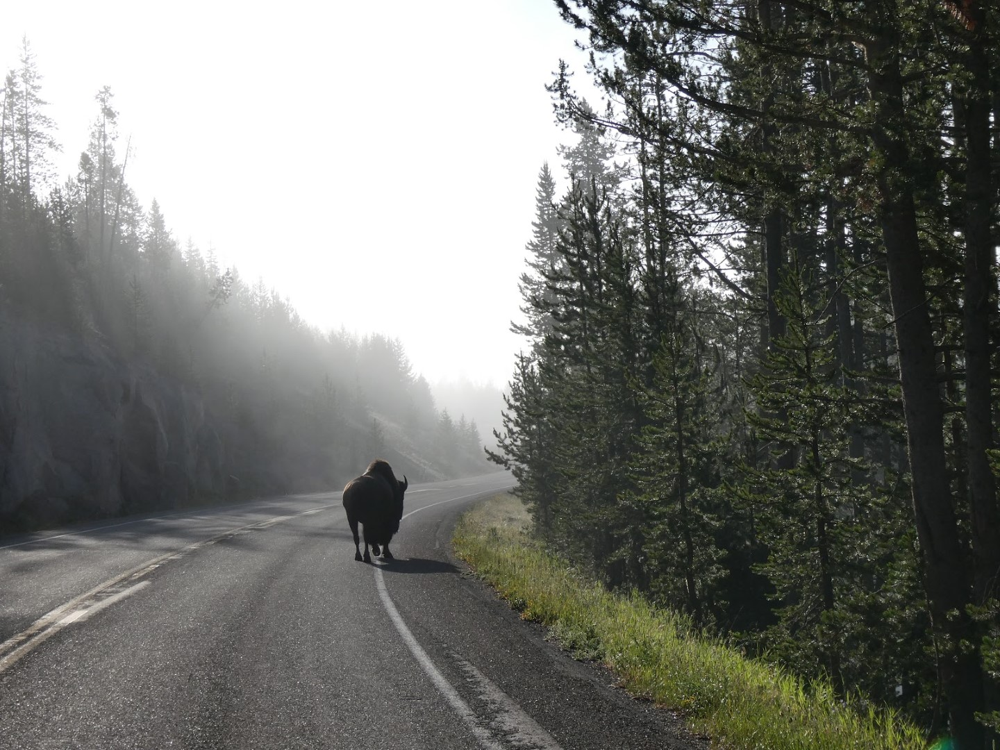

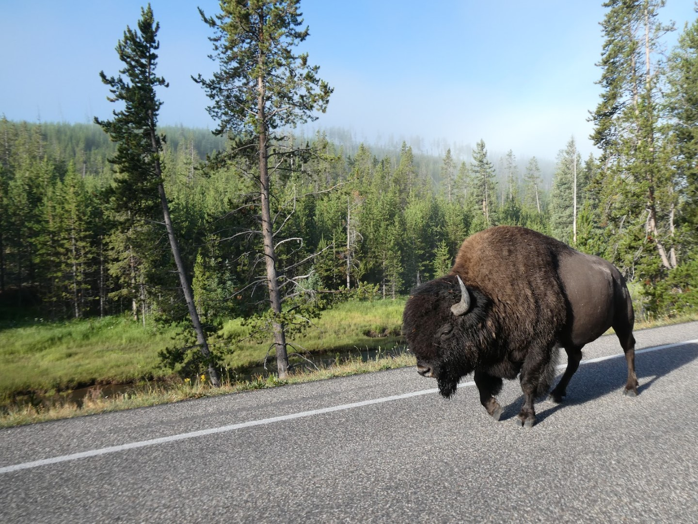

Norris zelf lag er deze nog frisse ochtend mooi bij.

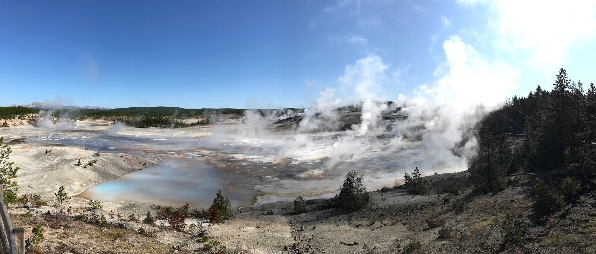

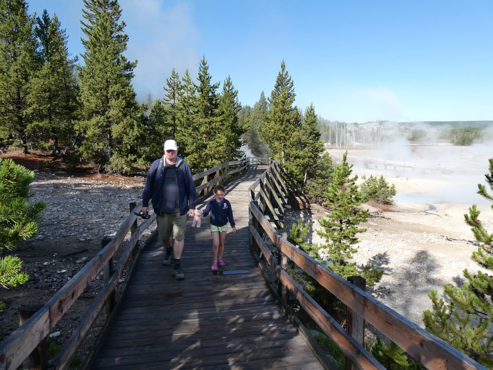

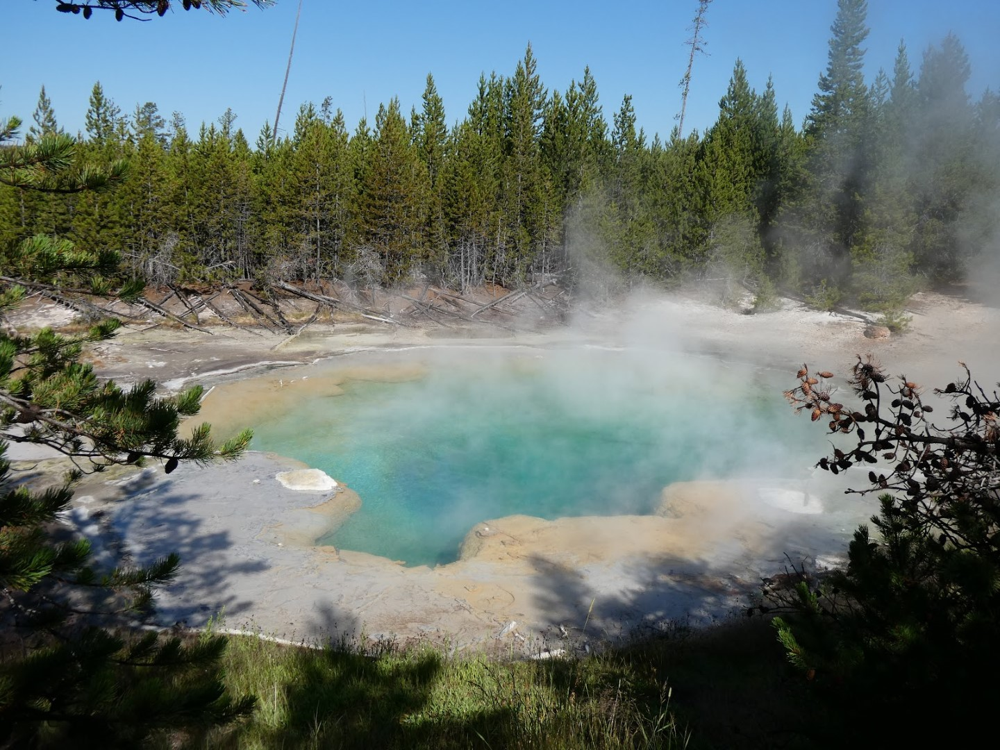

Bij Norris ligt ook de Steamboat Geyser, de grootste actieve geiser ter wereld met erupties tot 90 meter hoog.

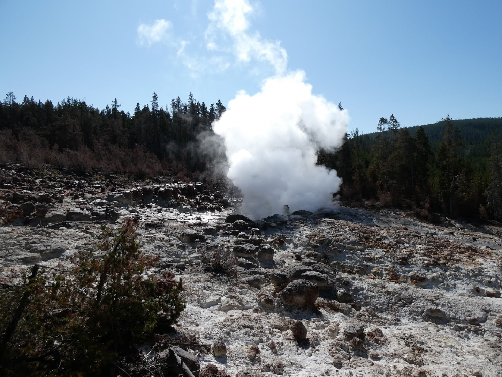

Onderweg naar Lake District in het oosten van het park, zijn we nog even gestopt bij de Virginia Falls, waar Sofie haar junior ranger boekje heeft afgemaakt.

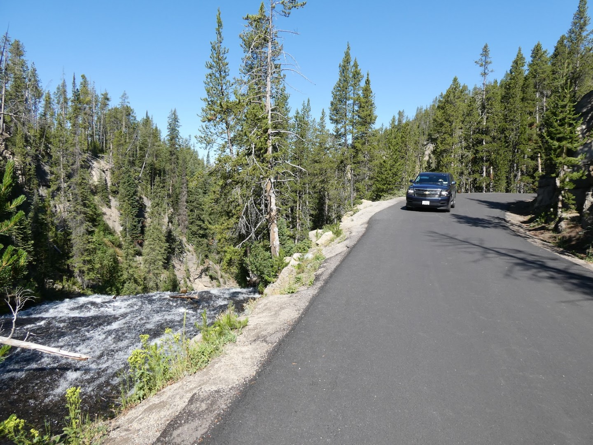

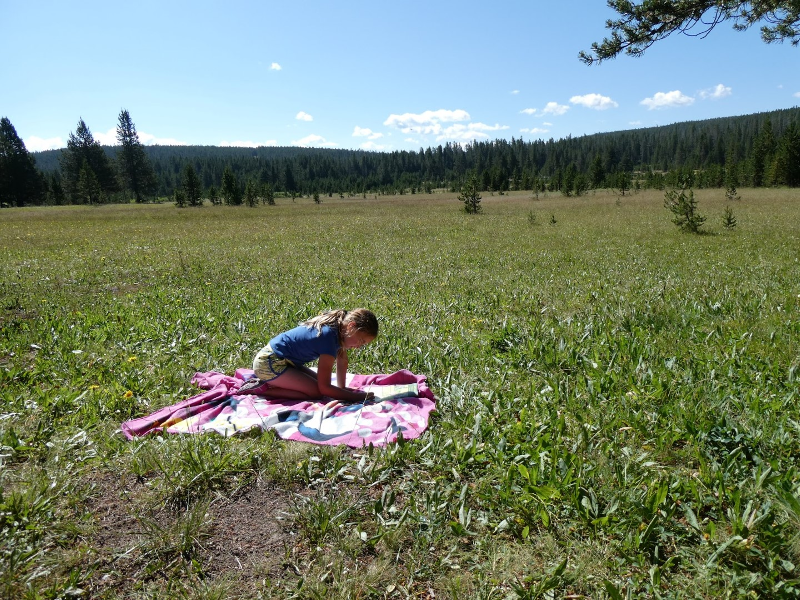

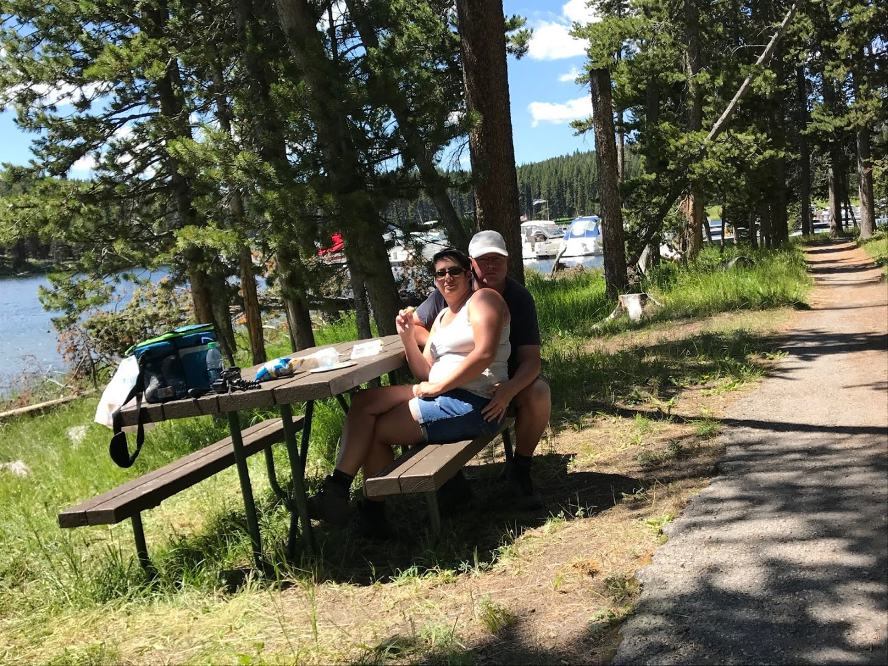

Bij West Thumb wilden we nog de laatste geisers bekijken, maar op de parkeerplaats had een of andere slimmerik (per ongeluk) z'n bearspray gespoten, dus de mensen die toevallig in de buurt waren kuchten en proesten het uit. Wij kregen gelukkig slechts een vlaagje mee vanaf een meter of 30, maar ook wij moesten hoesten en hadden een brandend gevoel in de keel. We besloten om deze geisers links te laten liggen en zijn naar het visitor center gegaan om de junior ranger badge op te halen.

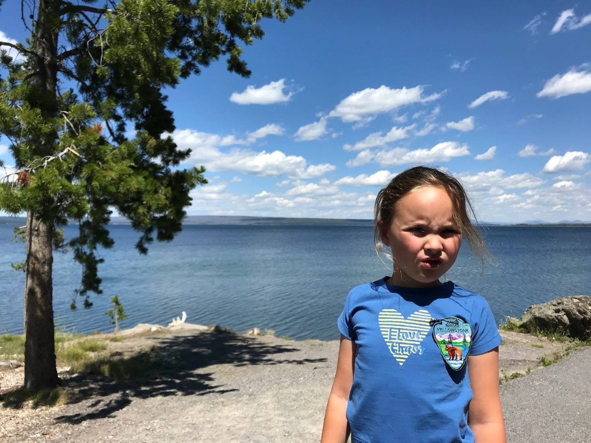

Na deze lange dag zijn we doorgereden naar het zuiden, dwars door Grand Teton National Park, op naar ons volgende hotel 49'er Inn & Suites, in Jackson, Wyoming. Hier verblijven we twee nachten om de Grand Tetons te bezoeken.

## 1 opmerking

### Gerard 1 augustus 2019 om 12:19

De kolossale vakantievriendjes zijn ook al vroeg op pad en de mooie plaatjes is een understatement. Leuk om later terug te zien, ook voor Sofie.
