De eerste dag in Grand Teton National Park begint een beetje grijs. Er is in de loop van de ochtend regen voorspeld, maar dat houdt ons natuurlijk niet tegen. Kortom, de regenjassen in de rugzak, koeltas gevuld met drank en de lunch, en op naar de Tahoe voor het ritje van ongeveer 20 minuten naar de ingang van het park. Op het programma staat de wandeling naar Inspiration Point, die een mooi uitzicht biedt over Jenny Lake. We besluiten met de boot naar de overkant van het meer te varen om daar de wandeling aan te vangen.

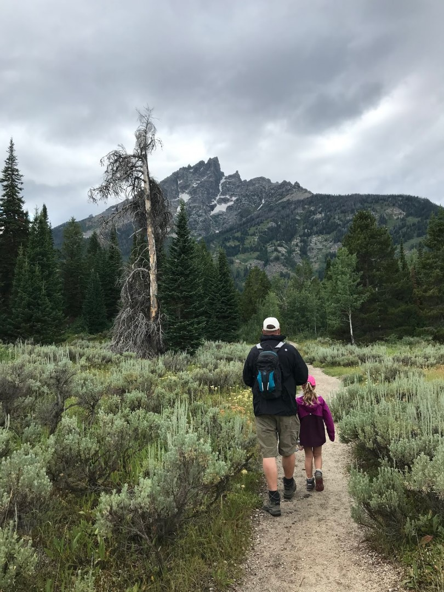

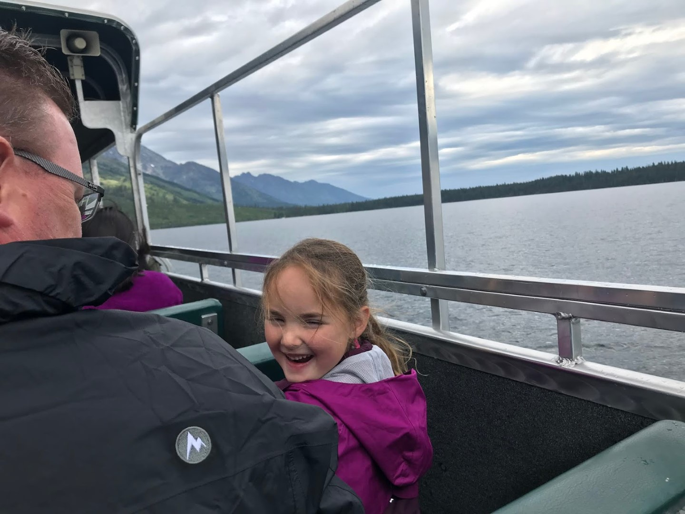

De kapitein van dienst vertelde vlak voor we aanmeerden trouwens dat in dit gebied nog nooit mensen zijn aangevallen door beren of ander wild. Wel heeft een mevrouw een paar jaar geleden haar rugzak achter haar neergelegd om een foto te maken. Terwijl ze door het zoekertje stond te kijken rende een beer achter haar door om haar rugzak af te pakken. Ze schijnt de haren van de beer langs haar benen gevoeld te hebben. Of het vissers Latijn is of echt gebeurd... we zullen het nooit weten.

Vanuit de aanlegplaats is het een kleine kilometer wandelen langs een snelstromend riviertje, de Cascade Creek, naar de Hidden Falls (zoals ik al eerder zei, ieder park heeft recht op z'n eigen Hidden Falls, of Hidden Canyon). Het is een mooi wandelingetje, maar halverwege begint het te druppelen, en al snel komt de regen behoorlijk naar beneden. We moeten de waterval in de stromende regen op de gevoelige (digitale) plaat vastleggen. Onder een boom eten we samen een appeltje, en toen werd het gelukkig al weer droog.

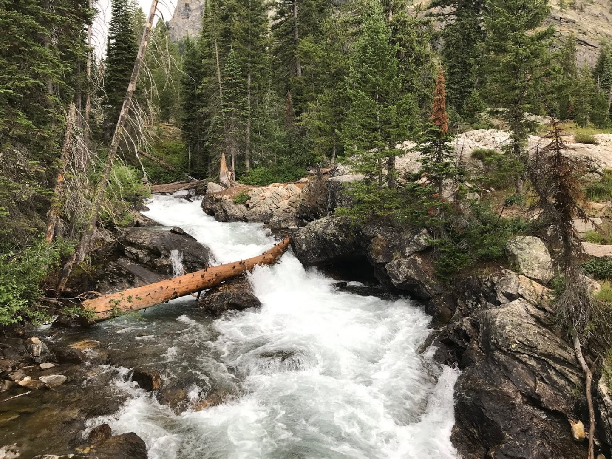

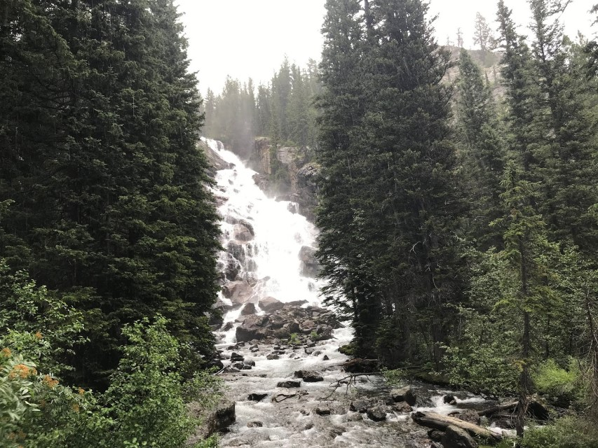

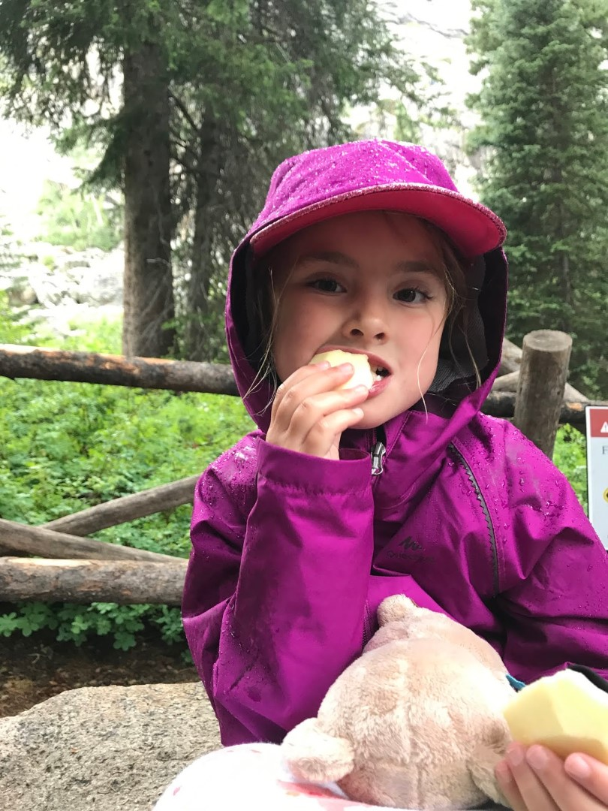

Nog een kilometer verder is het eindpunt van onze trip, Inspiration Point.

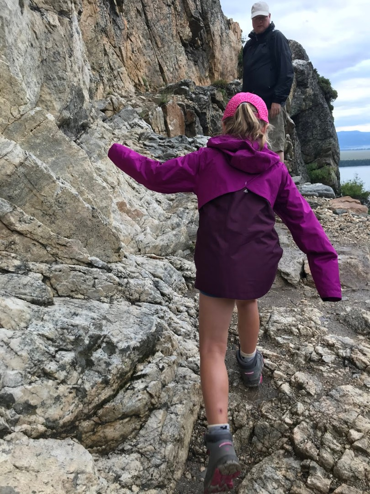

Omdat het geregend heeft, zijn de stenen op het pad spekglad geworden, dus het was uitkijken geblazen, want de afgrond is behoorlijk diep. Het uitzicht boven is inderdaad wonderschoon, dus de (beperkte) inspanning was niet voor niets.

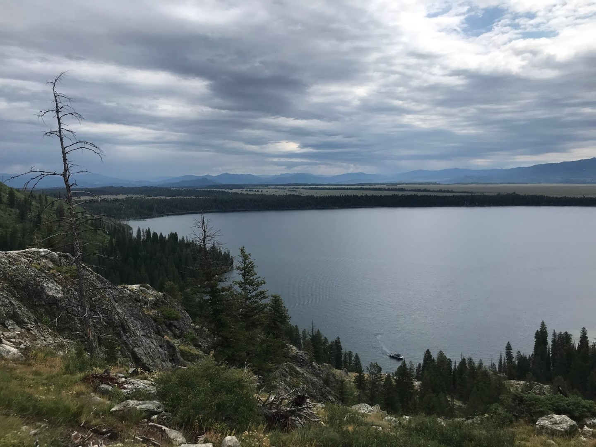

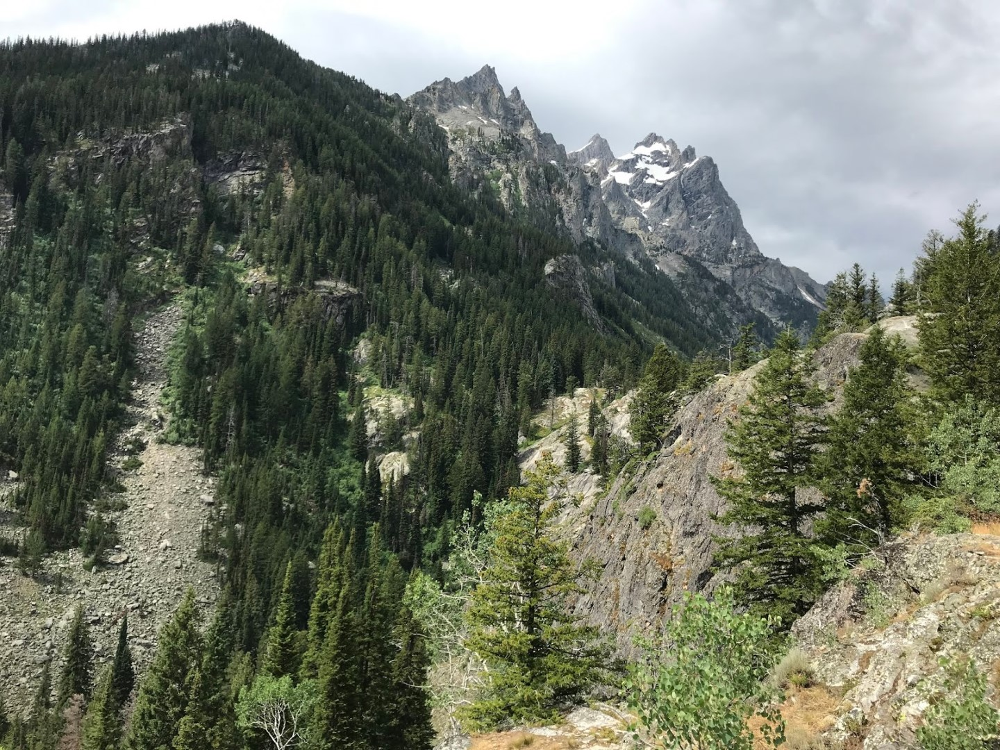

Het werd steeds zonniger, dus op de terugweg konden we nog wat mooie plaatjes schieten.

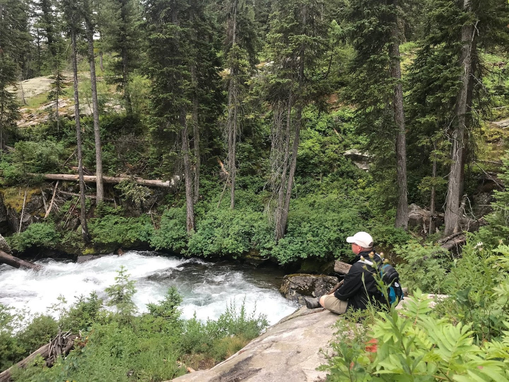

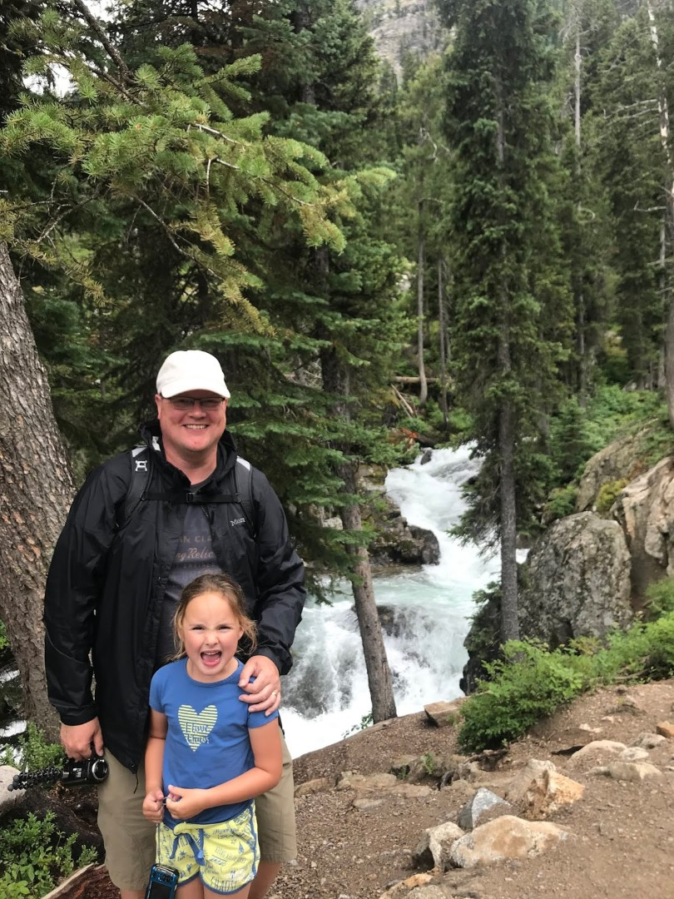

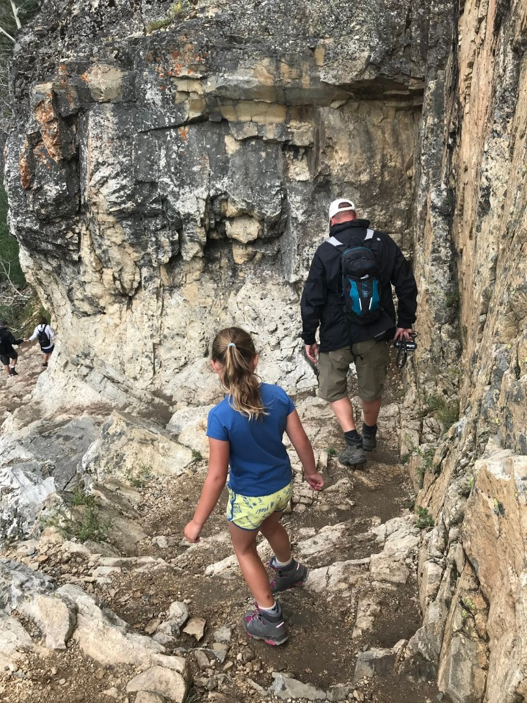

We hadden geluk, we konden op de eerste de beste boot weer terug naar het beginpunt en onze auto. We hebben geluncht bij op de picnic area bij String Lake.

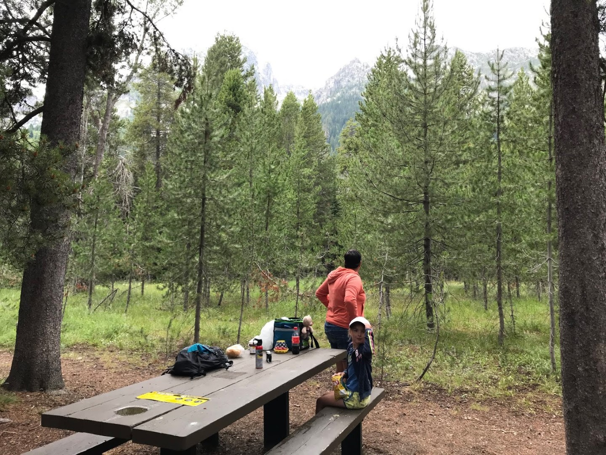

Om de dag in stijl af te ronden, hebben we de restanten bezocht van de boerderijen van de eerste Mormonen die hier ooit gewoond hebben, Mormon Row.

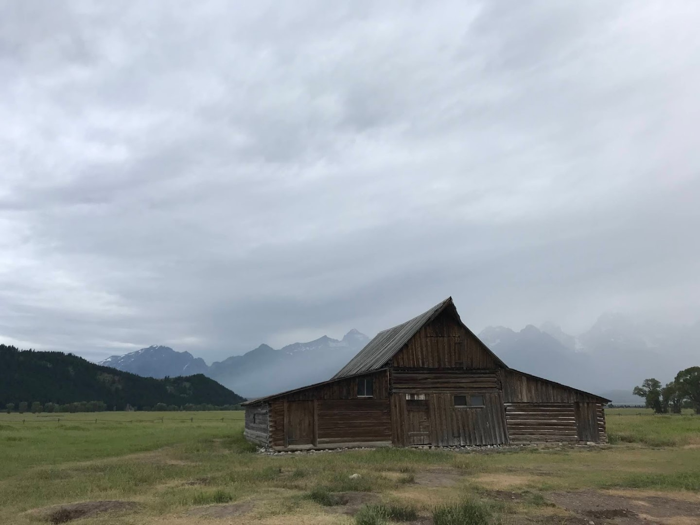

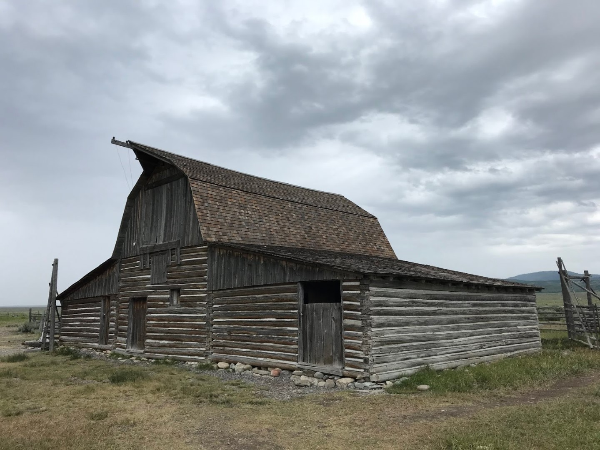

's Avonds hebben we boven verwachting lekker gegeten bij Bubba's Bar-B-Que (spareribs!)

## 1 opmerking

### Gerard 3 augustus 2019 om 10:56

En ook dit park heeft een prachtige schoonheid te bieden en Sofie wordt ook al een echte klimgeit.
