De weersvoorspellingen voor vandaag zijn prima, mooi zonnetje en lekker warm. Aangezien we toch pas na 3 uur kunnen inchecken in ons laatste hotel in Salt Lake City, besluiten we nog een keer naar Grand Teton NP te gaan. De eerste stop in de Cunningham cabin.

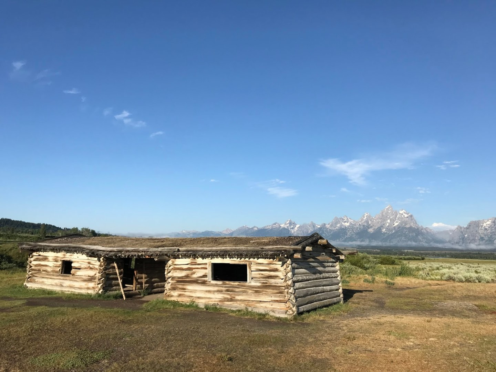

De Snake River die door het park meandert, ligt er deze ochtend ook erg mooi bij.

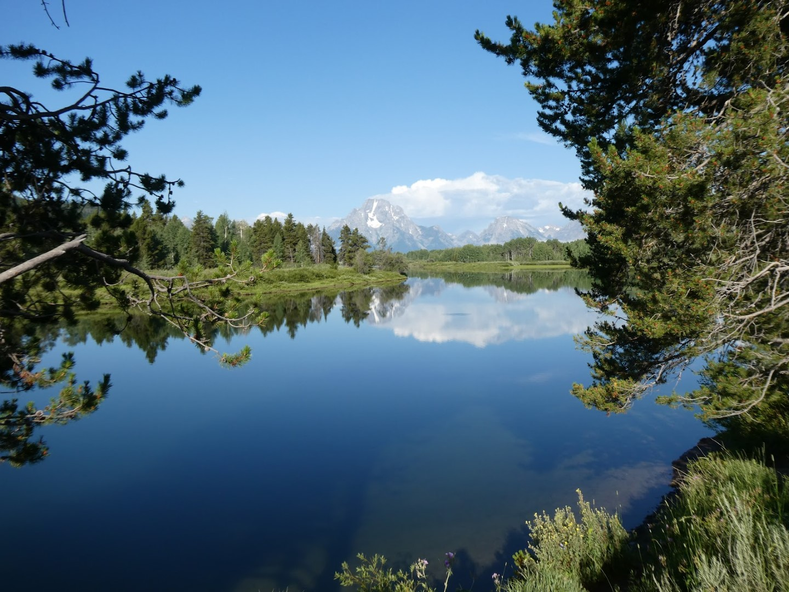

Bij de dam van Jackson Lake hebben we ontbeten en zijn er de nodige stenen van de kant het water ingegooid.

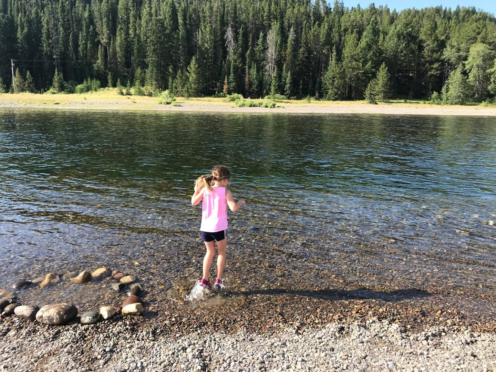

Na het uitgebreide ontbijt was Signal Mountain aan de beurt. Op de top (2355 meter) hebben we bijna een 360 graden view over de omgeving. Het is fantastisch mooi.

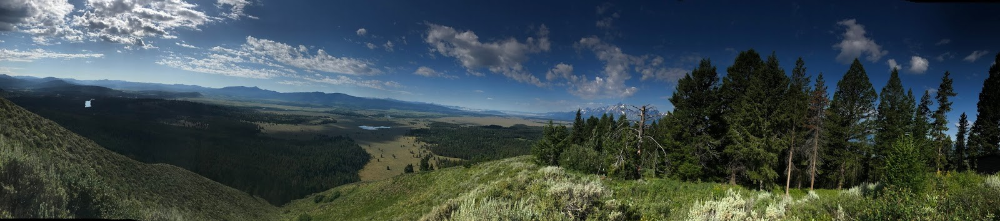

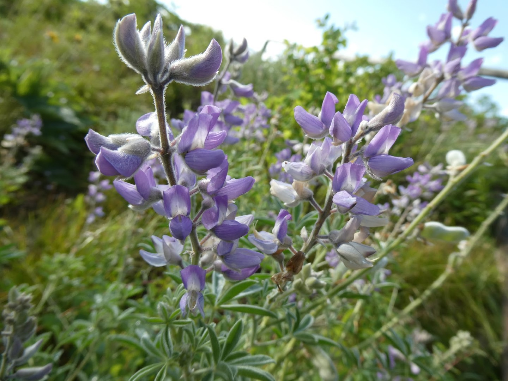

Op de top wemelt het van de satelietschotels en gsm-masten, dus hebben we maar meteen een telefoontje naar de opa's en oma's gepleegd (dat verklaart wellicht ook de naam van berg?).

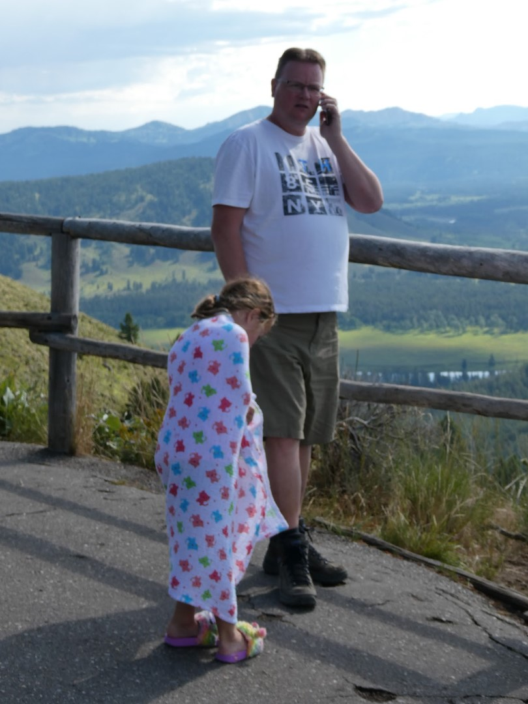

Aan de voet van de Grand Tetons lag Jenny Lake heel fraai de wolken en bergen te weerspiegelen. Met de zon aan oogt het allemaal stukken vriendelijker en groener.

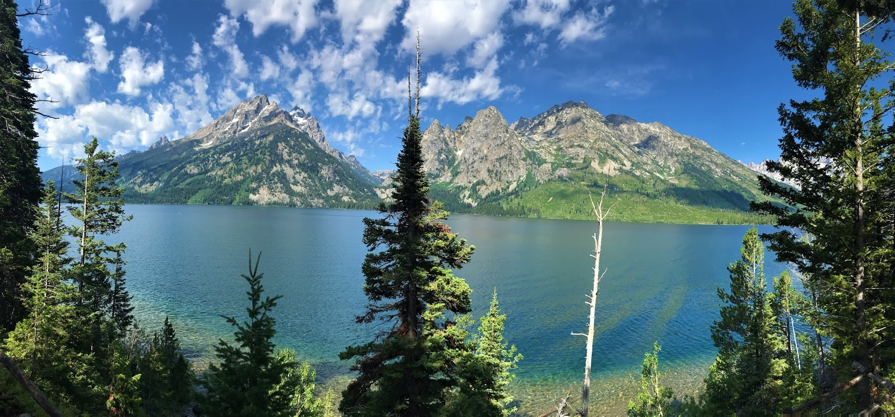

Hierna was het tijd geworden om de welverdiende badge van Sofie op te halen.

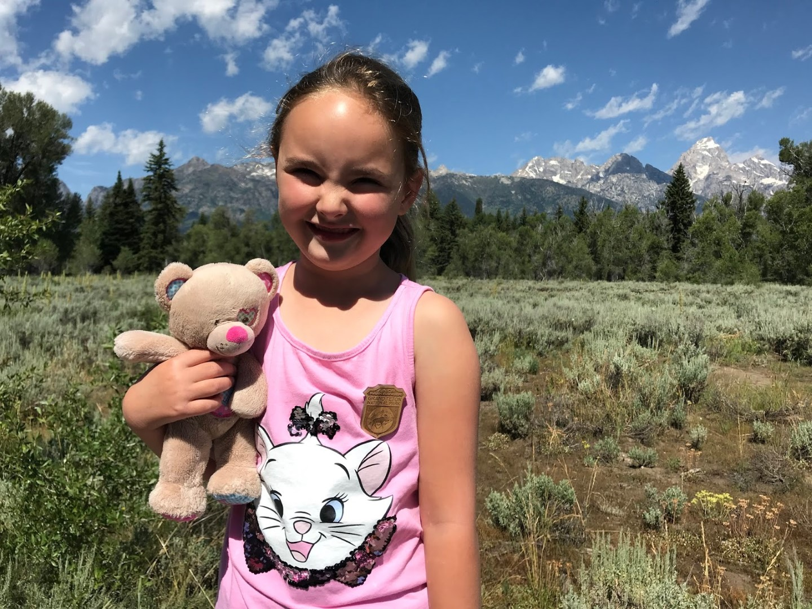

Na een calorie-rijke lunch in Jackson zijn we via de waanzinnig mooie Teton Pass en US-22 en US-31 bij Idaho Falls de Interstate 15 op te gaan richting Utah.

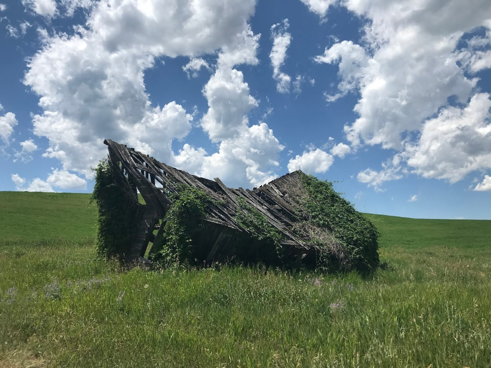

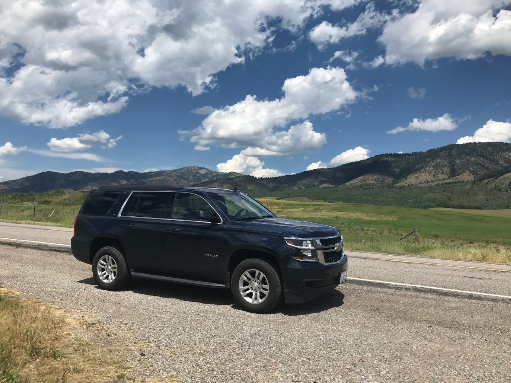

Het is een heel eind rijden naar Salt Lake City (4.5 uur), dus onderweg stoppen we bij Blackfoot, Wyoming om in het Jensen Grove Park even de benen te strekken, te snacken en te zwemmen in het meer.

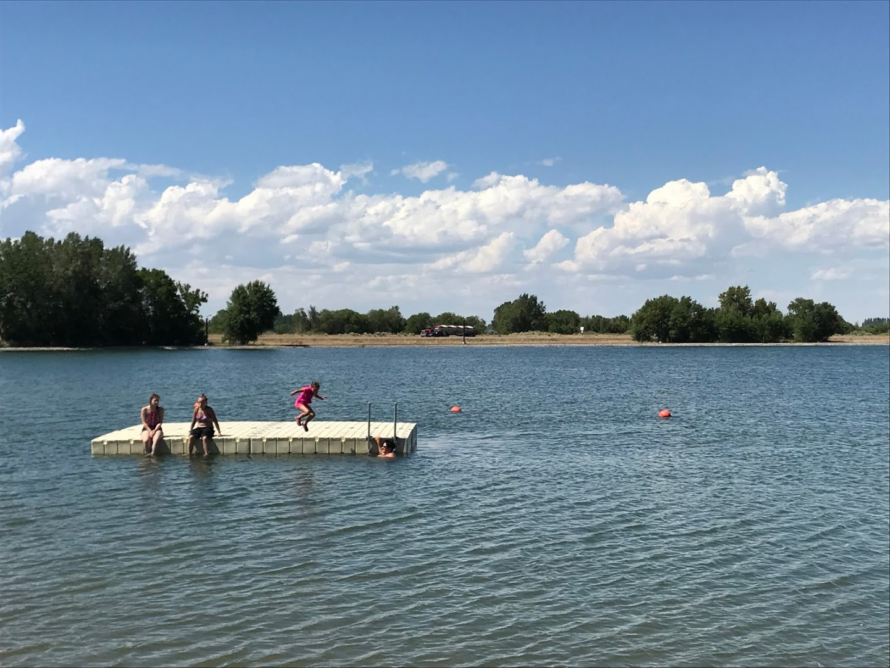

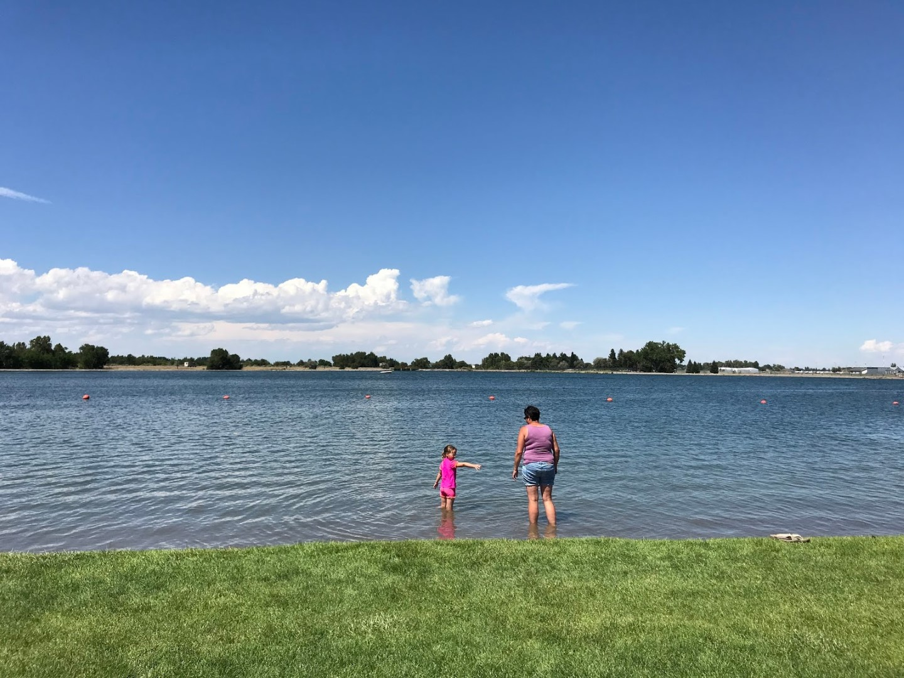

De laatste vier nachten verblijven we in Salt Lake City bij de Homewood Suites in downtown. Onze kamer kijkt uit op het zwembad, en dus hebben we direct na het eten de zwembroek aangetrokken en hebben we tot het donker werd gezwommen.
