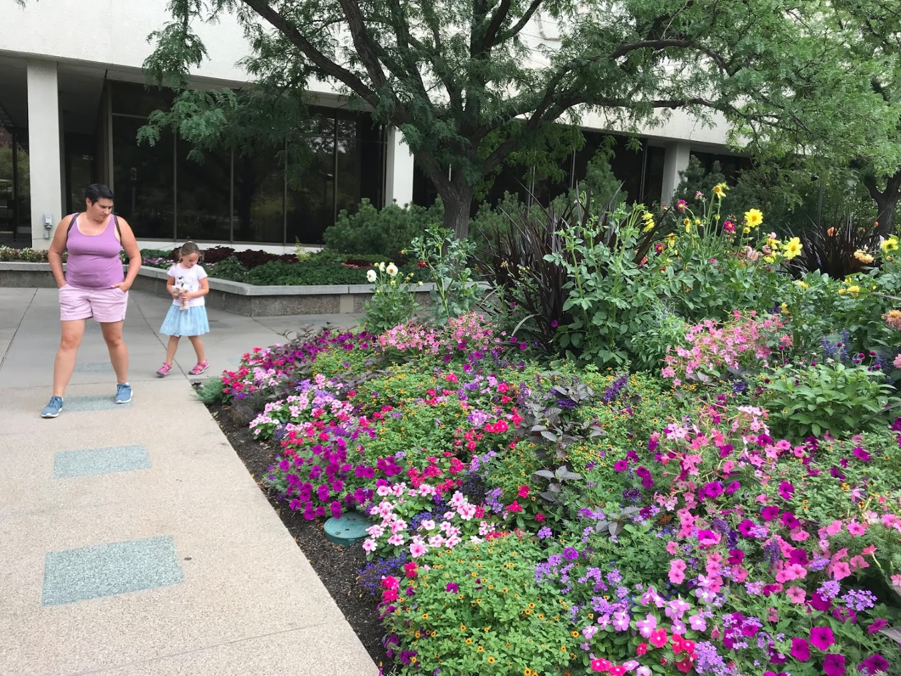
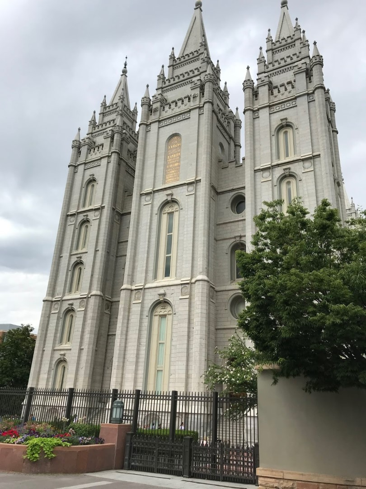
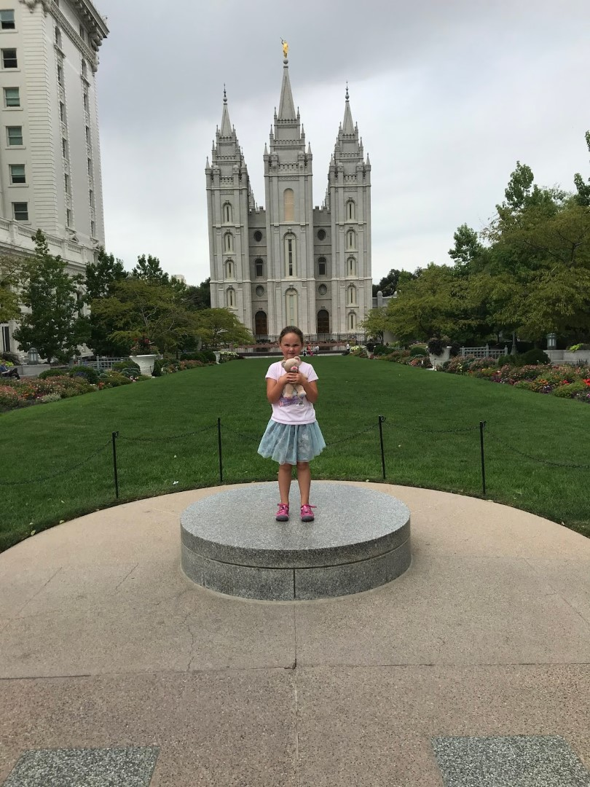

Temple Square is zeg maar het Vaticaanstad voor de Mormonen. Het bestaat uit een aantal religieuze en administratieve gebouwen, een zeer mooie tuin en een bezoekerscentrum. Voor het grootste deel is alles vrij toegankelijk, op 10 euro parkeerkosten en de tempel zelf na. De tempel is alleen toegankelijk voor 18 jarige getrouwe leden.

Het bezoekerscentrum vonden we erg mooi, er werd uitgelegd hoe de tempel gebouwd is (voornamelijk met de hand) en de verschillende gebruikte gereedschappen waren te bezichtigen. Ook was er een mooi opengewerkt schaalmodel van de tempel, zodat je toch een indruk krijgt van hoe het er van binnen uitziet. Eerlijk gezegd: we hebben wel eens mooiere kerken gezien.

De Mormonen (of eigenlijk de Kerk van Jezus Christus van de Heiligen der Laatste Dagen) heeft een wereldwijde reputatie op het gebied van genealogisch onderzoek. Dit onderzoek wordt voornamelijk verricht om religieuze redenen: de aldus opgespoorde voorouders kunnen postuum worden gedoopt. In de Family History Library staat een leger aan pc's te zoemen waarop je jezelf of anderen kunt opzoeken. Best leuk, hoewel dat tegenwoordig prima vanaf je eigen computer kan in Nederland.

Het hele complex biedt voor ongelovigen als ons verder niet al te veel spannends, dus voor de lunch waren we weer in het hotel. De rest van de middag hebben we geluierd aan het zwembad.
