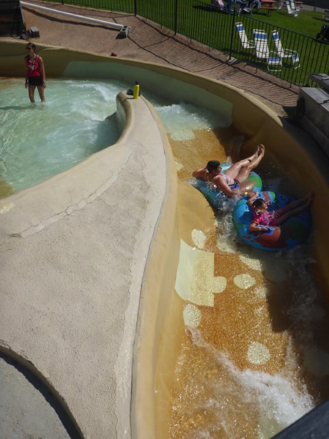
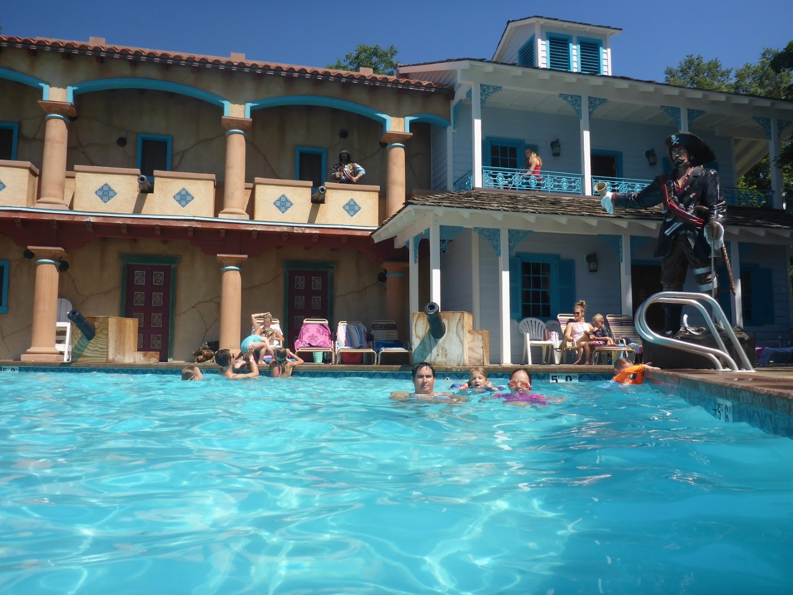
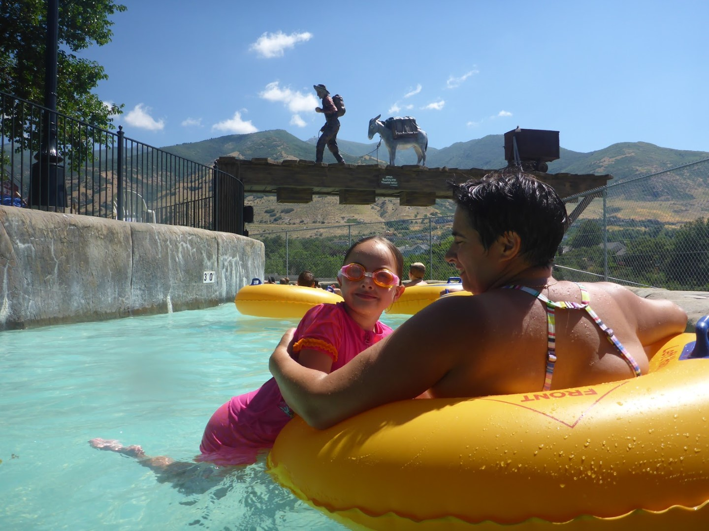
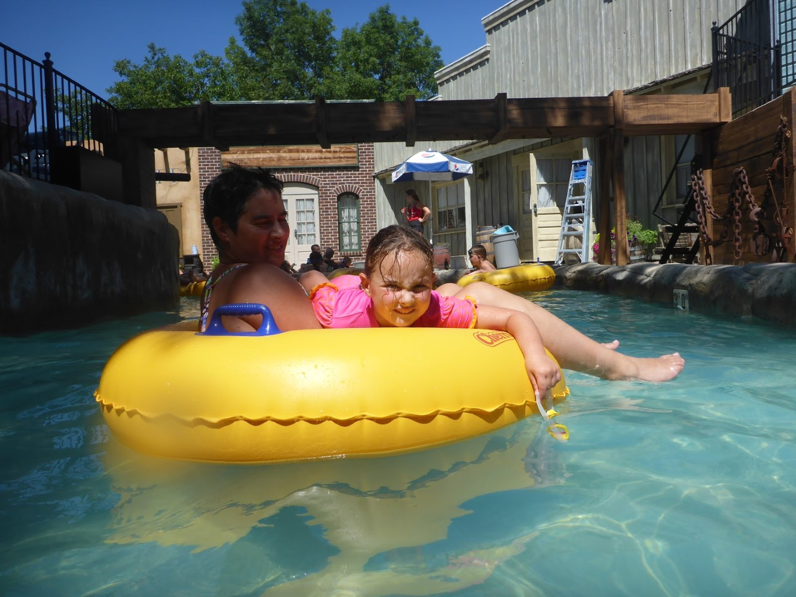
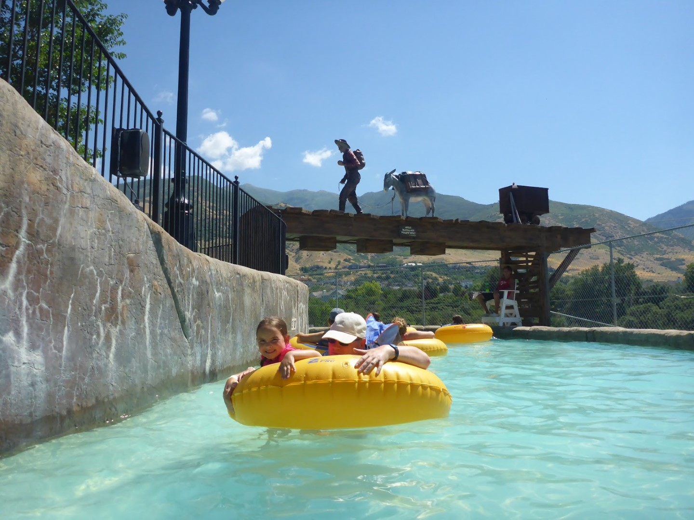
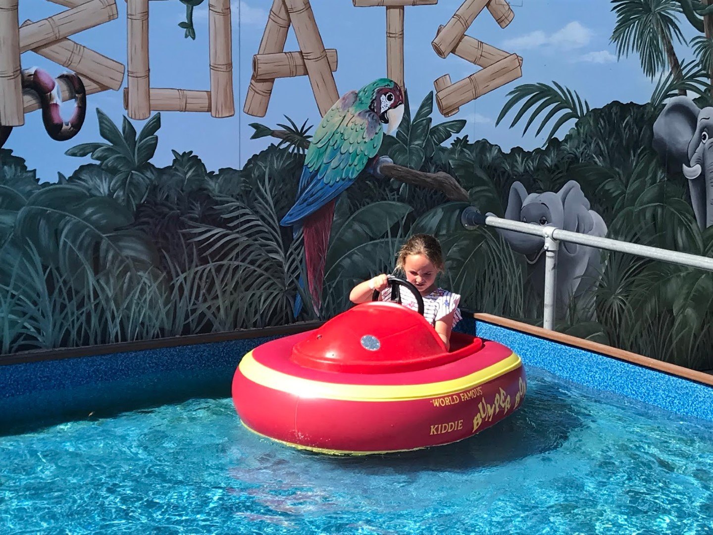
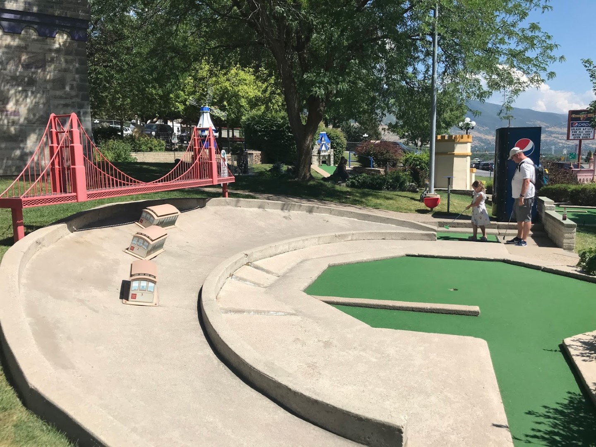
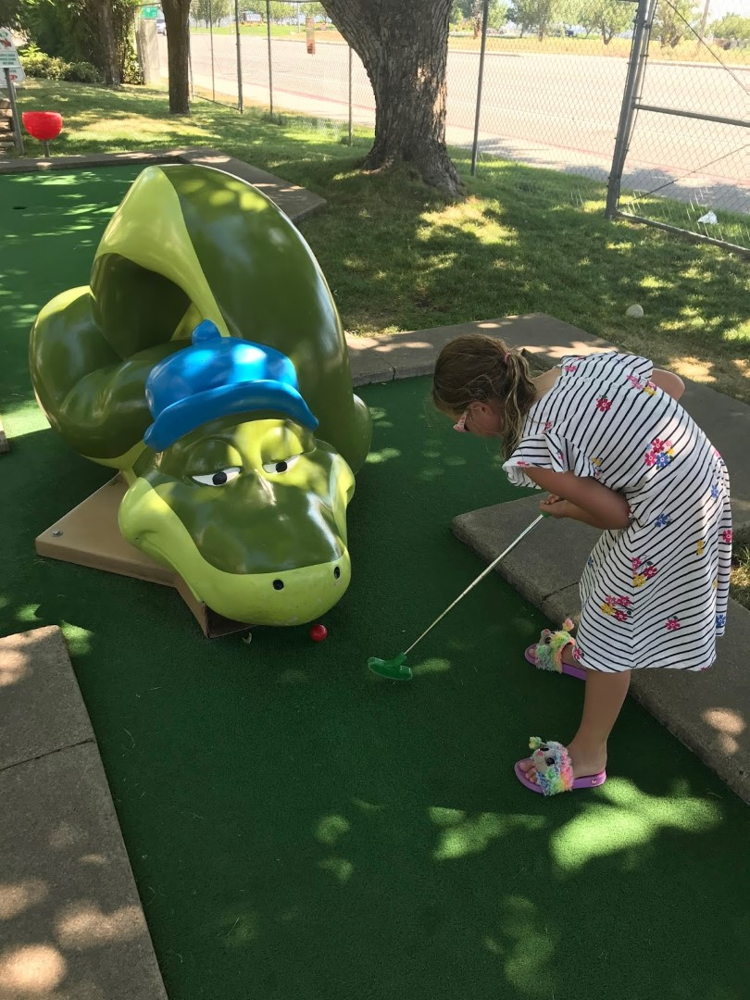

Op een minuut of twintig rijden van ons hotel ligt Cherry Hill Water Park. Aangezien het deze laatste dagen erg warm is, gaan we dat park maar eens met een bezoekje vereren. Er is van alles te doen voor jong en oud. De dames gaan als eerste met een band van de wildwaterbaan.

Het grote zwembad heeft een piraten thema. De kanonnen spuiten soms water!

De lazy river was fantastisch! Heel mooi gemaakt, en er stond eindelijk eens een fatsoenlijke stroming.

Ook was er een trampoline, een doolhof en waterscooters.

Na de middag hebben we ons weer aangekleed en hebben we gaan mini-golven.

's Avonds hebben we gegeten bij de Cheesecake Factory in downtown.
