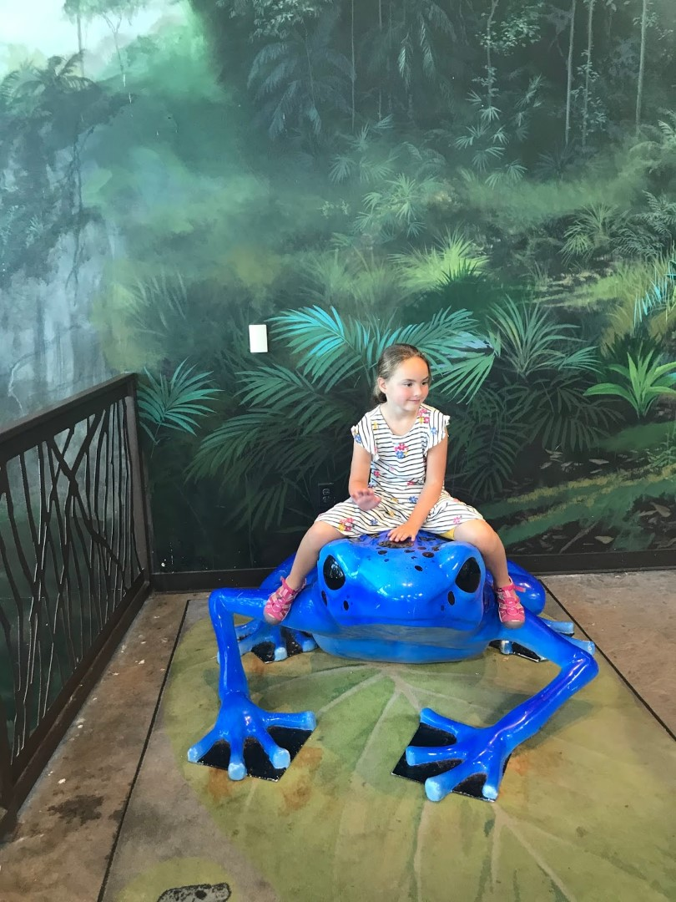
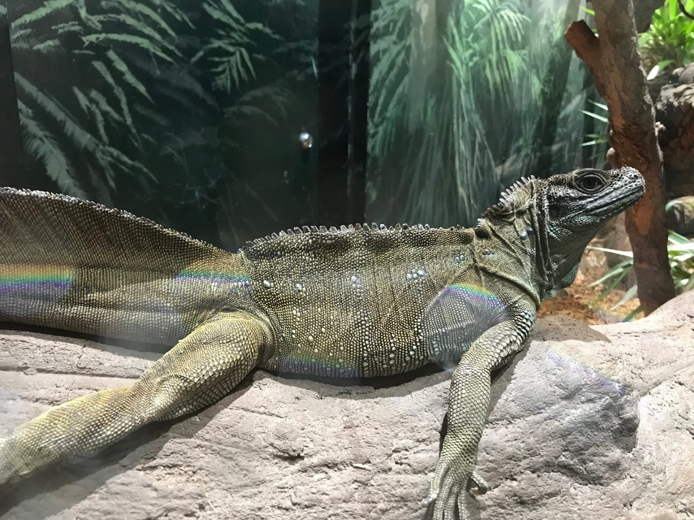
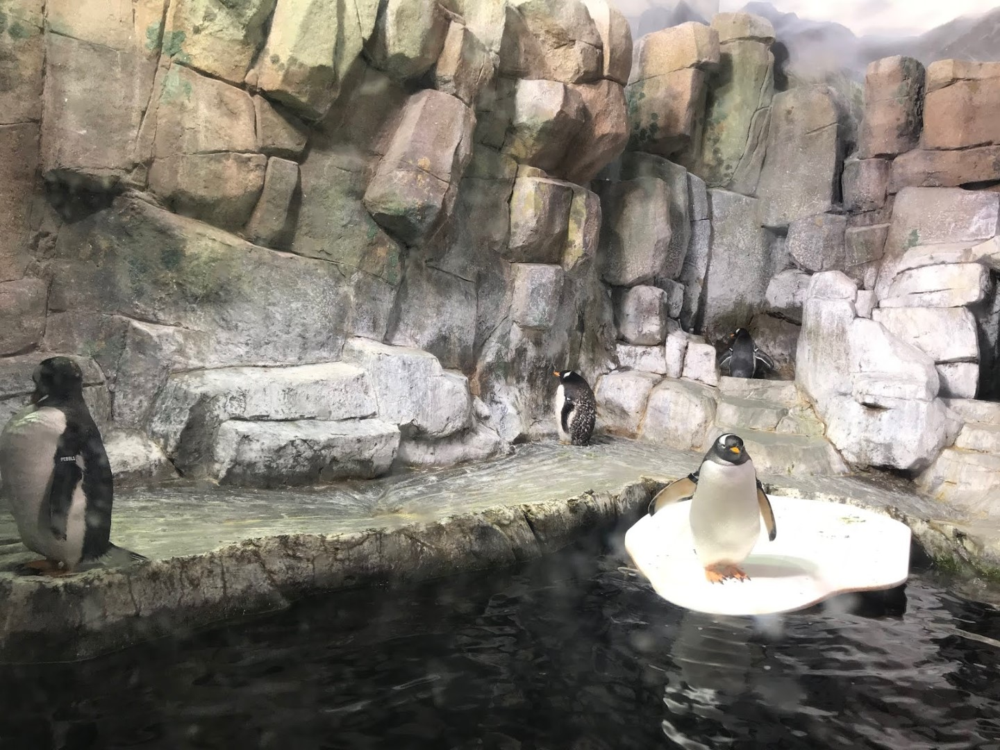
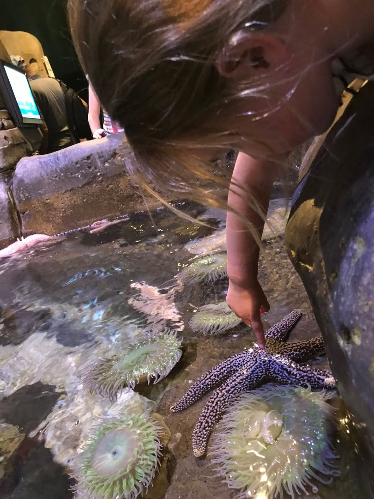
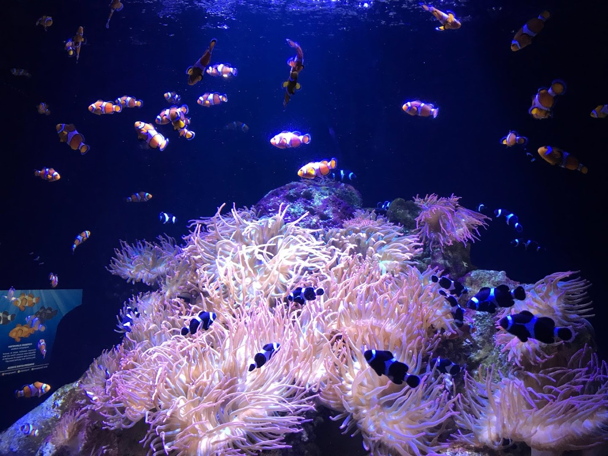
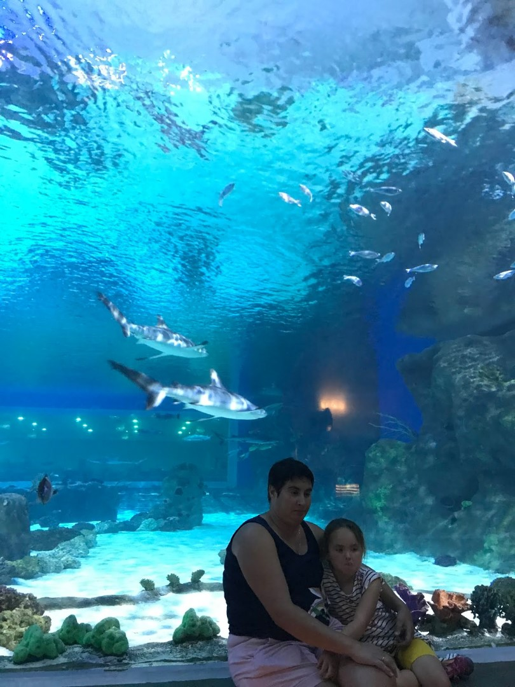
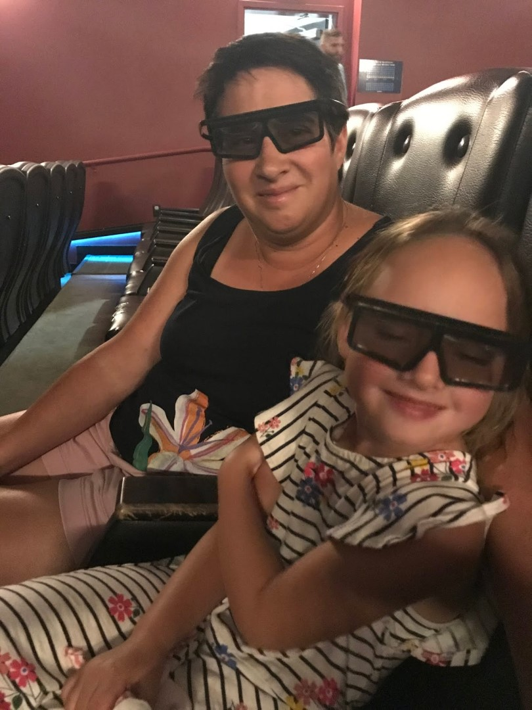

Vandaag is onze laatste dag van deze vakantie. We gaan dus niet al te veel doen, voor de ochtend en middag staat het Loveland Living Planet Aquarium op het programma. Het is boven verwachting mooi! Vissen in alle kleuren van de regenboog, koraal, krokodillen, vogels en pinguins. Het is allemaal mooi gepresenteerd, en het is niet al te druk.

Ook hebben we een film bekeken over de gevolgen van de opwarming van de aarde voor de noord- en zuidpool. Het was een 4D-film, maar de vierde dimensie voelde wat geforceerd.

Als afsluiting van de mooie reis zijn we maar weer naar Cheesecake Factory gegaan. De rest van de avond hebben we alle koffers en de handbagage ingeruimd.
