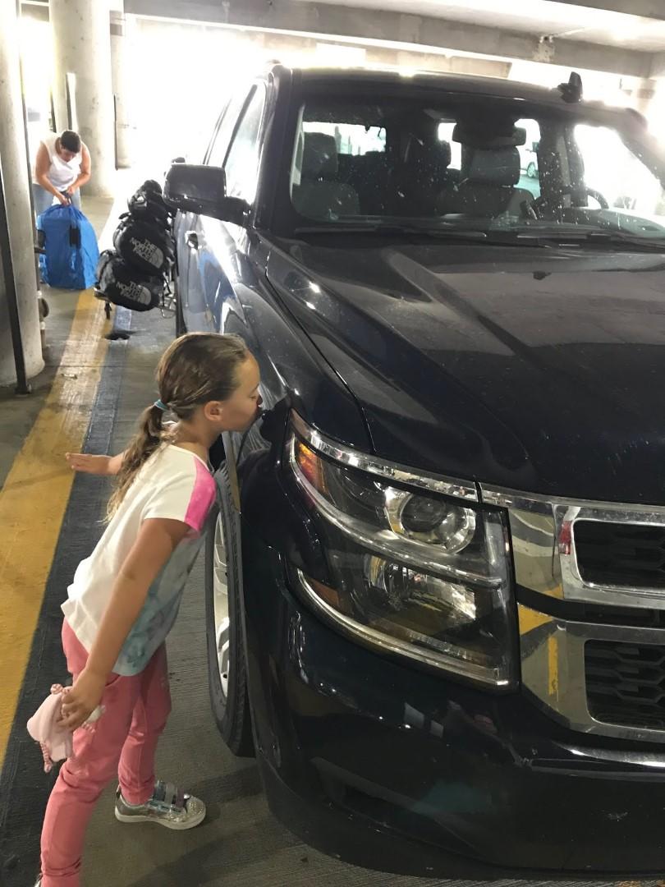

En zo brak sneller dan gehoopt de laatste dag aan. Na ruim 2500 mijl hebben we het eindpunt zonder kleerscheuren weten te bereiken. We hebben er van genoten. Wat het vooral leuk maakte, was dat we deze keer in gebieden zijn geweest waar we nog niet eerder waren. Glacier National Park was een hoogtepunt, maar zeker ook de fietstocht over het Hiawatha Trail en natuurlijk Yellowstone. De camper hebben we minder gemist dan gevreesd. De luxe van de hotels compenseerden ruimschoots het kampvuurtje en (bijna) dagelijkse bbq-en. Ook het reizen met een auto gaat een stuk sneller en comfortabeler. Maar we gaan zeker weten nog een keer met een camper. Het overnachten in de parken heb ik wel een beetje gemist.

Het inleveren van de auto ging zoals gebruikelijk eenvoudig en snel. Er werd nog innig afscheid genomen van onze trouwe metgezel, wat een enorm fijne wagen is het toch.

We waren ruim op tijd op het vliegveld, dus we hadden alle tijd om op ons gemak te lunchen en wat rond te kijken. De vlucht ging ook voorspoedig, we hebben zelfs wat kunnen slapen, maar het blijft natuurlijk een lange zit. Op Schiphol stonden oma Helen en opa Gerard ons traditiegetrouw op te wachten. Uiteindelijk waren we om half twaalf in de ochtend weer thuis.
