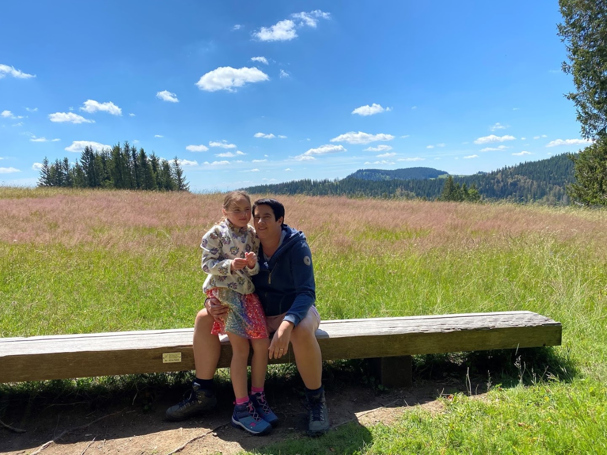
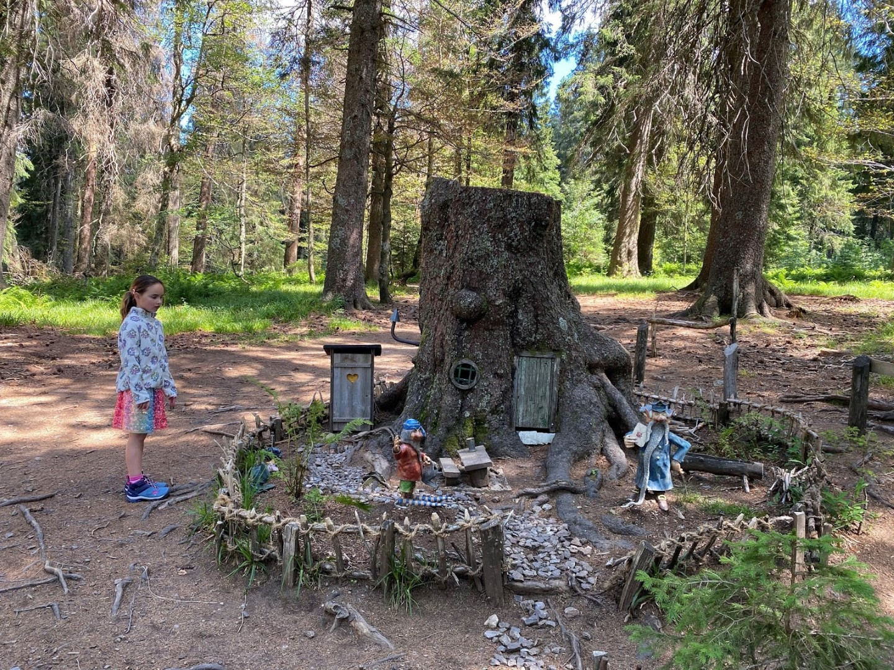
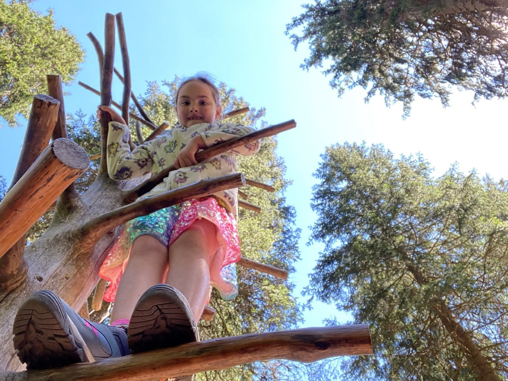
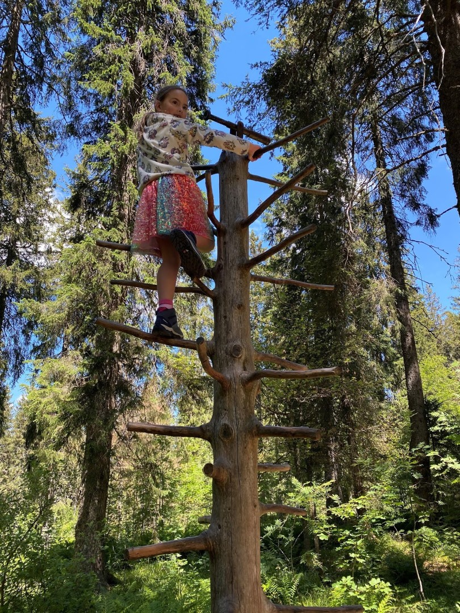
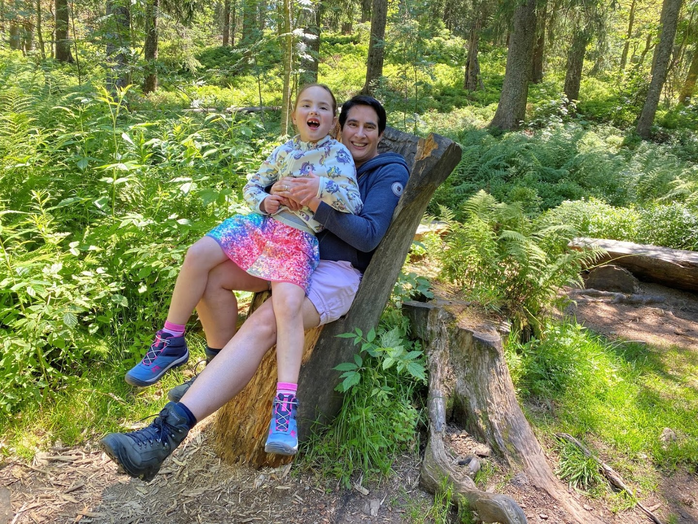
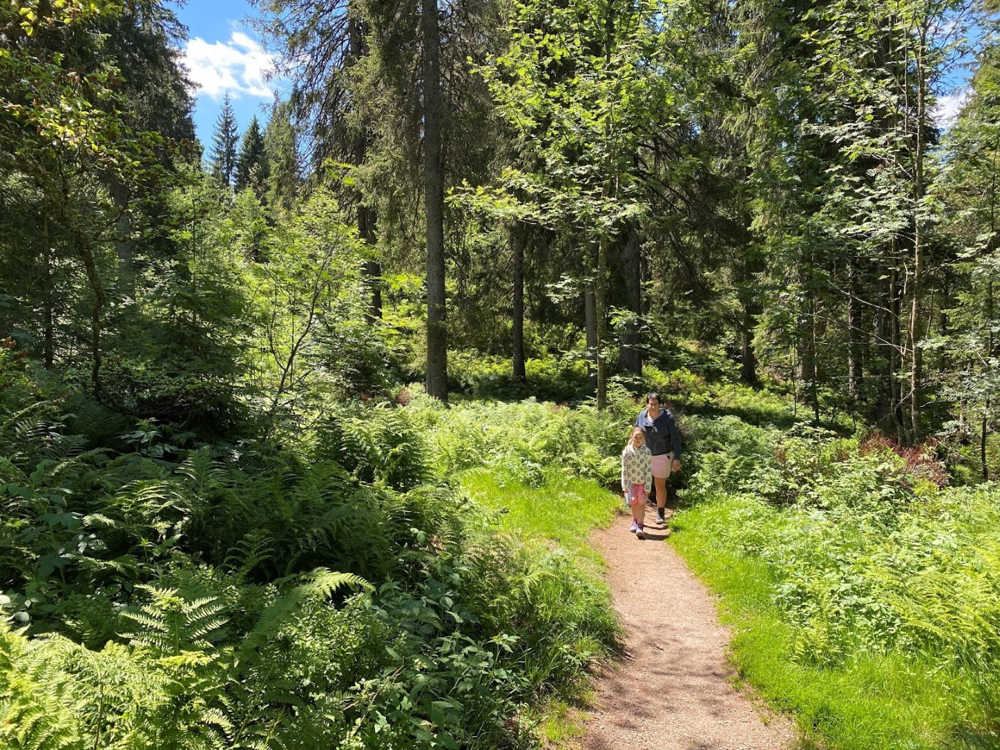
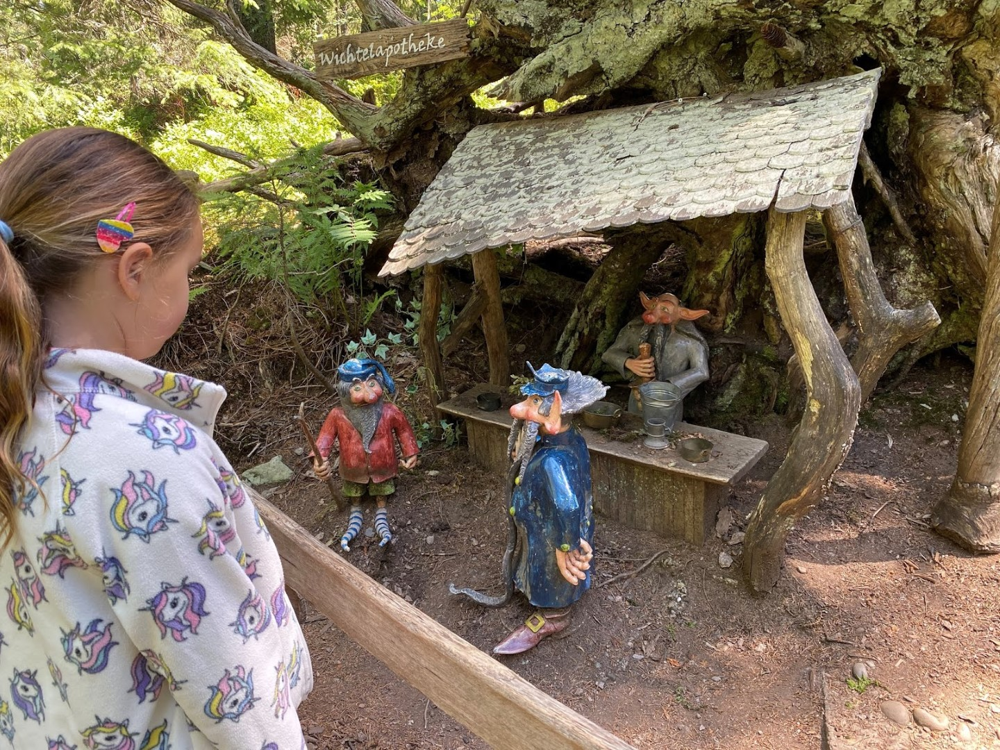
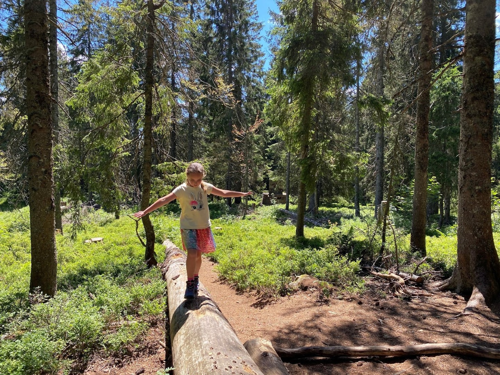
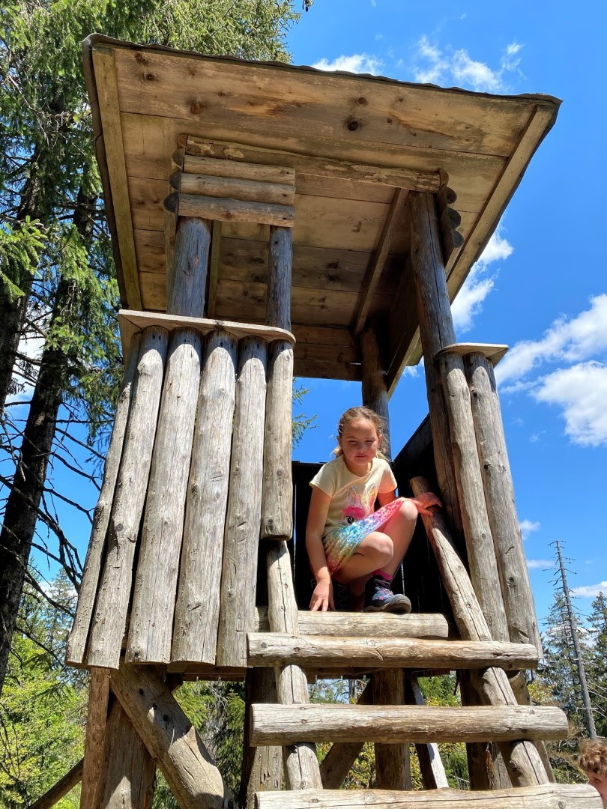
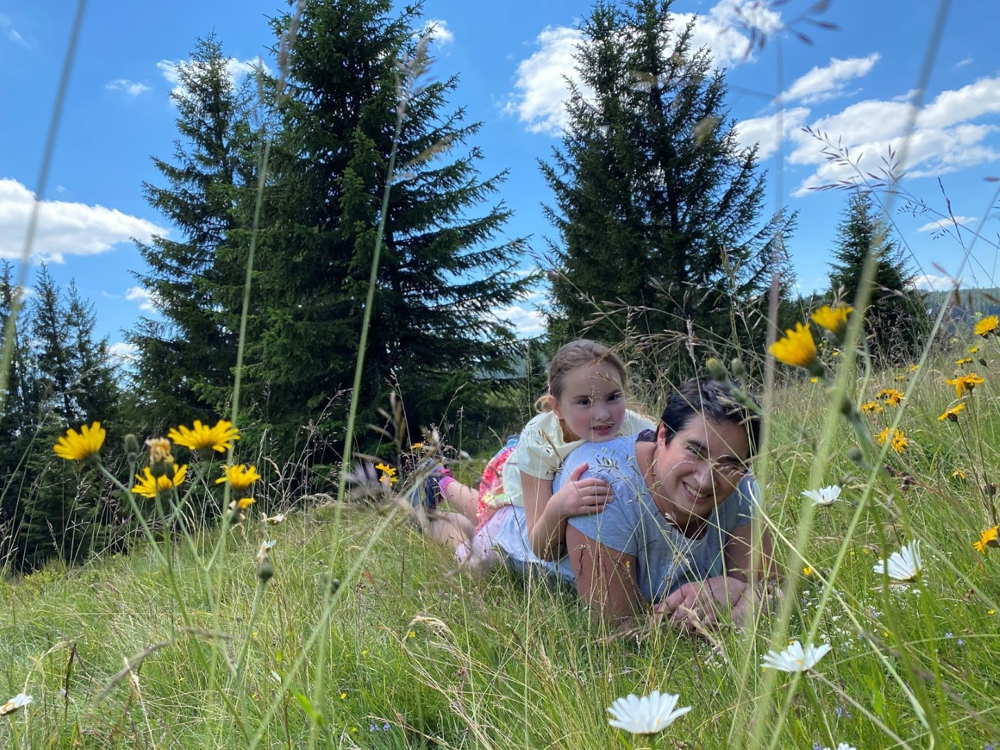

Na het uitgebreid ontbijt en nog even wat chillen in de kamer, zijn we rond elf uur vertrokken richting de Feldberg. Op deze berg zijn we afgelopen winter nog gaan sleeën, maar nu hebben we de wandelschoenen aangetrokken om het Wichtelpfad eens te gaan bekijken. Parkeren bovenop de berg is eenvoudig, de parkeergarage biedt plek voor zo'n 1200 auto's. Gedurende het skiseizoen vult die al snel, maar vandaag is er meer dan plek genoeg. Er is volop vertier op de berg, van hotels en restaurants tot musea en natuurlijk een enorm aanbod van wandelpaden. Zoals gezegd, wij kozen voor het Wichtelpfad (Elfen pad). Samen met de elfen Ferdinand en Velt bezoeken we hun leefgebied. Het pad is erg op kinderen gericht, en dat maakt het extra leuk.

Er was van alles te zien en genoeg te klimmen en klauteren.

Het is prachtig weer, hoewel het in de schaduw best wel frisjes is. We hebben op een boomstam onze lunch gegeten.

Aan het eindpunt van de wandeling hebben we op een terras wat gedronken. Daarna zijn we nog even bij Haus der Natur gaan kijken. Dit is het bezoekerscentrum van Feldberg waar je van alles leert over de lokale flora en fauna. Rond half vijf waren we weer terug bij ons hotel. Omdat we wat lui zijn hebben we maar een pizza gehaald en op ons balkon in de zon opgegeten.

## 2 opmerkingen

### opa 12 juli 2020 om 23:19

Mooi dat jullie weer een blog hebben. Blijven we op de hoogte.
De prachtige foto's erbij maken het helemaal af. Zullen het blijven volgen. Veel plezier nog. Het weer werkt in ieder geval mee!
Groeten van ons beiden.

#### Gerard 22 juli 2020 om 22:59

Ik loop een beetje achter maar geniet desondanks van alle mooie foto's. Het is een prachtige omgeving
