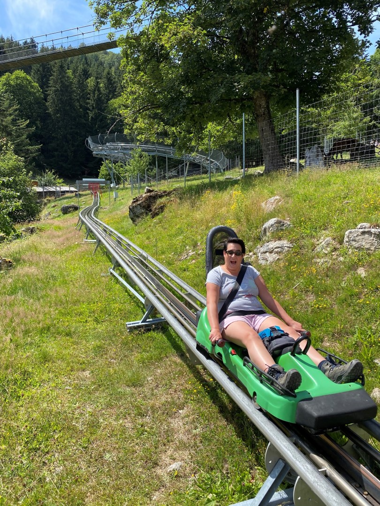
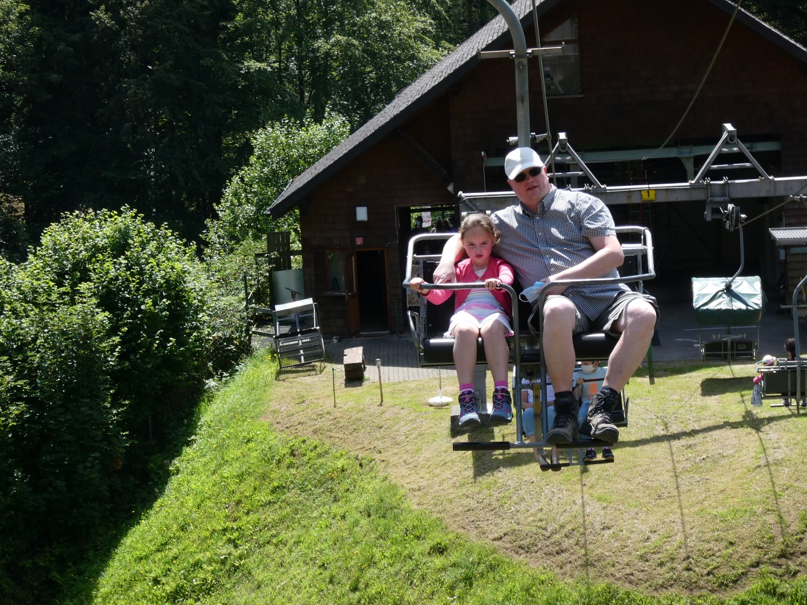
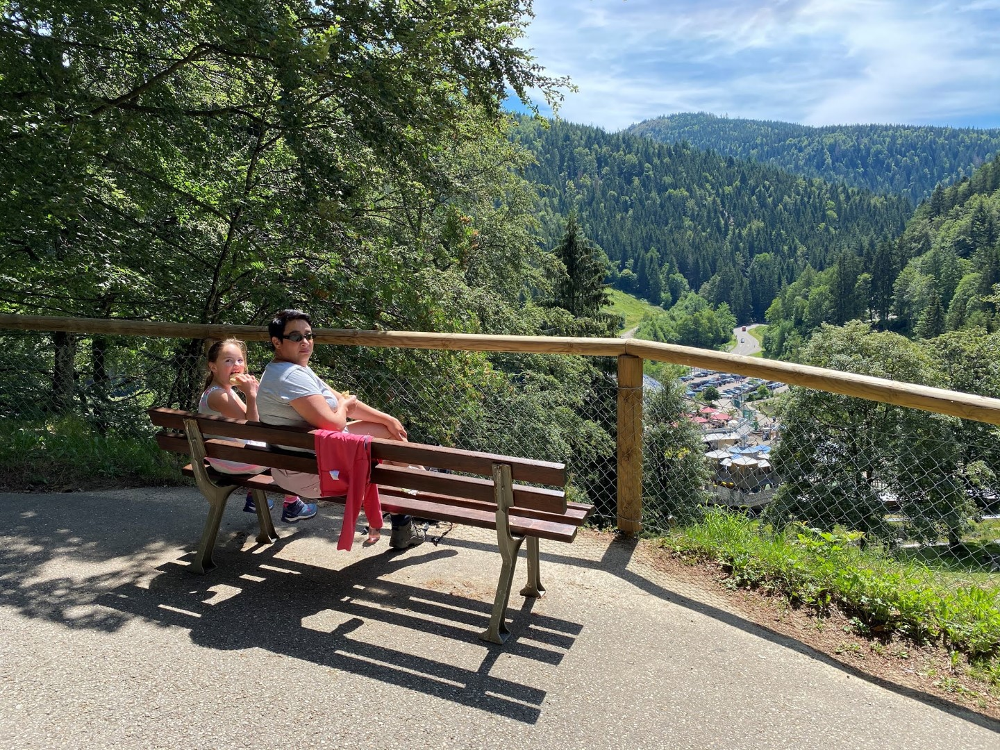
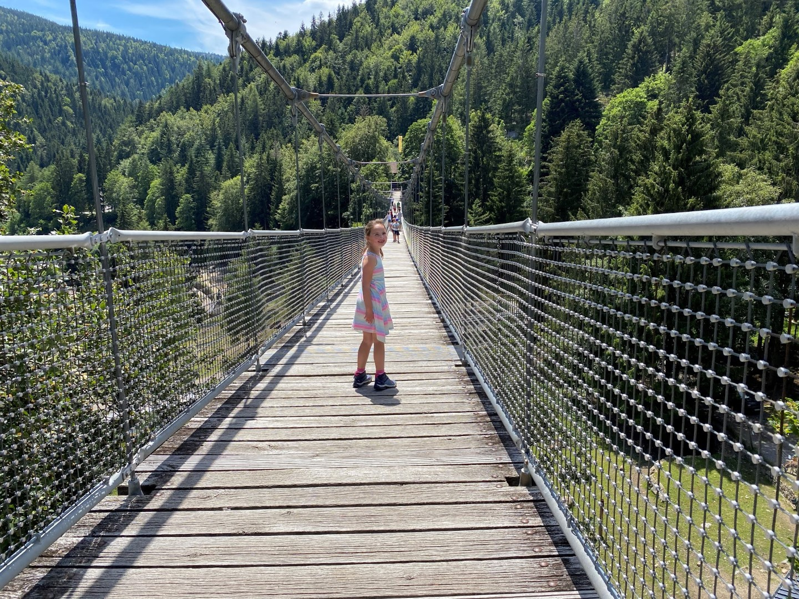
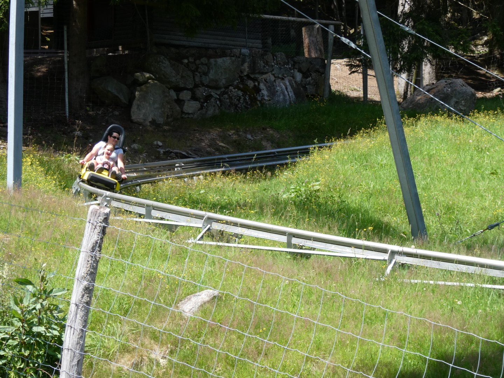
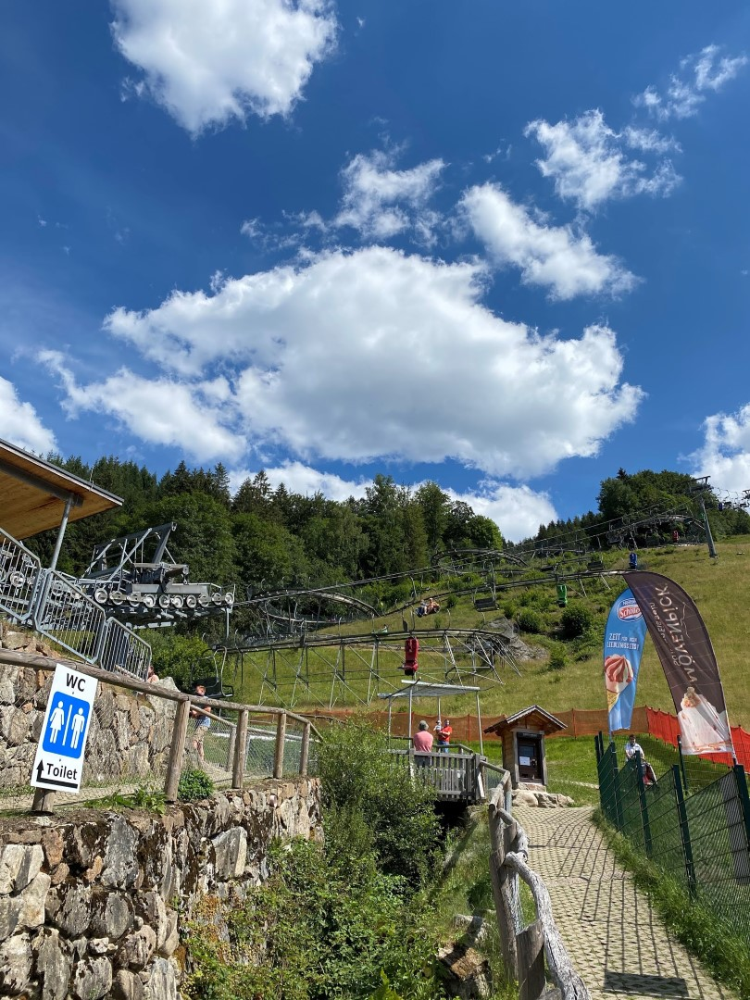
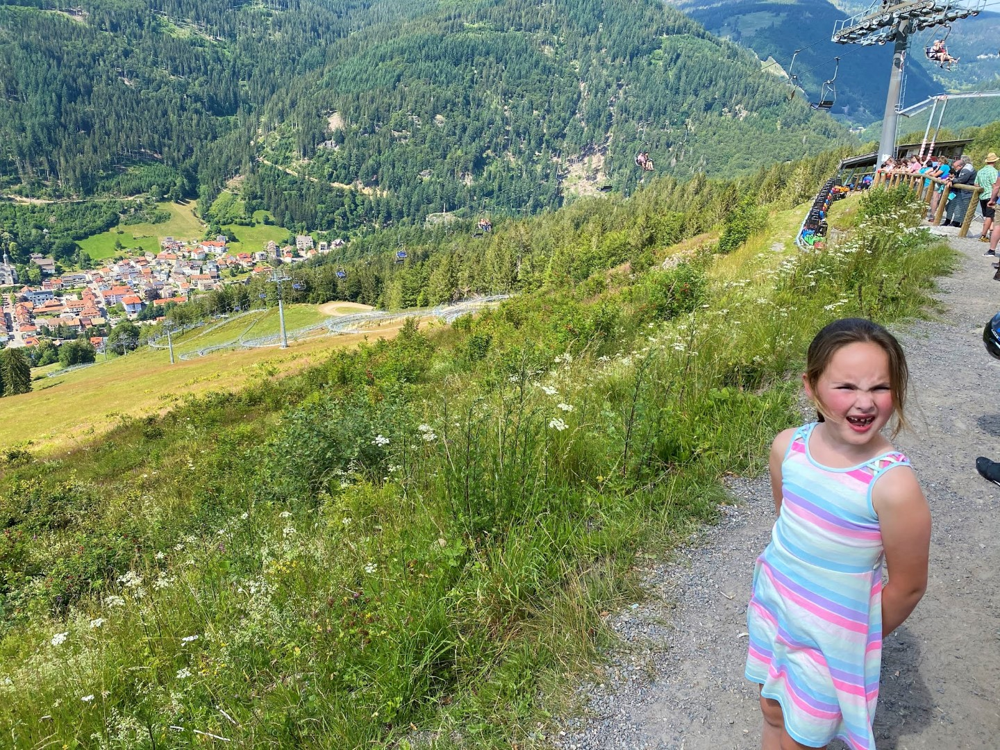

Op een minuut of 40 rijden ligt het Steinwasen Park, een alleraardigst allegaartje met wat dieren, speeltuinen en attracties. Als eerste gaan de dames in een wildwaterbaan. Met een lift wordt het bootje naar het beginpunt getild, waarna het spektakel los barst.



In de wachtrijen en overdekte gebouwen is het dragen van een mondkapje verplicht. Het vreemde is dat iedereen braaf zo'n ding op heeft, maar vervolgens wel bovenop je komt staan in de rij. Na een kwartiertje wachten was de eerste rodelbahn rit een feit. Wat een fijne baan zeg! Het gaat af en toe hard naar beneden, en moet je behoorlijk in de remmen om niet al te hard door de bocht te vliegen.

Na het eerste ritje met de rodelbahn zijn we met de kabelbaan helemaal naar boven gegaan.

Vanaf de top wandel je langzaamaan weer terug naar beneden langs dieren van divers pluimage. Van herten tot geiten en van gemzen tot een tweetal loslopende ezels. Halverwege de afdaling was het tijd voor de lunch, with a view deze keer.

De lunchplek lag aan het begin van een enorme hangbrug die over een aanzienlijk deel van het park loopt.
 

Na een vlugge links-rechts beweging kwamen we weer bij de rodelbahn uit. Toch veruit de meest spectaculaire attractie van het park, dus nog een ritje om het af te leren.

Na een welverdiend ijs voor Sofie en een versnapering voor ons op het terras, zijn we naar de nabij gelegen Hasenhorn Rodelbahn in Todtnau gereden. Met z'n 2,9 km lengte is het een van de langste rodelbahnen in Duitsland.

Vanuit het dal ziet de baan er al behoorlijk indrukwekkend uit.

Na een ritje met de kabelbaan, stappen we boven op de berg uit. Daar staat een behoorlijke rij met wachtenden, maar na een klein kwartiertje zitten we strak ingesnoerd in de slee die ons in vliegende vaart terug naar beneden begeleidt. Deze baan is echt superleuk, het gaat bij tijd en wijle echt enorm hard. Sofie gilt dat het een lieve lust is.

## 1 opmerking

### Gerard 22 juli 2020 om 23:06

leuke wildwaterbaan, ook een beetje natgespat?
