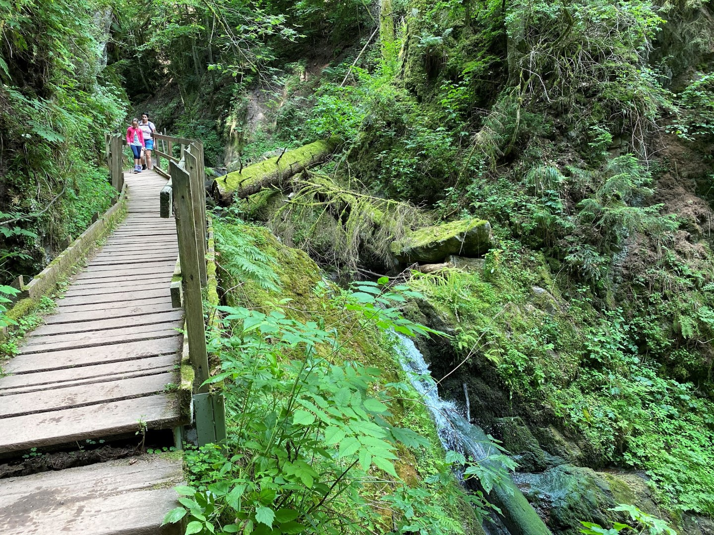
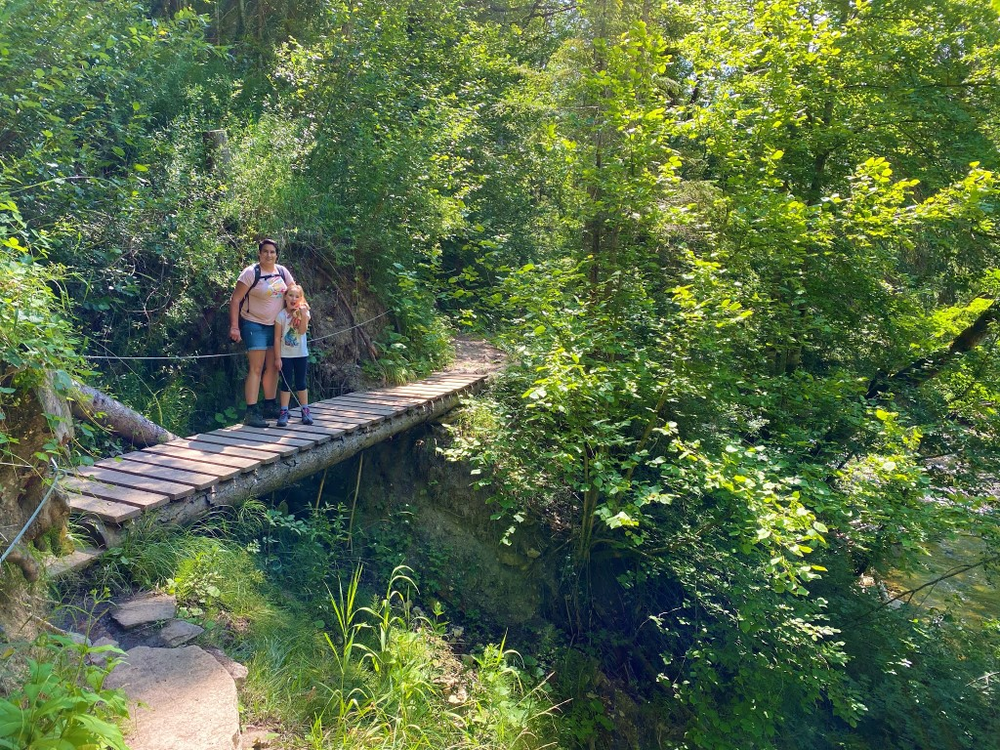
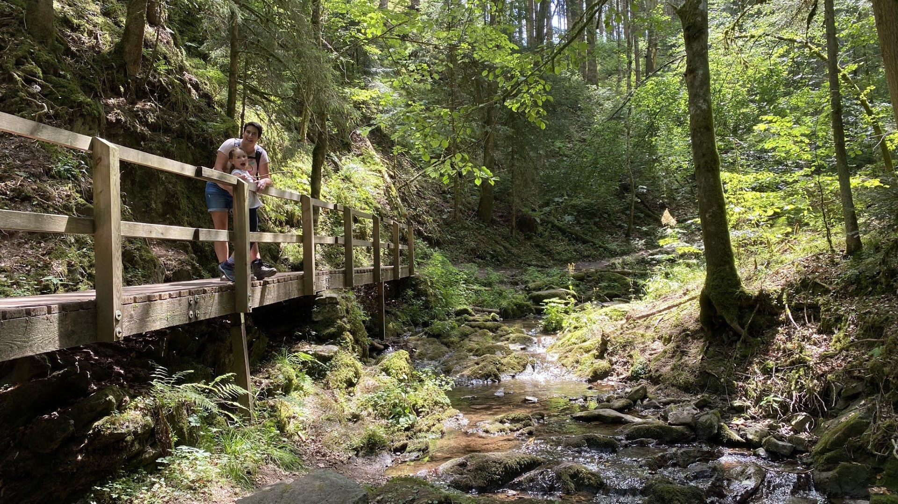
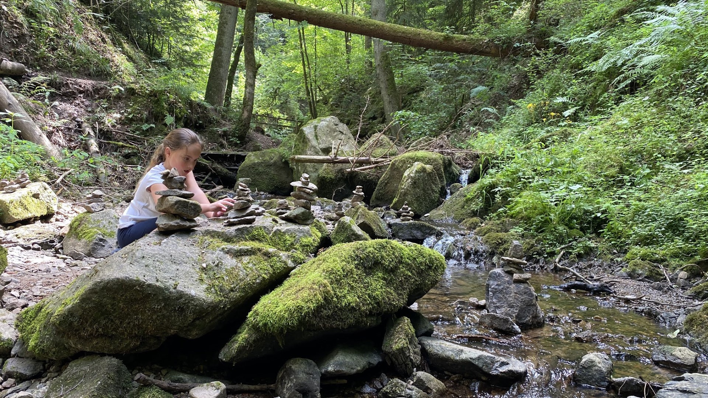
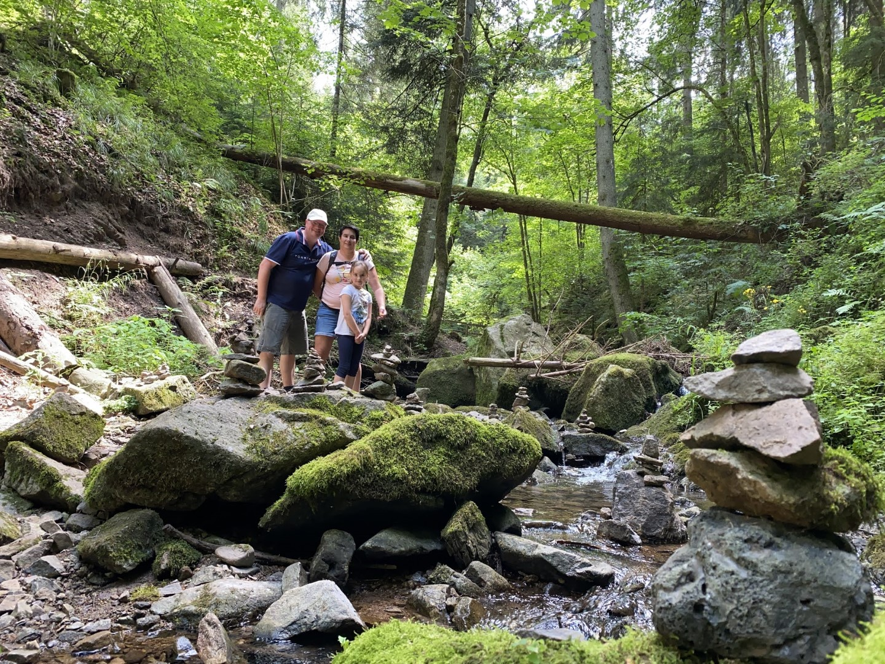
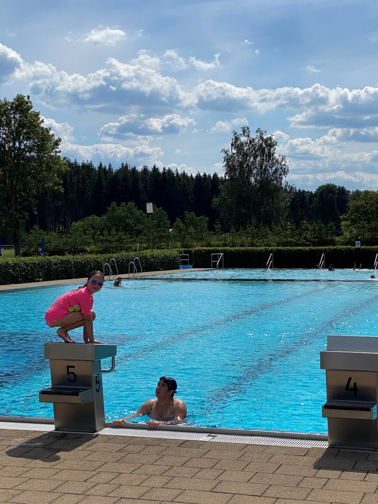

De Lothenbachklamm is een anderhalf kilometer lange zijtak van de Wutachschlucht. De Lothenbach kabbelt eerst rustig tussen de granieten rotsen, maar dan stort hij zich met gepast geweld tussen de rotsen door naar beneden. Het blijkt, ondanks de beperkte afstand, een prachtige wandeling te zijn.

Het is vandaag dinsdag en hier in het zuiden van Duitsland nog geen vakantie, maar het is er toch al aardig druk. Benieuwd hoe dat in het echte hoogseizoen gaat zijn.

Na anderhalve kilometer komen we aan bij de Schattenmuhle, een hotel en restaurant. We lopen nog een klein stukje verder de Wutachschlucht in, maar na een kwartiertje keren we maar terug naar de Schattenmuhle om daar te lunchen. De Wutachschlucht komt vast en zeker op een later tijdstip deze vakantie nog aan de beurt.

Na deze wandelinspanningen was een plons in het Waldbad in Löffingen meer dan welkom. Er zijn maar weinig mensen hier, dus het bad (en glijbaan!) hebben de dames bijna voor zichzelf.

## 1 opmerking

### opa 14 juli 2020 om 22:42

Het Schwarzwald is zeker de moeite van een bezoek waard. Mooie plaatjes en ook genoeg bezienswaardigheden zo te zien. Als het eten er ook goed is gaan we eens bij Felix kijken.
Groeten uit Heerlen en een knuffel voor Sofie. Auf Wiedersehen.
