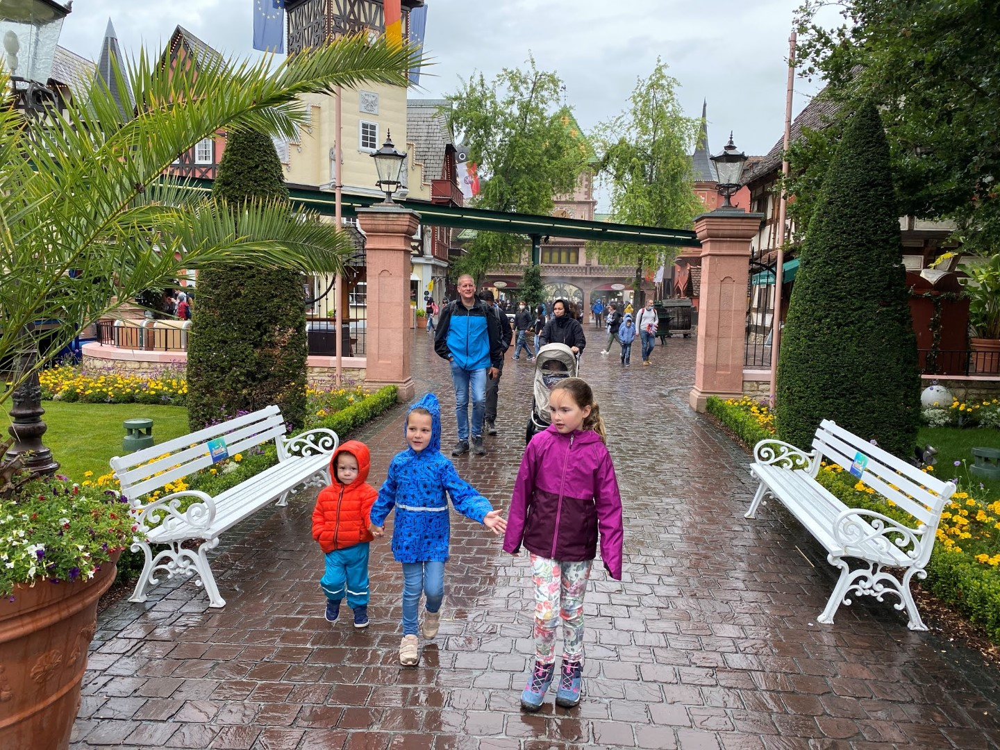
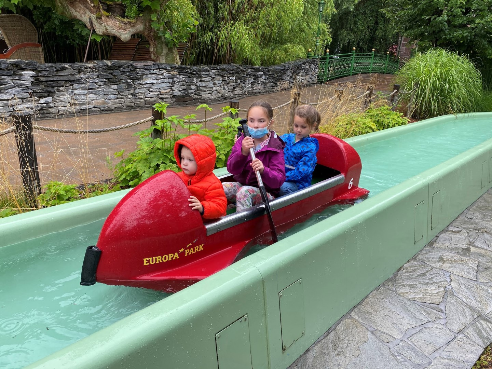
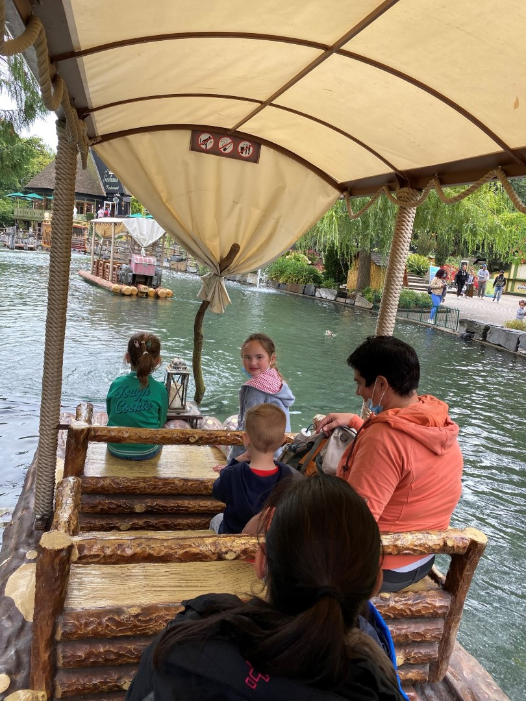
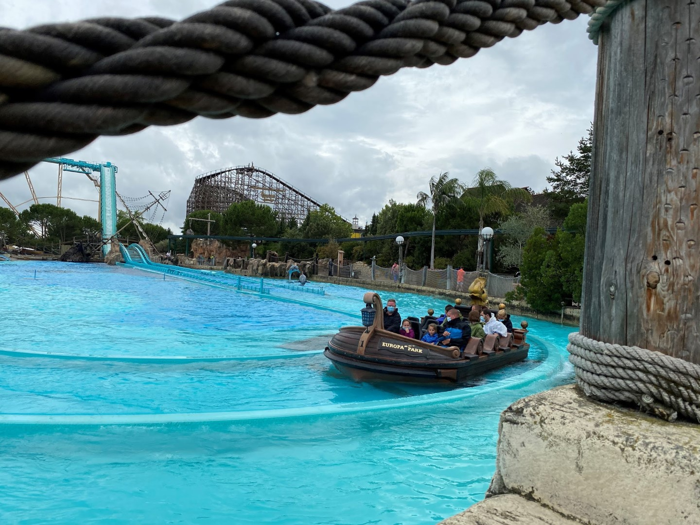
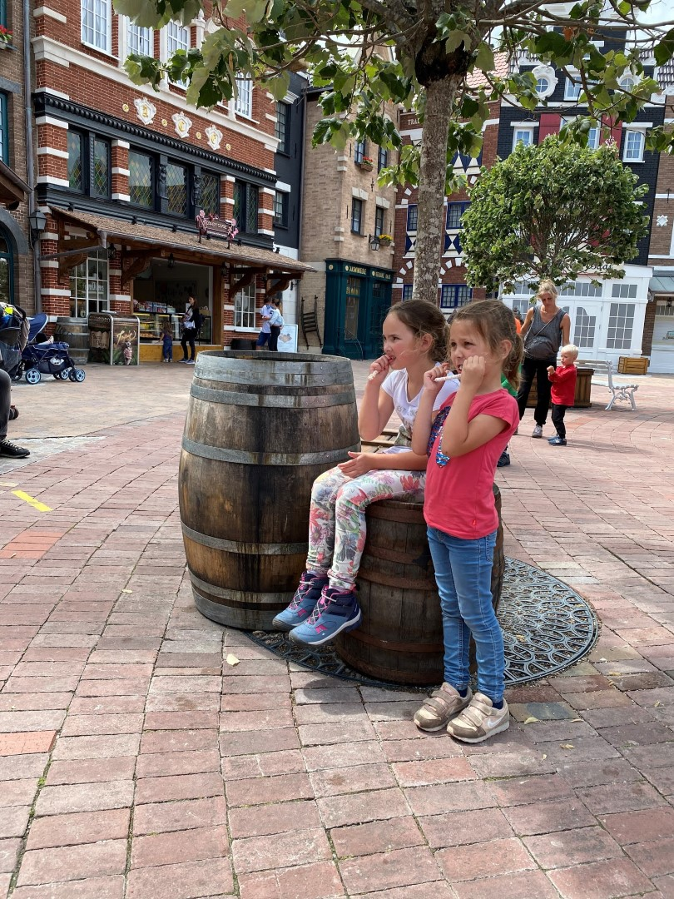
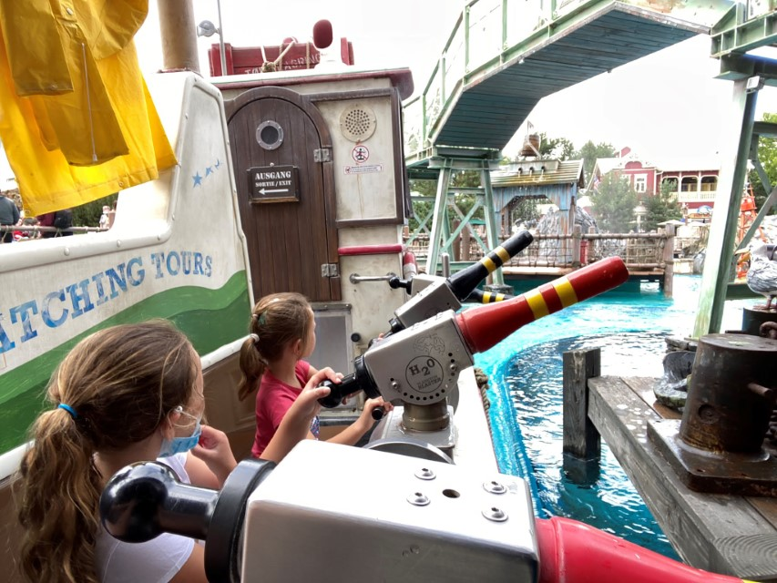
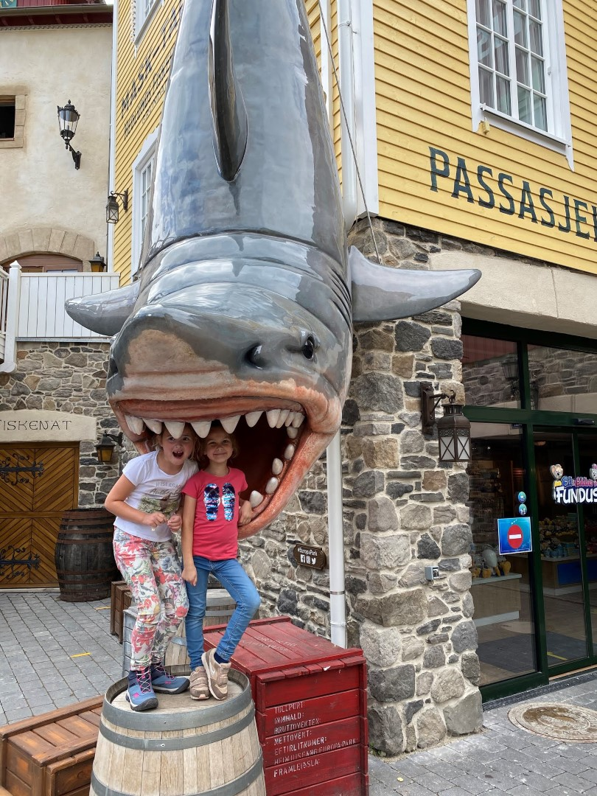

Het weer was de afgelopen dagen perfect, lekker zonnetje, aangename temperatuur. Voor de komende dagen echter wordt lichte regen voorspeld. Ideaal dus om Europapark te bezoeken! Gisterochtend hebben we de kaartjes online gekocht, dat moet vanwege alle corona perikelen. In de tussentijd even geappt met Barry, en wat wil het toeval: zij gaan ook de woensdag naar het pretpark. Dus was al vlug besloten om elkaar om 9 uur in de ochtend aldaar te ontmoeten.

De ochtend begon wat druilerig, maar na de middag werd het droog en hebben we zelfs nog geruime tijd in t-shirt kunnen rondlopen. De mini dames en dito heren hebben zich samen kostelijk vermaakt.

Vanwege corona worden er (veel) minder mensen in het park toegelaten, maar de karretjes van de attracties worden wel helemaal opgevuld, dus de wachttijden zijn zeer prettig. We hebben maximaal 15 minuten moeten wachten, bijna overal konden we min of meer direct plaats nemen.

Bij overdekte locaties en in de wachtrijen moet iedereen vanaf 6 jaar het mondkapje op, maar echt storend is het eigenlijk niet.

Om een uur of vijf trok een beste hoosbui over het park, dus toen hebben we maar besloten om Europapark te verlaten en zijn we naar restaurant Stadtrainsee in Waldkirch gereden. Daar hebben we met z'n allen de geslaagde dag afgerond. Het was een topdag!
 
## 1 opmerking

### Gerard 22 juli 2020 om 23:08

De Kids hebben samen veel plezier in het europapark, leuk om te zien
