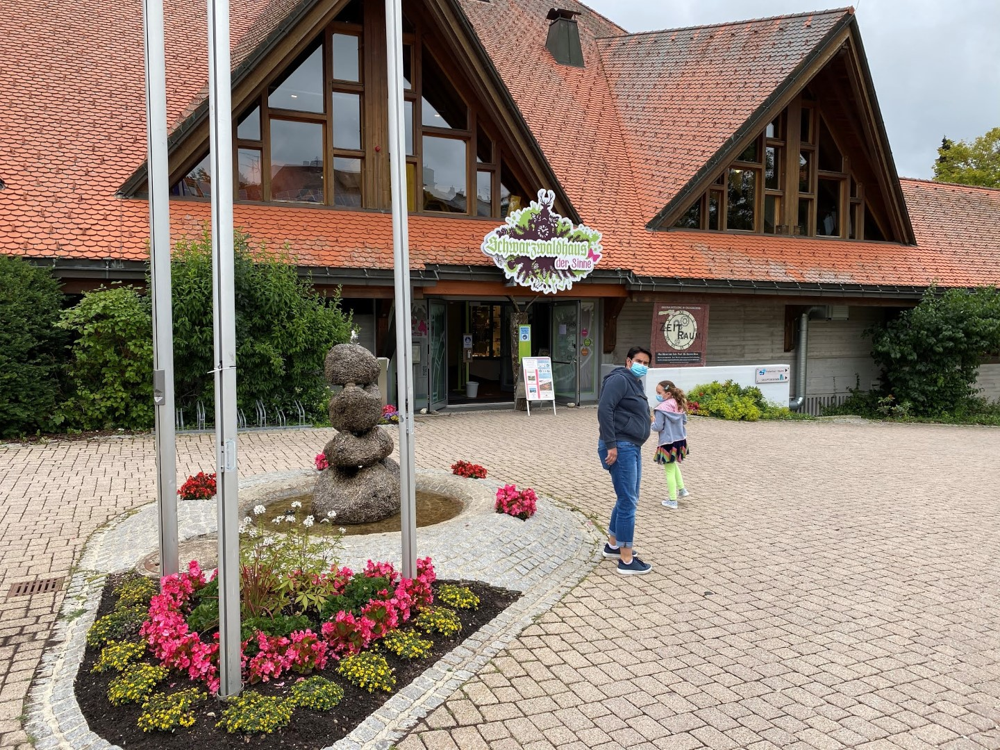
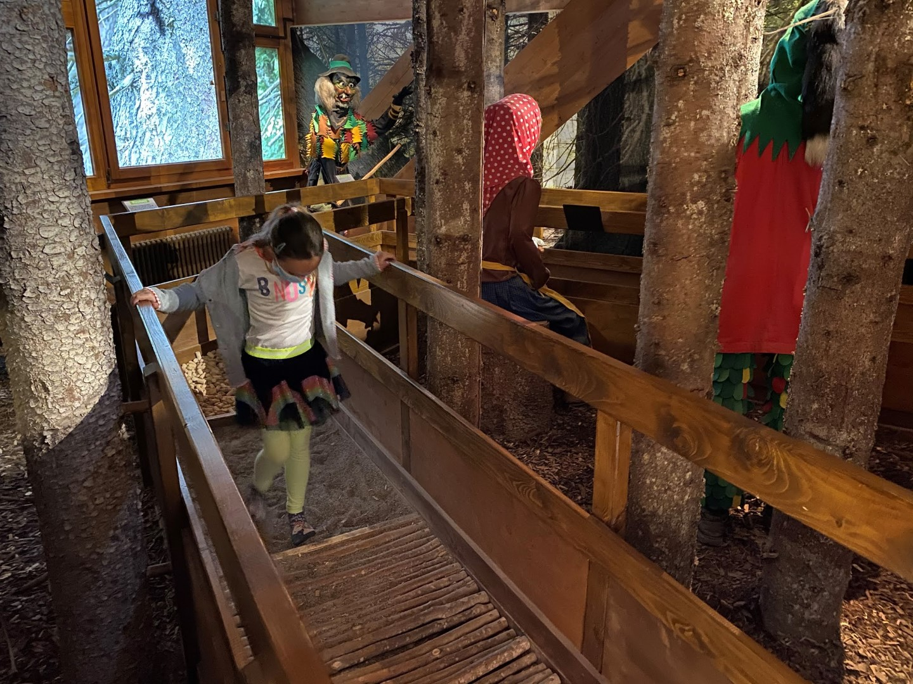
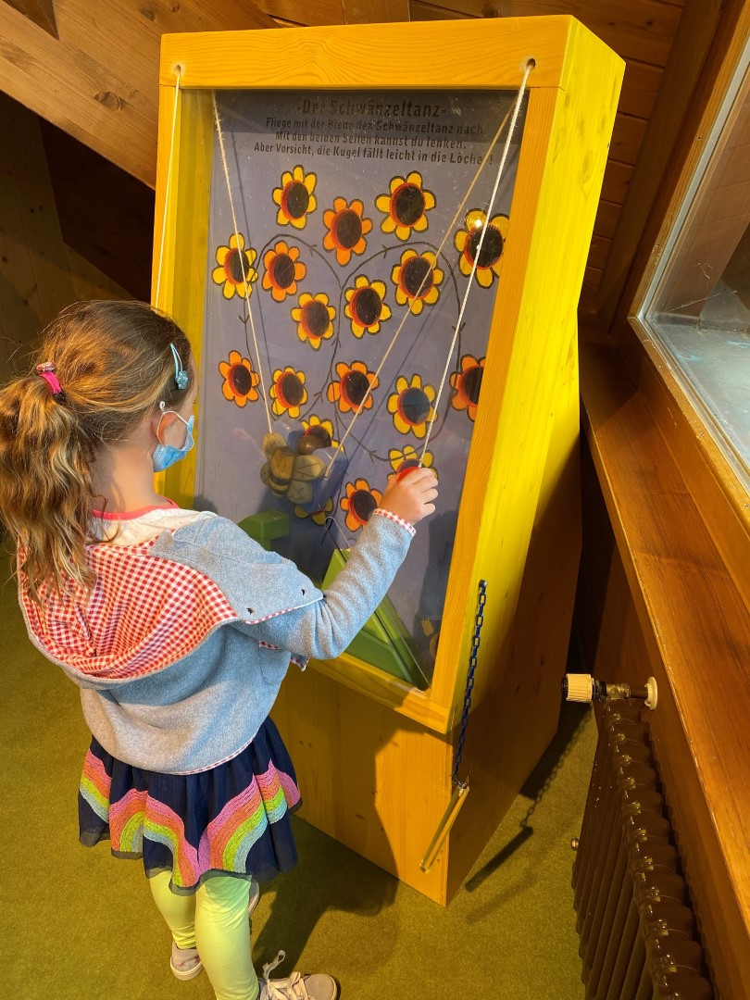
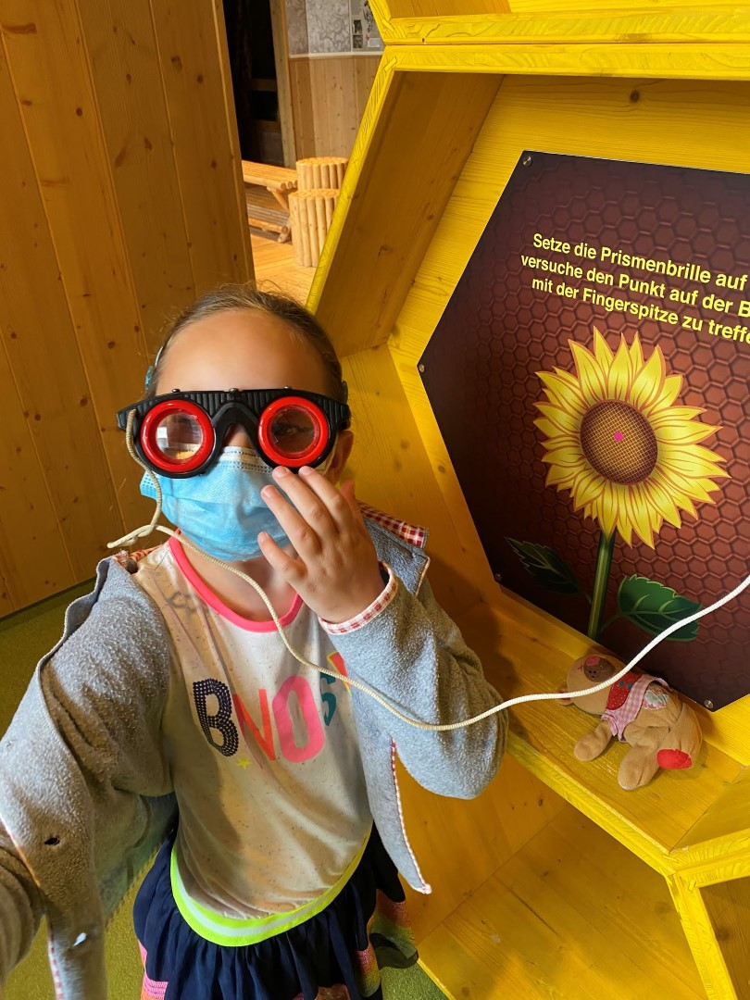
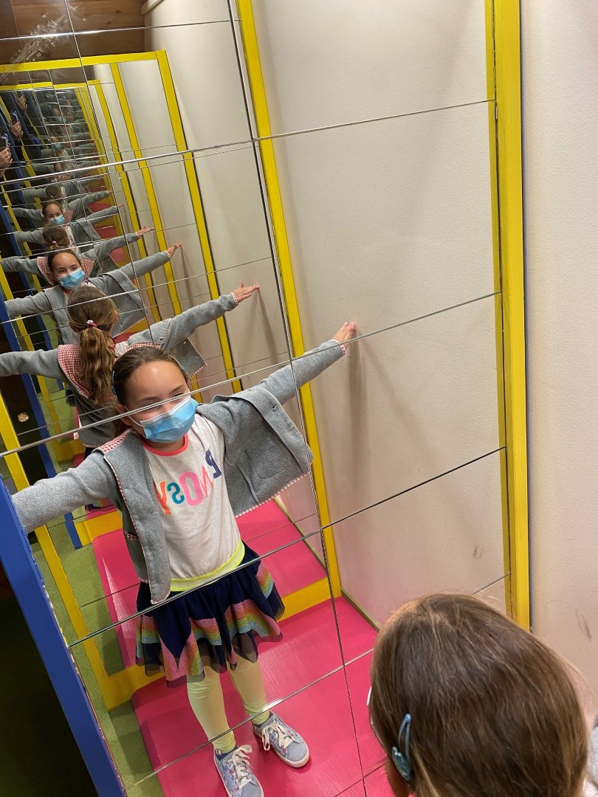
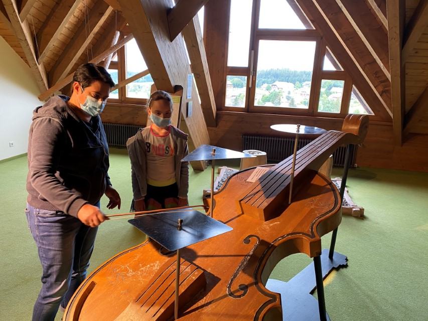
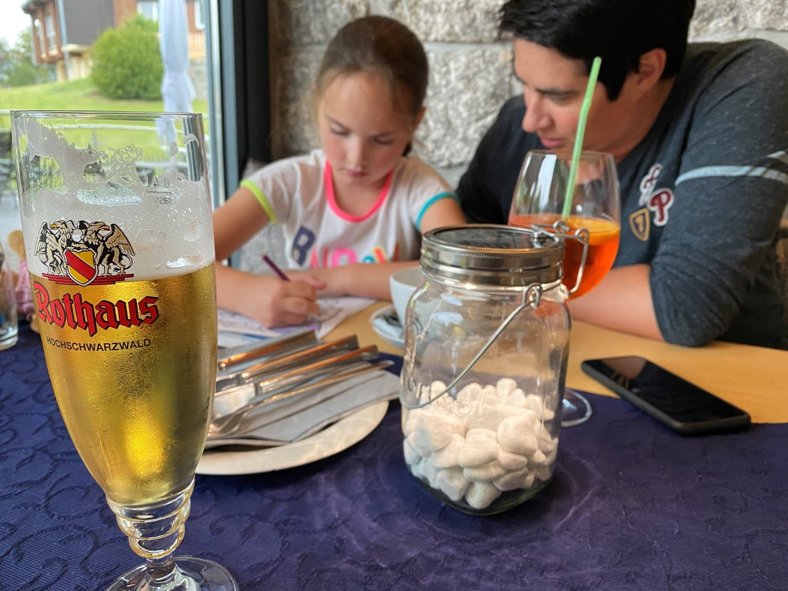

Gisteren was wel een erg drukke dag, en Sofie lag ook nog eens erg laat in bed. Dus vandaag doen we het rustig aan. 's Morgens hebben we heerlijk wat geluierd, gelezen en Mario Kart op de Nintendo Switch gespeeld. Na de lunch zijn we naar het Schwarzwaldhaus der Sinne in het nabij gelegen dorpje Grafenhausen gereden.

In dit op kinderen gerichte museum staat alles in het teken van de zintuigen. Er valt van alles te zien, voelen en horen, en het was best een leuk uitje eigenlijk. In ieder geval om een uurtje of zo rond te lopen.

De eerste beproeving was het blote voeten pad (=voelen!)

Daarna konden we onze behendigheid testen door een bij van bloem tot bloem te laten vliegen zonder dat hij z'n lading verliest. Dat was nog best lastig!

En met een gekke prisma bril op een stipje aantikken is ook niet zo heel eenvoudig.

's Avonds hebben we heerlijk gegeten bij restaurant Seehof, bij ons om de hoek. Zowel de rumpsteak, Zwiebelrostbraten en pizza margarita bambino smaakten voortreffelijk.

## 1 opmerking

### Gerard 22 juli 2020 om 23:13

Wat een leerzame leuke dag voor Sofie
