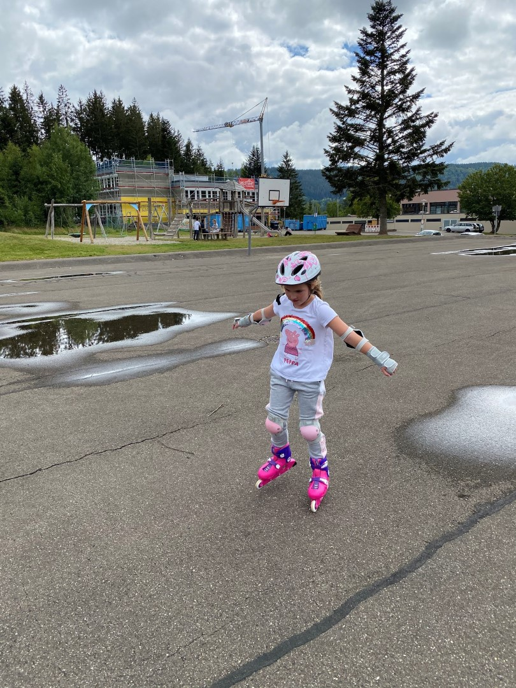
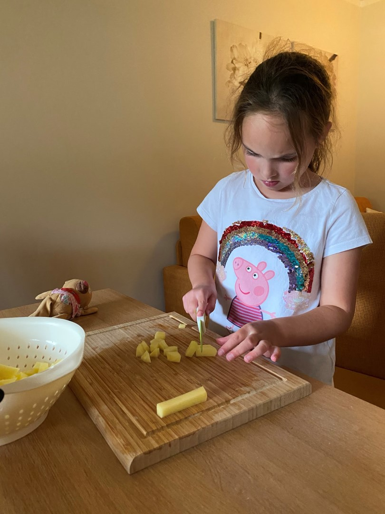

Gisteravond bleek het nog mogelijk om kaartjes te reserveren voor het Badeparadies in Titisee. Dus vanmorgen hadden we een leuke verrassing voor Sofie. Ook hier geldt weer dat er een zeer beperkt aantal mensen het bad in mogen, en in ons geval ook nog eens voor maximaal 2,5 uur omdat we gebruik maken van de Hochschwarzwald Karte. Na het zwemmen hebben we even boodschappen gedaan in de grote Edeka in Titisee.

's Middags hadden we nog tijd voor een skeeler-avontuur op het schoolplein tegenover ons hotel. Tenminste, de dames zijn gaan skeeleren; ik heb een wandelingetje gemaakt in het bos op zoek naar een Grillplatz om komende week een keer te gaan eten (gevonden!)

's Avonds hebben we lekker thuis gegeten en nog wat spelletjes gedaan.

