Op tweede kerstdag 1999 heeft orkaan Lothar huisgehouden in Hochschwarzwald. Heel veel bomen zijn toen omgewaaid tussen de Rothaus brouwerij en de Schlüchtsee in Grafenhausen. Na de opruimwerkzaamheden is het idee ontstaan om in het getroffen gebied een Naturerlebnispfad aan te leggen. Een aantal lokale houtsnijders en kunstenaars heeft uit de omgevallen boomstronken beelden gemaakt en die werden dus tentoongesteld in het gebied wat inmiddels de naam Schlühüwana park heeft gekregen. Schlühüwana betekent overigens helemaal niets, maar staat voor Schlüchtsee-Hüsli-Wald-Natur. Het is vandaag weer heerlijk weer, dus vol goede moed gaan we op pad.

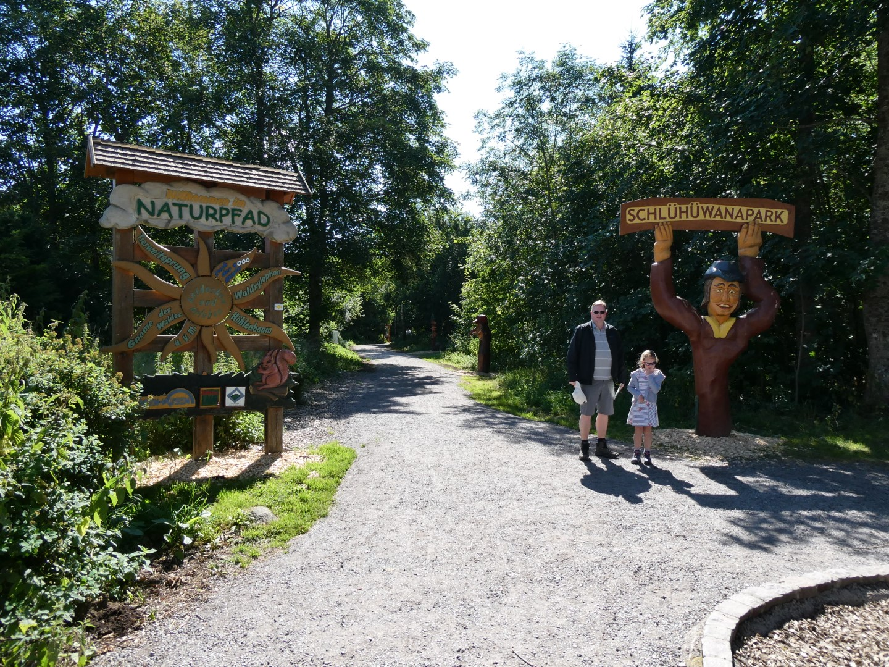

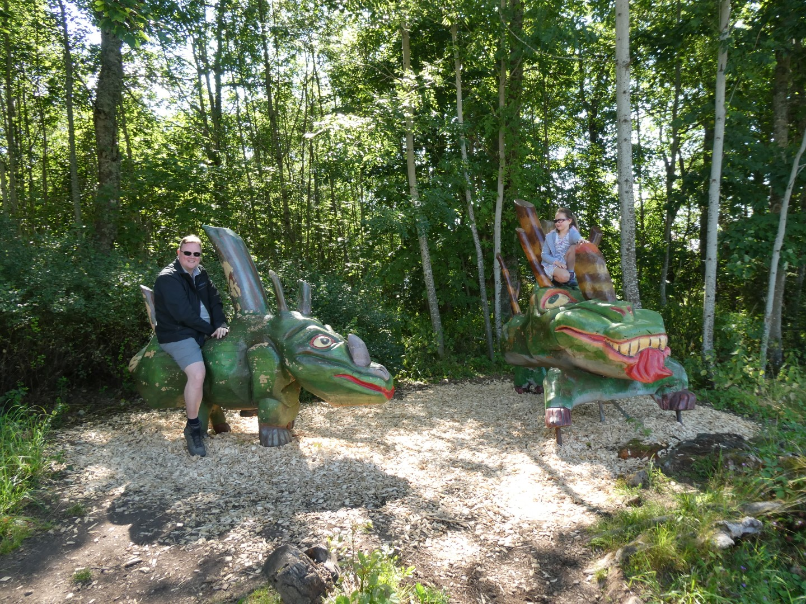

Met 2,6 km is het pad ideaal voor kinderen en er is dus veel te doen voor het klein grut. Er is een blotevoetenpad, je kunt springen, klimmen, herrie maken en dus de tientallen beelden bekijken.

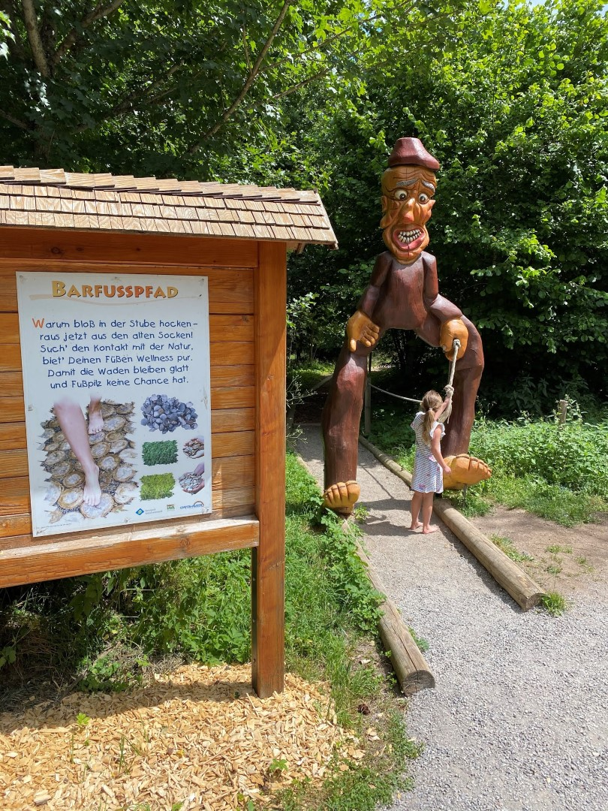



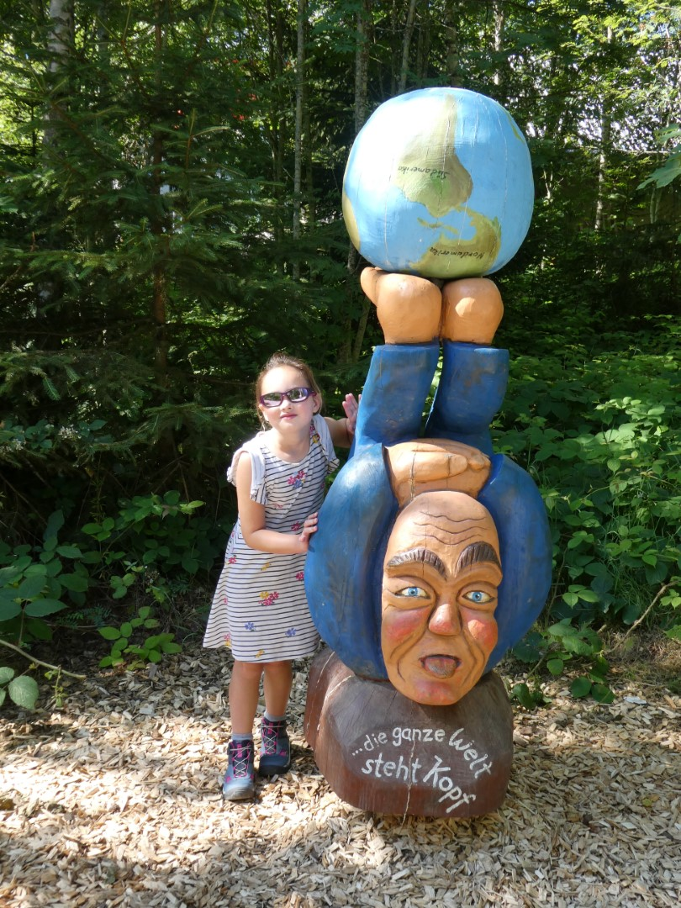



Halverwege het pad door het park kun je ervoor kiezen om een rondje te maken om de Schlüchtsee, dus dat doen we dan maar. We laten de beelden even voor wat ze zijn, en al snel worden we getrakteerd op een jongeman die het nodig vond om in z'n blootje via een touw in het meer te springen. Sofie vond het maar een grappig gezicht.

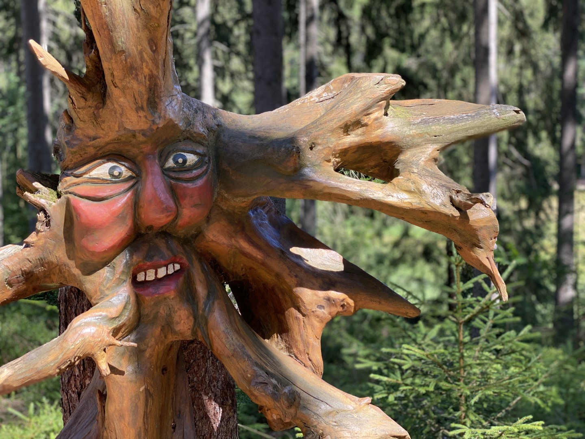

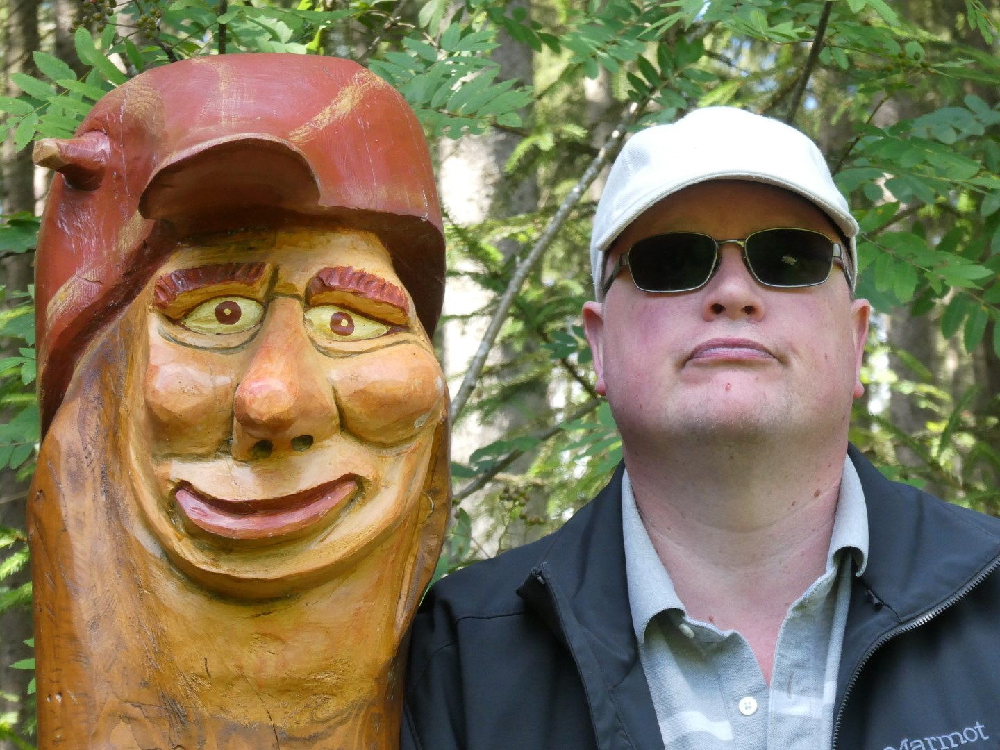

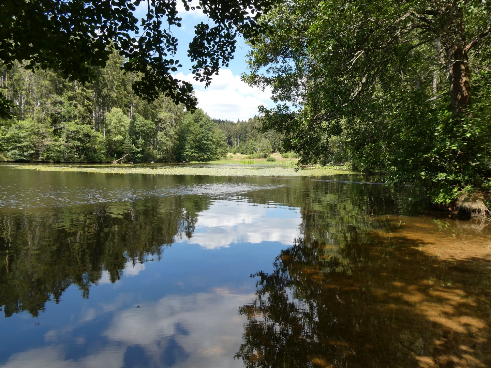

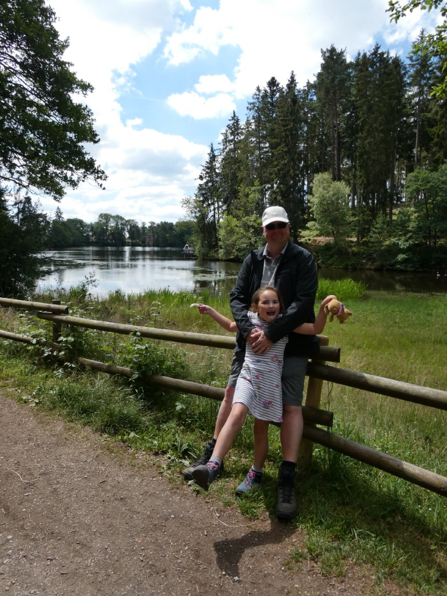

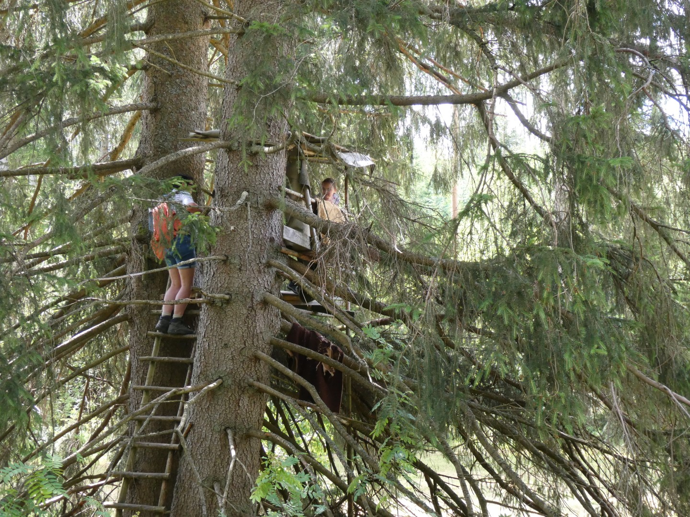

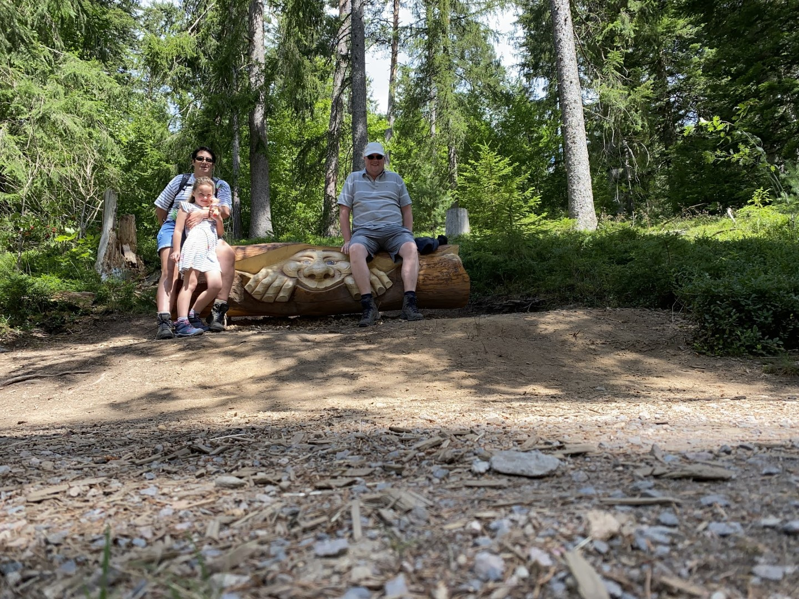

We waren vroeg op pad dus we waren rond lunchtijd weer in ons hotel. Daar hebben we wat brood weg gewerkt, en toen hebben we de zwemspullen in de Volvo geladen en zijn we weer gaan zwemmen in het Waldbad in Löffingen. We hadden weer het hele zwembad nagenoeg voor ons alleen (logisch, want het water is IJSKOUD, maar dat schijnt Sofie helemaal niet erg te vinden).

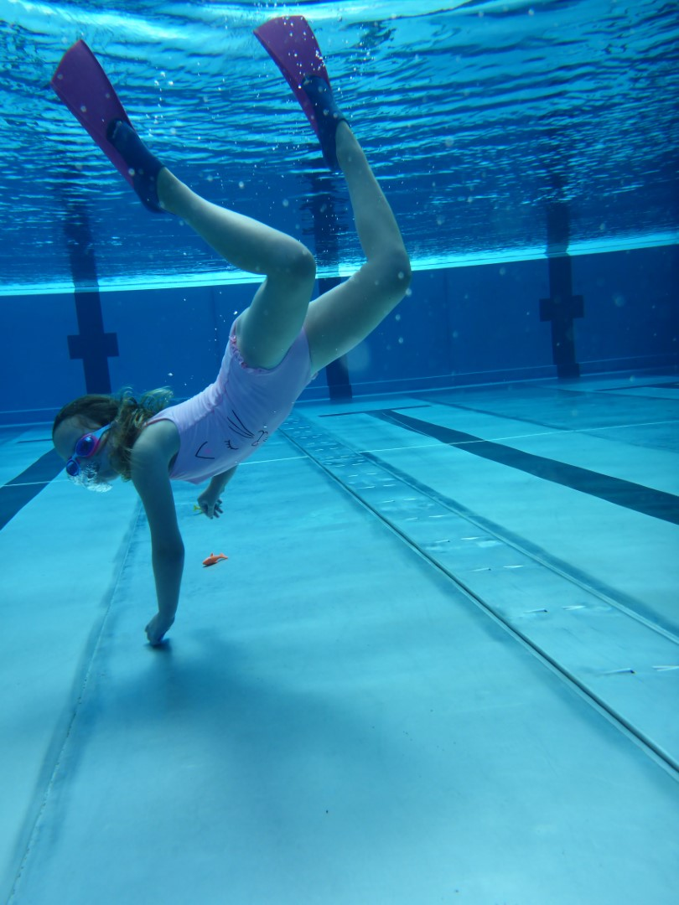

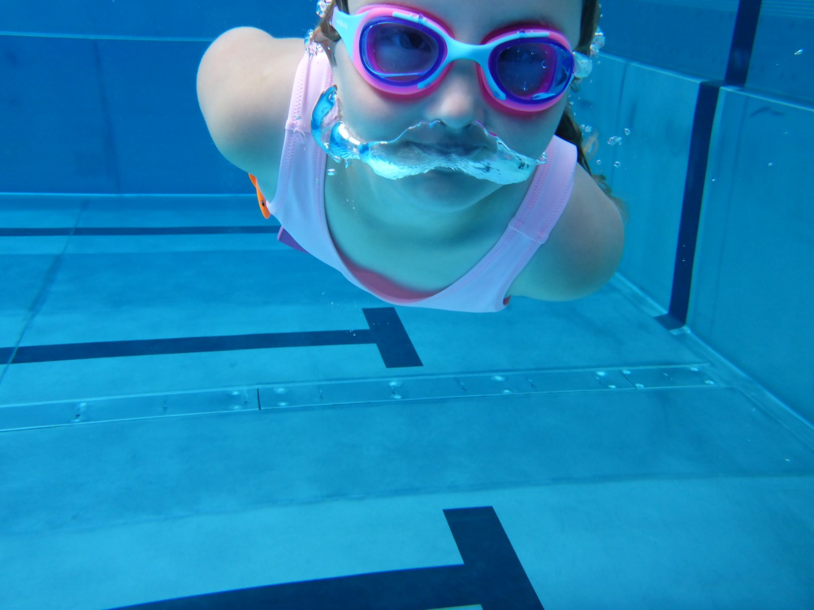

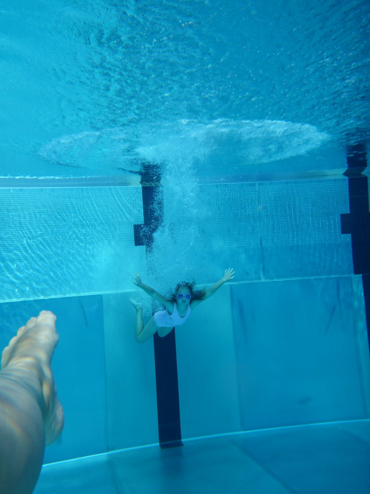

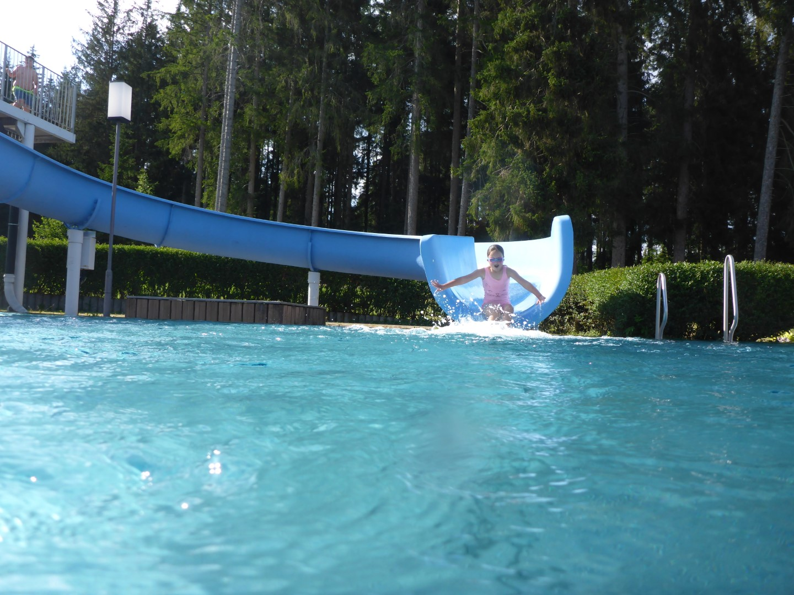

Om de dag af te sluiten hebben we gegeten bij het zwembad.

## 2 opmerkingen

### opa 19 juli 2020 om 09:18

Weer mooie foto's. Lothar kan ik me goed herinneren uit de "Pfaltztijd".
De schade was enorm.
Nog een fijne week.
Groeten en een knuffel voor Sofie

### Gerard 22 juli 2020 om 23:17

Aan sportieve en ludieke momenten ontbreek het jullie zeker niet. Geniet er maar lekker van.
