Vanmorgen moesten we vroeg uit de veren, omdat de Drei Schluchten Pfad op het programma staat. Volgens de beschrijving is het een zware wandeling van zo'n 10 kilometer. We starten de trip vanuit Bachheim, zo'n half uurtje rijden vanuit Schluchsee. Als eerste duiken we de Wutachschluch in. De afdaling gaat over een glibberig pad, eenmaal beneden is het gelukkig een stuk beter te bewandelen. Het pad volgt de Wutach en is bijzonder mooi.

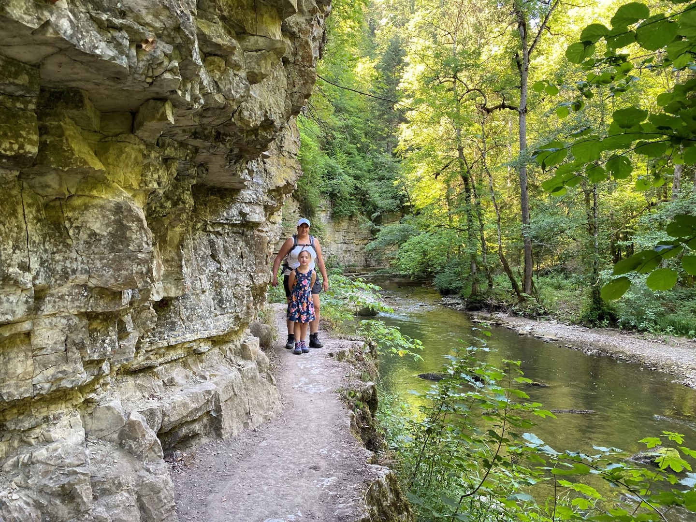

Af en toe moeten we over een smal richeltje lopen om geen natte voeten te krijgen. Het is vandaag zondag en veel mensen zijn op pad. Af en toe is het file-lopen.

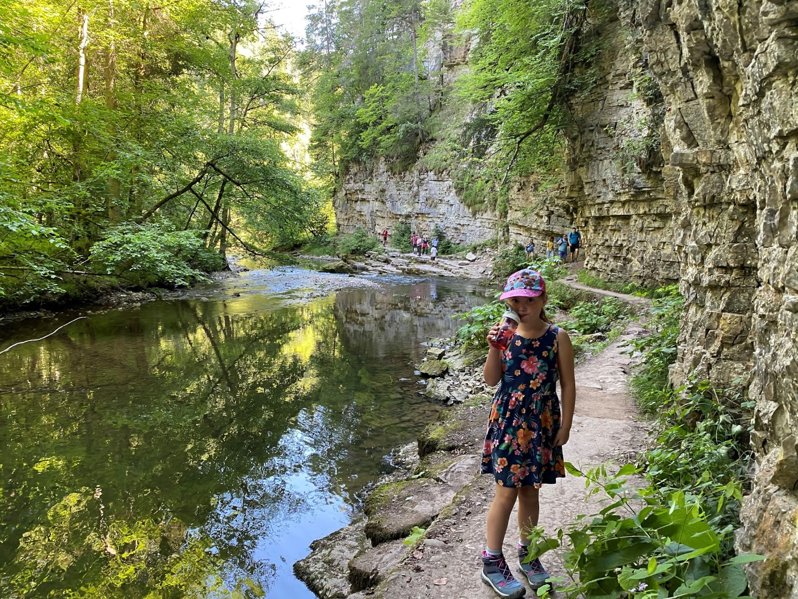

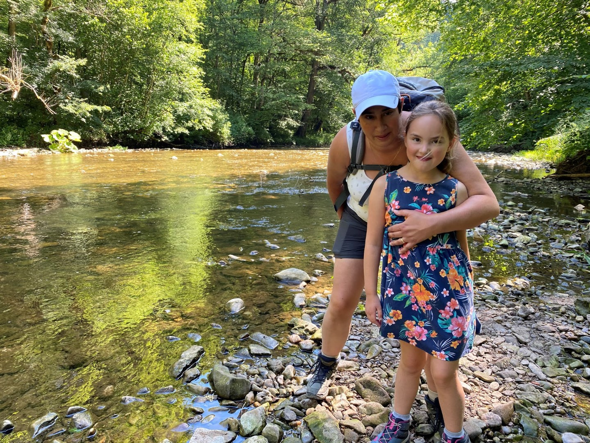



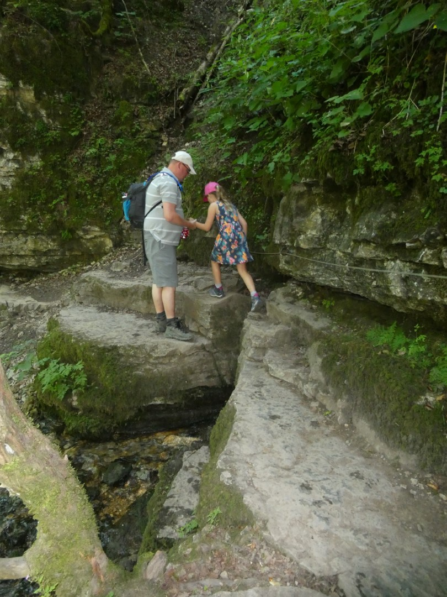

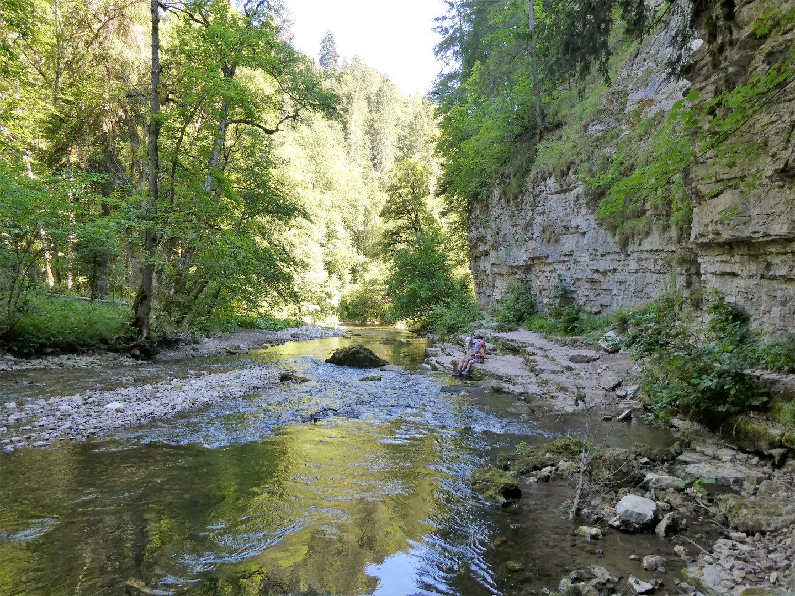

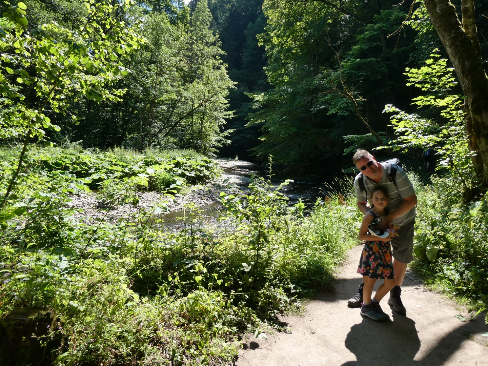

Na de Wutachschlucht slaan we linksaf via een mooie brug de Gauchachschlucht in. Hier zijn gelukkig aanmerkelijk minder mensen.

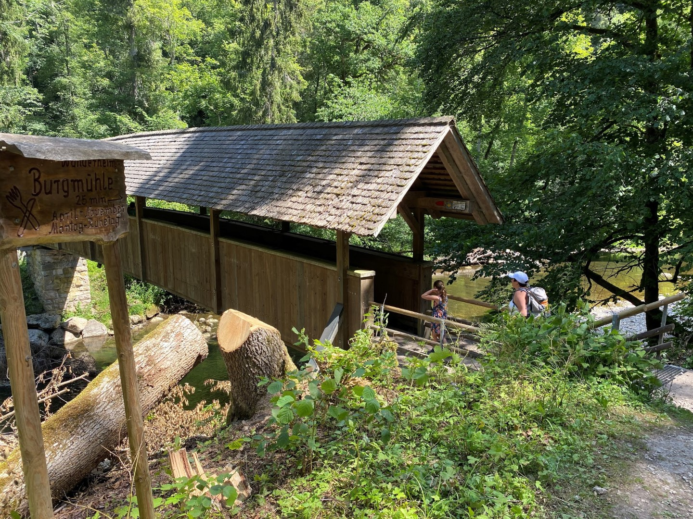

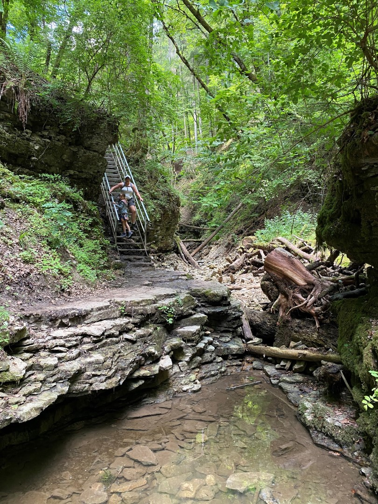

Na de Gauchach- werd het hoog tijd voor de Engeschlucht. En hier bleek de kwalificatie "zwaar" van de hele wandeling terecht: het was glibberen en glijden, zowel omhoog als weer naar beneden. Af en toe werd het zelfs wat gevaarlijk, maar we raken niet in paniek. We houden de moed erin door middel van de volksmuziek.

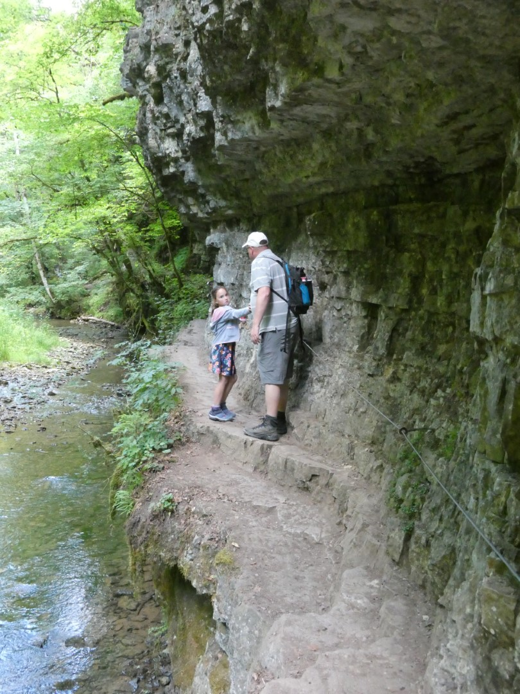

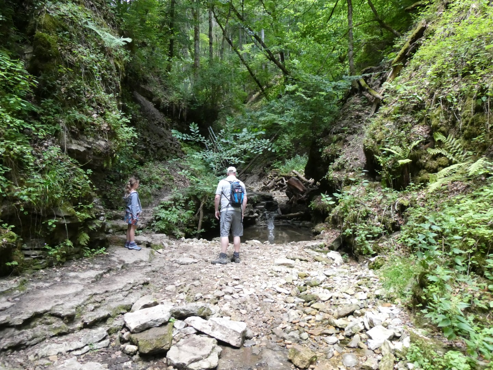

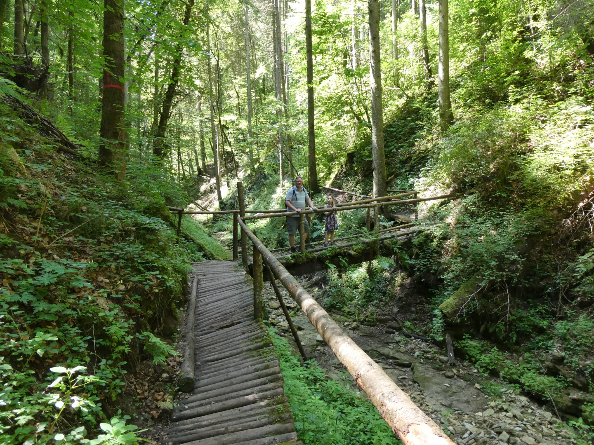

Na bijna 5 uur lopen kwamen we weer aan bij de auto. Ruim op tijd om nog een duik te nemen in het Waldbad in Loffingen. En 's avonds hebben we voortreffelijk gegeten op het terras van onze buren Seehof. Alledrie de Batentjes sliepen om 9 uur al, na alle inspanning (en het lekkere bier).

## 1 opmerking

### Gerard 22 juli 2020 om 23:20

Wij staan steeds weer versteld van de schoonheid van de omgeving. Mooie foto's
