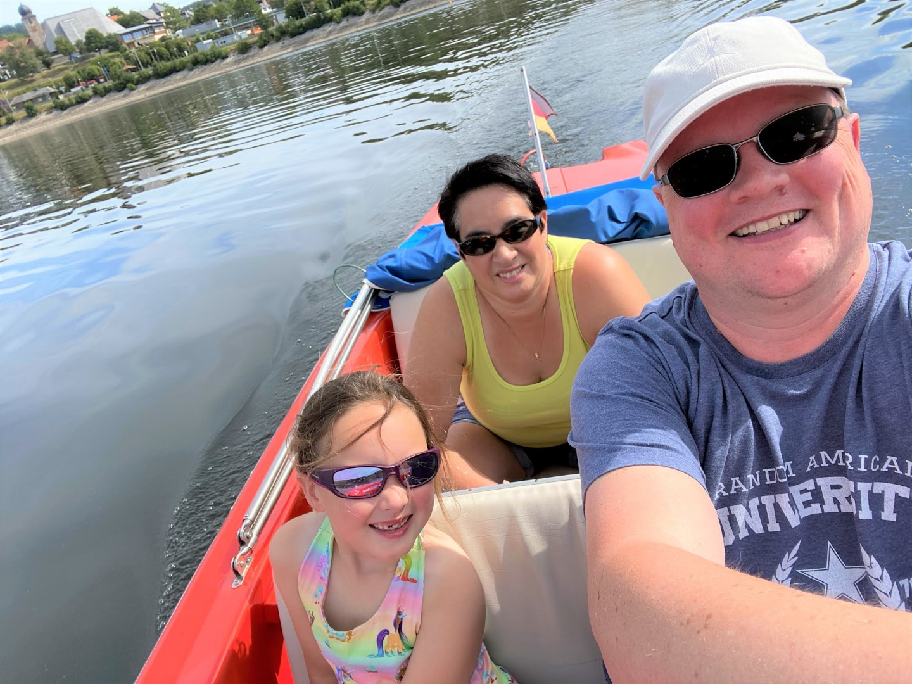
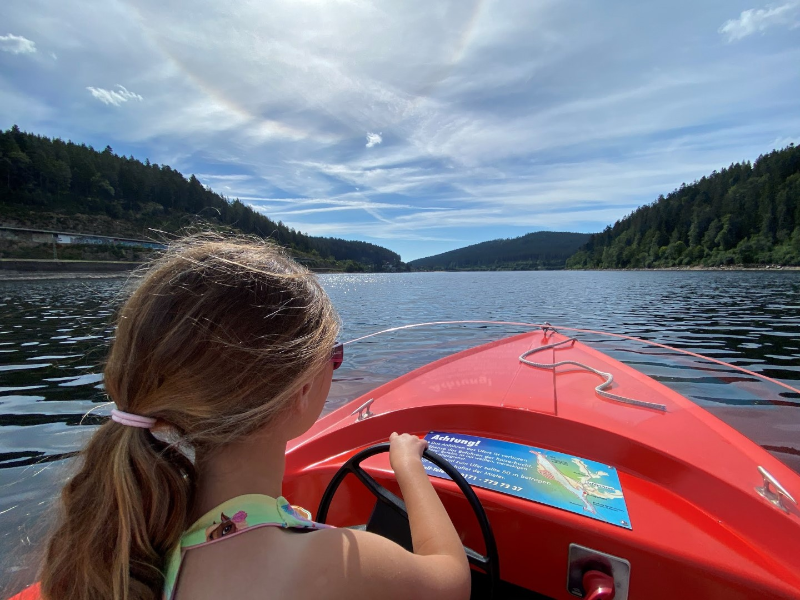
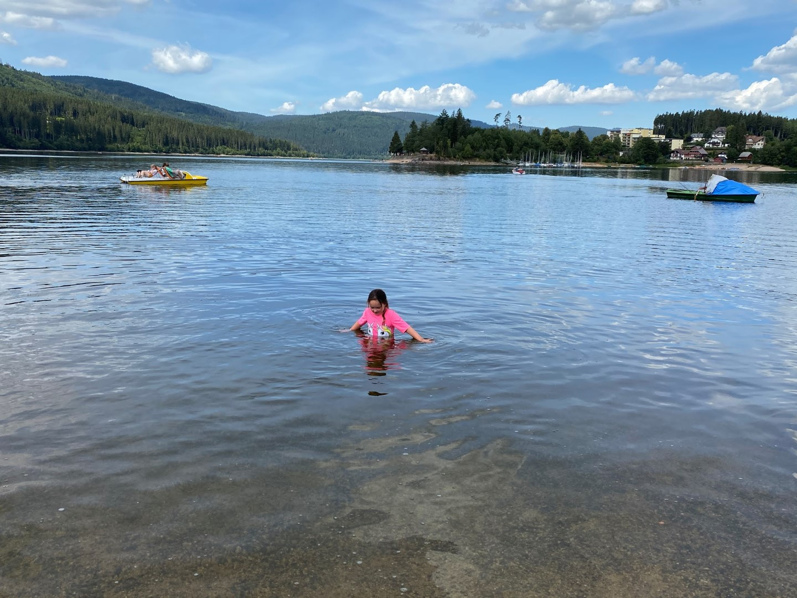
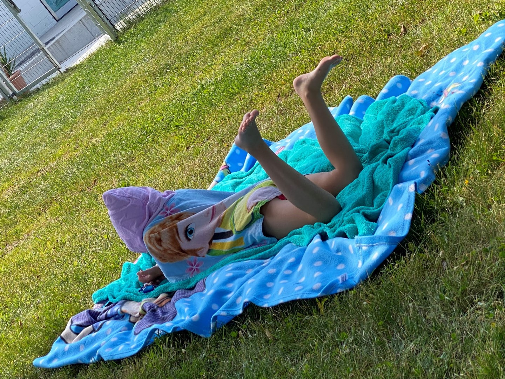
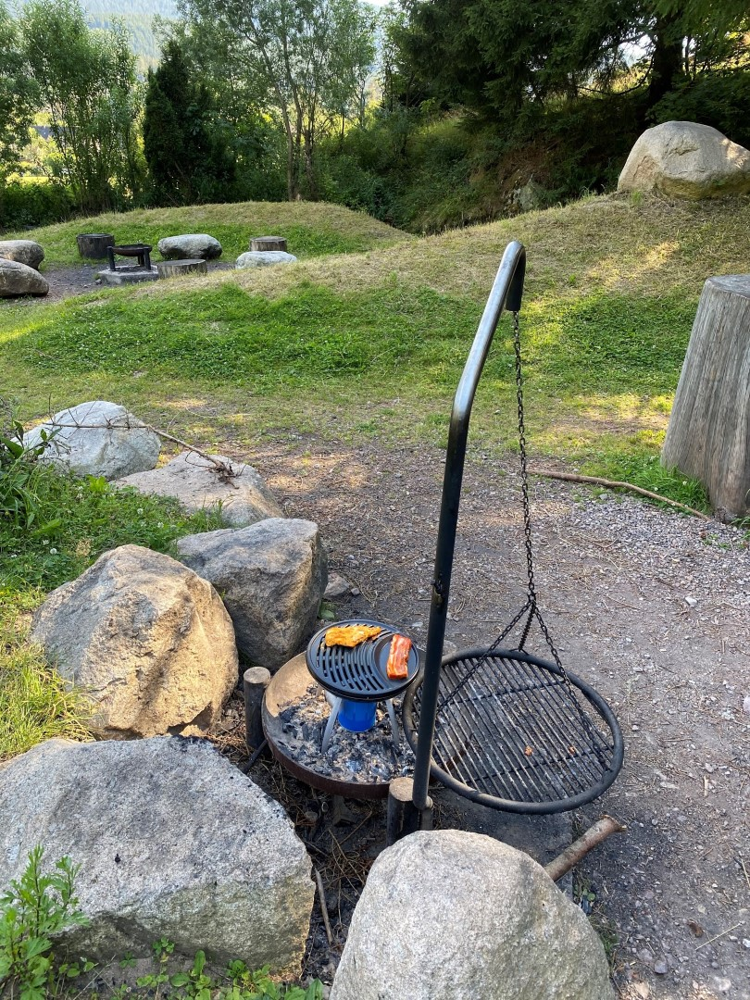
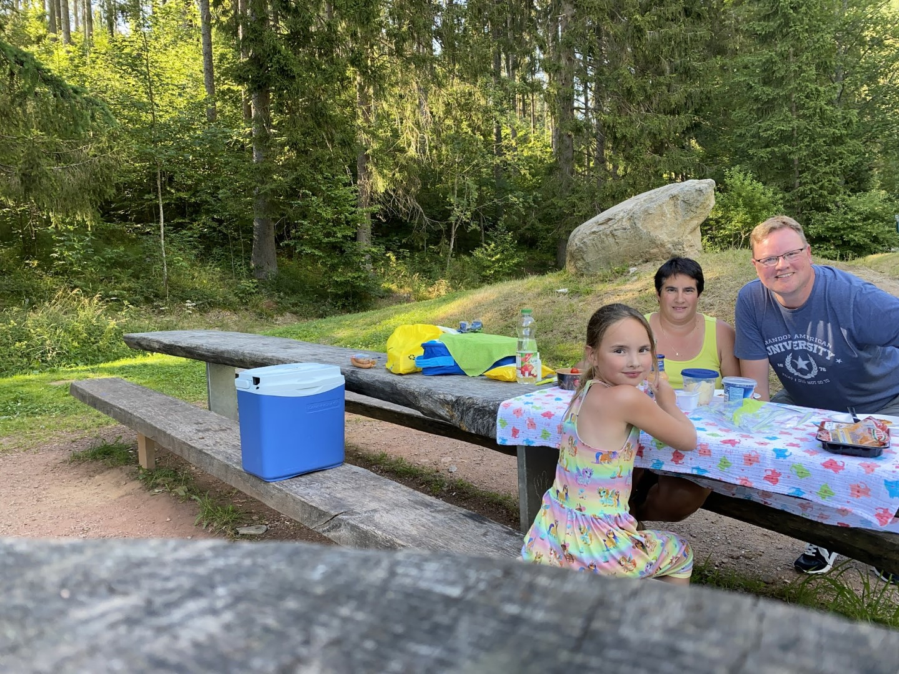
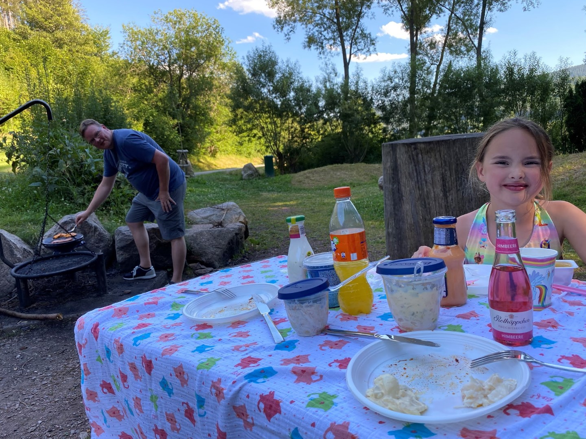
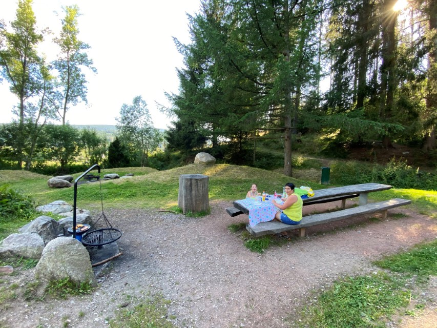

Het is vanuit ons hotel ongeveer 5 minuten wandelen naar de Schluchsee. Aan het strandje kun je bootjes huren om het meer zelf te ontdekken. Je kunt kiezen uit een waterfiets, roeiboot of een bootje met een electro motor. Maatschappelijk verantwoord en milieubewust als wij zijn, kiezen we uiteraard voor de laatst genoemde optie.

Met zijn afmetingen van 7,3 bij 1,4 km is het het grootste meer van Schwarzwald. Het is erg rustig op het water, maar we waren er dan ook al vroeg. Het is heerlijk weer.

Helaas mag je nergens aanmeren, dus na een uurtje hadden we het wel gezien.

Na de lunch zijn we naar het openluchtbad in Neustadt gereden, hier mogen we voor nop zwemmen met onze Hochschwarzwald Karte. Het is een mooi bad, niet zo mooi gelegen als het Waldbad in Loffingen, maar dat maakt voor Sofie helemaal niks uit natuurlijk: water = water.



Na het zwemmen zijn we naar de nabij gelegen Grillplatz Felsele gereden. Hier is een leuke speeltuin, maar nog veel belangrijker: je mag er grillen! Dat kan op de daar aanwezige roosters, maar wij hadden onze eigen gas bbq meegenomen.

## 2 opmerkingen

### opa 22 juli 2020 om 22:21

Prachtige locatie waar jullie grillen. Leuke foto's op het meer.
Veel plezier nog. Houdoe

### Gerard 22 juli 2020 om 23:26

Na bootje varen en zwemmen is de openlucht eetgelegenheid een mooie uitkomst. Leuke picknickplaats. Geniet er maar lekker van.
