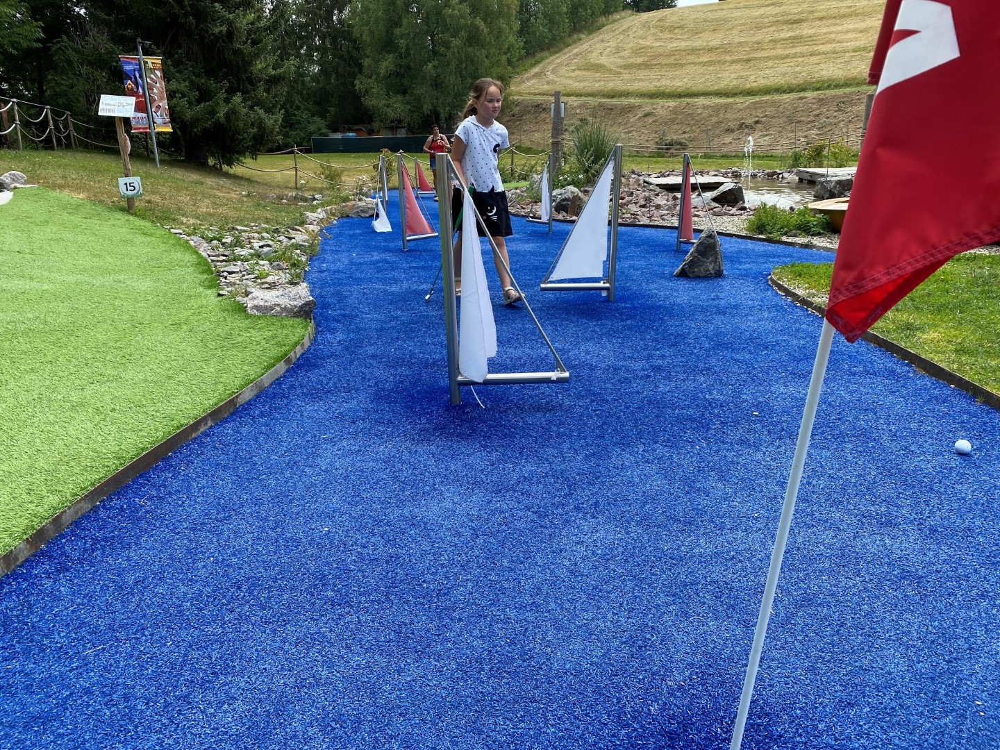
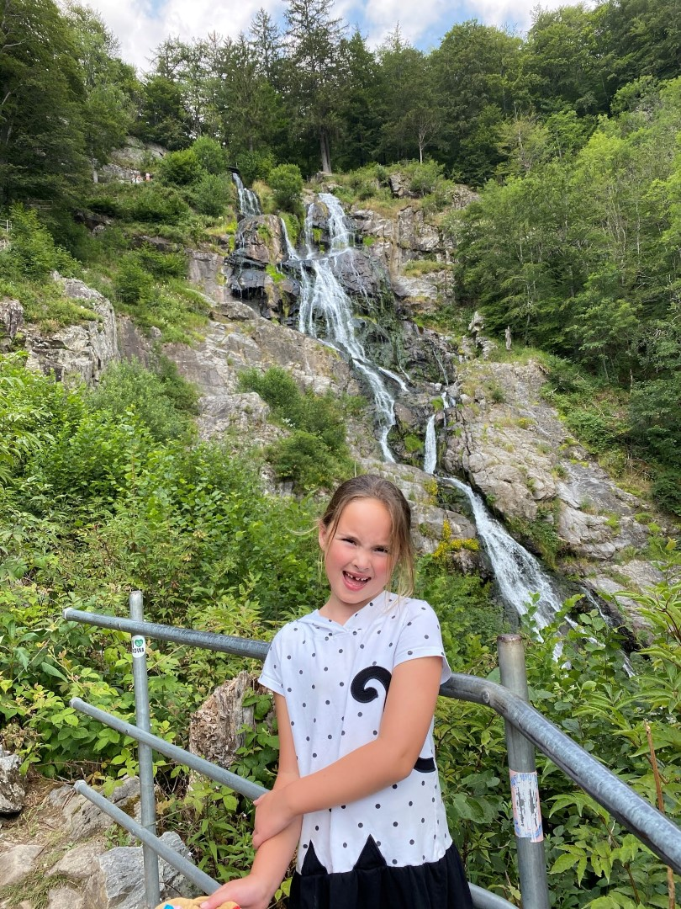
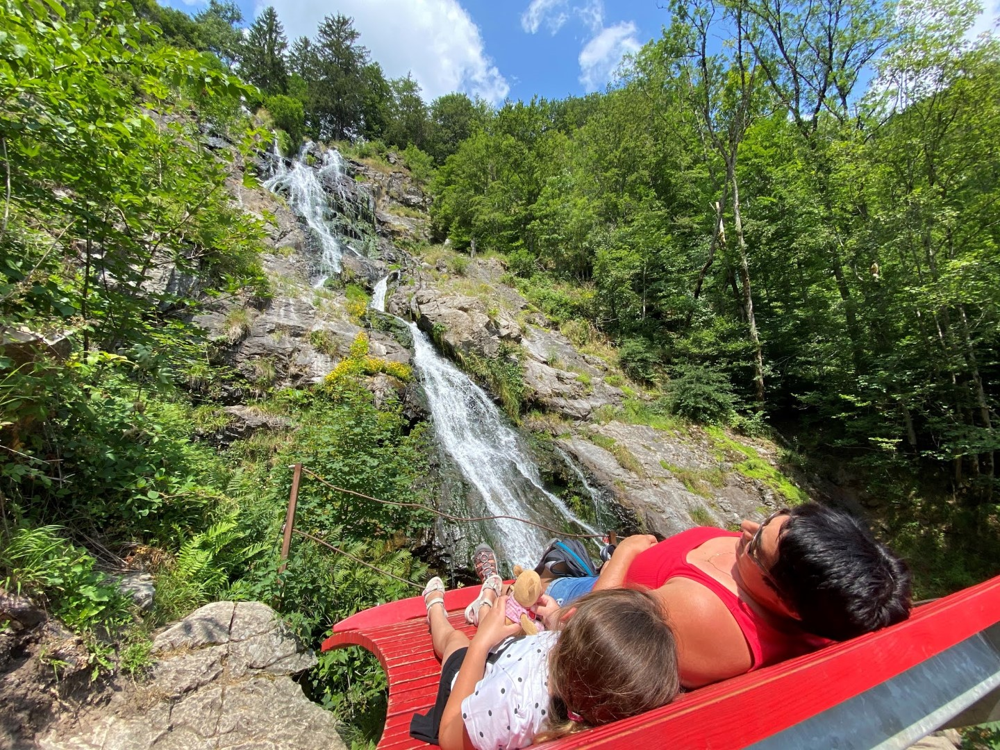
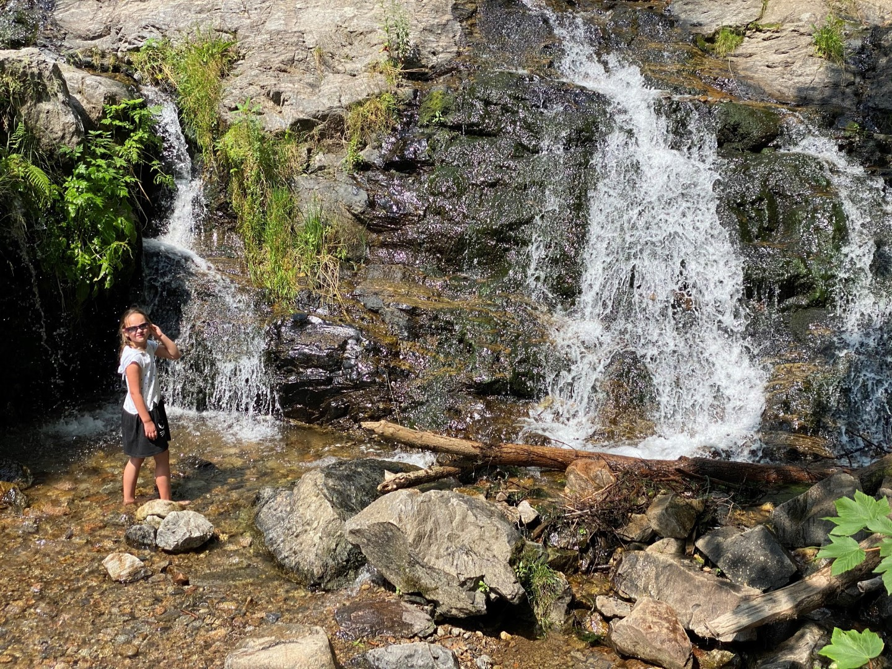

De ochtend hebben we doorgebracht bij het Abenteuer Golfpark in Lenzkirch. Naar eigen zeggen is het een van de grootste en spectaculairste minigolf banen van Duitsland. Nou, het moet gezegd worden: het is allemaal bijzonder mooi aangelegd en verzorgd en het is daarmee zekerteweten de grootste en spectaculairste minigolf baan van heel Lenzkirch. Vanwege het mooie weer is het er vandaag best druk, waardoor er soms wat file ontstaat bij de 18 holes in Schwarzwald thema die voor ons liggen.

Met gevaar voor lijf en leden moeten we ons naar de overkant van de rivier trekken.



Naast de golfbaan is een klein parkje met een speeltuin waar we de meegebrachte broodjes eten. Daarna werd het tijd om de Rasenhorn rodelbahn in Todtnau met een tweede bezoek te vereren. Helaas bleek bij de kassa dat de Hochschwarzwald Karten alleen in de ochtend geldig zijn. Heel vreemd, toen we hier een paar dagen geleden waren, was het geen enkel probleem toen we aan het einde van de middag waren. De regels zijn toevallig deze week veranderd. Kleine teleurstelling natuurlijk, maar wij waren kwaad en weigerden de normale entreeprijs te betalen. Dus zijn we maar een stukje doorgereden naar de Todtnauer Wasserfälle, die bij aankomst opvallend mooi zijn.

Onderaan de waterval staan bankjes waarop je lui naar het neerkletterende water kunt kijken.

Sofie kon het natuurlijk niet laten om even de voetjes nat te maken.

's Avonds hebben we weer heerlijk gegeten bij restaurant Seehof.
