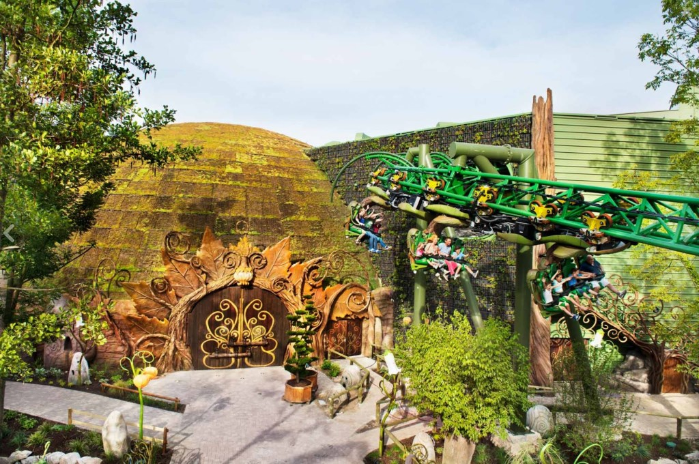
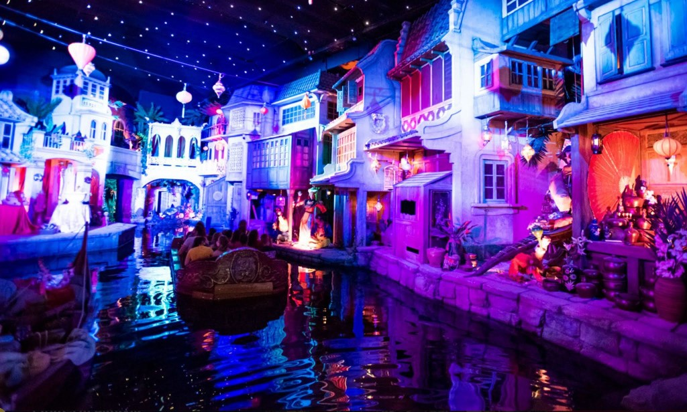
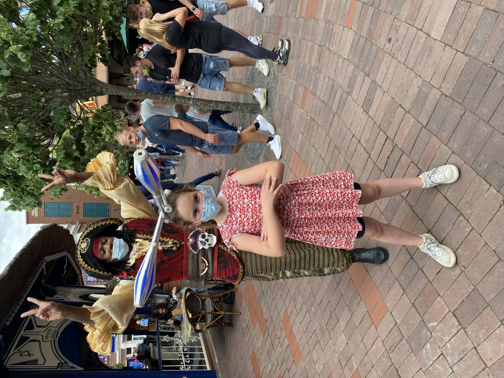
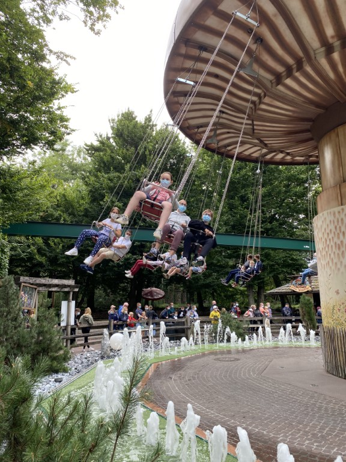

Iets voor 9 uur parkeerden we de auto op het parkeerterrein van Europa Park. Direct na het uitstappen moest iedere bezoeker aantonen dat 'ie aan de 3G regels (Genesen, Geimpft oder Getested) voldoet. Ook hier hoefden we het zelf-test certificaat van Sofie niet te tonen. Overal hangen borden dat je anderhalve meter afstand moet houden, maar daar houdt zich wederom helemaal niemand aan.

Direct na de ingang zijn we als eerste in Voletarium geweest. Je zit in een soort vliegtuig voor een enorm bioscoopscherm en maakt een vlucht over Europa. Erg mooi gemaakt, ook in de wachtrij word je verwend, er is van alles te zien.

We zijn nog in de Alpenexpress (achtbaan), botsauto's, 3 keer in Arthur (fantastische achtbaan waar je onder de rails hangt), Fjord Rafting (met een vlot over een wilde rivier, Sofie was kletsnat), draaiende koffie kopjes, Pirates of Batavia (erg mooi ondergrondse boottocht met erg lekker naast de uitgang).

Het park is enorm groot, en heeft ongelooflijk veel attracties. Dit heeft als voordeel dat de wachttijden bij meeste attracties niet super lang zijn.

De zweefmolen was een van Sofie's favorieten, ze wilde (na het ritje samen met mij) er per se alleen er in.

