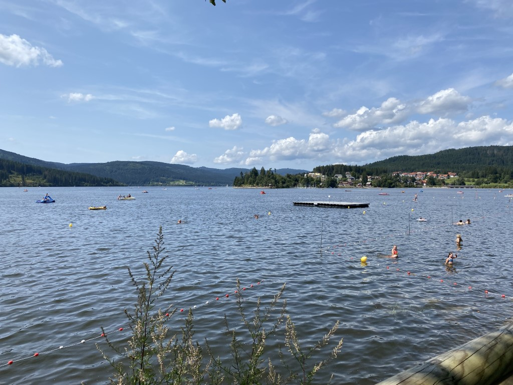
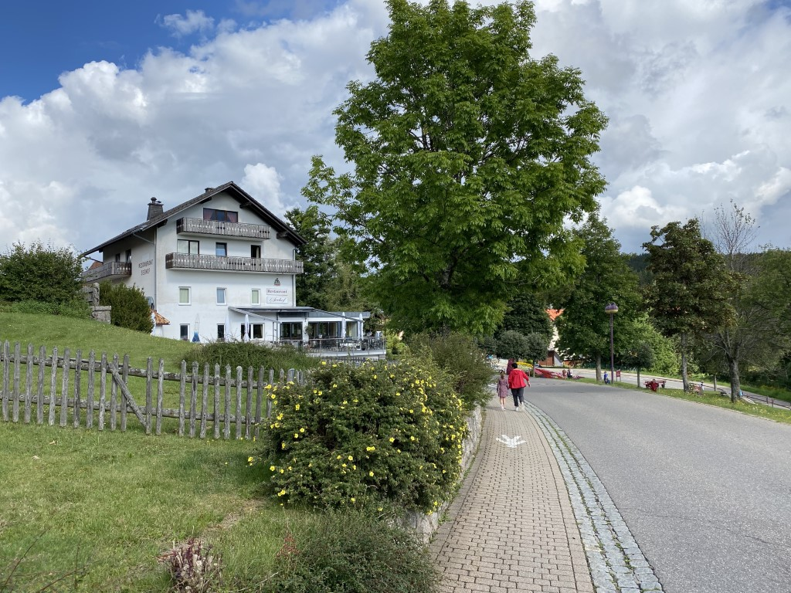

Er was mooi weer voorspeld, dus hebben we een waterfiets met ingebouwde glijbaan gehuurd bij de lokale Bootsvermietung. Het water had een temperatuur van ongeveer 20 graden, maar dat weerhield de dames er niet van om veelvuldig van de glijbaan te roetsjen. Wat een feest!



De lunch hebben we ook aan boord genuttigd, en na nog wat plonzen zijn we weer teruggefietst naar de aanlegsteiger. Onderweg werden we nog bijna aangevaren door de grote rondvaartboot, we moesten hard trappen om het stomme ding te ontwijken!

De middag hebben we doorgebracht op de ligweide naast het Aqua Fun zwembad, aan de oever van het meer. Het zwembad is al twee jaar niet meer in gebruik, maar de kleedruimten, restaurant, en dus ook de ligweide gelukkig nog wel. Ook kun je via wat trappen in het meer zwemmen, waar beide dames dan ook dankbaar gebruik hebben gemaakt.

's Avonds zijn we weer gaan eten bij Seehof.

